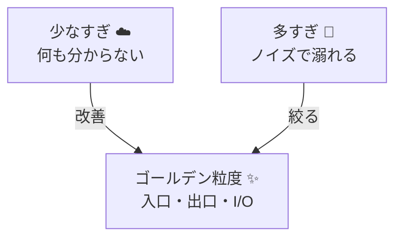

# 第14章：ログの“粒度”設計🍚✨（出す量のバランス）

この章は「ログが足りなくて詰む😇」と「ログが多すぎて溺れる😱」のちょうど真ん中を取りにいく回だよ〜！🫶✨
（.NETは**.NET 10（LTS）**が現行世代として扱われてる前提で進めるね📌） ([Microsoft][1])

---

## この章でできるようになること🎯✨

* 1リクエストあたりの**最低限ログ（ミニマムセット）**を決められる✅
* 「追加で出すログ」を**条件つき**にして、ノイズを増やさない設計ができる⚖️
* 実装でブレないように、**粒度ルール（型）**をチームに説明できる📣✨

---

## まず結論：おすすめの“粒度の型”🍙✨

### ✅ 基本は「3点固定ログ」＋「例外は境界で1回」

**固定で出す場所は3つだけ**にするのがいちばん強い💪✨

1. **入口（Request In）**：受け取った🧾
2. **外部I/O（Dependency）**：外に行った🚪➡️🌍（DB/外部APIなど）
3. **出口（Request Out）**：返した📤

そして例外は…
4) **例外ログは“境界で1回”**（二重三重にスタックトレースを撒かない）💥🧯

> ASP.NET Coreのログは `Microsoft.Extensions.Logging` の `ILogger` を中心に組むのが基本だよ〜📌 ([Microsoft Learn][2])

---

## 粒度ってなに？🍚✨（ざっくり定義）


ログの粒度＝
**「どのタイミングで」「何を」「どれくらいの量で」「どんな形（検索できる形）で」残すか**の設計だよ🧠✨

粒度がズレると…

* 少なすぎ：障害時に「何が起きたのか」見えない😇
* 多すぎ：重要ログが埋もれる＆コストも上がる😱💸



---

## 粒度を決める4つの軸🧭✨

### ① 置き場所（どこで出す？）📍

* 入口（HTTP受信）
* 業務（ルール分岐・判断）
* 外部I/O（DB/外部API/Queue/Cache）
* 出口（HTTP返却）

### ② 頻度（どれくらいの回数？）🔁

* 毎回出す？
* エラー時だけ？
* 遅い時だけ？
* サンプリングする？（成功ログの間引き）🎲

### ③ 詳細度（どれだけ情報を載せる？）🧳

* “今すぐ調査に使える”最小限にする
* 迷ったら「検索キー」「時間」「結果」「相手先」を優先✨

### ④ 形（検索できる形？）🔎

* **構造化ログ（キー＝値）**に寄せる（第10章の続きだね🧱）
* メッセージ連結より、テンプレ＋プロパティが強い💪
  （`"Order {OrderId}"` みたいに `{}` をキーとして残すやつ）

---

## “3点固定ログ”のおすすめテンプレ🧩✨

### 1) 入口ログ（Request In）🚪

**レベル**：基本 `Information`
**目的**：そのリクエストの“開始点”を作る🧵✨

入れたい項目（おすすめ）👇

* `http.method`（GET/POST）
* `http.route`（/work など）
* `requestId`（ASP.NET Coreの識別子）
* `traceId`（後でトレースと繋げたい人はここから仕込む）
* `user`（個人情報にならない範囲で！例：匿名化ID or ロール）

### 2) 外部I/Oログ（Dependency）🌍

**レベル**：成功は `Information`、失敗は `Warning` or `Error`
**目的**：遅い/落ちてる原因が外か中か切り分ける🔪

入れたい項目👇

* `dep.type`（db/http/cache など）
* `dep.name`（どのDB/どのAPI名）
* `dep.target`（ホスト名や論理名）
* `durationMs`
* `result`（success/fail）
* `statusCode`（HTTPなら）

### 3) 出口ログ（Request Out）📤

**レベル**：基本 `Information`（5xxなら `Error`寄りでもOK）
**目的**：結果と総時間を確定させる⏱️✨

入れたい項目👇

* `statusCode`
* `durationMs`
* （必要なら）`errorType`（例外分類）

---

## 追加ログは「条件つき」にするのがコツ⚖️✨

### ✅ 追加ログの出しどころ（おすすめ）

* **失敗したときだけ**💥
* **遅いときだけ**🐢（例：`durationMs > 1000` の時だけ詳細ログ）
* **再試行したときだけ**🔁
* **重要な業務判断をしたときだけ**（例：在庫不足で注文拒否、レート制限発動など）🚫

### ❌ 増やしちゃダメな出し方

* for/foreach の中で毎回ログ（高トラフィックだと地獄）🔥
* “成功”の詳細を毎回全部吐く（ノイズ＆コスト）💸
* 例外を**各層で全部 `LogError(ex, ...)`**（スタックトレース祭り）🎆😱

---

## 実装：まずは「入口＋出口」をミドルウェアで固定化🧱✨

> ASP.NET Coreのログは `ILogger<T>` をDIから受け取るのが基本だよ📌 ([Microsoft Learn][2])

```csharp
using System.Diagnostics;
using Microsoft.AspNetCore.Http;
using Microsoft.Extensions.Logging;

public sealed class RequestLoggingMiddleware
{
    private readonly RequestDelegate _next;
    private readonly ILogger<RequestLoggingMiddleware> _logger;

    public RequestLoggingMiddleware(RequestDelegate next, ILogger<RequestLoggingMiddleware> logger)
    {
        _next = next;
        _logger = logger;
    }

    public async Task InvokeAsync(HttpContext context)
    {
        var sw = Stopwatch.StartNew();

        // 追跡に使うID（あとでログ検索の軸になるよ✨）
        var requestId = context.TraceIdentifier;
        var traceId = Activity.Current?.TraceId.ToString(); // いれば（後の章で育つやつ🧵）

        // スコープで共通フィールドを付ける（ログが一気に探しやすくなる！）
        using (_logger.BeginScope(new Dictionary<string, object?>
        {
            ["requestId"] = requestId,
            ["traceId"] = traceId
        }))
        {
            _logger.LogInformation(
                "RequestIn {Method} {Path}",
                context.Request.Method,
                context.Request.Path.Value
            );

            try
            {
                await _next(context);

                sw.Stop();
                _logger.LogInformation(
                    "RequestOut {StatusCode} {DurationMs}ms",
                    context.Response.StatusCode,
                    sw.ElapsedMilliseconds
                );
            }
            catch (Exception ex)
            {
                sw.Stop();

                // 例外は境界で1回ログ（ここが“出口”扱いだよ🧯）
                _logger.LogError(
                    ex,
                    "RequestOutFailed {StatusCode} {DurationMs}ms",
                    StatusCodes.Status500InternalServerError,
                    sw.ElapsedMilliseconds
                );

                throw;
            }
        }
    }
}
```

* `BeginScope` は “この範囲のログに共通情報を付ける” ための仕組みだよ🔗✨（スコープはネストもできる） ([Microsoft Learn][3])
* `{Method}` や `{Path}` みたいなテンプレは、構造化ログとして後で絞り込みやすい🧱✨

---

## 実装：外部I/O（HTTP呼び出し）を“1行で”残す🌍✨

```csharp
using System.Diagnostics;
using System.Net.Http;
using Microsoft.Extensions.Logging;

public static class ExternalCall
{
    public static async Task<string> GetWithLogAsync(
        HttpClient http,
        ILogger logger,
        string url,
        CancellationToken ct = default)
    {
        var sw = Stopwatch.StartNew();

        try
        {
            using var resp = await http.GetAsync(url, ct);
            var body = await resp.Content.ReadAsStringAsync(ct);

            sw.Stop();
            logger.LogInformation(
                "Dependency {DepType} {DepName} {StatusCode} {DurationMs}ms",
                "http",
                "ExternalApi",
                (int)resp.StatusCode,
                sw.ElapsedMilliseconds
            );

            return body;
        }
        catch (Exception ex)
        {
            sw.Stop();
            logger.LogWarning(
                ex,
                "DependencyFailed {DepType} {DepName} {DurationMs}ms",
                "http",
                "ExternalApi",
                sw.ElapsedMilliseconds
            );
            throw;
        }
    }
}
```

ポイントはこれ👇✨

* **成功は1行**、失敗も基本1行（必要なら例外分類を足す）
* 外部I/Oは「どれ」「結果」「時間」が最重要⏱️🔎

---

## 実装：ログを“高速＆安定”にする（おまけ強化）⚡✨

高頻度のログ（入口/出口/依存関係など）は、実はコストが効くので
`LoggerMessageAttribute` の**コンパイル時ソース生成**が便利だよ〜⚡
（ボクシングや余計な割り当てを減らしてくれる系） ([Microsoft Learn][4])

```csharp
using Microsoft.Extensions.Logging;

public static partial class AppLog
{
    [LoggerMessage(
        EventId = 1001,
        Level = LogLevel.Information,
        Message = "RequestIn {Method} {Path}")]
    public static partial void RequestIn(ILogger logger, string method, string path);

    [LoggerMessage(
        EventId = 1002,
        Level = LogLevel.Information,
        Message = "RequestOut {StatusCode} {DurationMs}ms")]
    public static partial void RequestOut(ILogger logger, int statusCode, long durationMs);
}
```

---

## ログレベルで“出す量”を調整できるようにする🎚️✨

`appsettings.*.json` の `Logging:LogLevel` で、カテゴリごとに絞れるよ📌 ([Microsoft Learn][5])
さらに設定ファイルは既定で変更検知（reload）される動きがあるので、運用で助かる場面も多いよ〜🪄 ([Microsoft Learn][6])

```json
{
  "Logging": {
    "LogLevel": {
      "Default": "Information",
      "Microsoft.AspNetCore": "Warning"
    }
  }
}
```

---

## ミニ演習：1リクエストで最低限残すログを決める🧩✨

### お題🎭

題材アプリに `/work` があるとして、内部で

* DB（っぽい処理）1回
* 外部API（HTTP）1回
  を呼ぶ想定にするね🌍

### ステップ1：成功時の“理想ログ数”を決めよう📝

おすすめはこのくらい👇（まずはシンプルに！）

* RequestIn（1）
* Dependency（DB）（1）
* Dependency（HTTP）（1）
* RequestOut（1）

👉 **成功時：合計4行**✨
（多くても6行くらいまでに抑えると気持ちいいよ〜🍃）

### ステップ2：失敗時の“追加ログ”を決めよう💥

例：外部APIが落ちた

* DependencyFailed（1）
* RequestOutFailed（1）

👉 **失敗時は +2行**くらい
（ここで詳細を増やしすぎないのがコツ！）

### ステップ3：遅い時だけ追加ログ🐢

例：`/work` が 2秒超えたら

* “何に時間かかった？” を示す補助ログを **1〜2行だけ**追加
  （例：外部APIのURL種別、リトライ回数など）

---

## よくある“粒度事故”あるある😇💥

### 事故①：成功ログが詳細すぎる📚😱

* 1リクエストで50行とか出る
  → 本番で「見たい行」が死ぬ☠️

✅ 対策：成功は**短く固定セット**、詳細は条件つき（遅い/失敗/再試行）⚖️✨

### 事故②：例外ログが多重発火🎆

* RepositoryでもServiceでもControllerでも `LogError(ex, ...)`
  → 同じ例外が3回出てカオス😵‍💫

✅ 対策：**境界（入口/出口）で1回**。内部は “情報を足すなら” `LogDebug` 程度で✨

### 事故③：ログレベルの設計が曖昧🎚️

* 何でも `Information`
  → 本当に重要なものが埋まる😇

✅ 対策：粒度ルールに「レベル表」もセットで書く（第9章と合体だね💞）

---

## 仕上げ：粒度設計チェックリスト✅✨

* [ ] 成功時ログは「入口/外部I/O/出口」の固定セットに収まってる？🍙
* [ ] 1リクエストの成功ログ、**だいたい数行**で済む？（目安：4〜6）🧮
* [ ] 失敗時に“次の一手”が打てる情報がある？🧯
* [ ] 例外ログは境界で1回になってる？🎆防止
* [ ] 検索キー（requestId/traceId/dep.name）が入ってる？🔎
* [ ] ループ内ログで爆発してない？🔥

---

## AI活用（超おすすめ🤖✨）

* 「このエンドポイントの最小ログセット案を出して。成功は4行以内、失敗は+2行以内」
* 「このログ設計、ノイズになりそうな点を指摘して、条件つきログに直して」
* 「ログのキー名（dep.name / durationMs 等）を命名ルールに合わせて統一して」

---

## まとめ🍚✨

粒度設計は、センスじゃなくて**型**で勝てるよ🫶

* **3点固定ログ（入口/外部I/O/出口）**をまず決める
* 追加ログは**条件つき**（失敗/遅い/再試行/重要判断）
* 実装はミドルウェア＋外部I/Oラッパで“固定化”が最強🧱✨

次の章（第15章）は、そのログを使って **「現場の調査手順🕵️‍♀️」**に入っていくよ〜！🔍✨

[1]: https://dotnet.microsoft.com/ja-jp/platform/support/policy/dotnet-core?utm_source=chatgpt.com ".NET および .NET Core の公式サポート ポリシー"
[2]: https://learn.microsoft.com/en-us/aspnet/core/fundamentals/logging/?view=aspnetcore-10.0&utm_source=chatgpt.com "Logging in .NET and ASP.NET Core"
[3]: https://learn.microsoft.com/ja-jp/dotnet/api/microsoft.extensions.logging.loggerextensions.beginscope?view=net-9.0-pp&utm_source=chatgpt.com "LoggerExtensions.BeginScope(ILogger, String, Object[]) ..."
[4]: https://learn.microsoft.com/en-us/dotnet/core/extensions/logger-message-generator?utm_source=chatgpt.com "Compile-time logging source generation - .NET"
[5]: https://learn.microsoft.com/ja-jp/aspnet/core/fundamentals/logging/?view=aspnetcore-10.0&utm_source=chatgpt.com ".NET と ASP.NET Core でのログ記録"
[6]: https://learn.microsoft.com/ja-jp/aspnet/core/fundamentals/configuration/?view=aspnetcore-10.0&utm_source=chatgpt.com "ASP.NET Core の構成"
