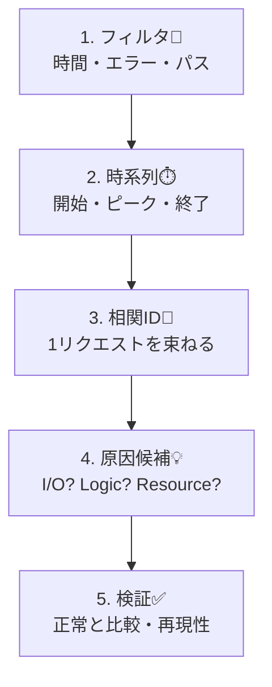

# 第15章：ログから調査する手順🕵️‍♀️🪵（現場の型）

この章は「ログだけを頼りに、迷子にならずに原因へ近づく」ための **“調査の型”** を体に入れる回だよ〜！🧠✨
（ログは“読書”じゃなくて“捜査”だからね🔍📚➡️🔎）

---

## 15章でできるようになること🎯✨

* 事故が起きたときに「まず何から見る？」が即決できる🧭
* ログを **フィルタ→時系列→相関ID→原因候補** の順で追える🪵➡️⏱️➡️🔗➡️💡
* “それっぽい結論”じゃなくて、**根拠つきの仮説**を作れる📌

---

## 0. まず最初にやる「3つの前提チェック」✅🧯

調査は、ここでズレると全部ズレるよ〜😂💦

1. **時間（タイムゾーン）** ⏰🌏

* ログはUTCのことが多いよ（表示がJSTかも含めて確認）
* “発生時刻”を **±10分** くらい広めに取るのがコツ🧻✨

2. **対象の範囲（どのサービス？どの環境？）** 🧩

* 例：`Service=Api` / `Env=Prod` / `Region=JP` みたいに絞る

3. **ログが“捜査向き”の形か** 🧱🪵

* .NET の `ILogger` は **構造化ログ（プロパティ付き）** を前提にした設計だよ🧱✨ ([Microsoft Learn][1])
* そして ASP.NET Core では設定次第で `TraceId` / `SpanId` などを **スコープとして自動でログに混ぜられる**（相関がめっちゃ楽になる！）🔗✨ ([Microsoft Learn][2])

---

## 1. 現場で使う「ログ調査の型」🧭🕵️‍♀️


覚える順番はこれだけ👇（超大事）



### 型A：フィルタ → 時系列 → 相関ID → 原因候補🪵⏱️🔗💡

#### Step 1：フィルタする（母集団を小さく）🧹🪵

最初は“広く薄く”じゃなくて **“狭く濃く”** が勝ち！😤✨

* 期間：発生時刻の **前後10〜30分**
* レベル：まず `Error` / `Warning`（必要なら `Information`）
* 入口の条件：`path` / `statusCode` / `method`
* “現象のキーワード”：`timeout` / `deadlock` / `429` / `SqlException` など🧨

👉 ここでのゴール：
**「今ヤバいログの山」を10〜200行くらいにする**📦✨

---

#### Step 2：時系列で並べる（何が先？）⏱️📈

ログは1行ずつ読むより **時間で読む** のがコツだよ〜！

見るポイント👇

* **最初の異常**はどれ？（最初の `Warn/Error`）
* **ピーク**はいつ？（同じエラーが連発してる時間）
* **回復**はいつ？（エラーが止まる／遅延が戻る）

👉 ここでのゴール：
**「いつ始まって、いつ終わった」** を言えるようにする🗣️✨

---

#### Step 3：相関IDで“1リクエストの物語”を束ねる🔗📚

ここがログ調査の核！🔥

* `CorrelationId` / `RequestId` / `TraceId` のどれかを見つける
* それで **全文検索して、そのIDのログだけを抜く**
* 入口ログ → 業務ログ → 外部I/Oログ → 例外ログ の順に並べる

ASP.NET Core のログは設定で `TraceId` / `SpanId` をスコープに載せられるから、相関がかなり楽になるよ🔗✨ ([Microsoft Learn][2])

👉 ここでのゴール：
**「この1リクエストはどこで詰まった？」** を指差す👆🐢

---

#### Step 4：原因候補を“3つ”出す（仮説ガチャ防止）🎰🚫

いきなり1個に決めないのが賢い〜！😎✨

おすすめの3点セット👇

1. **外部I/O系**（DB / 外部API / Queue）🌐🗄️
2. **入力・業務ロジック系**（想定外データ、分岐漏れ）🧩💥
3. **リソース系**（スレッド枯渇、コネクション枯渇、GC）🧠🔥

👉 ここでのゴール：
**“当たりそうな3択”** にする🎯

---

#### Step 5：仮説検証（ログだけでもできる！）🔍✅

「それっぽい」で終わらせないやつ💪✨

検証の鉄板👇

* **正常リクエスト**の相関IDも1本取って比較する（差分が真実）🆚
* 同じ例外が **1回だけ**？それとも **連発**？（再現性）🔁
* “遅い”なら、開始ログと終了ログの差で **どこに時間が消えたか** ⏳

---

## 2. 相関が強くなる設定（最小だけ）🔗🧱（※調査がラクになる✨）

「TraceId がログに出てこない〜😭」って時はこれが効くよ〜！
ASP.NET Core では `ActivityTrackingOptions` を使って、スコープに `TraceId` 等を載せられるよ🔗✨ ([Microsoft Learn][2])

```csharp
using Microsoft.Extensions.Logging;

var builder = WebApplication.CreateBuilder(args);

builder.Logging.AddSimpleConsole(o =>
{
    o.IncludeScopes = true; // スコープ（TraceIdなど）を出す✨
});

// どの情報をスコープに載せるか（TraceId/SpanIdなど）
builder.Services.Configure<LoggerFactoryOptions>(o =>
{
    o.ActivityTrackingOptions =
        ActivityTrackingOptions.TraceId |
        ActivityTrackingOptions.SpanId |
        ActivityTrackingOptions.ParentId;
});

var app = builder.Build();
app.MapGet("/work", () => "ok");
app.Run();
```

---

## 3. ミニ障害シナリオで“型”を回してみる🧯🎬

### 状況🎭

* `/checkout` がたまに遅い🐢
* たまに `502` も出る💥
* 「ログだけで追って！」って言われた😇（あるある）

### サンプルログ（JSON Lines 例）🧾🪵

※この章の演習用だよ〜

```text
{"ts":"2026-01-17T02:10:01.120Z","level":"Information","msg":"HTTP start {Method} {Path}","method":"POST","path":"/checkout","traceId":"4b2f...a1","spanId":"9f1...c3"}
{"ts":"2026-01-17T02:10:01.210Z","level":"Information","msg":"Calling payment API {Provider}","provider":"PayFast","traceId":"4b2f...a1"}
{"ts":"2026-01-17T02:10:03.980Z","level":"Warning","msg":"Payment API slow {ElapsedMs}ms","elapsedMs":2770,"provider":"PayFast","traceId":"4b2f...a1"}
{"ts":"2026-01-17T02:10:04.050Z","level":"Error","msg":"Payment failed {StatusCode}","statusCode":502,"provider":"PayFast","traceId":"4b2f...a1","ex":"HttpRequestException: Bad Gateway"}
{"ts":"2026-01-17T02:10:04.060Z","level":"Information","msg":"HTTP end {StatusCode}","statusCode":502,"path":"/checkout","traceId":"4b2f...a1"}

{"ts":"2026-01-17T02:11:10.020Z","level":"Information","msg":"HTTP start {Method} {Path}","method":"POST","path":"/checkout","traceId":"77aa...19","spanId":"e11...07"}
{"ts":"2026-01-17T02:11:10.120Z","level":"Information","msg":"Calling payment API {Provider}","provider":"PayFast","traceId":"77aa...19"}
{"ts":"2026-01-17T02:11:10.380Z","level":"Information","msg":"Payment ok","provider":"PayFast","traceId":"77aa...19"}
{"ts":"2026-01-17T02:11:10.410Z","level":"Information","msg":"HTTP end {StatusCode}","statusCode":200,"path":"/checkout","traceId":"77aa...19"}
```

---

## 4. 演習：ログだけで追跡してみよ〜！🔍🕵️‍♀️✨

### お題📝

1. 障害（もしくは異常）の中心になってる `traceId` はどれ？🔗
2. “遅い”の原因候補はどこ？（アプリ内？外部？）🐢
3. 根拠になったログ行（キー）を3つ挙げて！📌

### 解答例（見てOKだよ）✅✨

1. `traceId = 4b2f...a1`
2. **外部I/O（決済API）**が遅くて、最後は `502` で落ちてる可能性が高い
3. 根拠ログ

   * `Calling payment API`（外部呼び出し開始）
   * `Payment API slow elapsedMs=2770`（外部が遅い証拠）
   * `Payment failed statusCode=502 ex=HttpRequestException`（外部エラーっぽい）

---

## 5. ローカルでの“検索の手”🧰（PowerShell版）🪟✨

ログがファイル（例：`app.log`）に落ちてる想定で、最小の捜査コマンドだよ〜🔎

### Error だけ拾う💥

```powershell
Get-Content .\app.log | Select-String '"level":"Error"'
```

### traceId で束ねる🔗

```powershell
$tid = "4b2f...a1"
Get-Content .\app.log | Select-String $tid
```

### 時間帯でざっくり絞る（文字列でOK）⏱️

```powershell
Get-Content .\app.log | Select-String "2026-01-17T02:10"
```

---

## 6. ちょい上級：実行中プロセスから“ログ含む診断データ”を取る🧪📦

現場だと「その場で証拠を固めたい！」ってなることあるよね😇
`.NET` には `dotnet-monitor` みたいに **実行中アプリから logs/traces/metrics を収集できるツール**があるよ🧰✨ ([Microsoft Learn][3])

* `dotnet-monitor` は `dotnet tool install --global dotnet-monitor` で入れられる（公式ドキュメント）🧰 ([Microsoft Learn][3])
* さらに `dotnet-trace` も 2026年1月更新の公式ドキュメントがあるよ（トレース収集の基本）🧪 ([Microsoft Learn][4])

※この章では深掘りしないけど、「ログだけじゃ足りない…！」って時の次の武器になるよ〜🗡️✨

---

## 7. AI活用（調査を爆速にするテンプレ）🤖⚡

Copilot / ChatGPT に“丸投げ”じゃなくて、**型を渡して働いてもらう**のがコツだよ〜😎✨

### ① タイムライン化してもらう⏱️📌

```text
次のログを、時系列のタイムラインにして。
(1) 入口→外部I/O→例外→出口 の順に要約
(2) 重要なID（traceId/requestId）を抜き出す
(3) 遅延/失敗の根拠ログを3つ示す
ログ:
（ここに貼る）
```

### ② 仮説を3つ作ってもらう🎯🎲

```text
このログから、原因仮説を3つ出して。
それぞれ「根拠ログ」と「追加で欲しいログ項目」も書いて。
ログ:
（ここに貼る）
```

---

## 8. この章のまとめ🍵✨

* 調査は **フィルタ→時系列→相関ID→原因候補** の順でやる🧭
* 相関ID（TraceId等）があると、ログは“物語”になる📚🔗
* 仮説は3つ出して、ログで検証していくのが安定ムーブ✅✨

---

## ちょい最新メモ📌（2026/01/17 時点）

* .NET は **.NET 10.0** が最新系列で、**2026-01-13 に .NET 10.0.2 の更新**が出てるよ🧩✨ ([Microsoft サポート][5])
* Visual Studio も **Visual Studio 2026** の **2026-01-13 更新（18.2.0）**が案内されてるよ💻✨ ([Microsoft Learn][6])

---

次の章（16章）は **メトリクスの基本（カウント/ゲージ/ヒストグラム）** に入るよ〜📈✨
「ログは詳しいけど遅い、メトリクスは速いけど粗い」っていう役割分担を、体感で掴みにいこっ😆🚀

[1]: https://learn.microsoft.com/en-us/dotnet/core/extensions/logging?utm_source=chatgpt.com "Logging in C# - .NET"
[2]: https://learn.microsoft.com/en-us/aspnet/core/fundamentals/logging/?view=aspnetcore-10.0&utm_source=chatgpt.com "Logging in .NET and ASP.NET Core"
[3]: https://learn.microsoft.com/en-us/dotnet/core/diagnostics/dotnet-monitor?utm_source=chatgpt.com "dotnet-monitor diagnostic tool - .NET"
[4]: https://learn.microsoft.com/en-us/dotnet/core/diagnostics/dotnet-trace?utm_source=chatgpt.com "dotnet-trace diagnostic tool - .NET CLI"
[5]: https://support.microsoft.com/en-us/topic/-net-10-0-update-january-13-2026-64f1e2a4-3eb6-499e-b067-e55852885ad5?utm_source=chatgpt.com ".NET 10.0 Update - January 13, 2026 - Microsoft Support"
[6]: https://learn.microsoft.com/en-us/visualstudio/releases/2026/release-notes?utm_source=chatgpt.com "Visual Studio 2026 Release Notes"
