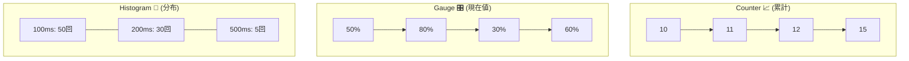

# 第16章：メトリクスの基本📊（カウント/ゲージ/ヒストグラム）✨

## この章のゴール🎯

* 「ログとメトリクス、どっちで何を見る？」をサクッと仕分けできる🧠✨
* **カウント / ゲージ / ヒストグラム**の違いを、例でパッと説明できる📌
* 「アラート向き」な理由（＝集計の強さ）を体感レベルで理解する🚨💡

---

## 1) メトリクスって、結局なに？👀

メトリクスは、ざっくり言うと「**時間と一緒に記録される数値**」だよ📈⏱️
たとえば Web API なら「1秒あたりのリクエスト数」「処理にかかったms」「エラー数」みたいなやつ！
これって“健康診断の数値”みたいに、**増えた/減った/いつからおかしい**がすぐ分かるのが強み💪✨
（メトリクスはアプリの健康監視やアラートでよく使われる、という位置づけが公式にも書かれてるよ） ([Microsoft Learn][1])

---

## 2) ログと役割分担しよう🪵📊（ここ超大事！）

* ログ🪵：**何が起きたか**を詳しく読む（文章・文脈・例外・詳細）
* メトリクス📊：**どれくらい起きてるか**を俯瞰する（数値・割合・傾向・異常検知）
* トレース🧵：**どこで遅い/詰まってるか**を辿る（旅の地図）

メトリクスは「細かいストーリー」じゃなくて「**全体の異常を最速で見つける**」担当だよ🚀✨

---

## 3) 3種類を一気に覚えるコツ🧠✨


覚え方はこれでOK👇

* **カウント（Counter）**：どんどん増える“累計”📈（基本戻らない）
* **ゲージ（Gauge）**：いまの値“現在地”🎛️（増えたり減ったり）
* **ヒストグラム（Histogram）**：ばらつき“分布”🎒（遅延の偏りとかを見る）

Prometheusの説明も分かりやすくて、

* Counter は **増えるだけ**（リセットは再起動など）
* Gauge は **増減する**
  ってハッキリ書いてあるよ📝 ([Prometheus][2])



---

## 4) カウント（Counter）📈✨ 〜「累計の回数」〜

### 何に向いてる？🙆‍♀️

* リクエスト総数（累計）🌐
* エラー総数（累計）💥
* ジョブ完了数（累計）✅
  こういう「**何回起きた？**」に超強い！

### 大事ルール⚠️

Counterは「減るかも？」なものに使っちゃダメ🙅‍♀️
例：現在動いてるプロセス数、同時接続数…これは増えたり減ったりするから **Gauge**！
（これもPrometheusが注意書きしてるよ） ([Prometheus][2])

### 「1秒あたり」を出したいとき⏱️

カウントは累計だから、そのまま見ても「増えてる」しか分からないことが多いのね🙂
なので監視側で「増え方（レート）」を見るのが定番！
Prometheusだと `rate()` が Counter に使えるよ、って説明があるよ📌 ([Prometheus][3])

---

## 5) ゲージ（Gauge）🎛️✨ 〜「いまの値」〜

### 何に向いてる？🙆‍♀️

* 同時リクエスト数（現在の混み具合）🚦
* キューの長さ（今どれだけ溜まってる？）📬
* メモリ使用量（いま何MB？）🧠
* CPU使用率（いま何%？）🔥

### イメージ🎮

「いまのHP」みたいなもの！増減するのが前提だよ🧡

---

## 6) ヒストグラム（Histogram）🎒✨ 〜「分布を見る」〜

### 何に向いてる？🙆‍♀️

* レスポンスタイム（ms）のばらつき⏱️
* DBクエリ時間のばらつき🗄️
* ペイロードサイズ（bytes）のばらつき📦

**平均だけ**だと事故ることが多いの…😱
例：平均200msでも、たまに5秒が混ざってるとユーザーはキレる🔥
そこでヒストグラムで「遅いのがどれくらい混ざってる？」を掴む！

OpenTelemetryでも、メトリクスは時系列データとして扱いつつ、ヒストグラム等のモデルで集計して運ぶ設計になってるよ📦 ([OpenTelemetry][4])
（.NET側でもヒストグラム用の作成APIが用意されてるよ） ([Microsoft Learn][5])

---

## 7) 3種類を、題材アプリで当てはめてみよう🧩✨

「/work」みたいなエンドポイントがあるとして…こんな感じ！

| 見たいこと👀       | おすすめ型       | 例                     |
| ------------- | ----------- | --------------------- |
| 今日の総リクエスト数は？  | Counter📈   | `requests_total`      |
| いま同時に何件処理中？   | Gauge🎛️    | `inflight_requests`   |
| どのくらい遅い？（偏り）  | Histogram🎒 | `request_duration_ms` |
| いまキューに何件？     | Gauge🎛️    | `queue_length`        |
| 失敗がどれくらい増えてる？ | Counter📈   | `errors_total`        |

---

## 8) ミニ演習📝✨（仕分け練習）

次の「測りたいもの」を、**Counter / Gauge / Histogram**に分類してね🎯
（答えは下にあるよ👇）

1. APIが受けたリクエストの累計数🌐
2. 現在の同時接続数👥
3. レスポンス時間のばらつき（95%が知りたい）⏱️
4. 現在のメモリ使用量🧠
5. 例外の発生回数（累計）💥
6. 画像アップロードサイズの分布📦

### ✅答え合わせ

1. Counter📈
2. Gauge🎛️
3. Histogram🎒
4. Gauge🎛️
5. Counter📈
6. Histogram🎒

いいね！この仕分けができるだけで、設計が一気に事故りにくくなるよ🥳✨

---

## 9) “設計の超ミニ”コツ集🧠✨（次章以降がラクになる）

### コツ①：単位をつける📏

ms / seconds / bytes / count みたいに、**単位があるだけで誤解が減る**よ👍
（.NETのメトリクスAPIでも unit を扱える前提で設計されてるよ） ([Microsoft Learn][1])

### コツ②：名前は「何の」「どの量」を明確に🏷️

例：

* `request_duration_ms`（何の時間？どの単位？が分かる）
* `errors_total`（累計っぽい雰囲気が出る）

### コツ③：まずは“少数精鋭”でいい🥲➡️😊

最初から100個作ると、見ない＆壊れる＆運用できないの三重苦😵‍💫
まずは「健康診断の最重要3つ」くらいからでOK🙆‍♀️

---

## 10) AI活用🤖✨（この章向けの使い方）

### ① 仕分け添削（Counter/Gauge/Histogram）

「この候補メトリクス、型の選び方合ってる？」ってAIにチェックさせるのが強い💪

例プロンプト👇

```text
次のメトリクス候補を Counter / Gauge / Histogram に分類して、理由も一言で。
また「その型にすると事故るポイント」があれば警告して。

- リクエスト数
- 同時処理数
- レスポンス時間
- キュー長
```

### ② “平均だけでいい？”チェック

「平均だけでOKか、分布（ヒストグラム）が必要か」って判断もAIが得意だよ🧠✨

---

## まとめ🏁✨

* **Counter**＝累計📈（増えるだけ）
* **Gauge**＝現在値🎛️（増減する）
* **Histogram**＝分布🎒（ばらつき、遅延の尾っぽを見る）
* メトリクスは「異常を速攻で見つける係」🚨📊、ログは「深掘りする係」🕵️‍♀️🪵

次の第17章では、このメトリクスを「何を測れば健康が分かる？」に落とし込むよ🟥🟨🟩✨

[1]: https://learn.microsoft.com/en-us/dotnet/api/system.diagnostics.metrics?view=net-10.0&utm_source=chatgpt.com "System.Diagnostics.Metrics Namespace"
[2]: https://prometheus.io/docs/concepts/metric_types/?utm_source=chatgpt.com "Metric types"
[3]: https://prometheus.io/docs/tutorials/understanding_metric_types/?utm_source=chatgpt.com "Understanding metric types"
[4]: https://opentelemetry.io/docs/specs/otel/metrics/data-model/?utm_source=chatgpt.com "Metrics Data Model"
[5]: https://learn.microsoft.com/en-us/dotnet/api/system.diagnostics.metrics.meter?view=net-10.0&utm_source=chatgpt.com "Meter Class (System.Diagnostics.Metrics)"
