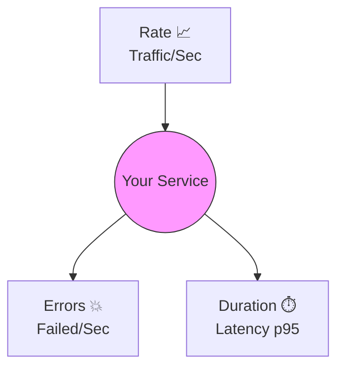

# 第17章：何を測る？REDっぽく考える🟥🟨🟩✨

## 今日のゴール🎯

この章が終わると、あなたのWeb APIに対して👇を“設計として”決められるようになります😊✨

* **Rate（量）**：どの「リクエスト」を数える？どの単位で見る？📈
* **Errors（失敗）**：何を「失敗」にする？4xxは？タイムアウトは？💥
* **Duration（時間）**：どの「時間」を測る？平均じゃなく分布で見る？⏱️

RED（Rate/Errors/Duration）は、リクエスト駆動のサービス（API）を健康診断するための、超わかりやすい型だよ〜！🩺✨ ([Grafana Labs][1])

---

## 1) REDってなに？なんで強いの？🧠✨

REDはざっくり言うと、

* **Rate**：どれだけ来てる？（リクエスト数 / 秒 など）📈
* **Errors**：どれだけ失敗してる？（失敗数 / 秒、失敗率）💥
* **Duration**：どれだけ遅い？（応答時間の分布：p95とか）⏱️

これだけで「今、利用者の体験がヤバいか？」が見えやすいのが強み🥹✨
しかも、**サービス監視に向いた考え方**として有名だよ〜！ ([Grafana Labs][1])

> ちなみに「Durationは平均じゃなく“分布”で見る（ヒストグラム/パーセンタイル）」がREDの重要ポイントになりがち💡 ([solarwinds.com][2])

---

## 2) “何を1つのサービス（Resource）として見る？”を決めよう🏷️✨

REDは「**各サービス（Resource）**」に対して当てはめるのが基本だよ🧩

初心者におすすめの切り方はこれ👇

### まずは超シンプル版（おすすめ）🍙

* **Resource = APIのエンドポイント（ルート）**
  例：`GET /work`、`GET /health`、`POST /orders` など

### 少し慣れたら（次の段階）🚀

* **Resource = “業務イベント”**
  例：注文作成、決済、在庫引当 など（HTTPよりドメイン寄り）

この章では、まず **“エンドポイント単位”** でREDを設計するね😊✨

---

## 3) Rate（量）を決める📈✨「何をカウントする？」

Rateは「来てる量」なんだけど、設計で迷うのはココ👇

### 3-1. “入口リクエスト数”を基本にする🚪📈

まずは **HTTPリクエスト数** を数えるのが鉄板！

* 単位は「**requests / second**」で見ることが多いよ（グラフは秒あたり、元データはカウントでもOK）📊
* エンドポイント単位で増減が見えると、異常が分かりやすい😊

### 3-2. 「成功/失敗」はRate側に含める？🤔

おすすめは👇

* **Rate = 総リクエスト数（成功も失敗も含む）**
* **Errors = 失敗数（別で数える）**

こうすると「量が増えたせいで壊れたのか？」が追いやすいよ🧭✨

---

## 4) Errors（失敗）を決める💥✨「何をエラー扱いにする？」

ここが一番 “設計” が出るところ！😤✨
「失敗」を雑にすると、アラートが地獄になります🥲🚨

### 4-1. まずは“3種類の失敗”に分けよう🧩

APIの失敗はだいたいこの3つに分かれるよ👇

1. **サーバ都合（5xx）**：障害の匂いが濃い🔥
2. **依存先都合（タイムアウト/DB/外部API失敗）**：これも障害寄り🔥
3. **ユーザ都合（4xx）**：仕様どおりの可能性が高い（ただし増えすぎは問題）⚠️

### 4-2. 初心者向けのおすすめルール✅

最初はこれでOK！

* **Errors（障害として扱う） = 5xx + タイムアウト系**
* **4xxは “UserError” として別枠で数える**（増えたら調査対象）

こうしておくと、
「ユーザが間違えてるだけなのに障害アラート鳴りまくり😭」
を避けられるよ〜！🧯✨

---

## 5) Duration（時間）を決める⏱️✨「どの時間を測る？」

Durationも迷いポイント多いよね〜！🥹

### 5-1. “何の時間”を測る？（測り方の定義）🧠

初心者向けの基本はこれ👇

* **サーバが受け取ってから返すまでの処理時間（Server duration）**

これを「エンドポイント単位」で見れると、まず強い💪✨

### 5-2. 平均は捨てて、分布で見る📊✨

平均だけだと、こういう事故が起きるよ👇

* 99%は速いのに、1%が激遅 → 平均だと隠れる😇
* 利用者は「遅い1回」にキレる😡

だから **p95 / p99** みたいなパーセンタイルで見るのが王道！
（裏ではヒストグラムが使われがち） ([solarwinds.com][2])

---

## 6) “まず作るREDセット”のテンプレ🧾✨（これを埋めればOK！）

エンドポイントごとに、これを埋めるだけでRED設計が完成するよ😊✨

### REDカード（1エンドポイントにつき1枚）🟥🟨🟩

* **Resource（対象）**：例 `GET /work`
* **Rate（量）**：何を数える？（総リクエスト数、単位）📈
* **Errors（失敗）**：何を失敗扱い？（5xx、timeout…）💥
* **Duration（時間）**：何の時間？（server duration）⏱️
* **分けて見たい切り口（次章以降で効く）**：method / route / status など🏷️
* **このREDで答えたい質問**：

  * 「遅い？（Duration）」
  * 「壊れてる？（Errors）」
  * 「混んでる？（Rate）」

---

## 7) ミニ演習：題材アプリでREDを“指標設計だけ”やる🧾✍️✨

題材アプリにこんなルートがある想定でいくね👇
（以前作った：成功・失敗・遅延の3兄弟😈⏱️✨）

* `GET /work`：普通に成功
* `GET /fail`：わざと失敗
* `GET /slow`：わざと遅い

### 7-1. `GET /work` のREDカード🟥🟨🟩

* Resource：`GET /work`
* Rate：`/work` への総リクエスト数
* Errors：`/work` の **5xx** と **タイムアウト**（あれば）
* Duration：`/work` のサーバ処理時間（p95で見るつもり）

👉 これで答えられること：

* 「急にアクセス増えた？」📈
* 「失敗増えた？」💥
* 「遅くなった？」🐢

### 7-2. `GET /fail` のREDカード💥特化版

* Resource：`GET /fail`
* Rate：総リクエスト数（「失敗させる」検証に必要）
* Errors：**5xxがどれだけ返ったか**（ここは“必ず失敗”想定でもOK）
* Duration：失敗時も時間は見る（例外で遅くなることある）

👉 ここで気づけるポイント：

* エラーでも「速く落ちる」のは良いことがある（ムダに待たせない）⚡

### 7-3. `GET /slow` のREDカード🐢特化版

* Resource：`GET /slow`
* Rate：総リクエスト数
* Errors：タイムアウトが出るなら、ここが増える
* Duration：ここは主役！p95/p99で見るつもり

👉 ここで答えられること：

* 遅延が「常に遅い」のか「たまにだけ遅い」のか（分布で分かる）📊✨

---

## 8) “既製品のメトリクス”を活かす発想🧰✨（作りすぎ防止）

今どきの .NET / ASP.NET Core は **System.Diagnostics.Metrics** ベースで、標準のメトリクス（built-in metrics）も出せる流れが強いよ〜！ ([Microsoft Learn][3])

さらに OpenTelemetry の世界では、HTTPサーバのメトリクスに **セマンティック規約**があって、たとえば **Duration** は `http.server.request.duration`（秒）みたいな形が出てきます🧠✨ ([OpenTelemetry][4])

なので設計としてはこう考えるのがおすすめ👇

* **まずは“既製品で取れるRED”を把握する**
* 足りない分だけ、業務に必要なメトリクスを追加する

「全部自作しなきゃ！」って思わなくてOKだよ😊🫶

---

## 9) AI活用コーナー🤖✨（設計レビューがめちゃ楽になる！）

Copilot / Codex みたいなAIがいる前提で、ここは超おいしいところ🍰✨
（“正解を聞く”というより、“抜け漏れチェック”が強いよ！）

### 9-1. REDカードをAIにレビューしてもらう🧐

例プロンプト（そのまま投げてOK）👇

* 「このAPIのRED設計として抜けてる観点ある？初心者向けに改善案も出して」
* 「Errorsの定義（5xx/timeout/4xx別枠）は妥当？運用で困りそうな点ある？」
* 「Durationはどの区間を測るべき？“利用者体験”視点で提案して」

### 9-2. アラート候補を“3つだけ”案出し🥲➡️😊

* 「REDからアラート候補を3つに絞って。理由も添えて」
  （※アラート本体は22章でガッツリやるよ🚨✨）

---

## 10) よくある事故トップ5⚠️😱（ここ踏むと泣く）

1. **Errorsの定義が曖昧** → チームで揉める＆アラート地獄😇
2. **4xxを障害扱いにして鳴りまくる** → 本当の障害が埋もれる🥲
3. **Durationを平均だけで見る** → “たまに激遅”を見逃す🐢💥
4. **Rateを見ずに「遅い！」だけ見る** → 混雑が原因なのに気づかない😵
5. **メトリクスを作りすぎる** → 維持できない＆コストも増える💸

---

## まとめ🎀✨

第17章では、メトリクスの“実装”じゃなくて **何を測るか（設計）** を固めたよ😊

* **Rate**：入口の量（まずは総リクエスト）📈
* **Errors**：障害として扱う失敗の定義（5xx/timeout中心、4xx別枠）💥
* **Duration**：平均じゃなく分布（p95/p99を見据える）⏱️📊

次の第18章では、いよいよ **.NETでメトリクスを出すときに「どこに置く？」を設計する**よ〜！🔧📈✨
（“責務を薄く保つ”がテーマになるから、ここで作ったREDカードがめちゃ効く🪶💕）

---

おまけ：最新の土台情報メモ🗒️✨

* .NETは **.NET 10** が最新LTSとして配布されていて、2026年1月の更新も出てるよ（例：10.0.2 が 2026-01-13）。 ([Microsoft][5])
* C# 14 は .NET 10 対応で、Visual Studio 2026 で扱える案内になってるよ。 ([Microsoft Learn][6])

[1]: https://grafana.com/blog/the-red-method-how-to-instrument-your-services/?utm_source=chatgpt.com "The RED Method: How to Instrument Your Services"
[2]: https://www.solarwinds.com/blog/monitoring-and-observability-with-use-and-red?utm_source=chatgpt.com "Monitoring and Observability With USE and RED"
[3]: https://learn.microsoft.com/en-us/aspnet/core/log-mon/metrics/built-in?view=aspnetcore-10.0&utm_source=chatgpt.com "ASP.NET Core built-in metrics"
[4]: https://opentelemetry.io/docs/specs/semconv/dotnet/dotnet-http-metrics/?utm_source=chatgpt.com "Semantic conventions for HTTP client and server metrics ..."
[5]: https://dotnet.microsoft.com/en-us/download/dotnet?utm_source=chatgpt.com "Browse all .NET versions to download | .NET"
[6]: https://learn.microsoft.com/en-us/dotnet/csharp/whats-new/csharp-14?utm_source=chatgpt.com "What's new in C# 14"
