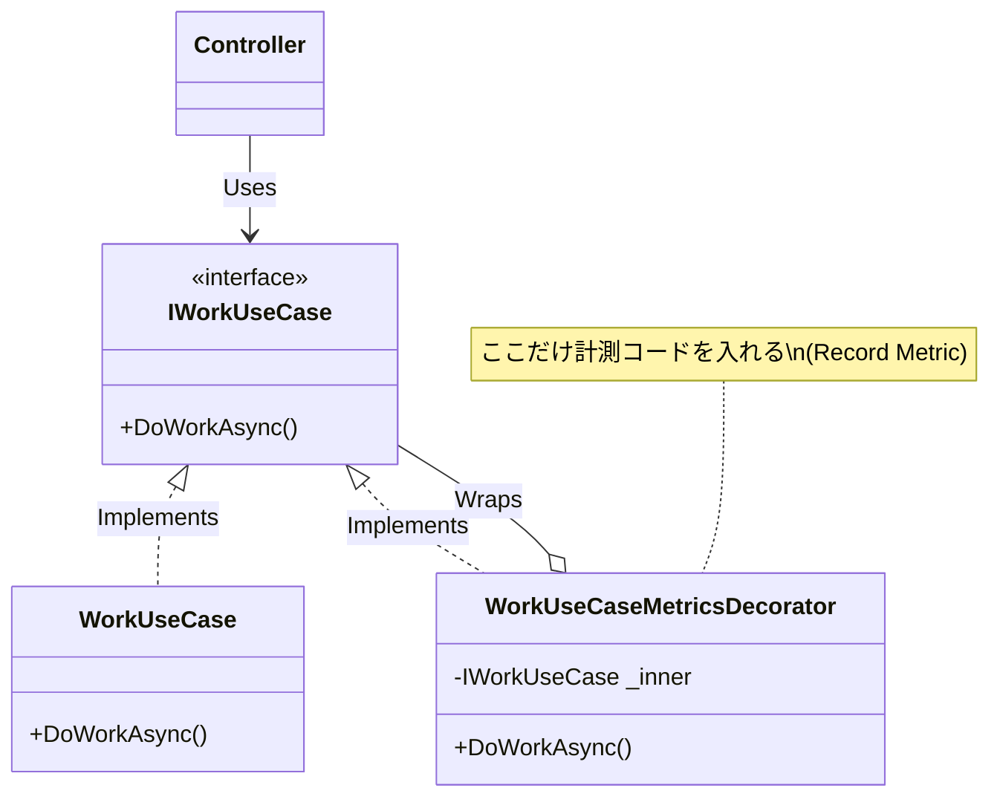

# 第18章：.NETでメトリクスを出す考え方🔧📈（設計中心）

この章は「**メトリクスを“どこに置くか”**」「**何を記録するか**」を、**コードを書く前に決められる**ようになるのがゴールだよ〜！✨
いまの最新世代としては **.NET 10 / ASP.NET Core 10（LTS）** を前提に話すね🧁（2025-11-11リリース）([Microsoft][1])

---

## 0) 到達目標🎯✨

章末でこうなってたら勝ち！🏆

* 「入口/業務/外部I/O」それぞれに**どんなメトリクスが必要か**言える🗺️
* **計測コードが本体ロジックを汚さない**置き方を選べる🪶
* “まずは自動、足りない分だけカスタム”の方針で**ムダ計測を減らせる**✂️
* **Counter / Histogram / Gauge**を「用途で」選べる📊([Microsoft Learn][2])

---

## 1) まず全体像👀：「数字」はどうやって“メトリクス”になるの？🧩

アプリが出すのは「数値（計測点の記録）」なんだけど、監視で使える形にするには流れがあるよ〜🌊

1. **計測コード**が数値を記録する（例：処理時間、件数）
2. **収集（collection）**で集計される（例：平均、p95、成功率）
3. **エクスポート**されて保存される（PrometheusやOTLPなど）
4. **ダッシュボード/アラート**で使える✨

この「収集〜表示」まで含めて、ASP.NET Core のメトリクス解説がまとまってるよ📝([Microsoft Learn][3])

---

## 2) 計測ポイントは3カ所だけ覚えて🧠✨（入口/業務/外部I/O）

第4章でやった「観測の境界」💡を、メトリクスでももう一回だけ固定しよ！

## A. 入口（HTTP）🚪🌐

* 例：リクエスト数、失敗率、応答時間（p95）
* ここは **フレームワークや自動計測**が強い💪
  ASP.NET Core には **System.Diagnostics.Metrics** ベースの組み込みメトリクスがあるよ([Microsoft Learn][4])

## B. 業務（ユースケース）🧠🧾

* 例：「注文確定件数」「検索回数」「在庫引当失敗」みたいな**ビジネス指標**
* ここは “自動”で出ないことが多いから、**最小限だけカスタム**が効く✨

## C. 外部I/O（DB・外部API・Queue）🔌🗄️

* 例：外部APIの失敗率、DB待ち時間、リトライ回数
* ここも **HttpClient/DB instrumentation** が助けてくれる（OpenTelemetry など）([OpenTelemetry][5])

---

## 3) この章の主役：「計測の責務を薄くする」作戦🪶✨

メトリクス実装で一番やりがち事故はこれ👇😱

* ドメイン/業務ロジックの中に `Histogram.Record(...)` が散らばる
* 仕様変更で計測点がズレて、修正が地獄
* テストが読みづらくなる

だから、基本方針はこれだけ覚えてね💖

## ✅ 方針1：まず“自動で取れるもの”を最大限使う🤖📈

ASP.NET Core のメトリクス手順（Prometheus/Grafana例）も公式にあるよ([Microsoft Learn][3])

## ✅ 方針2：カスタムは「少数の意思ある指標」だけ🎯

* “なんとなく全部” はやめる🙅‍♀️
* 「アラート候補になる」「経営/プロダクトの判断に効く」だけ残す✨

## ✅ 方針3：計測は“境界に寄せる”🧲

* 入口：Middleware / Filter / 自動計測
* 業務：UseCase の **外側**（Decorator）
* 外部I/O：Repository や Client の **外側**（Wrapper/Decorator）

---

## 4) 置き方の定番パターン3つ🍰（これだけでOK）

## パターンA：入口に置く（Middleware/Filter）🚪✨

* HTTP全体のレイテンシ、ステータス別件数
* “どのAPIが遅い？”がすぐ分かる
* しかも組み込み/自動に乗りやすい([Microsoft Learn][3])

## パターンB：業務の外側に巻く（UseCase Decorator）🎀🧠

**おすすめ度：高い💯**

* “注文確定”みたいなユースケース単位で

  * 件数（Counter）
  * 失敗件数（Counter）
  * 所要時間（Histogram）
    をまとめて出す✨

## パターンC：外部I/Oの外側に巻く（HttpClient/Repository Decorator）🔌🧯

* “外部APIが遅い/落ちてる”を切り分けやすい
* 自動計測と併用しやすい([OpenTelemetry][6])

---

## 5) .NETのメトリクスAPIで「汚さず出す」基本形🧼✨

.NET のメトリクスは **System.Diagnostics.Metrics** が基礎だよ🧱([Microsoft Learn][2])
そして今どきは **IMeterFactory** を使うと「作り方が揃って気持ちいい」🫶([Microsoft Learn][7])

## ✅ “メトリクス定義を1箇所に集める”例（おすすめ）🏠

```csharp
using System.Diagnostics.Metrics;

public static class AppMetrics
{
    public const string MeterName = "MyApp";

    // Meterは使い回す（アプリ全体で1つ、が基本）
    public static readonly Meter Meter = new(MeterName, "1.0.0");

    // 件数（増えるだけ）
    public static readonly Counter<long> WorkRequests =
        Meter.CreateCounter<long>("myapp.work.requests", unit: "count");

    // 所要時間（分布）
    public static readonly Histogram<double> WorkDurationMs =
        Meter.CreateHistogram<double>("myapp.work.duration", unit: "ms");
}
```

> ここでのポイントは「**UseCaseやControllerにメトリクス定義を置かない**」だよ🪶✨
> 使う側は `AppMetrics.WorkDurationMs.Record(...)` を呼ぶだけでOK。

---

## 6) “業務の外側で巻く”いちばん実用的な例🎀🧠（Decorator）




たとえば `IWorkUseCase` があるとして、計測はこうやって外側で巻いちゃう👇

```csharp
using System.Diagnostics;
using System.Diagnostics.Metrics;

public interface IWorkUseCase
{
    Task DoWorkAsync(CancellationToken ct);
}

public sealed class WorkUseCaseMetricsDecorator : IWorkUseCase
{
    private readonly IWorkUseCase _inner;

    public WorkUseCaseMetricsDecorator(IWorkUseCase inner)
        => _inner = inner;

    public async Task DoWorkAsync(CancellationToken ct)
    {
        var sw = Stopwatch.StartNew();
        try
        {
            AppMetrics.WorkRequests.Add(1);
            await _inner.DoWorkAsync(ct);
        }
        catch
        {
            // 例：失敗件数も欲しいなら Counter を別に用意して Add(1) する
            throw;
        }
        finally
        {
            sw.Stop();
            AppMetrics.WorkDurationMs.Record(sw.Elapsed.TotalMilliseconds);
        }
    }
}
```

これの良さ💖

* 本体の `WorkUseCase` は**業務だけに集中**できる
* どのユースケースを測るか、後から差し替えやすい
* テストでも “計測を外した状態” を作りやすい

---

## 7) ミニ演習🧪✨「計測の責務を“薄く”保つ作戦を作る🪶」

あなたの題材アプリ（/work など）を想定して、次を埋めてね📝💕

## ① 入口（HTTP）🚪

* 何を見る？：例）リクエスト数 / エラー率 / p95
* 置き場所：Middleware or 自動計測（まずは組み込み確認）([Microsoft Learn][3])

## ② 業務（UseCase）🧠

* 何を見る？：例）`work.completed`（完了数） / `work.duration`（時間）
* 置き場所：Decorator（外側）🎀

## ③ 外部I/O（HttpClient/DB）🔌

* 何を見る？：例）外部APIの失敗率 / 待ち時間
* 置き場所：Client/Repository の外側 + 自動計測併用([OpenTelemetry][6])

✨最後に一言で！

> 「**業務コードは汚さない。境界で測る。カスタムは最小。**」
> この1文をあなたの“観測ポリシー”に入れてOKだよ💖

---

## 8) ちゃんと動いてるかローカルで見る👀✨（超ざっくり）

この章は設計中心だけど、「見える」体験は大事なので最短だけ！

* **dotnet-counters** でリアルタイム確認できるよ（公式チュートリアルでも触れてる）([Microsoft Learn][3])
* OpenTelemetry を使うなら、ASP.NET Core の例で **Prometheus exporter** → Grafana まで公式導線があるよ([Microsoft Learn][3])

---

## 9) AI活用🤖✨（メトリクス設計を早く“それっぽく”する魔法🪄）

コピペで使えるプロンプト例だよ〜💕

* 「このWeb APIの主要ユースケースは○○。RED観点で指標候補を出して、**3つに絞って理由も**書いて」
* 「このユースケースにメトリクスを入れたい。**業務コードを汚さない**Decorator案をC#で出して」
* 「“アラートに向く指標”だけにしたい。ノイズになりそうな指標を指摘して」

---

## まとめ🍓✨（第18章のキモ）

* 計測ポイントは **入口/業務/外部I/O** の3つに固定🧷
* 実装は **境界で測る**（Decorator/Wrapper）＝責務が薄くて強い🪶
* まずは **組み込み＆自動計測**、足りない分だけカスタム🎯([Microsoft Learn][4])
* .NETは **System.Diagnostics.Metrics** が土台で、**IMeterFactory** も選択肢になるよ([Microsoft Learn][2])

---

次の第19章は「命名ルールと単位設計🏷️📏」だから、この章で決めたメトリクスを**読みやすい名前に整える**感じになるよ〜✨

[1]: https://dotnet.microsoft.com/en-us/platform/support/policy/dotnet-core?utm_source=chatgpt.com "NET and .NET Core official support policy"
[2]: https://learn.microsoft.com/en-us/dotnet/core/diagnostics/metrics-instrumentation?utm_source=chatgpt.com "Creating Metrics - .NET"
[3]: https://learn.microsoft.com/en-us/aspnet/core/log-mon/metrics/metrics?view=aspnetcore-10.0&utm_source=chatgpt.com "ASP.NET Core metrics"
[4]: https://learn.microsoft.com/en-us/aspnet/core/log-mon/metrics/built-in?view=aspnetcore-10.0&utm_source=chatgpt.com "ASP.NET Core built-in metrics"
[5]: https://opentelemetry.io/docs/languages/dotnet/libraries/?utm_source=chatgpt.com "Using instrumentation libraries"
[6]: https://opentelemetry.io/docs/languages/dotnet/metrics/getting-started-aspnetcore/?utm_source=chatgpt.com "Getting started with metrics - ASP.NET Core"
[7]: https://learn.microsoft.com/en-us/dotnet/api/system.diagnostics.metrics.imeterfactory?view=net-10.0&utm_source=chatgpt.com "IMeterFactory Interface (System.Diagnostics.Metrics)"
