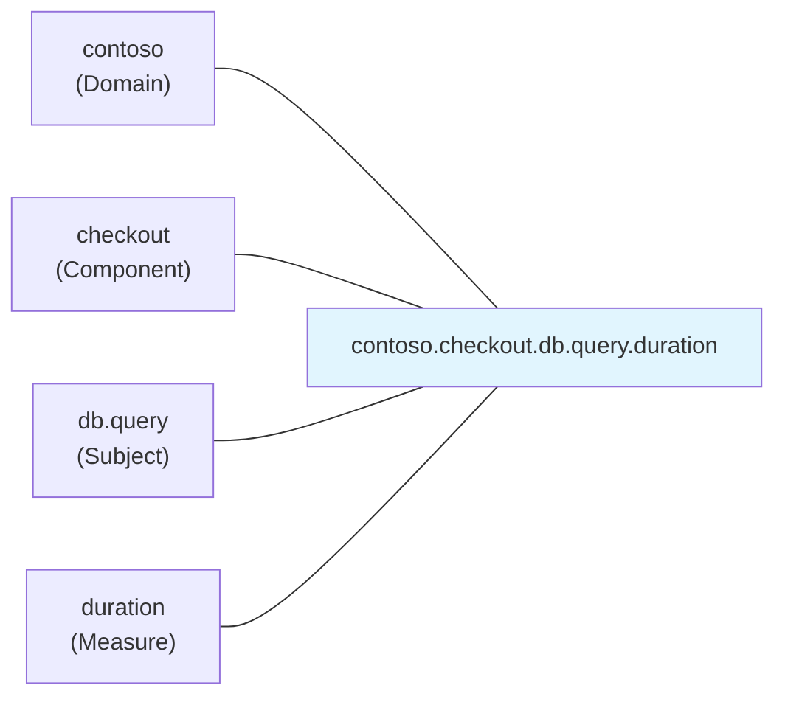

# 第19章：命名ルールと単位設計🏷️📏（読みやすさ＝正義）✨

## この章のゴール🎯

* メトリクス名を見ただけで「何を測ってるか」が分かるようになる👀✨
* “秒？ミリ秒？バイト？”みたいな単位事故をゼロにする🧯💥
* 後からダッシュボードやアラートを作る人（未来の自分も！）が助かる設計にする🫶

---

## 1) まず結論：命名と単位は「設計の契約」🤝📜

メトリクスは **出した瞬間から“運用のAPI”** だよ〜！📡
名前と単位がブレると、グラフが嘘をついたり、アラートが誤爆したり、調査が迷子になります😵‍💫🌀

特に .NET 側は「この名前でこういう意味」っていう強制が少ない分、**最初のルール作りが超大事**！
.NET の公式ドキュメントでも、Instrument（メトリクス名）は **OpenTelemetry の命名ガイドライン（小文字＋ドット階層＋単語区切りは `_`）** を推奨してるよ〜📘✨（さらに “Meter 名が最終メトリクス名に残らないこともあるから、Instrument 名だけで一意にしよう” とも言ってる）([Microsoft Learn][1])

---

## 2) “標準に乗る”のが一番ラク🚃💨（OpenTelemetry / Prometheus）

## OpenTelemetry（OTel）側の考え方🧠✨

* **単位はメトリクス名に入れない**（メタデータで持てるなら）
* 単位は **UCUM**（表記ルール）で書くのが推奨
* **時間は秒 `s` 推奨**（ms じゃなくて s）
* バイトは **`By`**（できるだけ非プレフィックス＝MiBとか避ける）
* “件数”みたいなカウントは `{request}` `{error}` みたいに **波かっこ注釈** を使うのが推奨([OpenTelemetry][2])

そして実例として、HTTP の標準メトリクスも **`ms → s` に寄せる変更**が入ってる（例：`http.server.request.duration` の unit が `s`）ので、「時間は秒」が今の流れだよ〜⏱️➡️🕰️([OpenTelemetry][3])

## Prometheus 側の考え方🟦🐻

Prometheus は逆に、運用上の都合で **“単位を名前に含める”のを強く推奨**してるよ〜（`*_seconds` とか）📏
それに「単位は混ぜるな危険」🔥 も明確に書かれてる！([Prometheus][4])
さらに Counter なら `_total` を付ける、`_sum/_count/_bucket/_total` は型に意味があるから雑に使わない、などのお作法もあるよ〜([Prometheus][5])

## じゃあ現場ではどうする？🤔

今回のカリキュラムは **OTel前提の設計**として進めるのが◎（.NET公式もそっち推奨）([Microsoft Learn][1])
ただし、Prometheus などに出すときに **変換（ドット→アンダースコア、単位サフィックス付与）** が入ることがあるので、**“二重に単位を書かない”** のが超重要！💣😇

---

## 3) 命名ルール：これだけ守れば強い💪🏷️✨

## ✅ 命名の基本形（おすすめテンプレ）🧩

**`<domain>.<component>.<subject>.<measure>`**

* domain：アプリや会社・プロダクト（例 `contoso`）
* component：サブシステム（例 `checkout` `catalog`）
* subject：何に関する話？（例 `db.query` `http.server.request`）
* measure：何を測る？（例 `duration` `errors` `active`）

.NET 側の推奨どおり、**小文字＋ドット階層**、同じ要素の複数単語は **`_`** で区切ると読みやすいよ🏷️✨([Microsoft Learn][1])

## ✅ “名前は名詞で、タグで条件を付ける”🌿

例：

* 良い：`contoso.checkout.http.server.request.duration`（タグで `http.request.method` や `http.response.status_code` を付ける）
* 微妙：`contoso.checkout.http.get_200.duration`（条件を名前に焼き込みすぎ😵‍💫）

> タグ設計の深掘りは次章（cardinality）でガッツリやるよ⚠️🏷️

## ✅ “名前は変えない”が基本（変えると別メトリクス）🧊

ダッシュボード・アラート・SLO が全部壊れるので、リネームは実質「API破壊」💥
どうしても直したい時は、**新しい名前を追加して旧メトリクスは段階的に廃止**が安全だよ🧯✨

---

## 4) 単位設計：事故るポイントを潰す🧯📏

## ✅ 単位は UCUM で書く（おすすめ）🧾

OTel の semconv は **UCUM（case sensitive “c/s”）** を推奨してるよ📐✨([OpenTelemetry][2])
よく使うのはこのへん👇

* 時間：`s`（秒）⏱️（OTelでも seconds 推奨）([OpenTelemetry][2])
* サイズ：`By`（bytes）📦（プレフィックス避けるの推奨）([OpenTelemetry][2])
* 比率：`1`（無次元）📊
* カウント：`{request}` `{error}` `{item}` みたいな注釈📌（複数形にしないのもコツ！）([OpenTelemetry][2])

## ✅ “秒 vs ミリ秒”は統一しないと死ぬ😇

Prometheus も「単位は混ぜるな」って強く言ってるよ🔥([Prometheus][4])
OTel のHTTPメトリクスも `ms → s` に揃えた流れがあるので、**基本は秒で統一**がおすすめ⏱️✨([OpenTelemetry][3])

---

## 5) 具体例：良い名前 / ダメ名前🆚😇😱


| 目的            | ダメ（事故りやすい）😱                     | 良い（意味が明確）😇                   | unit        |
| ------------- | -------------------------------- | ----------------------------- | ----------- |
| /work の処理時間   | `workTime`                       | `demo.work.duration`          | `s`         |
| /work の呼び出し回数 | `work_count`（Gaugeっぽく見える）        | `demo.work.requests`          | `{request}` |
| 失敗回数          | `demo.work.failures_total`（型が曖昧） | `demo.work.errors`（Counter前提） | `{error}`   |
| 送信サイズ         | `payload_size_kb`（単位がKB固定）       | `demo.http.response.size`     | `By`        |

※ Prometheus に直接出す世界だと `*_seconds` とか `*_total` を名前に入れる流儀が強いけど、OTel前提なら **unit はメタデータ**で持つのが基本、って覚えておくと混乱しにくいよ🧠✨([OpenTelemetry][2])



---

## 6) C# 実装例（命名＋単位を “最初から” 入れる）💻✨

> ここでは **「秒」「UCUM」「階層名」** を意識して、あとで見た人が迷わない形にするよ〜🫶

```csharp
using System.Diagnostics;
using System.Diagnostics.Metrics;

public static class DemoMetrics
{
    // Meter名は「ライブラリ/コンポーネント」を表すイメージ（安定した名前にする）
    private static readonly Meter Meter = new("Contoso.Demo", version: "1.0.0");

    // 1) リクエスト数（カウント）: unit は {request}
    public static readonly Counter<long> WorkRequests =
        Meter.CreateCounter<long>(
            name: "demo.work.requests",
            unit: "{request}",
            description: "Number of /work requests");

    // 2) エラー数（カウント）: unit は {error}
    public static readonly Counter<long> WorkErrors =
        Meter.CreateCounter<long>(
            name: "demo.work.errors",
            unit: "{error}",
            description: "Number of /work errors");

    // 3) 処理時間（分布）: Histogram + 秒(s)
    public static readonly Histogram<double> WorkDuration =
        Meter.CreateHistogram<double>(
            name: "demo.work.duration",
            unit: "s",
            description: "Duration of /work handler");
}

public sealed class WorkService
{
    public string DoWork(bool fail)
    {
        DemoMetrics.WorkRequests.Add(1);

        var sw = Stopwatch.StartNew();
        try
        {
            if (fail) throw new InvalidOperationException("boom");
            // 何か処理...
            return "ok";
        }
        catch
        {
            DemoMetrics.WorkErrors.Add(1);
            throw;
        }
        finally
        {
            sw.Stop();
            DemoMetrics.WorkDuration.Record(sw.Elapsed.TotalSeconds);
        }
    }
}
```

ポイント✨

* `duration` は **`Histogram<double>`** ＋ **unit `s`**（秒）に統一⏱️
* “件数” は **`{request}` / `{error}`** のノリで意味を足す📌
* 「Meter名が最終名に残らないこともある」ので、**Instrument名だけで見ても一意**にしておくと安心だよ〜🛡️([Microsoft Learn][1])

---

## 7) ミニ演習：命名テンプレを作ろう🧩📝✨

## お題🎒

題材アプリに「最低限これだけは欲しい！」を **6個** 選んで、
**(1) メトリクス名 (2) 型 (3) unit** を埋めてみてね😊✨

| No | 目的           | 名前 | 型         | unit |
| -- | ------------ | -- | --------- | ---- |
| 1  | /work 呼び出し回数 |    | Counter   |      |
| 2  | /work エラー回数  |    | Counter   |      |
| 3  | /work 処理時間   |    | Histogram |      |
| 4  | 外部API呼び出し時間  |    | Histogram |      |
| 5  | DBクエリ時間      |    | Histogram |      |
| 6  | 現在のキュー長      |    | Gauge     |      |

## 模範例（ひとつの答え）🌟

* `demo.work.requests` / Counter / `{request}`
* `demo.work.errors` / Counter / `{error}`
* `demo.work.duration` / Histogram / `s`
* `demo.external_api.request.duration` / Histogram / `s`
* `demo.db.query.duration` / Histogram / `s`
* `demo.queue.length` / Gauge / `{item}`（または `1` でもOK。意味付けしたいなら `{item}`）([OpenTelemetry][2])

---

## 8) AI活用（レビューがめちゃ効く）🤖✨

Copilot / ChatGPT にこう投げると強いよ💪💬

* 「このメトリクス一覧、命名の一貫性が崩れてる所を指摘して、直した案を出して」🔍
* 「unit が `ms` と `s` で混ざってない？混ざってたら統一案を出して」⏱️
* 「タグに逃がすべき情報を、名前に入れちゃってないかレビューして」🏷️
* 「Prometheus に出した時に誤解されそうな名前（_total/_count など）を検知して」⚠️([Prometheus][5])

---

## 9) 章末チェックリスト✅✨（これ通ったら勝ち）

* [ ] メトリクス名は **小文字＋ドット階層**（単語区切りは `_`）になってる？([Microsoft Learn][1])
* [ ] `duration` は **秒 `s`** に統一できてる？([OpenTelemetry][2])
* [ ] “件数” は `{request}` `{error}` などで意味が足せてる？([OpenTelemetry][2])
* [ ] 1つのメトリクス名で単位が混ざってない？（秒とmsを混ぜない！）([Prometheus][4])
* [ ] `_sum/_count/_bucket/_total` を雑に使ってない？（特別な意味がある）([Prometheus][5])

---

## 次章予告👀✨

次は **ラベル（タグ）設計と cardinality 爆発⚠️🏷️**！
ここでやった「名前はスッキリ、条件はタグへ」の設計が、次章でめちゃ効いてくるよ〜🔥💪

[1]: https://learn.microsoft.com/en-us/dotnet/core/diagnostics/metrics-instrumentation "Creating Metrics - .NET | Microsoft Learn"
[2]: https://opentelemetry.io/docs/specs/semconv/general/metrics/ "Metrics semantic conventions | OpenTelemetry"
[3]: https://opentelemetry.io/blog/2023/http-conventions-declared-stable/ "HTTP semantic conventions declared stable | OpenTelemetry"
[4]: https://prometheus.io/docs/practices/naming/ "Metric and label naming | Prometheus"
[5]: https://prometheus.io/docs/instrumenting/writing_exporters/ "Writing exporters | Prometheus"
