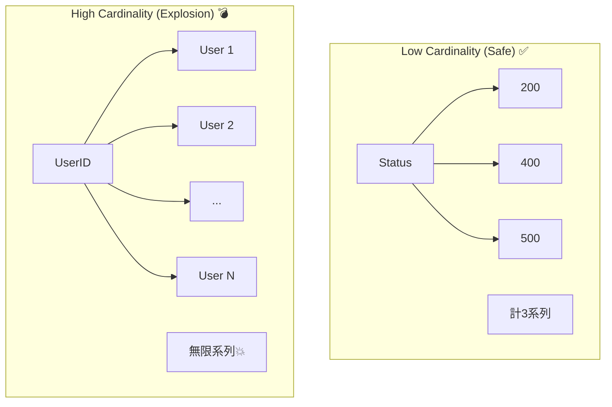

# 第20章：ラベル（タグ）設計と cardinality 注意 ⚠️🏷️

（メトリクスが“爆発🔥”しないようにする回！）

---

## 0. この章でできるようになること 🎯✨

* 「このタグは付けてOK？やめた方がいい？」を判断できる🧠✅
* **cardinality（カーディナリティ）＝“組み合わせ爆発”**を説明できる💥
* “分けたい軸”は **メトリクス / ログ / トレース**のどれに載せるべきか選べる🧭

---

## 1. そもそもラベル（タグ）って何？🏷️😊

メトリクスって、ざっくり言うと「数の集計」📈
でも、集計って **“切り口（軸）”** がないと役に立ちにくいよね？

* 例）`http.server.request.duration`（リクエストの時間）

  * GET と POST を分けたい
  * 200 と 500 を分けたい
  * どのルートが遅いか分けたい

この **“分けるための付属情報”**が、ラベル（タグ）だよ〜🏷️✨
（OpenTelemetryでは attributes とも呼ぶよ）([OpenTelemetry][1])

---

## 2. cardinality（組み合わせの数）って何？💣😱


**cardinality = ラベル値の“ユニークな組み合わせ数”**のこと！
たとえば

* `method` が 3種類（GET/POST/DELETE）
* `status_code` が 5種類（200/400/401/404/500）

なら、組み合わせは **3×5=15** 通りだね🧮✨

でもここに、もし `user_id`（無限に近い）を入れたら…？
**組み合わせが無限に増えて、保存量もメモリもコストも爆増💥**しちゃう。

Prometheus は特に分かりやすくて、公式がこう警告してるよ👇

> ラベルのキー・値の組み合わせ1つが **新しい時系列**になる。
> user ID やメールみたいな **高cardinality**は入れるな⚠️
> …っていう話。([Prometheus][2])



OpenTelemetry側も「爆発はよくある課題」ってはっきり書いてる🧯
属性が増えて値が多いと、組み合わせが天文学的になるよ〜って説明されてるよ。([OpenTelemetry][1])

---

## 3. まず覚える！タグ設計 “5つの鉄則” 🏷️🧠✨

### 鉄則①：**値が“有限で小さい集合”か？** 🧊

* ✅ OK：`method=GET|POST`、`status_code=200|500`、`result=success|fail`
* ❌ NG：`user_id=12345`、`request_id=uuid`、`email=...`
  （無限に増える＝爆発🔥）([Prometheus][2])

### 鉄則②：**「検索したい文字列」はメトリクスに入れない**🔍🚫

* 「特定ユーザーの挙動を追いたい」→ **ログ or トレース**向き🪵🧵
* メトリクスは「全体の健康診断」📊が得意！

### 鉄則③：**“URLの生”を入れない** 🌐😱

OpenTelemetryのHTTPメトリクスでは `http.route` について
**「低cardinalityであること（MUST）」**って明記されてるよ。
動的な部分はプレースホルダにしようね、って。([OpenTelemetry][3])

* ✅ OK：`/users/{id}`
* ❌ NG：`/users/12345`（idごとに時系列が増える！）

### 鉄則④：**“環境/サービス名/インスタンス”は、基本 Resource 属性へ** 🧩

OpenTelemetryでは `service.name` は “サービスの論理名”で、明示設定推奨だよ〜って書いてある🛠️
（タグで毎回付けるより、リソースとして付ける発想）([OpenTelemetry][4])

### 鉄則⑤：**「このタグで何を判断するの？」が言えないなら削る** ✂️🙂

タグは便利だけど、増やすほどダッシュボードもアラートも複雑化😵‍💫
“目的が説明できるものだけ”残すのが最強だよ💪✨

---

## 4. “OKタグ / NGタグ” 早見表 📋🏷️✨

| 目的        | OKタグ例 ✅                            | NGタグ例 ❌（爆発しがち）                 |         |                    |
| --------- | ---------------------------------- | ------------------------------ | ------- | ------------------ |
| HTTPの切り分け | method / status_code / route(テンプレ) | 生path / querystring / full URL |         |                    |
| エラー分類     | error.type（種類で）                    | exception.message（文章そのまま）      |         |                    |
| 顧客セグメント   | plan=free                          | pro / region=JP                | US      | user_id / email    |
| 外部依存      | dependency=payment                 | db / outcome=ok                | timeout | dependency_url（無限） |

HTTPの推奨タグ（例：`http.request.method`, `http.response.status_code`, `http.route`）は仕様としてまとまってるよ🧵📏([OpenTelemetry][3])

---

## 5. ASP.NET Core の実例：タグは“範囲を決めて”足す 🧁✨

ASP.NET Core には `http.server.request.duration` があって、
**マッチしたルート**や**ステータスコード**などをタグに持てるよ〜って説明がある📌([Microsoft Learn][5])

しかもタグ拡張（enrich）例が最高に教材向きで👇
`utm_medium`（クエリ文字列）をそのまま入れずに、
`social/email/organic/other/none` みたいに **値を有限に丸めてる**の！えらい！👏🥹([Microsoft Learn][5])

---

## 6. C#で“良いタグ”の付け方（ミニ例）🧪🏷️

ポイントはこれ👇

* **生データをタグにしない**（丸める！）
* 値は **小さい集合**にする

```csharp
using System.Diagnostics.Metrics;

static class Metrics
{
    private static readonly Meter Meter = new("MyApp.Api", "1.0.0");

    // 例: APIの処理時間（秒）
    public static readonly Histogram<double> WorkDuration =
        Meter.CreateHistogram<double>("myapp.work.duration", unit: "s");
}

static string ToResultTag(bool ok) => ok ? "success" : "fail";

// “爆発防止”の丸め例：例外種別を有限に寄せる
static string ToErrorTypeTag(Exception ex) =>
    ex switch
    {
        TimeoutException => "timeout",
        HttpRequestException => "http_error",
        _ => "other"
    };

// 呼び出し側（例）
try
{
    var sw = System.Diagnostics.Stopwatch.StartNew();

    // ... work ...

    sw.Stop();
    Metrics.WorkDuration.Record(sw.Elapsed.TotalSeconds,
        KeyValuePair.Create<string, object?>("result", ToResultTag(true)));
}
catch (Exception ex)
{
    Metrics.WorkDuration.Record(0,
        KeyValuePair.Create<string, object?>("result", ToResultTag(false)),
        KeyValuePair.Create<string, object?>("error.type", ToErrorTypeTag(ex))); // 有限に丸める
}
```

※タグ数が多いときのパフォーマンス最適化として `TagList` の話もあるよ（必要になったらでOK！）([GitHub][6])

---

## 7. それでも“高cardinalityで見たい”ときどうする？🧵🪵✨

「ユーザー別に遅い人を特定したい！」みたいな要望、あるよね🥺

そのときの方針はこれ👇

* **メトリクス**：全体傾向・アラート（健康診断）📈
* **ログ/トレース**：個別ユーザー・個別リクエストの深掘り🪵🧵

OpenTelemetry には “メトリクスとトレースを関連付ける（exemplars）” の考え方もあるよ〜（深掘り導線づくりに便利）([OpenTelemetry][1])

---

## 8. OpenTelemetry の“安全装置”も知っておこう 🧯✨

OpenTelemetry .NET には **cardinality limit** があって、
デフォルトは **1メトリクスあたり 2000**。超えそうになると抑制する仕組みがあるよ。([OpenTelemetry][1])

さらに新しめのSDK（説明中では `1.10.0` の話が出てる）だと、上限到達後に “overflow attribute” 側にまとめる挙動も説明されてる。([OpenTelemetry][1])
ただし！これは最後の砦🛡️なので、**設計で爆発させない**のが基本ね😉

---

## 9. ミニ演習：OKラベル / NGラベル表を作ろう 📋🖊️✨

あなたの題材アプリ（/health /work /失敗ルートなど）を想定して👇

1. 付けたいタグ候補を10個出す🏷️🏷️🏷️
2. それぞれについて、これを埋める👇

* タグ名：
* 想定値の種類数（だいたいでOK）：
* 値は増え続ける？（Yes/No）
* このタグで何が判断できる？（1文）：
* 判定：✅採用 / ❌却下 / 🤔要相談（ログ/トレースへ）

3. 最後に、**採用タグだけ**で「最大組み合わせ数（概算）」を掛け算してみる🧮✨
   （“増え続ける値”が混ざってたら、その時点でアウト〜！🙅‍♀️）

---

## 10. AI活用（Copilot / Codex）🤖🪄

使い方のコツは「タグ案を出させる」より、**“爆発判定”をさせる**のが強い💪✨

* 例プロンプト👇

  * 「このメトリクスのタグ候補を出して。各候補に対して “値が有限か/増え続けるか” も判定して」
  * 「`http.route` を生のURLじゃなくてテンプレにする案を3つ出して」([OpenTelemetry][3])
  * 「このタグ設計で cardinality が危ない箇所を指摘して、代替（ログ/トレース）案も出して」

---

## 11. 章末チェッククイズ（サクッと）✅💡

1. `user_id` をタグに入れるのが危ない理由は？😱
2. `http.route` はどう作るべき？（生URL？テンプレ？）🛣️
3. “個別ユーザーの深掘り”は、メトリクスより何が向く？🪵🧵

---

次の第21章では、わざと負荷・失敗・遅延を起こして、**タグがちゃんと“反応”する**のを見比べるよ〜🧪📈✨

[1]: https://opentelemetry.io/docs/languages/dotnet/metrics/best-practices/ "Best practices | OpenTelemetry"
[2]: https://prometheus.io/docs/practices/naming/ "Metric and label naming | Prometheus"
[3]: https://opentelemetry.io/docs/specs/semconv/http/http-metrics/ "Semantic conventions for HTTP metrics | OpenTelemetry"
[4]: https://opentelemetry.io/docs/concepts/resources/ "Resources | OpenTelemetry"
[5]: https://learn.microsoft.com/en-us/aspnet/core/log-mon/metrics/metrics?view=aspnetcore-10.0 "ASP.NET Core metrics | Microsoft Learn"
[6]: https://raw.githubusercontent.com/open-telemetry/opentelemetry-dotnet/main/docs/metrics/README.md?utm_source=chatgpt.com "https://raw.githubusercontent.com/open-telemetry/o..."
