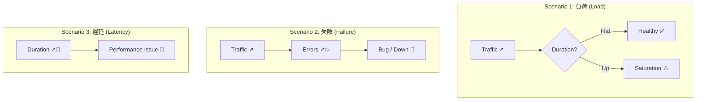

# 第21章：ローカルでの検証（負荷・失敗・遅延）🧪📈✨

この章は「メトリクスって…ほんとに“反応する”の？」を、手で壊して👊→目で見て👀→納得する😳ための回です！

---

## 今日のゴール🎯💖

次の3つを “自分の目で” 確認できるようになります👇

1. **負荷（Traffic）が増えた**とき：リクエスト数が上がる📈
2. **失敗（Errors）が増えた**とき：成功率が落ちる💥
3. **遅延（Duration）が増えた**とき：P90/P99が伸びる🐢➡️🚀

そして最後に、**「どのグラフを見ればいいか」**が迷子にならない型も作ります🧭✨

---

## まずは可視化の“観測窓”を用意しよ🪟👀

ローカル検証は、最短でいくならこの2択がおすすめ！

## A案：Aspire Dashboard（いちばん楽）🪄✨

Dockerで起動して、**OTLPで送ったログ/メトリクス/トレースを一気に見れる**やつです。
開発者向けで、セットアップ少なめなのが強い💪✨ ([Microsoft Learn][1])

起動（PowerShell）👇（そのままコピペOK）

```powershell
docker run --rm -it `
  -p 18888:18888 `
  -p 4317:18889 `
  --name aspire-dashboard `
  mcr.microsoft.com/dotnet/aspire-dashboard:latest
```

* 起動ログに**ログイン用トークン**が出ます（毎回変わるよ）🔑
* URLの `0.0.0.0` を `localhost` にして開けばOK、みたいな流れです ([Microsoft Learn][1])

> Aspire Dashboardは **ヒストグラムを P50/P90/P99 で描いてくれる**し、外れ値に「点（exemplar）」が出て **クリックでトレースに飛べる**のが神✨ ([Microsoft Learn][1])

---

## B案：Prometheus（収集）＋Grafana（可視化）🧰📊

王道構成。後で運用に寄せるならこっちが筋良し。
.NET 側は **Prometheus Exporterで `/metrics` を生やす**のが基本ムーブです ([Microsoft Learn][2])

（この章では、A案で進めつつ、B案の差分も最後に置きます🫶）

---

## 題材アプリに「反応するメトリクス」を入れる🧩📈

ここでは、**わざと壊せる**ように、1つの `/work` で全部起こせる設計にします😈✨

* `ms`：遅延を増やす（例：500ms）🐢
* `failRate`：失敗率を増やす（例：0.2で20%失敗）💥

## 1) NuGet（例）📦

Aspire Dashboard（OTLP）に投げるなら、OTLP Exporter入りが便利です ([Microsoft Learn][1])

## 2) Program.cs（サンプル）🧑‍💻✨

```csharp
using System.Diagnostics;
using System.Diagnostics.Metrics;
using OpenTelemetry.Metrics;
using OpenTelemetry.Resources;
using OpenTelemetry.Trace;

var builder = WebApplication.CreateBuilder(args);

// OpenTelemetry（メトリクス＋トレース）をまとめて設定
builder.Services.AddOpenTelemetry()
    .ConfigureResource(r => r.AddService("DemoApi"))
    .WithMetrics(m =>
    {
        m.AddAspNetCoreInstrumentation();
        m.AddHttpClientInstrumentation();

        // 自作メトリクス（Meter）
        m.AddMeter(DemoMetrics.MeterName);

        // ASP.NET Core 側のメトリクスも拾う（例）
        m.AddMeter("Microsoft.AspNetCore.Hosting");
        m.AddMeter("Microsoft.AspNetCore.Server.Kestrel"); // .NETの例でも使われます
    })
    .WithTracing(t =>
    {
        t.AddAspNetCoreInstrumentation();
        t.AddHttpClientInstrumentation();
    });

// OTLP exporter は “環境変数/設定” で指定した時だけON（例に合わせた形）
if (!string.IsNullOrWhiteSpace(builder.Configuration["OTEL_EXPORTER_OTLP_ENDPOINT"]))
{
    builder.Services.AddOpenTelemetry().UseOtlpExporter();
}

var app = builder.Build();

app.MapGet("/work", async (int? ms, double? failRate) =>
{
    return await DemoMetrics.WorkAsync(ms ?? 30, failRate ?? 0);
});

app.Run();

static class DemoMetrics
{
    public const string MeterName = "DemoApi";
    private static readonly Meter Meter = new(MeterName);

    private static readonly Counter<long> Requests =
        Meter.CreateCounter<long>("work_requests", description: "Requests for /work");

    private static readonly Counter<long> Failures =
        Meter.CreateCounter<long>("work_failures", description: "Failures for /work");

    private static readonly Histogram<double> DurationMs =
        Meter.CreateHistogram<double>("work_duration_ms", unit: "ms", description: "Duration of /work");

    public static async Task<IResult> WorkAsync(int ms, double failRate)
    {
        var start = Stopwatch.GetTimestamp();
        Requests.Add(1);

        await Task.Delay(ms);

        var isFail = Random.Shared.NextDouble() < failRate;
        if (isFail)
        {
            Failures.Add(1);
            DurationMs.Record(Stopwatch.GetElapsedTime(start).TotalMilliseconds);
            return Results.Problem("boom", statusCode: 500);
        }

        DurationMs.Record(Stopwatch.GetElapsedTime(start).TotalMilliseconds);
        return Results.Ok(new { ok = true, ms, failRate });
    }
}
```

## 3) OTLP の行き先を設定🧷

Aspire Dashboard コンテナを使う場合、例では **`OTEL_EXPORTER_OTLP_ENDPOINT` を `http://localhost:4317`** にします ([Microsoft Learn][1])

```json
{
  "OTEL_EXPORTER_OTLP_ENDPOINT": "http://localhost:4317",
  "OTEL_SERVICE_NAME": "DemoApi"
}
```

---

## 負荷をかける道具：k6 を入れる🧨🧪


Windowsなら、`winget` か `choco` でOKです✨ ([Grafana Labs][3])

```powershell
winget install k6 --source winget
## または
choco install k6
```

---

## 3つの検証シナリオ🔥（この章のメイン！）



## シナリオ0：ベースライン（平常運転）🌤️

まず「何もしてない時」の形を見ます👀

* `failRate=0`、`ms=30` くらいでOK

k6スクリプト（baseline.js）👇

```javascript
import http from "k6/http";
import { sleep } from "k6";

export const options = { vus: 5, duration: "20s" };

export default function () {
  http.get("http://localhost:5000/work?ms=30&failRate=0");
  sleep(0.1);
}
```

実行👇

```powershell
k6 run baseline.js
```

見るところ（Aspire Dashboard想定）👀✨

* `work_requests`：右肩上がり📈
* `work_failures`：ほぼ0
* `work_duration_ms`：P50/P90/P99 が「30ms付近」に集まる（だいたい）

> Aspire Dashboardはヒストグラムを P50/P90/P99 で描いてくれます ([Microsoft Learn][1])

---

## シナリオ1：負荷（Traffic）を増やす📈💨

「ユーザー増えた！」を再現✨

* VU（仮想ユーザー）を増やすだけでOK！

```javascript
// load.js
import http from "k6/http";

export const options = { vus: 30, duration: "20s" };

export default function () {
  http.get("http://localhost:5000/work?ms=30&failRate=0");
}
```

```powershell
k6 run load.js
```

期待する見え方👀✨

* `work_requests`：増える📈📈
* `work_failures`：0のまま😊
* `work_duration_ms`：もしCPU/スレッドが詰まると、P90/P99がじわっと上がる🐢（上がらないなら健康👍）

📌ここで覚える“型”🧭

* **Trafficが上がったのに Duration が上がらない** → まだ余裕あり💪
* **Trafficが上がったら Duration も上がる** → 飽和近いかも⚠️（次の章の話につながる✨）

---

## シナリオ2：失敗（Errors）を増やす💥🚨

「外部API死んだ」「DB接続落ちた」みたいなのを再現😈

```javascript
// errors.js
import http from "k6/http";

export const options = { vus: 10, duration: "20s" };

export default function () {
  http.get("http://localhost:5000/work?ms=30&failRate=0.3"); // 30%失敗
}
```

```powershell
k6 run errors.js
```

期待する見え方👀✨

* `work_failures`：増える📈💥
* `work_requests`：増える（失敗でもリクエスト自体は来てる）
* `work_duration_ms`：大きくは変わらないことも多い（失敗が即死なら）
* もし「失敗＝リトライ地獄」だと Duration も上がることあり🔥

💡ポイント：**Errorsは「率」で見ると気持ちいい**

* 例：`Failures / Requests` を自分で計算して「失敗率」を作ると、アラート設計に直結します🚨✨

---

## シナリオ3：遅延（Duration）を増やす🐢⏱️

「なんか遅い…」を再現😇（これが一番“体感”しやすい！）

```javascript
// latency.js
import http from "k6/http";

export const options = { vus: 10, duration: "20s" };

export default function () {
  http.get("http://localhost:5000/work?ms=500&failRate=0");
}
```

```powershell
k6 run latency.js
```

期待する見え方👀✨

* `work_duration_ms`：**P90/P99がグワッと伸びる**🐢➡️🚀
* `work_requests`：同じVUでも「処理が遅いと回転数が落ちる」ので、増えにくいこともある
* Aspire Dashboardなら、ヒストグラムがP50/P90/P99で見えて分かりやすいです ([Microsoft Learn][1])
* 点（exemplar）が出たら、クリックして「この遅いやつ何？」をトレースで追えるのが最高✨ ([Microsoft Learn][1])

---

## “見る順番”テンプレ（迷子防止）🧭✨

検証でも障害でも、この順が強いです👇

1. **Traffic（量）**：来てる？増えた？減った？📈
2. **Errors（失敗）**：失敗率が跳ねた？💥
3. **Duration（遅延）**：P90/P99が伸びた？🐢
4. （余裕あれば）**Saturation（詰まり）**：CPU/スレッド/コネクションが限界？⚠️

---

## よくある「出ない😵」チェックリスト✅

* Dashboard側：コンテナ起動できてる？ポート合ってる？（OTLPは `localhost:4317` の形が例） ([Microsoft Learn][1])
* アプリ側：`OTEL_EXPORTER_OTLP_ENDPOINT` 入ってる？（設定がDevelopment側に入ってる？） ([Microsoft Learn][1])
* メトリクス：`work_requests` みたいなCounterは「叩けば増える」ので、まずそこから確認👀

---

## （おまけ）Prometheus でやる場合の差分🧰📊

「/metrics を生やして Prometheus が scrape」する形です ([Microsoft Learn][2])

.NET 側の例（要点だけ）👇

```csharp
var otel = builder.Services.AddOpenTelemetry();

otel.WithMetrics(metrics =>
{
    metrics.AddAspNetCoreInstrumentation();
    metrics.AddPrometheusExporter(); // /metrics に出す
});

var app = builder.Build();
app.MapPrometheusScrapingEndpoint(); // /metrics
app.Run();
```

この “`AddPrometheusExporter` + `MapPrometheusScrapingEndpoint`” の流れが基本になります ([Microsoft Learn][2])

---

## ミニ課題🎒✨（やると定着するやつ）

1. `failRate=0.05`（5%）→ `0.2`（20%）にして、**失敗率が跳ねる瞬間**をスクショ📸
2. `ms=30` → `ms=1000` にして、**P99だけが暴れる**のを観察👀
3. 「Traffic↑なのにDuration↑しない」ケースを作る（VU少なめ）→ 「Traffic↑でDuration↑」になるまでVUを上げて境界を探す🎯

---

## AI活用プロンプト（コピペOK）🤖💬✨

* 「k6で“徐々にVUを増やす（ramp up）”シナリオを書いて。`/work` に当てたい」
* 「`work_failures / work_requests` をメトリクスとして出す設計案を出して（ラベル爆発しない形で）」
* 「P50/P90/P99 の読み方を、1枚のチートシートにして」

---

次の章（22章）は、この章で選んだ指標を **“アラート向き/向かない”** に仕分けして、鳴らし方まで型にします🚨💖

[1]: https://learn.microsoft.com/en-us/dotnet/core/diagnostics/observability-otlp-example "https://learn.microsoft.com/en-us/dotnet/core/diagnostics/observability-otlp-example"
[2]: https://learn.microsoft.com/en-us/aspnet/core/log-mon/metrics/metrics?view=aspnetcore-10.0&utm_source=chatgpt.com "ASP.NET Core metrics"
[3]: https://grafana.com/docs/k6/latest/set-up/install-k6/ "https://grafana.com/docs/k6/latest/set-up/install-k6/"
