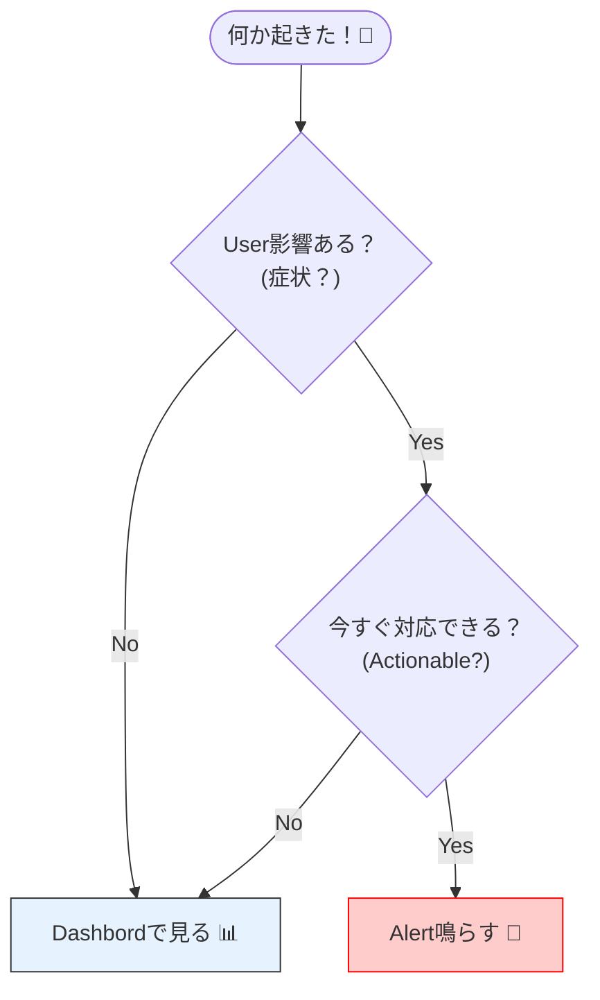

# 第22章：アラートに向く指標、向かない指標🚨📣

## この章でできるようになること🎯✨

* 「**起こしていいアラート**」と「**ダッシュボードで眺めればいい指標**」を見分けられる👀
* **アラート候補を3つだけ**に絞れる（鳴らしすぎ地獄回避🥲➡️😊）
* しきい値・時間窓・ノイズ対策まで含めて、**“実戦で使える形”**にできる💪🔥

---

## 1) まず大前提：アラートの目的って何？🔔🧠

アラートは「**通知**」じゃなくて「**行動スイッチ**」だよ〜！🕹️✨

✅ 良いアラート = **人が今すぐ何かできる**（止血・切り分け・エスカレーション）
❌ ダメなアラート = **見ても困る**／**原因が多すぎる**／**頻繁に誤報**

そして超重要な考え方👇

## 「原因」より「症状」をアラートにする💡

* 原因（CPU高い・メモリ多い）って、**別にユーザーが困ってない**こともあるよね？🫠
* 症状（エラー増・遅い・タイムアウト）は **ユーザー影響そのもの**✨
  なので「症状ベースで少なく」がおすすめ！ ([Google Cloud][1])

---

## 2) 1秒で判定する “アラート向き” チェック✅⏱️




次の5つ、**全部Yes**ならアラート向き！😍

1. **ユーザー影響（症状）に直結**してる？（遅い/失敗/利用不能）
2. それが起きたら **今すぐ対応したい**？（夜中でも起きる価値）😪➡️😱
3. **しきい値**を説明できる？（SLO/仕様/過去データ）📏
4. **ノイズに強い**？（スパイク1発で鳴らない）⚡️🧯
5. 鳴ったら **手順（Runbook）**がある？（最初の3手が書ける）🧭

---

## 3) アラートに向く指標たち🥇🚨（基本これ！）

## A. エラー率（失敗の割合）🟥

* **「失敗が増えた」**は症状ど真ん中
* カウントじゃなくて **率（割合）**が強い✨

  * 例：5xx率、例外率、タイムアウト率、依存先エラー率 など

**Prometheusでは `rate()` が基本**（アラート向き）だよ〜！ ([prometheus.io][2])

---

## B. レイテンシ（遅さ）🕰️🐢

* これも症状ど真ん中✨
* ただし注意！

  * ❌ 平均（average）だけでアラートは危険（遅い人が埋もれる😇）
  * ✅ **パーセンタイル（p95/p99）**が扱いやすい

パーセンタイルは **Histogram** が強い！

* Histogram はサーバ側で `histogram_quantile()` で求められる仕組みが説明されてるよ ([prometheus.io][3])

---

## C. Saturation（詰まり・飽和）🚧📛

* CPUやメモリそのものじゃなくて、**「詰まりがユーザー影響につながる形」**がアラート向き✨

  * 例：キュー長が増え続ける、同時処理が上限に貼り付く、コネクションプール枯渇など

---

## 4) アラートに “向かないことが多い” 指標たち🙅‍♀️📉

## 「原因っぽい」ものは、基本ダッシュボード行き🧸

* CPU使用率が高い🔥
* メモリ使用量が多い🧠
* GC回数が多い🧹
* スレッド数が増えた🧵
* Pod/プロセス数が減った（ただし可用性に直結なら例外）

これらは「原因候補が多すぎる」ので、誤報やノイズになりがち。
**症状（エラー/遅延）とセットで**使うのが気持ちいい！ ([Google Cloud][1])

---

## 5) しきい値と時間窓：ここが勝負🔥⏳

## “瞬間値”で鳴らさない（ノイズ対策）🧯

アラートはだいたい👇の形が安定！

* **率（ratio）**を
* **時間窓（例：5分）**でならして
* **一定時間続いたら** or **複数窓で一致したら**発火

Prometheus的には「`irate()`はグラフ用」「アラートは`rate()`」が推奨だよ ([prometheus.io][2])

---

## 6) “SLOベース”にするとアラート設計が一気にラク😍📐

ここ、2026時点でも超王道！✨
GoogleのSRE Workbookは「SLOをアラートに落とす方法」を段階的に説明してて、**Burn rate（燃焼率）**まで丁寧に扱ってるよ ([Google SRE][4])

## Burn rateってなに？🔥

* 「許される失敗（エラーバジェット）」を **どれくらいの速度で溶かしてるか**
* 例：SLO 99.9%（許容失敗率0.1% = 0.001）なら

  * 失敗率が 1%（0.01）だと **burn rate = 0.01 / 0.001 = 10** みたいな感じ💡 ([Google SRE][4])

## “`for:`で◯分続いたら” だけに頼るのは危険⚠️

SRE Workbookでも、持続条件（duration）だけで作ると

* 重大障害でも検知が遅い
* ちょい回復でタイマーがリセットされ続けて検知できない
  みたいな欠点があるよ、とハッキリ書いてるよ ([Google SRE][4])

---

## 7) 題材アプリで「アラート候補3つ」を決めよう🥹➡️😊（演習パート）

第21章の “成功/失敗/遅延” を思い出してね🧪✨
ここから **3つだけ**選ぶよ！

## 候補A：エラー率（5xx / 例外率）🚨🟥

* 目的：ユーザーが失敗してるのを即検知
* 判断：症状ど真ん中✅

## 候補B：p95レイテンシ（遅延）🐢⏱️

* 目的：遅くて不満が爆発する前に検知
* 判断：症状ど真ん中✅（平均じゃなくp95/p99推奨） ([prometheus.io][3])

## 候補C：飽和の予兆（詰まり系）🚧

* 目的：遅延→タイムアウトに行く前に止血
* 判断：単体だと原因寄りなので、**症状とセット**がおすすめ✨

---

## 8) 例：PromQL（雰囲気だけ掴めればOK）🧩

※ “形”が大事！暗記しなくてOKだよ〜🫶

## 8.1 エラー率アラート（率で見る）🟥

```yaml
- alert: HighErrorRate
  expr: |
    sum(rate(http_requests_total{status=~"5.."}[5m]))
      /
    sum(rate(http_requests_total[5m]))
    > 0.01
  for: 5m
```

* **rate() を使う**（アラート向き） ([prometheus.io][2])

---

## 8.2 レイテンシ（Histogram + p95）🐢

```promql
histogram_quantile(
  0.95,
  sum(rate(http_request_duration_seconds_bucket[5m])) by (le)
) > 0.5
```

* Histogram/Summaryの違いと、`histogram_quantile()` 前提の話はPrometheus公式がわかりやすいよ ([prometheus.io][3])

---

## 8.3 SLO/Burn rate（考え方）🔥

SRE Workbookの流れだと、SLOをアラートにする時は

* **有意なエラーバジェット消費**を検知する
* そのために burn rate を使う
  …が王道だよ ([Google SRE][4])

---

## 9) C#側：メトリクスを “アラート向き” に出すコツ🔧📈

.NETは `System.Diagnostics.Metrics` が基礎だよ（公式の説明あり） ([Microsoft Learn][5])
OpenTelemetry .NETでも **MetricsはこのAPI前提**でベストプラクティスがまとまってるよ ([OpenTelemetry][6])

## 9.1 最小メトリクス（カウント＋失敗＋時間）🧸

```csharp
using System.Diagnostics.Metrics;

public static class AppMetrics
{
    public static readonly Meter Meter = new("Sample.Api", "1.0.0");

    public static readonly Counter<long> RequestsTotal =
        Meter.CreateCounter<long>("app_requests_total");

    public static readonly Counter<long> ErrorsTotal =
        Meter.CreateCounter<long>("app_errors_total");

    public static readonly Histogram<double> RequestDurationMs =
        Meter.CreateHistogram<double>("app_request_duration_ms", unit: "ms");
}
```

**設計ポイント✨**

* アラートに使うなら「文字列ログ」じゃなくて

  * **総数（Counter）**
  * **失敗数（Counter）**
  * **時間分布（Histogram）**
    を揃えるのが強い💪

---

## 9.2 Prometheusに出す（OpenTelemetry）🧩

Prometheusスクレイプ用のASP.NET Core exporterはNuGetでも公式で提供されてるよ ([nuget.org][7])
また、OTel公式ドキュメントに `UseOpenTelemetryPrometheusScrapingEndpoint` が載ってるよ ([OpenTelemetry][8])

（本番はCollector経由がベストプラクティス、も公式で推してるよ） ([OpenTelemetry][9])

---

## 10) 最後のミニ演習🎓✨（ここが本番！）

## 演習1：向き/不向きを仕分け🗂️

次を「アラート向き / ダッシュボード向き」に分類してね👇

* CPU使用率
* 5xx率
* 平均レイテンシ
* p95レイテンシ
* 例外数
* GC回数

👉 ヒント：**症状はアラート**、**原因はダッシュボード** ([Google Cloud][1])

---

## 演習2：「3つだけ」選ぶ🥲➡️😊

題材アプリに対して、次のフォーマットで3つ書いてね📝

* アラート名：
* 何が起きてる？（症状）
* ユーザー影響は？
* しきい値（仮）：
* 見るべき次の画面（ダッシュボード/ログ/トレース）：

---

## 11) AI活用（Copilot/Codex向け）🤖✨

* 「このメトリクスはアラート向き？向かない？理由も」って聞く👂
* 「p95のPromQL作って」→ 作らせて、**しきい値と窓だけ人が決める**🧠
* 「アラート本文（何が起きて、何を見て、何をする）を短く」って整形✂️

---

## まとめ💖

* アラートは **“行動スイッチ”**🔔
* 基本は **症状（エラー率・遅延・飽和の影響）** を鳴らす ([Google Cloud][1])
* Prometheusなら **`rate()`中心**、Histogramでp95/p99も扱いやすい ([prometheus.io][2])
* 迷ったら **SLO/Burn rate**で整えるとスッキリするよ ([Google SRE][4])

次の章（23章）は、いよいよトレース編に入って「遅いのはどこ？」を地図で追いかける感じになるよ〜！🧵🧭✨

[1]: https://cloud.google.com/blog/topics/developers-practitioners/why-focus-symptoms-not-causes?utm_source=chatgpt.com "Why Focus on Symptoms, Not Causes?"
[2]: https://prometheus.io/docs/prometheus/latest/querying/functions/?utm_source=chatgpt.com "Query functions"
[3]: https://prometheus.io/docs/practices/histograms/?utm_source=chatgpt.com "Histograms and summaries"
[4]: https://sre.google/workbook/alerting-on-slos/ "Google SRE - Prometheus Alerting: Turn SLOs into Alerts"
[5]: https://learn.microsoft.com/en-us/dotnet/core/diagnostics/metrics-instrumentation?utm_source=chatgpt.com "Creating Metrics - .NET"
[6]: https://opentelemetry.io/docs/languages/dotnet/metrics/best-practices/?utm_source=chatgpt.com "Best practices - Metrics"
[7]: https://www.nuget.org/packages/OpenTelemetry.Exporter.Prometheus.AspNetCore?utm_source=chatgpt.com "OpenTelemetry.Exporter.Prometheus.AspNetCore 1.14.0- ..."
[8]: https://opentelemetry.io/ja/docs/languages/dotnet/exporters/?utm_source=chatgpt.com "Exporters"
[9]: https://opentelemetry.io/docs/languages/dotnet/exporters/?utm_source=chatgpt.com "Exporters"
