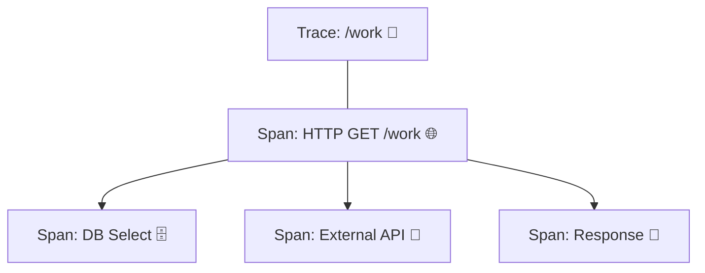

# 第23章：トレース入門🧵✨（Trace/Spanの世界）

## ねらい🎯


* 1リクエストの「旅」を **Trace** としてイメージできるようになる🧳✨ ([OpenTelemetry][1])
* 旅の「区間」を **Span** として切り出して、親子関係で説明できるようになる🌳🧵 ([Microsoft Learn][2])
* C#/.NET では「Span ≒ Activity」って感覚をつかむ🧠🔧 ([Microsoft Learn][2])

---

## 1. まず“トレース”って何？🧵👀（超ざっくり）

あるユーザーが `/work` を叩いたとするよね？
そのときアプリの中では、

* 入口で受け取る（HTTP）🌐
* DBに聞く🗄️
* 外部APIを叩く📡
* 計算する🧮
* 返す📮

…みたいに、いろんな処理が連鎖する。

この **「1回のリクエストが通った道のりぜんぶ」** が **Trace**（トレース）だよ🧵✨ ([OpenTelemetry][1])
そして **道のりを区間に分けた1つ1つ** が **Span**（スパン）！🚏🚃 ([OpenTelemetry][1])

---

## 2. Trace / Span の関係を“旅の地図”で覚える🗺️🧵

* **Trace = 旅の全体**（1リクエスト分のストーリー）🧳
* **Span = 旅の区間**（DB問い合わせ、外部API呼び出し…みたいな1操作）🚉
* **Spanは親子になる**：親Spanの中に子Spanがぶら下がって、木構造になる🌳 ([OpenTelemetry][3])



たとえばこんな木🌳👇

```text
Trace（/work）
└─ Span: HTTP GET /work（入口）
   ├─ Span: Validate input（入力チェック）
   ├─ Span: DB SELECT Orders（DB）
   ├─ Span: Call Payment API（外部API）
   └─ Span: Build Response（組み立て）
```

ここで大事なのは、**「どこで時間を食った？」** を Span の所要時間で“指差し”できること⏱️👉✨

---

## 3. Spanって何が入ってるの？🎒✨（最低限これだけ）

OpenTelemetryの概念として、Spanにはだいたいこういう情報が入るよ👇 ([OpenTelemetry][1])

* **名前**（例：`DB SELECT Orders`）🏷️
* **開始時刻 / 終了時刻**（＝所要時間）⏱️
* **親Span ID**（root以外）👨‍👩‍👧‍👦
* **TraceId / SpanId**（ひも付けの番号）🔢
* **Attributes（タグ）**（例：`db.system=postgresql`）🏷️
* **Events**（Spanの途中の“メモ”）📝
* **Status**（OK/ERROR）✅💥

> ここでは「へぇ〜 Spanって“メタ情報付きの区間”なんだ〜」くらいでOKだよ😊🫶

---

## 4. つながる条件：コンテキスト伝播🔗🌬️（超入門だけ）

分散トレースが成立するには、サービス間で「このリクエスト同じ旅だよ〜」って情報を渡す必要があるよね？
そのために **標準のHTTPヘッダー**（`traceparent` / `tracestate` など）でコンテキストを運ぶ仕組みがあるよ📦✨ ([w3.org][4])

※ここは第25章でガッツリやるから、今日は「ヘッダーでつないでるんだな〜」だけ持ち帰ろう😉🧡

---

## 5. C#/.NETでは Span ≒ Activity だよ🧠🔧

.NETの世界では、トレース上の「作業単位」は **System.Diagnostics.Activity** で表されるよ（Activityの木＝Traceの木）🌳✨ ([Microsoft Learn][2])

そして「Activityを作る入口」が **ActivitySource**！
アプリやライブラリは **ActivitySource と Activity** を使って計装してね、って公式にも書かれてるよ🧩 ([Microsoft Learn][5])

さらにコツ👇

* **ActivitySourceは毎回newしない**（基本は1つを使い回す）🧯

  * “staticで1回作って使い回してね”がベストプラクティスだよ✨ ([Microsoft Learn][5])

---

## 6. ミニ実装①：まずは「自動でSpanが出る」体験をする🧪✨

ここでは「自分でSpan切らなくても、入口/外部呼び出しは自動で出るんだ〜！」を体験するよ🎢
（次で手動Spanも足すよ！）

### 6.1 ざっくり構成🧩

* ASP.NET Core Web API に OpenTelemetry を入れる
* Console Exporter で “とりあえず出力” して見る
* `/work` を叩いて Span を眺める👀

※OpenTelemetryは「Exporterで出力先を変えられる」設計だよ（標準出力やCollector、各種バックエンドへ）🧰✨ ([OpenTelemetry][1])

### 6.2 サンプル（Program.csのイメージ）🧁

```csharp
using OpenTelemetry.Resources;
using OpenTelemetry.Trace;

var builder = WebApplication.CreateBuilder(args);

builder.Services.AddOpenTelemetry()
    .WithTracing(tracing =>
    {
        tracing
            .SetResourceBuilder(ResourceBuilder.CreateDefault().AddService("SampleApp"))
            .AddAspNetCoreInstrumentation()
            .AddHttpClientInstrumentation()
            .AddConsoleExporter(); // まずは見える化優先✨
    });

builder.Services.AddHttpClient();
var app = builder.Build();

app.MapGet("/work", async (IHttpClientFactory httpClientFactory) =>
{
    var client = httpClientFactory.CreateClient();
    // 適当な外部呼び出し（例）※実際は自分の題材アプリの外部APIでもOK
    var _ = await client.GetAsync("https://example.com");
    return Results.Ok(new { ok = true });
});

app.Run();
```

#### ポイント👀✨

* `AddAspNetCoreInstrumentation()` → 入口のHTTP Spanが出やすい🌐
* `AddHttpClientInstrumentation()` → 外向きHTTPのSpanが出やすい📡
  （この“自動で出る範囲”があるのが、トレース入門の楽しいとこ🥳） ([OpenTelemetry][6])

---

## 7. ミニ実装②：手動Spanを1本だけ足してみる🧵➕

自動Spanだけだと、「業務の中身」がブラックボックスになりがち😵‍💫
そこで **“ここが大事！”って場所に手動Span** を足すよ✨

### 7.1 ActivitySourceを用意（使い回し！）♻️

```csharp
using System.Diagnostics;

public static class MyTelemetry
{
    public static readonly ActivitySource ActivitySource = new("SampleApp.Work", "1.0.0");
}
```

> ActivitySourceは使い回しが基本だよ♻️✨ ([Microsoft Learn][5])

### 7.2 例：/work の中に「BusinessWork」Spanを追加🧵

```csharp
app.MapGet("/work", async (IHttpClientFactory httpClientFactory) =>
{
    using var span = MyTelemetry.ActivitySource.StartActivity("BusinessWork", ActivityKind.Internal);

    span?.SetTag("feature", "work");
    span?.SetTag("step", "start");

    var client = httpClientFactory.CreateClient();
    var res = await client.GetAsync("https://example.com");

    span?.SetTag("http.status_code", (int)res.StatusCode);

    return Results.Ok(new { ok = true });
});
```

これでトレースを見ると、だいたい👇みたいな並びになって嬉しい😊🧡

* HTTP GET /work（自動）

  * BusinessWork（手動）🧵✨
  * HTTP GET [https://example.com（自動）](https://example.com（自動）)

---

## 8. 演習：Spanの候補を洗い出そう🗺️🖊️（超重要！）

ここがこの章のメインだよ〜！！🎉

### 8.1 ルール（今日の暫定ルールでOK）📏

Span候補はまずこの3カテゴリだけで考えると迷いにくい✨

1. **入口/出口**（HTTP受信・レスポンス返却）🌐
2. **外部I/O**（DB・外部API・Queue・ファイル）🗄️📡
3. **時間を食いそうな業務の山**（計算・集計・変換）⛰️🧮

### 8.2 例題🎭（あなたの題材アプリに置き換えてOK）

「注文確定 `/checkout`」があるとして…👇

* 入口：`HTTP POST /checkout` 🌐
* 業務：`ValidateCart` / `CalculateTotal` 🧮
* 外部：`DB Insert Order` / `Call Payment API` 🗄️📡
* 仕上げ：`BuildResponse` 🎁

### 8.3 ワークシート（埋めてみてね📝✨）

```text
Trace名（入口）：
- [ ] 入口Span：____________________

子Span候補（まずは5個まで）：
1. [ ] 外部I/O：____________________（例：DB/外部API）
2. [ ] 外部I/O：____________________
3. [ ] 業務の山：____________________（“時間かかりそう”）
4. [ ] 業務の山：____________________
5. [ ] 仕上げ：____________________

“Spanにしない”候補（細かすぎ注意）：
- ____________________
- ____________________
```

---

## 9. よくある「つまずき」あるある😵‍💫➡️😊

### 9.1 Spanが出ない…💥

* OpenTelemetry側の **TracerProvider（初期化）が無いと no-op になる**ことがあるよ（＝作っても出ない）🫠 ([OpenTelemetry][7])

### 9.2 ActivitySourceをあちこちでnewしてぐちゃぐちゃ😇

* ActivitySourceは“高頻度でnewしないで、使い回し”が推奨だよ♻️ ([OpenTelemetry][8])

### 9.3 Span名が「DoWork」だらけ🫥

* 読めないトレースになる！
  → 次章（第24章）で「切り方と命名」を気持ちよく整えるよ🏷️✨

---

## 10. AI活用🤖✨（この章で使うと強いプロンプト例）

### 10.1 Span候補を提案してもらう🗺️

* 「このエンドポイントの処理手順はこう。どこをSpanに切ると調査しやすい？ 5〜10個で」

### 10.2 Span名を整えてもらう🏷️

* 「Span名が曖昧になりがち。**短く・具体的**に、名詞/動詞のルールで10案出して」

### 10.3 “細かすぎ問題”のチェック⚖️

* 「Spanが増えすぎそう。**削るべきSpan候補**と理由を教えて」

---

## まとめ🧵✨

* **Trace = 1リクエストの旅**、**Span = 旅の区間**🧳🚉 ([OpenTelemetry][1])
* 親子Spanで木になる🌳（どこで時間を食ったか見える）⏱️ ([Microsoft Learn][2])
* .NETでは **Spanっぽいものは Activity**、作るのは **ActivitySource**🔧 ([Microsoft Learn][2])
* 次は「Spanの切り方＆命名」で、**読みやすいトレース**に進化させるよ🏷️🚀

[1]: https://opentelemetry.io/docs/concepts/signals/traces/ "Traces | OpenTelemetry"
[2]: https://learn.microsoft.com/en-us/dotnet/core/diagnostics/distributed-tracing-concepts "Distributed tracing concepts - .NET | Microsoft Learn"
[3]: https://opentelemetry.io/docs/specs/otel/trace/api/?utm_source=chatgpt.com "Tracing API"
[4]: https://www.w3.org/TR/trace-context-2/ "Trace Context Level 2"
[5]: https://learn.microsoft.com/en-us/dotnet/core/diagnostics/distributed-tracing-instrumentation-walkthroughs "Add distributed tracing instrumentation - .NET | Microsoft Learn"
[6]: https://opentelemetry.io/docs/languages/dotnet/libraries/?utm_source=chatgpt.com "Using instrumentation libraries"
[7]: https://opentelemetry.io/docs/languages/dotnet/instrumentation/ "Instrumentation | OpenTelemetry"
[8]: https://opentelemetry.io/docs/languages/dotnet/traces/best-practices/?utm_source=chatgpt.com "Best practices"
