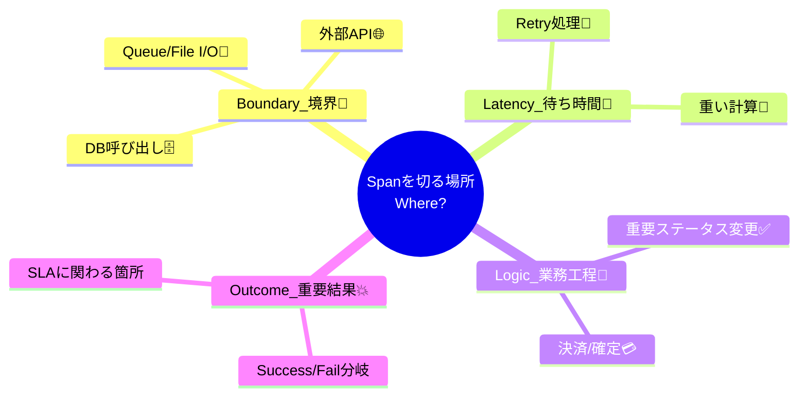

# 第24章：Spanの切り方と命名🧠🏷️（設計のコツ）

## この章のゴール🎯✨


この章が終わると…👇

* **Spanを「どこで切るか」**を、理由つきで決められる🧩
* **Span名を「ブレないルール」**で統一できる🏷️
* **細かすぎ😱／粗すぎ😇**のバランスを、自分で調整できる🎛️

---

## 1) そもそも「Spanを切る」って何？🧵✂️

Spanは「処理の区切り」をタイムラインで見えるようにする“しるし”だよ✨
でも、**区切り方が下手**だと…

* 細かすぎ👉 **スパンが大量**で読めない＆コスト増💸😵
* 粗すぎ👉 **何が遅いのか分からない**＆調査が迷子🧭😭

ポイントはこれ👇

> Span名は「個別の1回」じゃなくて、「統計的に意味がある“処理の種類”」を表すのが良い
> （IDみたいな一意値は名前に入れない）🏷️🚫 ([OpenTelemetry][1])

---

## 2) Spanを切る“いちばん強い基準”4つ💪✨


### ① 境界（Boundary）で切る🚧

**プロセス外に出るところ**は、まずSpan候補！

* DB呼び出し🗄️
* 外部HTTP/API呼び出し🌐
* メッセージキュー📮
* ファイルI/O📁

ここは遅延も失敗も起きやすいから、Spanがあると調査が超ラク🕵️‍♀️



---

### ② 待ち時間が「目立つ」ところで切る🐢➡️🚀

* たまに重い処理
* ネットワーク依存
* リトライが絡む
  こういうのはSpanがあると「時間を食ってる犯人」が一瞬で見える👀✨

---

### ③ “意味のある工程”で切る🧩

例えば注文処理なら…

* 検証✅
* 在庫引当📦
* 決済💳
* 保存🗄️

「業務としてのステップ」単位にSpanがあると、チーム全員が読める📚✨

---

### ④ 失敗しやすい／重要なところで切る💥

* 例外が出やすい
* SLAに効く
* お金に関わる💰
  このへんは、Spanで“守る”と強い🛡️

---

## 3) 細かすぎ😱／粗すぎ😇を見分けるチェックリスト✅

### 細かすぎサイン（やりがち！）🧨

* ループの1回ごとにSpan作ってる🔁😵
* 1リクエストでSpanが何百個も出る📈📈📈
* Span名が「メソッド名だらけ」になってる（読む人が意味取れない）🤯

👉対策：**Spanじゃなくて「Event」や「Tag（属性）」に寄せる**のが便利✨
（Spanは“区切り”、細かい出来事はEvent/属性へ🎒）

---

### 粗すぎサイン🫥

* ルートSpanしかなくて、中身が真っ黒（何が遅いか不明）🕳️
* 「外部APIが遅いのか、DBが遅いのか」が分からない🤷‍♀️

👉対策：まずは **外部I/O（DB/HTTP）だけSpan化** からでOK👌

---

## 4) 命名ルール：Span名は“低カーディナリティ”が正義🏷️⚖️


Span名は、**増えすぎない（＝低カーディナリティ）**のが超大事！
OpenTelemetryのAPI仕様でも、**ID入りみたいな高カーディナリティ名はNG**って明確に言ってるよ🚫 ([OpenTelemetry][1])

例👇

* ✅ `get_account`
* ✅ `get_account/{accountId}`（ルートテンプレ）
* ❌ `get_account/42`（ID入り） ([OpenTelemetry][1])

---

## 5) “公式に寄せる”命名テンプレ集📚✨（これ使えば迷わない）

### A. HTTP（サーバー側）🌐🧑‍💻


HTTPのSpan名は、基本こう👇

* **`{method} {target}`**
  target は **http.route（ルートテンプレ）** を使うのが推奨✨
  そして **生のパス（`/orders/123` みたいなの）をデフォルトで使っちゃダメ**って明記されてるよ⚠️ ([OpenTelemetry][2])

例👇

* ✅ `GET /orders/{orderId}`
* ✅ `POST /checkout`

---

### B. DB（クライアント側）🗄️🐘


DBのSpan名は、ざっくりこの優先順👇

1. `db.query.summary` があればそれ
2. なければ `{db.operation.name} {target}`
   …みたいなルールが整理されてるよ✨ ([OpenTelemetry][3])

例👇

* ✅ `SELECT orders`
* ✅ `INSERT shipping_details`
  （長いSQL全文は名前にしない。必要なら属性へ🎒）

---

### C. アプリ内（内部Span）🏠🧠


ここはあなたの設計センスが光るところ✨
おすすめは「業務の意味」が伝わる名前👇

**おすすめ形式（どれかに統一！）**

* `Orders.Create`（ドメイン/ユースケース）
* `Checkout.Run`（工程）
* `Inventory.Reserve`（業務動詞＋対象）

**避けたい**

* `Service1.DoWork2`（意味が薄い）
* `CreateOrder_20260117_foo`（一意値っぽいの混ぜる）🙅‍♀️

---

## 6) 実装イメージ（手でSpanを作るとき）🧑‍💻✨

OpenTelemetry .NETでは、手動計装する場所に **ActivitySource** を用意してSpan（Activity）を作るのが定番だよ🧵 ([OpenTelemetry][4])
あと、`StartActivity` の引数の名前が“見える名前”として扱われる（UIではDisplayName）って理解でOK👌
DisplayNameはUI用で、未設定ならOperationNameと同じになるよ✨ ([Microsoft Learn][5])

```csharp
using System.Diagnostics;

public static class Observability
{
    public static readonly ActivitySource ActivitySource = new("MyApp.Orders");
}

public class OrderService
{
    public async Task CreateOrderAsync(string orderId)
    {
        // ✅ 低カーディナリティなSpan名（IDは入れない）
        using var activity = Observability.ActivitySource.StartActivity(
            "Orders.Create",
            ActivityKind.Internal);

        // ✅ IDは“属性”へ
        activity?.SetTag("order.id", orderId);

        // ここでDBや外部APIが走る想定…
        await Task.Delay(50);
    }
}
```

**コツ💡**

* Span名：**固定のテンプレ**（増えない）
* 変化する値：**Tag（属性）**に入れる
  この分離が“強いトレース”を作るよ🔥 ([OpenTelemetry][1])

---

## 7) “ちょうどいい”Spanツリー例🌳✨（完成形のイメージ）


たとえば「注文作成」なら👇

* `POST /orders`（HTTP SERVER）

  * `Orders.Create`（INTERNAL：業務ステップ）

    * `SELECT orders`（DB CLIENT） ([OpenTelemetry][3])
    * `HTTP POST /payment/authorize`（HTTP CLIENT：テンプレで） ([OpenTelemetry][2])

こうしておくと、遅い時に
「HTTP？業務？DB？外部？」が一瞬で分かる👀✨

---

## 8) ミニ演習（この章のメイン）🎓📝

### 演習1：Spanを“切る場所”を決めよう🗺️✂️

題材アプリの `/work` を想像して、下の表を埋めてみてね✨

* 入口（HTTP）
* 業務（UseCase）
* 外部I/O（DB / 外部API）

**表テンプレ（コピペOK）**

* ルートSpan名：`{method} {route}`（例：`GET /work`） ([OpenTelemetry][2])
* 子Span1（業務）：`Work.Run`（例）
* 子Span2（DB）：`SELECT xxx`（例） ([OpenTelemetry][3])
* 子Span3（外部HTTP）：`GET /something/{id}`（テンプレ化） ([OpenTelemetry][2])

---

### 演習2：ダメ命名を直して“低カーディナリティ化”🏷️🧹

次のSpan名、どこがダメで、どう直す？✍️

* ❌ `GET /users/12345`
  ✅ `GET /users/{userId}` ＋ `user.id=12345` をTagへ ([OpenTelemetry][1])

* ❌ `CreateOrder_20260117_ABC`
  ✅ `Orders.Create` ＋ 変化情報はTagへ ([OpenTelemetry][1])

---

### 演習3：Span名テンプレを“1枚ルール”にする📄✨

あなたのアプリ用に、次を1セット作って完成🎉

* HTTP：`{method} {route}`
* 内部：`Domain.Operation`
* DB：`{operation} {target}`
* 外部HTTP：`{method} {target}`（テンプレ） ([OpenTelemetry][2])

---

## 9) AI活用（Copilot / Codex）🤖✨

**やらせると強いタスク**はこれ👇

* 「この処理のSpanツリー案を3パターン出して（粗/中/細）」🧠🌳
* 「Span名が高カーディナリティになってないかレビューして」👀✅
* 「`ActivitySource` を使って `Orders.Create` span を追加して、IDはTagにして」🧵🏷️
* 「HTTP/DBのSpan名をsemantic conventions寄せに修正して」📚✨ ([OpenTelemetry][2])

---

## まとめ🎀

* Spanは「境界・待ち時間・工程・重要度」で切る✂️✨
* Span名は「増えないテンプレ」が命🏷️（IDはTagへ🎒） ([OpenTelemetry][1])
* HTTPは `{method} {route-template}` が基本🌐 ([OpenTelemetry][2])
* DBは `db.query.summary` か `{operation} {target}` に寄せる🗄️ ([OpenTelemetry][3])

次の第25章は、ここで作ったSpanたちが**途中で途切れないための“コンテキスト伝播”**に進むよ🔗🌬️✨

[1]: https://opentelemetry.io/docs/specs/otel/trace/api/ "Tracing API | OpenTelemetry"
[2]: https://opentelemetry.io/docs/specs/semconv/http/http-spans/ "Semantic conventions for HTTP spans | OpenTelemetry"
[3]: https://opentelemetry.io/docs/specs/semconv/database/database-spans/ "Semantic conventions for database client spans | OpenTelemetry"
[4]: https://opentelemetry.io/docs/languages/dotnet/instrumentation/?utm_source=chatgpt.com "Instrumentation"
[5]: https://learn.microsoft.com/en-us/dotnet/api/system.diagnostics.activity.displayname?view=net-10.0&utm_source=chatgpt.com "Activity.DisplayName Property (System.Diagnostics)"
