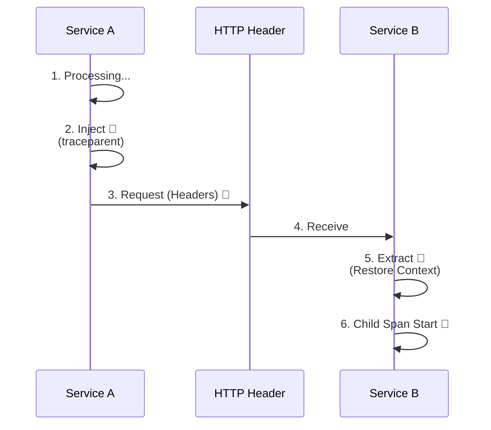

# 第25章：コンテキスト伝播🔗🌬️（つながる条件を理解）

トレースって、**「1リクエストの旅」🧵**がちゃんと1本の線になって初めて強いんだよね✨
でも現場あるあるで、**途中でプツッ✂️**と切れます…！
この章はそれを **「切れない条件」**としてスッキリ整理して、**切れた時の原因を秒で絞れる**ようにする回だよ〜🕵️‍♀️💨

---

## この章でできるようになること🎯✨

* 「なぜトレースが途切れるの？」を **言語化できる**🗣️
* HTTP呼び出しで **traceparent が渡ってるか**チェックできる👀
* 非同期・バックグラウンドで **Activity.Current が消えるパターン**を知って回避できる🧯
* 「つながらない時の原因チェック表」🔍 を自分のチーム用に作れる📋✨

---

## まず結論：つながる条件はコレ✅




コンテキスト伝播（Context Propagation）は、ざっくり言うと…

> **「親トレース情報（trace id / span id など）を、境界を越えるときに “入れて→渡して→取り出す”」**こと🔗

境界って主に2つ：

* **プロセス境界**：サービスA → サービスB（HTTP / gRPC / メッセージング）🌐
* **スレッド/非同期境界**：await / Task / Background など⚙️

OpenTelemetryでは、これを **Propagator（プロパゲータ）**が担当するよ🧰
「注入(Inject)」と「抽出(Extract)」で、メッセージのヘッダ等に出し入れするイメージ！📦✨ ([OpenTelemetry][1])

---

## 1) HTTP越し：traceparent / tracestate が命🫀🌍

### W3C Trace Context ってなに？🧾


いまの分散トレースの基本は、**W3C Trace Context**（標準のHTTPヘッダ）だよ📌
代表がこれ👇

* `traceparent`
* `tracestate`

この仕様自体が「HTTPヘッダでトレース文脈を渡す」ことを標準化してる✨ ([w3.org][2])

`traceparent` はだいたいこういう形（覚えなくてOK！“あるかどうか”が大事）👇 ([w3.org][2])

```text
traceparent: 00-<trace-id>-<parent-id>-<trace-flags>
```

### だいたいは自動で繋がる🤝✨（でも条件あり）

ASP.NET Core側で受け、HttpClientで呼ぶ、みたいな「よくある形」だと
計測ライブラリ（Instrumentation）が **受信でExtract・送信でInject** をやってくれて、繋がりやすいよ〜🎉 ([OpenTelemetry][3])

---

## 2) 非同期越し：Activity.Current が消えると切れる🫥⚡


.NETの分散トレースの中心は `System.Diagnostics.Activity` だよ🧵
そして **いまの実行の親コンテキスト**は `Activity.Current` に入る感じ👀✨ ([Microsoft Learn][4])

しかも `Activity.Current` は **非同期呼び出し間でフローする**（つまりawaitをまたいでも基本ついてくる）って明記されてるよ✅ ([Microsoft Learn][5])

### それでも切れやすい “あるある” 😭


* 🔥 **await しないで投げっぱなし**（親が先に終わる）
* 🧵 **新しいスレッド/独自の実行基盤**に飛ぶ（文脈を持っていかない）
* 🧪 **手動でActivityを作ったけど親を渡してない**（“新しい旅”になっちゃう）
* 🧹 **ExecutionContextのフローを抑制**する系（高度だけど現場で稀に遭遇）

---

## 3) 「外部に渡す」も設計だよ⚠️🌍

伝播って便利だけど、**外部サービスや公開API**へ何でも送るのは危ないこともあるよ〜🫣
トレースIDやBaggageが、内部事情をうっすら漏らす可能性があるから、**どこまで伝播するか**は方針が必要✨ ([OpenTelemetry][6])

---

## 4) ハンズオン：HTTPで「つながってる」を体感しよ🧪👀✨


ここは「A → B」で、**同じトレースになってる**のを確認するよ🧵🔗
（表示はコンソールでもOK！）

### ✅ ざっくり構成

* ServiceA：受け口（外から叩く）🚪
* ServiceB：呼ばれる側📞

### A) ServiceB（呼ばれる側）Program.cs例📌

```csharp
using OpenTelemetry.Resources;
using OpenTelemetry.Trace;

var builder = WebApplication.CreateBuilder(args);

builder.Services.AddOpenTelemetry()
    .WithTracing(tpb =>
    {
        tpb
            .SetResourceBuilder(ResourceBuilder.CreateDefault().AddService("ServiceB"))
            .AddAspNetCoreInstrumentation()
            .AddConsoleExporter();
    });

var app = builder.Build();

app.MapGet("/b", () => Results.Ok("Hello from B"));

app.Run();
```

### B) ServiceA（呼ぶ側）Program.cs例📌

```csharp
using OpenTelemetry.Resources;
using OpenTelemetry.Trace;

var builder = WebApplication.CreateBuilder(args);

builder.Services.AddHttpClient("toB", c =>
{
    c.BaseAddress = new Uri("http://localhost:5102"); // ServiceB
});

builder.Services.AddOpenTelemetry()
    .WithTracing(tpb =>
    {
        tpb
            .SetResourceBuilder(ResourceBuilder.CreateDefault().AddService("ServiceA"))
            .AddAspNetCoreInstrumentation()
            .AddHttpClientInstrumentation()
            .AddConsoleExporter();
    });

var app = builder.Build();

app.MapGet("/a", async (IHttpClientFactory f) =>
{
    var client = f.CreateClient("toB");
    var text = await client.GetStringAsync("/b");
    return Results.Ok($"A got: {text}");
});

app.Run();
```

### C) 観察ポイント👀✨

* `/a` を叩いたとき

  * ServiceA側のトレースが出る🧵
  * ServiceB側にもトレースが出る🧵
  * **同じ trace-id になってたら成功🎉**

Instrumentationを使うのが基本的にラクで安全、というベストプラクティスも公式で推されてるよ✅ ([OpenTelemetry][3])

---

## 5) HTTP以外（メッセージング等）は「自前Inject/Extract」が出やすい📦🧩


キューや独自プロトコルだと、自動でやってくれない場面があるから
**ヘッダに入れて渡す**を自分でやることがあるよ〜💪

OpenTelemetryのPropagatorは、まさにそのためのAPI✨ ([OpenTelemetry][1])
そして .NETのOpenTelemetry SDKでは、既定が **tracecontext + baggage の複合**になっている実装が示されてるよ📌 ([GitHub][7])

さらに、AMQP（メッセージング）向けに「どうエンコードするか」仕様も出てる（W3C側）ので、こういう世界もあるんだ〜でOK！📦📨 ([W3C][8])

---

## 6) つながらない時の原因チェック表🔍📋✨（ここが本題！）


「切れた！」って時は、順番に潰すのが最短だよ🕵️‍♀️💨

### ✅ Step 1：プロセス境界（HTTP等）で切れてない？🌐

* [ ] 送信側：**traceparent を送ってる？**（Instrumentationが入ってる？） ([w3.org][2])
* [ ] 受信側：**traceparent を受け取ってExtractしてる？**（AspNetCore instrumentation等） ([OpenTelemetry][3])
* [ ] 途中に **API Gateway / Proxy / LB** がいてヘッダ落としてない？
* [ ] 外部向けに “送らない方針” にしてない？（意図的に遮断してない？） ([OpenTelemetry][6])

### ✅ Step 2：非同期境界で切れてない？⚙️

* [ ] `Activity.Current` が欲しい地点で **nullになってない？**（親が居ない） ([Microsoft Learn][5])
* [ ] awaitせず投げた処理で **親が先に終了**してない？
* [ ] Background/Queue処理で **親コンテキストを渡してない**？

### ✅ Step 3：手動Spanの作り方で切れてない？🧵

* [ ] `ActivitySource.StartActivity()` の親が想定どおり？
* [ ] 「新しいトレース」になってもOKな処理と混ざってない？

### ✅ Step 4：メッセージングで切れてない？📦

* [ ] Producerが **Inject** してる？
* [ ] Consumerが **Extract** して親として開始してる？
* [ ] そもそもヘッダを運べる設定になってる？

---

## 7) AI活用（Copilot / Codex）プロンプト例🤖✨

そのまま貼ってOKだよ〜📋💕

* 「ASP.NET Core + HttpClient で OpenTelemetry を使い、A→B呼び出しが同一Traceになる最小サンプルを作って。ConsoleExporterで trace-id を見たい。」
* 「BackgroundServiceで処理すると trace が途切れる。親traceをメッセージに載せて、consumer側でExtractして継続する設計案と実装例を出して。」
* 「外部APIへは traceparent を送らない方針にしたい。送信先ホストで伝播を止める設計を提案して（セキュリティ理由も一言）。」 ([OpenTelemetry][6])

---

## まとめ🎁✨

* トレースが繋がる鍵は **「境界で Inject/Extract」** 🔗 ([OpenTelemetry][1])
* HTTPは **W3C Trace Context（traceparent等）** が基本🧾 ([w3.org][2])
* .NETは `Activity.Current` が親コンテキストで、非同期でも基本フローするよ🧵✨ ([Microsoft Learn][5])
* 切れたら、チェック表で **「どの境界で切れたか」**を特定するのが最短🔍📋

次の第26章は、トレースに「意味」を足していく回（属性🎒✨）だよ〜！

[1]: https://opentelemetry.io/docs/specs/otel/context/api-propagators/?utm_source=chatgpt.com "Propagators API"
[2]: https://www.w3.org/TR/trace-context/?utm_source=chatgpt.com "Trace Context"
[3]: https://opentelemetry.io/docs/languages/dotnet/traces/best-practices/?utm_source=chatgpt.com "Best practices"
[4]: https://learn.microsoft.com/en-us/dotnet/api/system.diagnostics.activity?view=net-10.0&utm_source=chatgpt.com "Activity Class (System.Diagnostics)"
[5]: https://learn.microsoft.com/ja-jp/dotnet/api/system.diagnostics.activity?view=net-9.0&utm_source=chatgpt.com "Activity クラス (System.Diagnostics)"
[6]: https://opentelemetry.io/docs/concepts/context-propagation/?utm_source=chatgpt.com "Context propagation"
[7]: https://github.com/open-telemetry/opentelemetry-dotnet/blob/main/src/OpenTelemetry/Sdk.cs?utm_source=chatgpt.com "opentelemetry-dotnet/src/OpenTelemetry/Sdk.cs at main"
[8]: https://w3c.github.io/trace-context-amqp/?utm_source=chatgpt.com "Trace Context: AMQP protocol"
