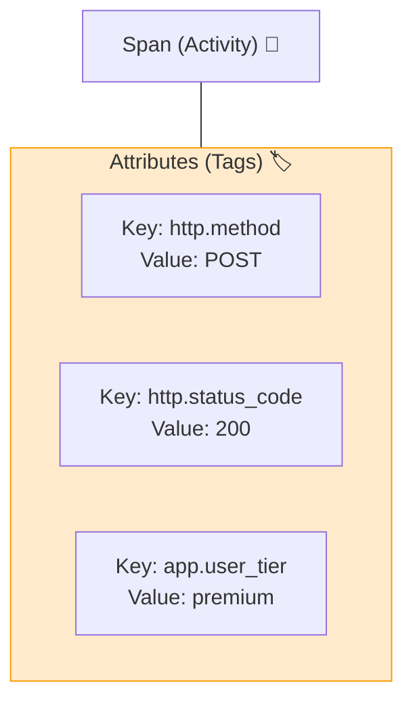

# 第26章：トレースに意味を足す（属性）🎒✨

〜「遅い！😱」の原因に最短で辿り着ける“タグ設計”入門〜

---

## 1) この章でできるようになること 🎯✨

* Span（Activity）に **「調査に効く属性（Attributes / Tags）」** を付けられるようになる 🏷️
* **付けすぎ地獄**（ノイズ・コスト増）を回避できる 😇
* **Semantic Conventions（標準の名前）** を優先して、チームで迷子にならない 🧭✨ ([OpenTelemetry][1])
* 例外（Exception）を **“正しい形”** でトレースに残せる 💥🧯 ([OpenTelemetry][2])

---

## 2) まず超大事：属性（Attributes）って何？👀🏷️


トレースは「処理の旅の地図🗺️」なんだけど、**属性がない**とこうなる👇

* 「どの支払い方法？💳」→分からない
* 「どの外部API？🌐」→分からない
* 「失敗の種類は？💥」→分からない

.NET の世界では、Span = `Activity`、属性 = `Tag` だよ🧩

> .NET は `System.Diagnostics.Activity` でトレースを表して、OTel の span に対応するよ〜、タグ（attributes）もSemantic Conventions（標準）に寄せていくよ〜 という立て付け💡 ([Microsoft Learn][3])



---

## 3) “付ける前”に知っておく分類 🧠✨

同じ「属性」でも、置き場所が違うと意味が変わるよ👀

* **Resource attributes**：サービスそのもの（例：`service.name`）🏢
* **Span attributes（今回の主役）**：その処理（Span）に関する追加情報 🏷️
* **Event attributes**：Span内イベント（例外イベントなど）💥
* **Status**：成功/失敗の状態（Errorなど）🚦

`service.name` みたいな “予約席” もあるので、勝手に同名を作らないのが安全🙅‍♀️ ([OpenTelemetry][4])

---

## 4) 属性設計のルール（これだけで勝てる）🥇✨

### ルールA：**標準（Semantic Conventions）を最優先** 📘✨

HTTP/DB/例外など、よくあるものは **すでに標準のキー名がある**よ！
標準に寄せるメリット👇

* ツール側の表示・集計・リンクが効きやすい 🧰✨
* チーム内の説明コストが激減する 🧑‍🤝‍🧑

Semantic Conventions 自体が「共通の名前を決める仕組み」だよ〜という公式の説明もあるよ📌 ([OpenTelemetry][1])

---

### ルールB：**低カーディナリティ**（種類が増えすぎない）🧨⚠️

ダメ例（増えすぎる）👇

* userId / email / 注文番号 / 検索クエリ全文

良い例（増えにくい）👇

* `plan=free|pro`
* `payment.provider=visa|master|paypal`
* `region=jp|us|eu`

> 理由：集計・検索・派生メトリクスでコストが爆発しやすいから💣（トレースでも、裏でメトリクス化される世界が多い）

---

### ルールC：**個人情報・秘密情報は入れない** 🔒🫣

属性は「いろんな場所に運ばれる」前提が安全✨

* パスワード/トークン/セッションID：絶対ダメ🙅
* どうしても“ユーザー由来”を入れたいなら

  * “区分”に落とす（例：`user.tier`）
  * “匿名化した短い分類”にする（例：`user.segment`）

---

### ルールD：**デカい文字列を入れない** 🍔➡️🧂

やりがち👇

* JSONペイロード全文
* SQL全文
* 長文のエラー全文

代わりに👇

* **要約**（summary）
* **種類**（type）
* **短いコード**（error_code）

DBの世界でも、全文より「操作名・対象・要約」に寄せる方向が推奨されてるよ📌 ([GitHub][5])

---

### ルールE：**実験中のキーに振り回されない** 🌀

Semantic Conventions には Stable と Development があるよ。
HTTP は安定してるけど、分野によっては変更が入ることも。
「安定版に寄せる / 移行の影響を知る」ための仕組み（環境変数でのopt-in）もあるよ📌 ([OpenTelemetry][6])

---

## 5) 何を付ければいい？“必須属性セット”の作り方 🧩✨

ここからが本題〜！🎒✨
属性は「何でも付ける」じゃなくて、**調査に効く最小セット**を決めるのがコツ💡

### 5-1) まず質問を3つ作る（これ超重要）❓❓❓

例（Web API あるある）👇

1. どの機能が遅い？🐢
2. どの外部依存（DB/外部API）が遅い？🌐🗄️
3. 失敗の種類は何？（timeout? validation? auth?）💥

この「質問」に答えるための属性だけ付ける🎯

---

### 5-2) 属性は “3カテゴリ” に分けると決めやすい 🧠✨

1. **分類**：どの機能？どの種類？（低カーディナリティ）
2. **結果**：成功/失敗、失敗タイプ
3. **主要な数値**：件数、リトライ回数、サイズ、など

---

## 6) “標準キー”の代表例（まずはこれを知る）📘🏷️

### 6-1) HTTP サーバー/クライアント系 🌐

HTTP系は標準の属性名がしっかり決まってるよ✨
代表例：

* `http.request.method`
* `http.response.status_code`
* `http.route`
* `url.full`
* `server.address` / `server.port`
* エラー系：`error.type`

（このへんはHTTP SpanのSemantic Conventionsで整理されてる） ([OpenTelemetry][6])

> ここ大事：多くの場合、HTTPはフレームワーク/計測ライブラリが **標準属性を自動で付けてくれる** ので、あなたの仕事は「業務に必要な分」だけ足す感じになるよ🧑‍🍳✨ ([Microsoft Learn][3])

---

### 6-2) 例外（Exception）は “イベント” として残す 💥

例外は、Spanに「文字列で貼る」より、**exceptionイベント**として残すのが標準✨

* イベント名：`exception`（必須）
* 属性：`exception.type`, `exception.message`, `exception.stacktrace` など ([OpenTelemetry][7])

---

### 6-3) DB系 🗄️

DBも標準の考え方があって、特に「全文（クエリ全文）より、操作・対象・要約」に寄せると強い💪
（DB spanのキー例やガイドがまとまってる） ([GitHub][5])

---

## 7) C#で属性を足す（超実践）🛠️✨

### 7-1) まずは “業務Span” を1個だけ作る（おすすめ！）🎁

「Checkout」とか「CreateOrder」みたいな **ユースケース単位**で1本作ると、調査がめちゃ楽になるよ🧵✨

```csharp
using System.Diagnostics;

public static class Telemetry
{
    public static readonly ActivitySource Source = new("MyApp");
}

public sealed class CheckoutService
{
    public async Task CheckoutAsync(string paymentProvider, int itemCount, decimal totalAmount)
    {
        using var activity = Telemetry.Source.StartActivity("Checkout", ActivityKind.Internal);

        // ✅ 低カーディナリティな“分類”
        activity?.SetTag("app.feature", "checkout");
        activity?.SetTag("app.payment.provider", paymentProvider); // 例: "visa" / "paypal"

        // ✅ “主要な数値”
        activity?.SetTag("app.items.count", itemCount);
        activity?.SetTag("app.total.amount", (double)totalAmount);
        activity?.SetTag("app.total.currency", "JPY");

        try
        {
            await DoWorkAsync();
            activity?.SetTag("app.result", "success");
        }
        catch (Exception ex)
        {
            // ✅ 失敗の“種類”を短く
            activity?.SetTag("error.type", ex.GetType().FullName);

            // ✅ OTel推奨の例外の残し方（イベント + status）
            activity?.SetStatus(ActivityStatusCode.Error);
            activity?.RecordException(ex);

            activity?.SetTag("app.result", "failed");
            throw;
        }
    }

    private static Task DoWorkAsync() => Task.CompletedTask;
}
```

ポイント🌟

* `app.*` は **自前領域**（標準に無い業務情報を入れる避難場所）🏠✨
* 例外は `RecordException` + `SetStatus(Error)` の形が分かりやすい（公式ガイドもこの方向） ([OpenTelemetry][2])
* `error.type` は予約属性としても言及されてるので、エラー分類に使いやすいよ📌 ([OpenTelemetry][4])

---

### 7-2) 既存のHTTP Spanに “ちょい足し” したい時 🍳✨

ASP.NET Core のリクエスト中なら、今のSpanは `Activity.Current` で取れることが多いよ🧵

```csharp
using System.Diagnostics;

public static class TraceTags
{
    public static void AddRequestContext(string feature, string? tenant, string? userTier)
    {
        var a = Activity.Current;
        if (a is null) return;

        a.SetTag("app.feature", feature);
        if (!string.IsNullOrWhiteSpace(tenant))
            a.SetTag("app.tenant", tenant);      // 例: "team-a" など（IDは避ける）
        if (!string.IsNullOrWhiteSpace(userTier))
            a.SetTag("app.user.tier", userTier); // 例: "free" / "pro"
    }
}
```

> .NET は OTel の標準（Semantic Conventions）に沿って tags/attributes を付ける方針で、.NET 9 以降はHTTPクライアントの重要タグも標準に沿って増えてるよ、という説明があるよ📌 ([Microsoft Learn][3])

---

## 8) ミニ演習（この章のゴール）📝🎒✨

あなたの題材アプリに、**必須属性セット**を作ろう！

### STEP1：観測したい質問を3つ書く🖊️

例：

* 「どのルートが遅い？」
* 「外部APIのどれが遅い？」
* 「失敗は何タイプ？」

### STEP2：各質問に効く属性を1〜3個だけ選ぶ🎯

例（最小セット案）👇

* `app.feature`（機能名）
* `app.dependency`（外部依存名：固定の種類だけ）
* `error.type`（失敗タイプ）

### STEP3：やってはいけない属性を赤で書く🚫🖍️

* userId / email / token / 注文番号 / クエリ全文 …など

---

## 9) AI活用（めちゃ効く）🤖✨

### 9-1) 「属性案を出して」プロンプト例 🪄

* 「Checkout機能の調査で欲しい質問を3つ作って。そこから低カーディナリティな属性案を10個、`app.*` で出して。NG例も添えて」

### 9-2) 「付けすぎチェック」プロンプト例 🧹

* 「この属性リスト、カーディナリティ爆発しそうなものを指摘して。置き換え案も出して」

---

## 10) まとめ（この章の“型”）✅✨

* まず **Semantic Conventions（標準）** を優先する 📘 ([OpenTelemetry][1])
* 業務情報は **`app.*`** に避難（低カーディナリティで！）🏠
* 例外は **イベント（`exception`）+ status(Error)** で残す 💥🧯 ([OpenTelemetry][2])
* 「質問→最小属性セット」の順で決めると、付けすぎない 😇🎒

---

次の章（第27章）は、この属性付きトレースを使って **ボトルネックを“指差し”する訓練**に入るよ〜！🐢➡️🚀

[1]: https://opentelemetry.io/docs/concepts/semantic-conventions/ "Semantic Conventions | OpenTelemetry"
[2]: https://opentelemetry.io/docs/languages/dotnet/traces/reporting-exceptions/ "Reporting exceptions | OpenTelemetry"
[3]: https://learn.microsoft.com/en-us/dotnet/fundamentals/networking/telemetry/tracing "Networking tracing - .NET | Microsoft Learn"
[4]: https://opentelemetry.io/docs/specs/otel/semantic-conventions/?utm_source=chatgpt.com "Semantic Conventions"
[5]: https://github.com/open-telemetry/semantic-conventions/blob/main/docs/db/elasticsearch.md?utm_source=chatgpt.com "elasticsearch.md - open-telemetry/semantic-conventions"
[6]: https://opentelemetry.io/docs/specs/semconv/http/http-spans/ "Semantic conventions for HTTP spans | OpenTelemetry"
[7]: https://opentelemetry.io/docs/specs/otel/trace/exceptions/ "Exceptions | OpenTelemetry"
