# 第27章：トレースでボトルネックを特定する🧯⏱️🧵

ねらいはコレ👇✨
**「遅い場所を“指差し”できる」**ようになること！
トレース（Trace）って、1リクエストの旅を **時間つきで可視化**してくれるから、**どこで時間が溶けたか**が一発で分かるようになるよ〜😳💡

---

## 1) ボトルネックってなに？🐢➡️🚀

ざっくり言うと👇
**全体の待ち時間を一番支配してる区間**のこと！

* 例：全体 2.0 秒のうち、DBが 1.6 秒
  → **DBが主犯**👮‍♀️💥
* 例：外部API待ち 1.2 秒
  → **外部I/Oが主犯**📡⏳

トレースは、この「主犯」を **Span（スパン）**の長さで見つける道具だよ🧵✨
.NETのトレースは `System.Diagnostics` の `Activity/ActivitySource` がベースになってて、OpenTelemetry（OTel）と噛み合う形になってるよ〜🧠🔧 ([OpenTelemetry][1])

---

## 2) トレースの見方：最強の3ステップ🕵️‍♀️✨


### ステップA：まず「一番上（Root）」の時間を見る⏱️

Root（サーバーが受けたリクエストのSpan）が **全体時間**だよ。

### ステップB：次に「長いSpan」を探す🔍

タイムライン（ウォーターフォール）で **棒が長いSpan**が怪しい！
トレースのタイムライン表示って「そのリクエスト中に何してたか」を俯瞰するのが得意だよ👀 ([Elastic][2])

### ステップC：「直列」か「並列」かを見る🧠

* **直列（順番待ち）**なら、長いSpanがそのまま全体を伸ばす😇
* **並列**なら、合計は長く見えても「実際の支配」は別のSpanだったりする⚡

ここで大事なのが👇
**“クリティカルパス（最長の道）”**を意識すること！🧠🧵

---

## 3) 典型パターンで「犯人当てゲーム」しよ🎯😈


### パターン① 外部I/Oが遅い（DB・外部API・ファイル）📡🗄️

見え方👇

* `http.client` / `db` 系のSpanがドーンと長い
* Rootの中の **大部分を外部待ちが占める**

対策の方向性👇

* タイムアウト・リトライ設計（やりすぎ注意）⏳
* キャッシュ🧊
* DBならインデックス/クエリ見直し🔧
* 外部APIなら回数削減（まとめて呼ぶ）📦

```mermaid
gantt
    dateFormat X
    axisFormat %s
    title Serial (直列) vs Parallel (並列)
    
    section Serial (Slow 🐢)
    App Processing :a1, 0, 10
    DB Query       :a2, after a1, 40
    External API   :a3, after a2, 40
    Response       :a4, after a3, 10
    
    section Parallel (Fast 🚀)
    App Processing :b1, 0, 10
    DB Query       :b2, after b1, 40
    External API   :b3, after b1, 40
    Response       :b4, after b2, 10
```



---

### パターン② アプリ内部が遅い（CPU・重い処理）🔥🧠

見え方👇

* `business.logic` みたいな **自作Spanが長い**
* 外部I/Oは短いのに、Rootが長い

対策の方向性👇

* ループ/アルゴリズム改善🔁
* JSONシリアライズ量削減📦
* 余計な変換や巨大オブジェクト削減🧹

---

### パターン③ Rootは長いのに、子Spanが短い（空白がある）🕳️😱

これ、めっちゃあるある！
**「測れてない時間」**があるってこと。

解決👇

* Spanの切り方を増やす（手動計装）🧵
* 使ってるライブラリの計装を有効化する🔧
  OpenTelemetryの自動/ライブラリ計装は対応範囲がどんどん広がってるよ📈 ([OpenTelemetry][3])

---

## 4) Spanに“意味”を足すコツ🎒✨（最小で効く！）

### ✅ タグ（属性）は「絞り込み」に効く🏷️

HTTP系の属性名は、できれば **セマンティック規約**に寄せると後で超ラク！
（ツール側も理解してくれる✨） ([OpenTelemetry][4])

例：

* `http.request.method`
* `http.response.status_code`
* `server.address` など ([OpenTelemetry][4])

### ✅ イベントは「途中経過メモ」📝

“Spanの途中”に出来事を残せるよ！
.NET だと `Activity.AddEvent(...)` がある🥳 ([Microsoft Learn][5])

---

## 5) 実装例：ボトルネック調査に強い「Spanの切り方」🧵🔧

### 例：自作Spanで「業務処理」を囲う（最小形）✨

```csharp
using System.Diagnostics;

static class Telemetry
{
    public static readonly ActivitySource ActivitySource = new("MyApp");
}

app.MapGet("/work", async () =>
{
    using var activity = Telemetry.ActivitySource.StartActivity("work.do"); // Span名は読みやすく🏷️

    // 例：属性（タグ）を付ける（あとで絞り込める！）
    activity?.SetTag("work.kind", "demo");
    activity?.SetTag("user.tier", "free"); // ※cardinality注意（ID直入れは基本NGね💦）

    // “途中経過”イベント
    activity?.AddEvent(new ActivityEvent("step.start"));

    // わざと遅くする（ボトルネックの練習用）
    await Task.Delay(800);

    activity?.AddEvent(new ActivityEvent("step.end"));

    return Results.Ok(new { ok = true });
});
```

---

## 6) 実践：遅延シナリオを作って「犯人」を当てる🐢🔍✨（演習）

### 🎬 シナリオを3つ用意するよ！

同じ `/work` でも **遅さの理由**を変える！

1. **外部I/O遅延**（擬似API待ち）📡
2. **CPU遅延**（重い計算）🔥
3. **計測漏れ遅延**（Spanが足りない）🕳️

### ✅ ゴール：トレースからこう言えること！

* 「遅いのは **外部待ち**」or「**アプリ内処理**」
* 「Spanが足りなくて **見えてない**」

---

## 7) UIでの調査の“型”🧭✨（迷子にならない）

Aspire Dashboard みたいに **ログ/トレース/メトリクス**を一緒に見れるUIがあると、調査が超スムーズだよ〜！
トレースは「リクエストがどんな経路で処理されたか」を見せてくれて、**ボトルネック特定に役立つ**ってハッキリ言われてる👍 ([Aspire][6])

調査の順番テンプレ👇🧡

1. **遅いリクエスト（duration大）**を選ぶ⏱️
2. タイムラインで **一番長いSpan**を探す🔍
3. それが **外部I/O**か **業務処理**か分類🧠
4. 「Rootと子Spanの差（空白）」があれば **計測追加**🧵
5. 直したら **同じシナリオでもう1回**（改善が数字で見える）🎉

---

## 8) 仕上げ：チェックリスト✅💖

トレースでボトルネック特定できる人の見方👇

* [ ] Rootの時間＝全体をまず見た？⏱️
* [ ] 一番長いSpanを見つけた？🔍
* [ ] それは外部I/O？アプリ内？分類できた？📡🔥
* [ ] Rootが長いのに子Spanが短いなら、計測漏れを疑った？🕳️
* [ ] 直列/並列を意識して「支配してる道」を見た？🧵🧠
* [ ] Spanにタグ/イベントを足して、次の調査が楽になった？🏷️📝 ([Microsoft Learn][5])

---

## 9) AI活用（Copilot / Codex など）🤖✨

おすすめの聞き方（コピペOK）👇😍

* 「このトレースで一番支配してるSpanはどれ？直列/並列も考えて理由つきで教えて」🧵
* 「Rootが長いのに子Spanが短い。計測をどこに追加するのが最小で効果的？」🕳️
* 「このSpan名とタグ設計、後で検索しやすい？セマンティック規約寄せの改善案ちょうだい」🏷️✨ ([OpenTelemetry][4])
* 「ボトルネックが外部APIっぽい。タイムアウト/リトライ/キャッシュの設計を“やりすぎない範囲”で提案して」📡⏳

---

次の章（28章）で、ここで見つけたボトルネックを **ログ×メト×トレ**で一本の導線にして「調査の勝ちパターン」にしていくよ〜🧩🔗🎉

[1]: https://opentelemetry.io/docs/languages/dotnet/instrumentation/?utm_source=chatgpt.com "Instrumentation"
[2]: https://www.elastic.co/docs/solutions/observability/apm/trace-sample-timeline?utm_source=chatgpt.com "Trace sample timeline | Elastic Docs"
[3]: https://opentelemetry.io/docs/zero-code/dotnet/instrumentations/?utm_source=chatgpt.com "Available instrumentations"
[4]: https://opentelemetry.io/docs/specs/semconv/http/http-spans/?utm_source=chatgpt.com "Semantic conventions for HTTP spans"
[5]: https://learn.microsoft.com/ja-jp/dotnet/api/system.diagnostics.activity.addevent?view=net-8.0&utm_source=chatgpt.com "Activity.AddEvent(ActivityEvent) メソッド (System.Diagnostics)"
[6]: https://aspire.dev/dashboard/explore/?utm_source=chatgpt.com "Explore Aspire dashboard"
