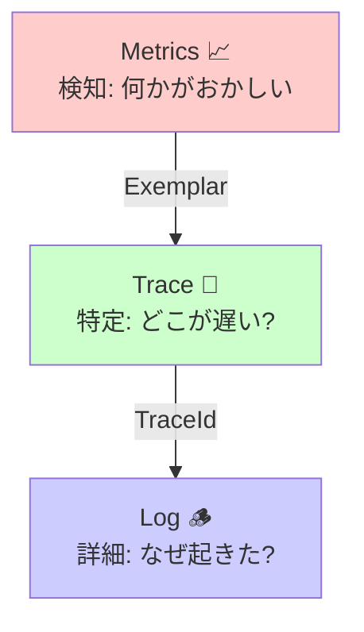

# 第28章：3本柱を“つなげる設計”🧩🔗（ログ×メト×トレ）

[](https://opentelemetry.io/docs/reference/specification/logs/?utm_source=chatgpt.com)

この章のゴールはこれ👇
**「メトリクスで異変を見つけて → ログで状況を絞って → トレースで犯人（遅い場所）を指差す」**の“一本道”を、設計として固定できるようになること🕵️‍♀️✨

---

## 28-1. まず結論：つなげるのは「3つの共通点」だけでOK🎯

ログ・メトリクス・トレースを“つなぐ”って、全部を混ぜる話じゃないよ🙅‍♀️
**共通点を3つそろえる**のが本質✨

1. **共通キー**🔑

* `traceId` / `spanId`（トレースのID）
* 追加で `correlationId`（独自の相関ID）を使うこともある

2. **共通の言葉（用語）**🗣️

* 「このAPI名はログではA、メトリクスではB」みたいなズレを消す
* “同じ操作”を“同じ名前”で呼ぶ

3. **共通の属性（サービスの名札）**🏷️

* `service.name` / `service.version` / `deployment.environment` みたいな「どのアプリのデータ？」が3本柱で一致してること
* これがズレると、ツール側で同じサービスとして集計できなくて崩壊しがち😇

この3点をそろえると、**ログ⇄トレースの相関**や、**メトリクス→トレースへのジャンプ（exemplar）**が成立するよ✨ ([OpenTelemetry][1])

---

## 28-2. “導線”を設計する：おすすめは「メト→トレ→ログ」🧭✨


現場で一番ハマりにくい順路はこれ👇

### ステップA：メトリクスで「どこがヤバい？」を特定📈🚨

* 例：`p95` が跳ねた、エラー率が上がった、特定ルートだけ遅い…など
* メトリクスは“健康診断”だから、全体の異変検知が得意💪

### ステップB：トレースで「遅い箇所」を指差す🧵👉

* どのSpan（DB？外部API？業務処理？）が時間を食ってるかを一発で見に行く
* しかも **exemplar** があると、メトリクスのグラフ上の点から“そのリクエストのトレース”に飛べる🪽✨ ([Microsoft Learn][2])

### ステップC：ログで「なにが起きてた？」を読む🪵🔍

* トレースの `traceId` でログ検索 → そのリクエスト周辺のログだけ読む
* OTel .NET では、**アクティブな `Activity` があればログに `TraceId`/`SpanId` が自動で入る**ので、ここが繋がりやすいよ✨ ([OpenTelemetry][1])

> もちろん「メト→ログ→トレ」でもOK🙆‍♀️
> ただ、初心者のうちは “ログ沼” にハマりやすいから、**トレースを先に挟む**のが超おすすめ🧸✨



---

## 28-3. 共通キー設計：traceId を“第一キー”にする🔑🧵

### 1) `traceId` / `spanId` を全信頼（基本の軸）✅

* HTTP でサービスをまたいでも、**W3C Trace Context** のヘッダー（`traceparent` など）で伝播する設計が標準だよ🌬️ ([w3.org][3])
* これがあると「フロント→API→DB→外部API」まで1本の糸になる✨

### 2) `correlationId` は “事情があるとき” だけ🎒

* 例：バッチ処理、非HTTP、古い仕組み、業務IDで追いたい…など
* ただし注意⚠️：**相関IDをメトリクスのラベルに入れるのはNG**（cardinality爆発💣）
  → メトリクスは集計、個別追跡はトレース（or ログ）へ寄せるのが安全🧯

---

## 28-4. 共通の“名札”をそろえる：Resource Attributes 設計🏷️✨

ここ、地味だけどめっちゃ効くやつ😇

最低限そろえたい名札（例）👇

* `service.name`（サービス名）
* `service.version`（アプリのバージョン）
* `deployment.environment`（prod / staging / dev など）

Microsoftの例でも、`OTEL_SERVICE_NAME` や `OTEL_RESOURCE_ATTRIBUTES` で Resource Attributes を付けられるよ、って案内されてるよ🧩 ([Microsoft Learn][2])

**設計ルール（おすすめ）**✅

* `service.name` は **リポジトリ名じゃなく“運用上の呼び名”**（短く固定）
* `deployment.environment` は **文字列を固定（prod/stg/dev など）**
* `service.version` は **ビルド番号でもOK**（追跡しやすい）

---

## 28-5. .NETで“つながる最小実装”を作る🧪💻

Microsoft Learn のサンプルは、**ログ・メトリクス・トレースを同じOTLPで出す最短ルート**になってて超参考になるよ✨ ([Microsoft Learn][2])

ここでは“設計が伝わる”最小セットを置くね👇

```csharp
using System.Diagnostics;
using System.Diagnostics.Metrics;
using OpenTelemetry.Logs;
using OpenTelemetry.Metrics;
using OpenTelemetry.Trace;

var builder = WebApplication.CreateBuilder(args);

// ① カスタム Meter / ActivitySource（自分のアプリの観測点）
var appMeter = new Meter("MyApp.Observability", "1.0.0");
var workCounter = appMeter.CreateCounter<long>("work.count", description: "Counts work executions");
var workDuration = appMeter.CreateHistogram<double>("work.duration", unit: "ms", description: "Work duration");

var appActivitySource = new ActivitySource("MyApp.Observability");

// ② Logs（ILogger → OpenTelemetry）
builder.Logging.AddOpenTelemetry(o =>
{
    o.IncludeFormattedMessage = true;
    o.IncludeScopes = true;
});

// ③ Metrics / Traces（AddOpenTelemetry）
var otel = builder.Services.AddOpenTelemetry();

// Metrics
otel.WithMetrics(m =>
{
    m.AddAspNetCoreInstrumentation();
    m.AddMeter(appMeter.Name);

    // ASP.NET Core が提供するメーター（例）
    m.AddMeter("Microsoft.AspNetCore.Hosting");
    m.AddMeter("Microsoft.AspNetCore.Server.Kestrel");
});

// Traces
otel.WithTracing(t =>
{
    t.AddAspNetCoreInstrumentation();
    t.AddHttpClientInstrumentation();
    t.AddSource(appActivitySource.Name);
});

// ④ Export（OTLP：環境変数で設定するのが一般的）
var otlpEndpoint = builder.Configuration["OTEL_EXPORTER_OTLP_ENDPOINT"];
if (!string.IsNullOrWhiteSpace(otlpEndpoint))
{
    otel.UseOtlpExporter();
}

var app = builder.Build();

app.MapGet("/work", async (ILogger<Program> logger) =>
{
    // トレース：Span（Activity）を切る
    using var activity = appActivitySource.StartActivity("Work");

    // ログ：構造化ログ（あとで絞り込みやすい）
    logger.LogInformation("Work started. mode={mode}", "demo");

    var sw = Stopwatch.StartNew();
    await Task.Delay(Random.Shared.Next(50, 400));
    sw.Stop();

    // メトリクス：回数と時間
    workCounter.Add(1);
    workDuration.Record(sw.Elapsed.TotalMilliseconds);

    // トレースに属性（意味づけ）
    activity?.SetTag("work.mode", "demo");
    activity?.SetTag("work.elapsed_ms", sw.Elapsed.TotalMilliseconds);

    logger.LogInformation("Work finished. elapsedMs={elapsedMs}", sw.Elapsed.TotalMilliseconds);

    return Results.Ok(new { ok = true, elapsedMs = sw.Elapsed.TotalMilliseconds });
});

app.Run();
```

ポイントはこれ👇

* **ログ**：`ILogger` を OTel に載せる（`IncludeScopes` と `IncludeFormattedMessage` がよく使われる）([Microsoft Learn][2])
* **トレース**：`ActivitySource` で “自分の業務Span” を作る
* **メトリクス**：`Meter` で “回数” と “時間” を出す
* **同じOTLP** に出すと、可視化ツール側で“つなげる前提”が整う🧩✨ ([Microsoft Learn][2])

---

## 28-6. 「メト→トレ」ジャンプを成立させる：exemplar の考え方💎🧵

メトリクスって集計だから、本来は「この1回の遅いリクエスト」を直接は持てないのね🤔
そこで **exemplar**（代表点）を使うと、**集計の中の“この1点”に trace_id を付けてリンクできる**✨ ([OpenTelemetry][4])

* OTel .NET では exemplar を **trace 기반** で付けられる（例：`SetExemplarFilter(ExemplarFilterType.TraceBased)`） ([OpenTelemetry][4])
* Microsoft の Aspire Dashboard の説明でも、ヒストグラムに exemplar が出て、そこからトレースに飛べる、と案内されてるよ🪽 ([Microsoft Learn][2])

**設計のコツ**🧠

* “時間系”はヒストグラムに寄せる（遅い1点を見つけやすい）
* メトリクスのラベルは「絞り込み用」まで（個体識別しない）
* 個体識別は traceId（exemplar）に任せる

---

## 28-7. 「トレ→ログ」ジャンプを成立させる：TraceId をログに持たせる🪵🔗

ここが繋がると、調査が気持ちよくなる🥹✨

### OTel .NET の嬉しいところ🌟

* **アクティブな `Activity` があると、ログに `TraceId` / `SpanId` / `TraceFlags` を自動で入れて相関できる**（ユーザーが特別な操作をしなくても） ([OpenTelemetry][1])

### “つながらない時”の典型パターン😵‍💫

* リクエスト外（バックグラウンド）でログってる
* OTel のログ出力を使ってない（別の出力経路）
* スコープが出てない（可視化ツール側の設定も含む）

補助として、`.NET` の `ActivityTrackingOptions` でログに TraceId/SpanId を含める設定もあるよ🧷 ([Microsoft Learn][5])

---

## 28-8. “同じ用語・同じ粒度”に揃えるテンプレ🧩🗂️

ここ、設計として文章化するとブレないよ✨

### ✅ 用語の統一（例）

* 操作名：`Work` / `OrderPlace` / `UserSignup` …

  * トレースの Span 名
  * ログの EventName / message
  * メトリクス名（`work.duration` など）
    → で “同じ単語” を使う

### ✅ 粒度の統一（例）

* 入口（HTTP）
* 業務（ユースケース）
* 外部I/O（DB / 外部API）

この3層が、ログ・メト・トレで同じ切り方だと、調査が迷子にならない🧭✨

---

## 28-9. ミニ演習：障害調査の導線を“固定”する🕵️‍♀️🧭

### 演習①：導線を1枚にする📄✨

次を埋めるだけ👇（手書きOK🖊️）

* 異変を検知するメトリクス：

  * 例：`http.server.request.duration` の p95
* 絞り込むディメンション：

  * 例：`route` / `method` / `status_code`
* トレースで見るSpan：

  * 例：`db` / `http.client` / `Work`
* ログで見るキー：

  * 例：`traceId` と `error.type` と `orderId(※ログだけ)`

### 演習②：遅延を“わざと”作る🐢💥

* `/work` に `Task.Delay(2000)` みたいな分岐を入れて遅くする
* どのメトリクスが動いて、どのトレースが長くなって、ログがどう並ぶかを見る👀✨

### 演習③：AIで“調査手順”をテンプレ化🤖🧠

Copilotにこう聞くと早いよ👇

* 「このアプリのメト→トレ→ログの調査手順を、5ステップのチェックリストにして」
* 「このメトリクス名・Span名・ログ項目がバラけてないかレビューして、命名を揃えて」

---

## 28-10. よくある事故💣と回避策🧯✨

* **サービス名が3本柱でズレる** → つながらない😇
  → `service.name` を固定、環境も固定（`deployment.environment`） ([Microsoft Learn][2])

* **メトリクスに個別IDをラベルで入れる** → 時限爆弾💣
  → 個別追跡は traceId（exemplar）に任せる ([OpenTelemetry][4])

* **トレースが無いのにログだけで戦う** → ログ沼🪵🌊
  → まずトレースで“遅い場所”を指差してからログへ ([Microsoft Learn][2])

* **開発環境でトレースが薄い** → 見えない😢
  → Aspire の service defaults では開発環境で AlwaysOn sampler を使う、みたいな設計もあるよ（見える化優先） ([Aspire][6])

---

## まとめ🧩✨（次章へのつなぎ）

この章でやったのは、3本柱を“混ぜる”んじゃなくて、**同じ地図記号を使って行き来できる状態にする**こと🗺️✨

* 共通キー（traceId）
* 共通の言葉（命名）
* 共通の名札（resource attributes）
  これが揃うと、**ダッシュボード設計（次章）**が一気に作りやすくなるよ📊🚀 ([Microsoft Learn][2])

[1]: https://opentelemetry.io/docs/languages/dotnet/logs/correlation/ "Log correlation | OpenTelemetry"
[2]: https://learn.microsoft.com/en-us/dotnet/core/diagnostics/observability-otlp-example "Example: Use OpenTelemetry with OTLP and the standalone Aspire Dashboard - .NET | Microsoft Learn"
[3]: https://www.w3.org/TR/trace-context-2/?utm_source=chatgpt.com "Trace Context Level 2"
[4]: https://opentelemetry.io/docs/languages/dotnet/metrics/exemplars/ "Using exemplars | OpenTelemetry"
[5]: https://learn.microsoft.com/en-us/dotnet/api/microsoft.extensions.logging.activitytrackingoptions?view=net-10.0-pp&utm_source=chatgpt.com "ActivityTrackingOptions Enum (Microsoft.Extensions.Logging)"
[6]: https://aspire.dev/fundamentals/service-defaults/?utm_source=chatgpt.com "Service defaults | Aspire"
