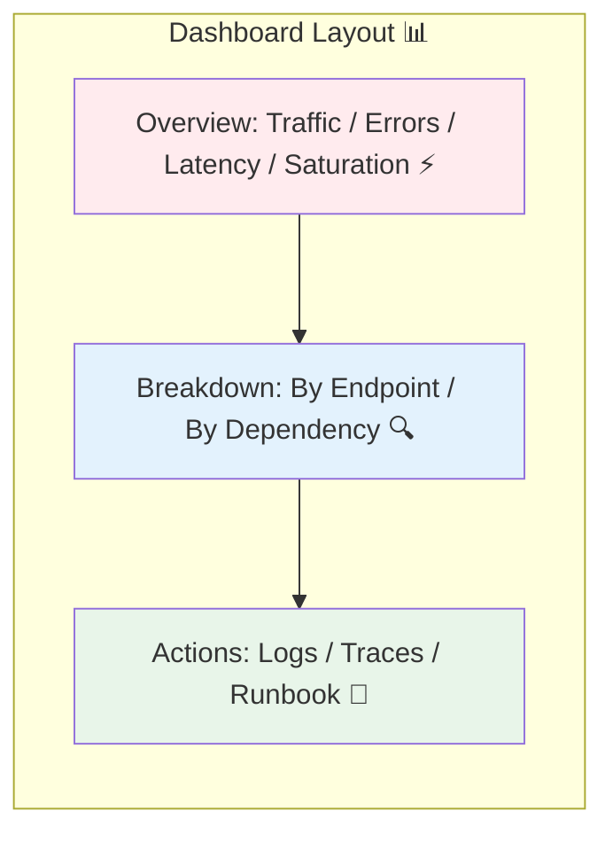

# 第29章：ダッシュボード設計📊✨（見る順番を設計する）

[](https://grafana.com/blog/2024/07/03/getting-started-with-grafana-best-practices-to-design-your-first-dashboard/?utm_source=chatgpt.com)


## この章のゴール🎯

この章が終わると、こんなことができるようになります💪✨

* 「最初にどれを見る？」を迷わない“画面の順番”を作れる👀➡️
* 1枚のダッシュボードで **状況把握→深掘り→調査（ログ/トレースへ）** までつなげられる🧭🔎
* “見た目が綺麗”じゃなくて、“意思決定できる”ダッシュボードを設計できる🧠💡

※いまどきの.NETは **.NET 10（LTS）** が現行の中心で、観測は **OpenTelemetry** 前提で組める流れが強いです（.NET 10のサポート表も公式に掲載）。([Microsoft][1])
※OpenTelemetry .NET も 3本柱（Logs/Metrics/Traces）で stable と明記されています。([GitHub][2])

---

## 1) ダッシュボードって「グラフ集」じゃないよ📌✨

ダッシュボードは **“ストーリー”** です📖👀
見た人がこう動けるように作ります👇

1. **いまヤバい？**（30秒で判断）😱✅
2. **どこがヤバい？**（3分で切り分け）🧩🔍
3. **なぜヤバい？**（ログ/トレへジャンプ）🪵🧵🚀

---

## 2) まず決める3つ📝✨（ここが設計の9割）

### A. 誰が見る？👩‍💻👨‍💻

* 当番（オンコール）😴📞
* 開発者（原因を直す人）🧑‍🔧🔧
* ついでに、マネージャー（影響だけ知りたい人）📣

### B. 見た瞬間に答えたい質問は？❓

例：

* 「エラー増えてる？」💥
* 「遅くなってる？」🐢
* 「特定のエンドポイントだけ？」🧭
* 「依存先（DB/外部API）？」🔌

### C. “次の一手”は何？🧯➡️

ダッシュボードには **次に押すリンク** が必要です👇

* ログへ（絞り込み済み）🪵🔎
* トレースへ（該当処理に直行）🧵🚀
* 手順書（Runbook）へ📄✅

---

## 3) 王道の型：RED → 深掘り → 調査リンク🟥🟨🟩

Grafanaのベストプラクティスでも、**RED/USEなどの戦略を使う**ことが推奨されています。([Grafana Labs][3])
ここではアプリ視点で **RED** を軸にします😊

### 3-1. 1枚目（Overview）に置くべき“トップ指標”🌟

**迷ったらこれだけでOK**👇（並び順も大事！）

1. **Rate（リクエスト量）**：トラフィック📈
2. **Errors（失敗）**：エラー率/例外数💥
3. **Duration（時間）**：p95/p99などの遅延⏱️
4. **Saturation（詰まり）**：CPU/メモリ/スレッド/DBコネクション等🧱

> ポイント：アラートは「原因」より「症状（ユーザー影響）」寄りが良い、という考え方もここに合います📣([Grafana Labs][3])

---

## 4) “見る順番”のおすすめレイアウト🧭✨（テンプレ）


### ✅ 上段：いまの健康状態（秒で判断）⚡

* リクエスト数（全体）📈
* エラー率（全体）💥
* レイテンシ p95（全体）⏱️
* サチり（CPU/メモリ等）🧱

### ✅ 中段：どこが悪い？（切り分け）🔍

* エンドポイント別（/api/xxx）🧭
* ステータスコード分布（2xx/4xx/5xx）🎯
* 依存先（DB/外部API）別の遅延・失敗🔌

### ✅ 下段：調査へ飛ぶ（ワンクリック）🚀

* “エラー急増した時刻”のログへ🪵
* “遅延が伸びたリクエスト”のトレースへ🧵
* 変更履歴（デプロイ/設定変更）の印（アノテーション）📌



---

## 5) ログ/トレースへ“つなげる”設計🔗✨（超重要）

### 5-1. ログに trace_id / span_id を入れておく🪵🧵

OpenTelemetryのログ仕様でも、**リクエスト文脈から trace id / span id を取り、ログに自動的に含める**話が出ています。([OpenTelemetry][4])
つまり、ダッシュボードで異常を見つけたら…

* メトリクスで「いつ・どのAPIが」おかしいか見つける📈
* ログで「例外の種類・入力条件・直前のイベント」を見る🪵
* トレースで「どこに時間を食われてるか」を指差す🧵👉

### 5-2. Grafanaなら “ログからトレースへ” を作れる🔗🚀

Grafanaでは **ログに含まれる trace ID を使って Tempo のトレースへリンク**できます。([Grafana Labs][5])
（「ログ詳細の derived field からトレースへ」みたいな導線が作れるやつです🪄）

---

## 6) “名前”と“切り口”の設計（ダッシュボードが死なないコツ）🏷️✨

### 6-1. サービスの名札（Resource Attributes）を揃える📛

OpenTelemetryは **Semantic Conventions（共通の属性名）** を用意していて、揃えるほど後が楽です。([OpenTelemetry][6])
最低限、ダッシュボードのフィルタ（変数）に使いたい代表は👇

* service.name（サービス名）
* deployment.environment（prod/stg/dev など）
* 可能なら region / instance など

### 6-2. 命名ルールの“地雷”も回避🧨

OpenTelemetryの命名ルールでは、文字種や区切りなどの制約があります（例：小文字、区切りの連続禁止…）。([OpenTelemetry][7])
→ 先にルールを決めておくと、メトリクス名もダッシュボードも破綻しにくいです😊

---

## 7) ダッシュボードあるある失敗😇😱（避けよう）

* 平均（avg）だけで安心してしまう（p95/p99が地獄）🔥
* パネルが多すぎて、どれ見ればいいか分からない迷路🌀
* 単位がバラバラ（msと秒が混在）⏱️💫
* “次に何をするか”のリンクがない（結局Explore地獄）🕳️
* フィルタが無くて「どの環境？どのサービス？」ってなる🤯

---

## 8) ミニ演習：紙ワイヤーフレームで設計しよう📝✨（最強）

### 手順🪄

1. A4に四角を描いて、上段に **4つのKPI枠** を置く📦📦📦📦
2. 中段に「エンドポイント別」と「依存先別」を置く🧭🔌
3. 下段に「ログへ」「トレースへ」「手順書へ」のリンク枠を置く🔗
4. それぞれに **“この枠は何に答える？”** を1行で書く✍️

ワイヤーフレーム例（雰囲気）👇

```text
[ Rate ] [ Error% ] [ p95 ] [ Saturation ]
-----------------------------------------
[ Endpoint別: Rate/Err/p95 ]   [ 依存先別: DB/外部API ]
-----------------------------------------
[ ログへ(絞込) ] [ トレースへ(該当) ] [ Runbook ]
```

### 仕上げチェック✅✨

* 30秒で「ヤバい/ヤバくない」が言える？⚡
* 3分で「どこが怪しい」が言える？🔍
* 1クリックでログ/トレースに飛べる？🚀

---

## 9) AI活用🤖💖（設計が爆速になるプロンプト）

### 9-1. まずは“構成案”を出してもらう🪄

```text
あなたはSREです。Web APIのダッシュボードを設計してください。
目的は「状況把握→切り分け→ログ/トレース調査に入る」です。
REDを軸に、上段4KPI・中段の切り分け・下段の調査リンクの構成で、
各パネルが答える質問も1行で付けてください。
```

### 9-2. “パネル名”を分かりやすくする🎀

```text
以下のパネル名が分かりにくいので、短くて誤解しない名前に直して。
（対象：女子大生の初学者でもわかる日本語）
```

### 9-3. “Runbookリンク”の文面を整える📄✨

```text
このダッシュボードでアラートが鳴ったときの手順（3分で切り分ける版）を書いて。
手順は箇条書きで、リンク先（ログ/トレース）に飛ぶ順番も入れて。
```

---

## 10) まとめ🌸

* ダッシュボードは **見る順番（意思決定の順番）** を設計するもの🧭✨
* まずは **REDのトップ指標** で状況把握 → 切り分け → ログ/トレへ🔗
* ログに trace_id / span_id を入れて、リンクで“一本道”にすると強い🧵🚀([OpenTelemetry][4])
* 命名と属性（Semantic Conventions）を揃えると、未来の自分が助かる🏷️💖([OpenTelemetry][6])

---

次の章（第30章）では、このダッシュボードを使って **障害対応の型→ふりかえり（ポストモーテム）** まで回し切るよ🧯🔁✨

[1]: https://dotnet.microsoft.com/en-us/platform/support/policy/dotnet-core?utm_source=chatgpt.com "NET and .NET Core official support policy"
[2]: https://github.com/open-telemetry/opentelemetry-dotnet?utm_source=chatgpt.com "The OpenTelemetry .NET Client"
[3]: https://grafana.com/docs/grafana/latest/visualizations/dashboards/build-dashboards/best-practices/?utm_source=chatgpt.com "Grafana dashboard best practices"
[4]: https://opentelemetry.io/docs/specs/otel/logs/?utm_source=chatgpt.com "OpenTelemetry Logging"
[5]: https://grafana.com/docs/grafana/latest/datasources/tempo/traces-in-grafana/link-trace-id/?utm_source=chatgpt.com "Link to a trace ID"
[6]: https://opentelemetry.io/docs/concepts/semantic-conventions/?utm_source=chatgpt.com "Semantic Conventions"
[7]: https://opentelemetry.io/docs/specs/semconv/general/naming/?utm_source=chatgpt.com "Naming"
