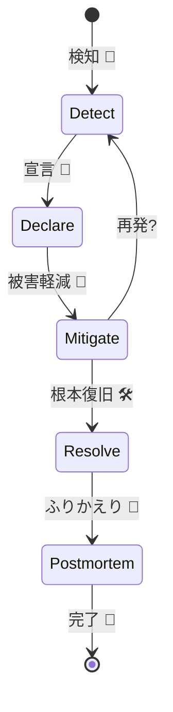

# 第30章：障害対応の型＋ふりかえり（ポストモーテム）🧯🔁

この章は「火事が起きた時に、パニックにならずに“勝ち筋”で動ける」ようになるための最終回だよ〜！🔥➡️🧊
ゴールは **調査→復旧→再発防止まで、型で回す** こと✨

---

## 0. この章でできるようになること 🎯✨

* 障害が起きたときに **最初の10分でやること** が迷わない⏱️
* 役割（指揮・復旧・連絡）を分けて **混乱を減らす** 👥🧠
* Logs / Metrics / Traces を使って **最短で原因に近づく導線** を回せる🧭🪵📈🧵
* 復旧後に **ブレームレス（責めない）** でポストモーテムを書ける📝🌈（文化としても大事） ([Google SRE][1])

---

## 1. 障害対応は「技術」だけじゃなく「運用の設計」だよ 🧩🧠

障害対応って、実は “プロジェクト運営” みたいなもの✨
だからこそ **ルールと役割** があると強い！

Microsoft も「手順（検知・封じ込め・トリアージ→RCA→ポストモーテム）」を含む **構造化されたインシデント管理** を推してるよ🧱([Microsoft Learn][2])

---

## 2. まず覚える「3つのC」🧠🧯

Google のインシデント対応フレームワーク（ICSベース）では、事故対応のゴールを **3つのC** として整理してるよ✨ ([Google SRE][3])

* **Coordinate（調整する）**：誰が何をやるか決めて交通整理🚦
* **Communicate（伝える）**：関係者・ユーザーに状況共有📣
* **Control（制御する）**：議論が拡散しないように指揮🧭

この3つが崩れると、だいたい事故対応がグダる😇

---

## 3. 事故が起きたら最初の10分でやる「型」⏱️🧯（テンプレで動く！）


### ✅ 3.1 インシデント宣言（早め・多めが正義）📣

Google SRE では「**インシデントは早めに宣言**」が原則のひとつになってるよ（迷ったら宣言してOK）🧯 ([Google SRE][3])

### ✅ 3.2 まず“場”を作る（事故チャンネル＆記録係）🗣️📝

同じく原則として「**役割を明確にする**」「**作業ログ（記録）を残す**」が挙げられてるよ✨ ([Google SRE][3])

やること（最初の10分チェック）✅

* 事故用の会話場所（Teams/Slack等）を1つに固定🧵
* 事故メモ（時系列）を書く人を決める📝
* 役割を宣言する（次の章で詳しく！）👥



---

## 4. 役割分担：IC / OL / CL（＋おすすめでScribe）👥✨


Google のやり方だと主要ロールはこの3つ（超大事！） ([Google SRE][3])

| 役割                       | ひとことで     | やること                |
| ------------------------ | --------- | ------------------- |
| IC（Incident Commander）🧭 | 交通整理の人    | 3つのC全部、優先順位・意思決定    |
| OL（Ops Lead）🛠️          | 復旧作業のリーダー | 技術的な切り分け・復旧の実行      |
| CL（Comms Lead）📣         | 連絡の人      | 定期報告、問い合わせ窓口、外部向け文面 |

さらに初心者チームで超おすすめ👇

* **Scribe（書記）📝**：タイムラインと決定事項を淡々と残す人（後で神になる）

> コツ：**ICは手を動かさない**（動かすと視野が狭くなる）😵‍💫➡️😇

---

## 5. 調査→復旧の導線（メト→ログ→トレ）🧭📈🪵🧵

第28章で作った「導線」をそのまま使うよ✨
事故対応は **“最短ルートのゲーム”** 🎮

### 5.1 まずメトリクス：症状の把握📈

* 何が悪い？（Errors増えてる？Duration伸びてる？）🟥🟨🟩
* どの範囲？（特定ルートだけ？全体？）🗺️
* いつから？（開始時刻）⏰

👉 ここで「影響範囲」と「優先順位」が決まる！

### 5.2 次にログ：具体の失敗を拾う🪵

* エラーの種類、例外の分類、外部I/Oの失敗🔍
* 相関ID / traceId で同じリクエストを束ねる🔗

### 5.3 最後にトレース：遅い場所を指差す🧵👆

* どのSpanが遅い？（DB？外部API？自前処理？）🐢
* どこで詰まってる？（待ち・リトライ・ロック）🚧

---

## 6. 復旧の基本方針：「原因究明」より先に「被害を減らす」🧯🧊

事故対応で一番やりがちなのがこれ👇
「原因を完璧に突き止めてから直そう」➡️遅い😇

おすすめの順番✨

1. **影響を止める**（切り離し・機能フラグ・リトライ抑制など）✂️
2. **復旧する**（ロールバック・設定戻し・スケールなど）🔁
3. **落ち着いて原因を詰める**（トレース深掘り）🧵🔍

Microsoft も「検知→封じ込め→トリアージ→RCA→ポストモーテム」みたいに段階で考えるのを推してるよ🧱 ([Microsoft Learn][2])

---

## 7. “クローズ”の条件を決めて、ちゃんと終わらせる 🏁✨

終わってないのに静かになるのが一番こわい😱

クローズ条件（例）✅

* メトリクスが通常レンジに戻った📈
* 監視アラートが収束した🚨➡️😌
* ユーザー影響が止まった（もしくは回避策を提示済み）🧑‍🤝‍🧑
* 「次にやること（宿題）」がチケット化された📌

---

## 8. ポストモーテム（ふりかえり）は“責めない”が正解🌈🧠

### 8.1 ブレームレスの意味😇➡️🧠

ブレームレスは「優しいから責めない」じゃなくて、
**本当の原因（仕組みの弱さ）を引き出すため** に必要なんだよね✨ ([Google SRE][1])

Google も「個人を名指しで責めると、みんなが萎縮して真実が出なくなる」方向の注意をしてるよ🧯 ([Google SRE][4])

Atlassian も「心理的安全性がないと情報が出なくなる」って言ってる📣 ([Atlassian Support][5])

### 8.2 いつ書く？（遅いと忘れる）⏱️📝

Atlassian は「**24〜48時間以内（遅くとも5営業日以内）** にドラフト」が理想って言ってるよ📝 ([Atlassian Support][5])

---

## 9. そのまま使える！ポストモーテム・テンプレ（コピペ用）📝✨

```text
## Postmortem: （インシデント名）🧯

## 1) まとめ（1〜3行）🌟
- 何が起きた？
- どれくらい影響した？
- いつ復旧した？

## 2) 影響（Impact）👥💥
- 影響を受けたユーザー／機能：
- 影響内容（例：エラー率、遅延、利用不能）：
- 期間：
- 可能なら数値（例：失敗率◯%）：

## 3) 検知（Detection）🚨
- 何で気づいた？（アラート／問い合わせ／ダッシュボード）
- 検知までの時間（MTTDが分かれば）：

## 4) タイムライン（Timeline）⏰
- 11:02 最初のアラート
- 11:05 インシデント宣言（Sev-?）
- 11:08 役割決定（IC/OL/CL/Scribe）
- 11:12 一次対応（被害軽減：◯◯）
- 11:25 原因の当たり（トレースで外部API遅延）
- 11:40 恒久対応の暫定（設定変更／ロールバック）
- 11:52 復旧確認（メトリクス正常化）
- 12:05 クローズ宣言

## 5) 原因（Root cause）🧠
- 直接原因（Trigger）：
- 根本原因（Systemic cause）：
- 促進要因（Contributing factors）：

## 6) 対応（Mitigation / Resolution）🛠️
- すぐ効いた対応：
- 効かなかった対応（なぜ？）：
- 復旧の決め手：

## 7) 良かった点（What went well）😎
- 例：相関IDで追えた
- 例：定期報告ができた

## 8) 悪かった点（What went poorly）🥲
- 例：役割が決まるまで時間がかかった
- 例：アラートがノイズで気づきにくかった

## 9) ラッキーだった点（Where we got lucky）🍀
- 例：ピーク時間じゃなかった
- 例：影響が一部機能で止まった

## 10) 再発防止（Action items）📌
- [ ] （アクション）／担当：（人）／期限：（日付）
- [ ] （アクション）／担当：（人）／期限：（日付）
- [ ] （アクション）／担当：（人）／期限：（日付）

## 11) 学び（Lessons）📚
- 技術面：
- 運用面：
- 設計面：
```

---

## 10. ミニ演習：題材アプリで“手順通り”にやってみよう🎮🧪

### シナリオ案（おすすめ）😈

* 例A：外部API呼び出しが遅くなって Duration が悪化🐢
* 例B：例外が増えて Errors が跳ねる💥
* 例C：DBが詰まってトレースが真っ赤🚧

### 演習の進め方（これが本番の動き）✅

1. **メトリクス**で症状確認（いつから？どのルート？）📈
2. **インシデント宣言**（Sevを決める）📣
3. **役割決め**（IC/OL/CL/Scribe）👥
4. **被害軽減**（タイムアウト調整、機能フラグで逃がす等）🧯
5. **ログ**で当たりを付ける（相関ID/traceIdで束ねる）🪵
6. **トレース**で遅いSpanを特定🧵
7. **復旧**（ロールバック等）🔁
8. **テンプレでポストモーテムを書く**📝

---

## 11. AI活用：ポストモーテム作成が爆速になるプロンプト集🤖✨

### 11.1 タイムライン整形（Scribe支援）📝

```text
以下はインシデント対応中のメモです。
時系列タイムライン（時刻付き）に整理し、重複をまとめてください。
また「意思決定ポイント」を太字見出しで抽出してください。

（ここにメモを貼る）
```

### 11.2 原因の書き分け（直接原因/根本原因/促進要因）🧠

```text
このインシデントについて、
1) 直接原因（Trigger）
2) 根本原因（Systemic cause）
3) 促進要因（Contributing factors）
に分けて箇条書きで提案してください。
責任追及の文体は禁止で、仕組みの改善に焦点を当ててください。

（ここに事実を書く：メトリクス、ログ、トレースの所見）
```

### 11.3 アクションアイテム案をSMART化📌

```text
以下の再発防止案を、SMART（具体的・測定可能・達成可能・関連・期限）に直して、
「担当ロール」「完了条件」「期限案」も付けてください。

（ここに案を書く）
```

---

## 12. 2026年らしい“運用のアップデート”小ネタ✨（知ってると強い）

* OpenTelemetry の .NET 自動計測（いわゆるゼロコード）で **コード改造少なめにトレース/メトリクスを出す** 流れが強いよ📦✨ ([OpenTelemetry][6])
* .NET 10 対応など、計測側の進化も速い（例：OpenTelemetry .NET 自動計測のリリースで .NET 10 対応が明記）🚀 ([GitHub][7])
* Collector も頻繁に更新されていて、運用パイプラインが“育つ前提”になってきてるよ🧩 ([OpenTelemetry][8])

※だからこそ、ポストモーテムのアクションで「計測の不足」や「相関の欠落」をちゃんと直すのが効く💪

---

## 13. よくある事故対応の失敗あるある😇（回避ワザ付き）

* **全員が手を動かして、誰も指揮してない** → ICを立てよう🧭
* **状況共有がなく、周りが不安で割り込みが増える** → CLが定期報告📣 ([Google SRE][9])
* **“誰が悪い”の空気になって情報が出なくなる** → ブレームレス徹底🌈 ([Atlassian Support][5])
* **復旧したのにポストモーテムが消える** → 24〜48h以内にドラフト📝 ([Atlassian Support][5])

---

## まとめ🎀✨

障害対応って、結局は
**「型（プロセス）＋ 観測（ログ/メト/トレ）＋ 文化（ブレームレス）」** の三点セットだよ🧩🧠🌈

この章のテンプレをそのままチームの標準にしちゃえば、次の障害から一気に強くなる💪🧯

---

次は、あなたの題材アプリ向けに「演習シナリオ（遅延/失敗/外部I/O）」を3本、**手順と観測ポイント付き**で作って、すぐ訓練できる形に整えることもできるよ🎮✨

[1]: https://sre.google/sre-book/postmortem-culture/?utm_source=chatgpt.com "Blameless Postmortem for System Resilience"
[2]: https://learn.microsoft.com/en-us/azure/well-architected/operational-excellence/incident-response "Architecture strategies for designing an incident management (IcM) process - Microsoft Azure Well-Architected Framework | Microsoft Learn"
[3]: https://sre.google/workbook/incident-response/ "Google SRE - Root Cause Analysis for Probing Incident"
[4]: https://sre.google/workbook/postmortem-culture/?utm_source=chatgpt.com "Postmortem Practices for Incident Management"
[5]: https://support.atlassian.com/jira-service-management-cloud/docs/post-incident-review-best-practices/ "Post-incident review best practices | Jira Service Management Cloud | Atlassian Support"
[6]: https://opentelemetry.io/docs/zero-code/dotnet/?utm_source=chatgpt.com "NET zero-code instrumentation"
[7]: https://github.com/open-telemetry/opentelemetry-dotnet-instrumentation/releases?utm_source=chatgpt.com "Releases · open-telemetry/opentelemetry-dotnet- ..."
[8]: https://opentelemetry.io/docs/collector/?utm_source=chatgpt.com "Collector"
[9]: https://sre.google/resources/practices-and-processes/incident-management-guide/ "Google SRE - Learn sre incident management and response"
