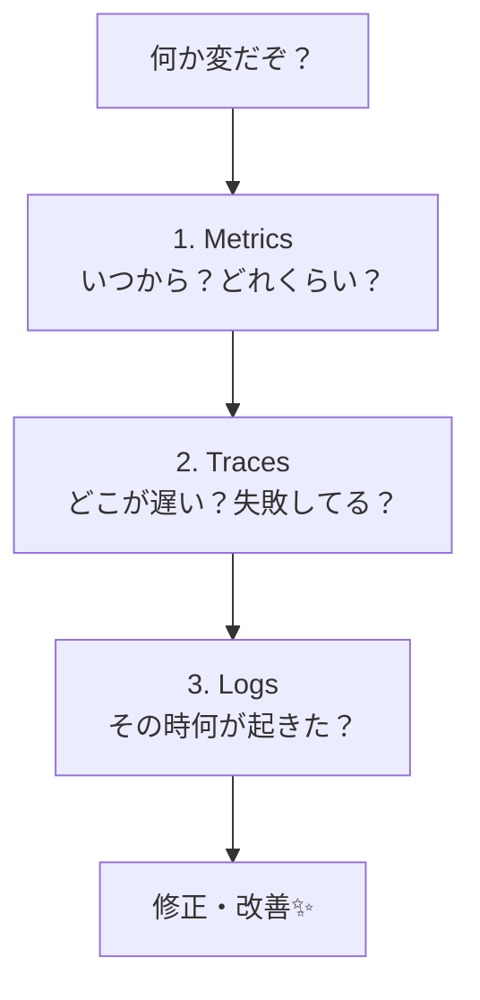

# 第01章：オブザーバビリティって何？👀✨

## 1) この章のゴール🎯

この章が終わるころにできていればOKです👇

* **「ログ / メトリクス / トレース」を1行ずつ**で説明できる📝
* **オブザーバビリティを1文で**言える✨
* 「あとで原因に辿り着くための設計」って何か、ふわっと掴める🔍

---

## 2) まずは“あるある”から😵‍💫💥


TypeScript/Nodeでよく起きるやつ👇

* 本番だけ遅い🐢💦（ローカルで再現しない）
* たまに落ちる💥（再現率1%）
* APIは成功してるのに、ユーザー体験は最悪😇😱
* 非同期が多くて「どこからどこまでが1リクエスト？」って混乱🧵🌀

ここで大事なのがこれ👇
**「いま起きてること」だけじゃなくて、あとで原因まで辿れる**状態にしたい。
そのための考え方が **オブザーバビリティ（Observability）** だよ👀✨

---

## 3) オブザーバビリティを一言でいうと？💡


**オブザーバビリティ = “外に出てくる情報（出力）から、中の状態を理解できる力”**。 ([OpenTelemetry][1])

ソフトウェアだと「外に出てくる情報」って主に👇

* **ログ（Logs）**
* **メトリクス（Metrics）**
* **トレース（Traces）**
  …の3つ（テレメトリ）だよ、って整理が定番！ ([OpenTelemetry][1])

> ポイント：**“データを出すこと”自体が設計**なんだよね🧠✨
> OpenTelemetryの説明でも「観測できるようにするには計装（instrumentation）が必要」って言ってるよ。 ([OpenTelemetry][1])

---

## 4) 3本柱（Logs / Metrics / Traces）を超やさしく🌈✨


### ✅ Logs（ログ）🪵📝

**「その瞬間に何が起きたか」のメモ**
例：エラー、分岐、外部API呼び出し開始/終了、入力が変だった…など。

* 強いところ💪：具体的な状況がわかる（文章や属性で説明できる）
* 弱いところ🥲：量が多いと探すのが地獄（ノイズ祭り）

---

### ✅ Metrics（メトリクス）📈⏱️

**「数値の変化」を時系列で見るもの**
例：リクエスト数、エラー率、処理時間の分布、メモリ使用量…など。

* 強いところ💪：**異常に気づく**のが速い（「いつから変？」が見える）
* 弱いところ🥲：原因の細部はわかりにくい（“なぜ”は別の手がかりが必要）

---

### ✅ Traces（トレース）🧵🗺️

**「1リクエストの旅の地図」**（どこを通って、どこで時間を使ったか）
OpenTelemetryの説明でも「リクエストがアプリを通る“道筋”」として説明されるよ。 ([OpenTelemetry][2])

* 強いところ💪：遅い/詰まってる場所が見つかりやすい（ボトルネック探しに強い）
* 弱いところ🥲：ちゃんと“つながる”ように作らないと途中で途切れる（後の章でやるよ🔗）

---

## 5) 監視（Monitoring）と何が違うの？🤔💭


ざっくり言うと👇

* **監視**：決めた条件で「異常」を検知する🚨（想定内の問題に強い）
* **オブザーバビリティ**：データを手がかりに「原因まで辿る」🔍（想定外にも強い）

だからオブザーバビリティは、**“あとで調査できる設計”**が主役になるよ👀✨ ([OpenTelemetry][1])

---

## 6) 「あとで原因に辿り着く」って具体的にどういうこと？🧭✨


理想の調査導線はこんな感じ👇

1. **メトリクス**で「いつから・どれくらいヤバい？」を掴む📈
2. **トレース**で「どこが遅い？どこで失敗？」を絞る🧵
3. **ログ**で「その瞬間に何が起きた？」を確定する🪵

この“つながる”感じが超大事！
（CNCFでも「メトリクス・ログ・トレースを相関させる」方向性が強調されてるよ） ([CNCF][3])



---

## 7) 使い分けミニ練習🎮✨（直感を作ろう）

次の状況、まず何を見る？（正解は1つじゃないよ🙆‍♀️）

* 「エラーが増えた気がする」👉 **Metrics**（エラー率）で事実確認📈
* 「どのAPIが遅いの？」👉 **Traces**でボトルネック探し🧵
* 「なぜ失敗したの？」👉 **Logs**で入力/分岐/例外を確認🪵
* 「サービスまたいだら分からなくなった」👉 **Traces**（つながり）＋ **Logs**（詳細）🔗

---

## 8) ミニ演習：自分用の定義を“1文”で書こう📝✨

ルールはこれだけ👇

* **短く（1文）**
* **“あとで原因に辿り着く”**が入ってる
* Logs/Metrics/Tracesのどれかが頭に浮かぶ

テンプレ（穴埋めでOK）👇

* 「オブザーバビリティは、**（　）**を手がかりに、**（　）**できるようにする設計」

例（そのまま使ってもOK）👇

* 「オブザーバビリティは、ログ・メトリクス・トレースを手がかりに、あとで原因まで辿れるようにする設計だよ👀✨」

---

## 9) AIに1文を“いい感じ”に整えてもらう🤖✂️✨

コピペで使えるお願い文（プロンプト）👇

* **短く整える**
  「次の文章を、女子大生にもわかる感じで“1文”に短くして：『（あなたの定義）』」

* **ブレを直す**
  「この定義、観測（Logs/Metrics/Traces）っぽさが弱いなら、そこを補って1文にして」

* **覚えやすくする**
  「この定義を、覚えやすい言い回しにして（20文字〜40文字くらい）」

---

## 10) ちょい実演：ログを“あとで探しやすく”する超ミニ🔎✨

まだ本格計装はしないけど、**「観測は設計」**の空気を感じる用のミニ例だよ🪄

```ts
// “あとで探せる”ログの超ミニ例（構造化ログっぽく）🪵✨
type LogLevel = "info" | "warn" | "error";

function log(level: LogLevel, message: string, props: Record<string, unknown> = {}) {
  const event = {
    ts: new Date().toISOString(),
    level,
    message,
    ...props, // ここに requestId とか route とかが入ると強い🔗
  };
  console.log(JSON.stringify(event));
}

// 例：1リクエスト中の出来事を “同じrequestId” でつなぐイメージ
const requestId = crypto.randomUUID();

log("info", "request:start", { requestId, route: "/work" });
// …何か処理…
log("info", "request:finish", { requestId, route: "/work", duration_ms: 123 });
```

この時点でもうメリットがあって👇

* 後で `requestId` で検索して、1リクエストの流れを追える🔗
* `duration_ms` を入れれば「遅い回」が分かる⏱️
* JSONなら後でフィルタしやすい（第9章で詳しくやるね）🧱✨

さらに本格的にやると、**トレースの traceId とログを紐づける**みたいな方向に進むよ🧵🔗
その“つなぐための共通の形式”として **W3C Trace Context（traceparent）** がある、って感じ！ ([w3.org][4])

---

## 11) 2026っぽい小ネタ：3本柱＋もう1つ？👀➕✨

最近は「ログ・メトリクス・トレース」に加えて、**継続プロファイリング（Continuous Profiling）**を“第4のシグナル”として扱う流れもあるよ🔥 ([Datadog][5])
（ただし第1章では、まず3本柱をしっかりでOK🙆‍♀️✨）

---

## 12) よくある落とし穴（この章で回避！）⚠️😇

* 「ログをいっぱい出せばOK！」→ **探せないログは負け**（ノイズ地獄）🪵💥
* 「監視ツール入れたらOK！」→ **出すべきデータが出てないと調査できない**👀🌀 ([OpenTelemetry][1])
* 「トレースはあとで」→ つなぐ設計を後回しにすると、後で痛い🧵😵‍💫

---

## 13) まとめ（今日覚えたい3行）🌟✨

* オブザーバビリティは「外の情報から中の状態を理解できる力」👀 ([OpenTelemetry][1])
* 3本柱は「ログ＝出来事」「メトリクス＝数値」「トレース＝旅の地図」🪵📈🧵
* ゴールは「**あとで原因に辿り着ける**」導線を作ること🧭✨

---

次は第2章で、「TS開発で“困る瞬間”から逆算」して、**観測が必要な理由を腹落ち**させにいくよ😵‍💫➡️😊✨

[1]: https://opentelemetry.io/docs/what-is-opentelemetry/?utm_source=chatgpt.com "What is OpenTelemetry?"
[2]: https://opentelemetry.io/docs/concepts/signals/traces/?utm_source=chatgpt.com "Traces"
[3]: https://www.cncf.io/blog/2025/01/27/what-is-observability-2-0/?utm_source=chatgpt.com "What is observability 2.0?"
[4]: https://www.w3.org/TR/trace-context/?utm_source=chatgpt.com "Trace Context"
[5]: https://www.datadoghq.com/blog/continuous-profiling-fourth-pillar/?utm_source=chatgpt.com "Why continuous profiling is the fourth pillar of observability"
