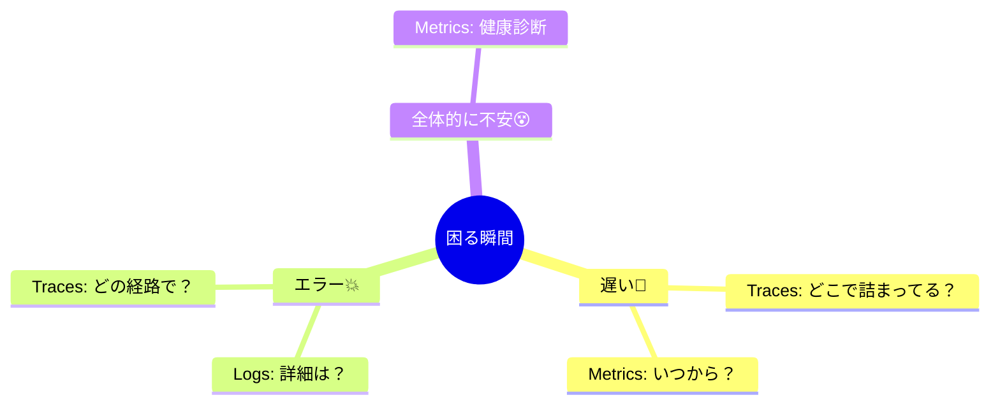

# 第02章：TS開発で“困る瞬間”から逆算😵‍💫➡️😊

この章は、いきなり「ログ！メトリクス！トレース！」って覚えるんじゃなくて、**“開発で詰む瞬間”から逆算して、何を観測すべきか決められるようになる**のがゴールだよ🧠✨
（設計って聞くと難しそうだけど、やることは「未来の自分を助けるメモの置き方」を決めるだけ📌）

---

## 1) “困る瞬間”あるある8選😇😱（TS/Nodeで特に多い）

まずは「あるある」をちゃんと名前つけしよ〜📝✨
困りごとはだいたい **“今ほしい答えが、どこにも残ってない”** から起きるよ💦

### ① 本番だけ落ちる／再現できない💥

* ローカルではOK、本番でだけ500😵
* 「どの入力で」「どの処理で」「どんな順で」壊れたか分からない

### ② どこが遅いか分からない🐢

* 体感「遅い」だけで、DB？外部API？自分の処理？不明🌀

### ③ 非同期でログが混ざって追えない🧵😵‍💫

* 同時アクセスでログが交互に出て、1リクエストの流れが見えない

### ④ エラーは出てるのに原因に辿り着けない🧯

* スタックトレースが弱い／情報が足りない／“どのユーザー操作か”不明

### ⑤ たまに失敗する（フレーク）🎲

* 失敗率1%くらい…でもユーザーには致命的😇
* リトライが悪化させてるのかも？でも証拠がない

### ⑥ 外部サービス障害に巻き込まれる🌩️

* 外部APIが遅い/落ちる→自分のサービスも道連れ😵

### ⑦ メモリがジワジワ増える🫠📈

* しばらく動くと重くなる…再起動で治る（怖い）
* Nodeでは「増え続ける」はかなり危険サイン🚨

### ⑧ 障害時に“今どうなってる？”が答えられない📣

* 「影響範囲」「失敗率」「遅延の程度」「いつから」を即答できない

---

## 2) 逆算のコツ：「困る」＝「未来の質問」❓✨

オブザーバビリティ設計って、要するにこう👇

> **未来の自分（or チーム）から飛んでくる質問に、証拠で答えられるようにする**🔎✨

そして、証拠の置き場所が3つの柱（ログ/メトリクス/トレース）だよ🪵📈🧵
OpenTelemetryもこの3本柱のテレメトリ（特にトレースとメトリクス）を扱うための標準的な枠組みとして広く使われてるよ📦✨ ([OpenTelemetry][1])

---

## 3) “困る瞬間”→「何が見えたら助かる？」対応表📋✨（超重要）

ここがこの章のメイン！🌟
次の表、あなたのプロジェクト用に育てていくと強いよ💪

| 😵 困る瞬間       | ✅ 何が見えたら助かる？（答えたいこと） | 🧰 使う柱 | 📝 最小で残すもの（例）                                                            |
| ------------- | -------------------- | ------ | ------------------------------------------------------------------------ |
| 本番だけ落ちる💥     | どの入力/どの経路/どこで落ちた？    | 🪵🧵   | `requestId`, `route`, `status`, `error.type`, `error.message`, `traceId` |
| どこが遅い？🐢      | どの区間が何ms？外部I/O？      | 🧵📈   | spanの所要時間、`db`/`http`区間、`duration`                                       |
| 非同期で追えない🧵    | 1リクエストのログがまとまって見たい   | 🪵🧵   | 相関ID（`requestId`/`traceId`）                                              |
| たまに失敗🎲       | 失敗の種類別に何%？いつ増えた？     | 📈🪵   | エラー率、失敗理由カウント、エラー詳細ログ                                                    |
| 外部障害に巻き込まれ🌩️ | 外部が遅い/落ちてる証拠ある？      | 🧵📈   | 外部呼び出しspan、外部API別エラー率/レイテンシ                                              |
| メモリ増える🫠      | いつから増えた？GC？リークっぽい？   | 📈     | RSS/heap使用量の推移、しきい値超え                                                    |
| 障害時に状況不明📣    | 影響範囲・失敗率・遅延を即答したい    | 📈     | Rate/Errors/Durationのトップ指標（最低限）                                          |

💡ポイント：

* **ログは「個別の事件の証拠」**（このリクエストで何が起きた？）🪵
* **メトリクスは「今の健康状態」**（増えてる？悪化してる？）📈
* **トレースは「遅い/詰まるの分解図」**（どの区間がボトルネック？）🧵

---

## 4) ミニ演習：困りごと3つ → 観測に翻訳📝✨（10〜15分）

### Step 1：あなたの“困る瞬間”を3つ書く😵‍💫🖊️

例）

* 「たまに /slow が3秒超える」
* 「外部APIが落ちたとき、どのユーザーが影響受けたか分からない」
* 「ログが混ざって追えない」

### Step 2：「何が見えたら助かる？」を1行にする✅

例）

* 「遅い原因がDBなのか外部APIなのか、区間ごとの時間が見たい」
* 「影響ユーザーの範囲と、失敗理由が見たい」
* 「1リクエストの流れでログを追いたい」

### Step 3：「柱」を決める🪵📈🧵

* 遅さの原因 → **トレース🧵**（＋傾向はメトリクス📈）
* 影響範囲の即答 → **メトリクス📈**（＋詳細はログ🪵）
* ログ混在 → **相関IDでログ/トレースを接続🪵🧵**

### Step 4：「最小で残す項目」を決める📌

最初は欲張らないのがコツ！✨
例（遅い系の最小セット）：

* `requestId` / `traceId`
* `route`
* `durationMs`
* `externalService`（外部呼び出しがある場合だけ）

---

## 5) ちょい先取り：なぜ非同期で“つながらない”の？🧵⚡

Nodeには **AsyncLocalStorage** っていう「非同期の流れの中で値を保つ仕組み」があるよ🧠
これがあると、ログに `requestId` を自動で載せたりして、**混ざったログを“同じリクエスト単位”に戻す**のがやりやすくなる✨ ([nodejs.org][2])

（本格的にやるのは後の章でOK！今は「そういう仕組みがあるんだ〜」で十分☺️）

---

## 6) AIの使いどころ🤖✨（この章は“整理”に全振りでOK）

### ① 対応表を一気に作る（おすすめ）📋🤖

CopilotやCodexにこう投げると早いよ👇

* 「TS/Node APIで起きがちな“困る瞬間”を10個出して、
  　各々に対して『何が見えたら助かる？』『Logs/Metrics/Tracesどれ？』『最小フィールド案』を表にして」

### ② “最小”になってるかチェックしてもらう🧹✨

* 「この観測項目、やりすぎ/不足を指摘して。最小セットに削って」
* 「ラベル（タグ）にユーザーIDや注文IDをそのまま入れるのは危ない？代替案は？」（※メトリクスのラベル爆発を防ぐやつ⚠️）

### ③ 文言の統一（表記ゆれ撲滅）🏷️✨

* 「requestId/traceId/userId の命名を統一して、推奨のキー名に揃えて」

---

## 7) この章のチェックテスト✅✨（サクッと）

1. 「どこが遅い？」に一番効きやすい柱はどれ？🧵📈🪵
2. ログが混ざって追えないときにまず欲しいものは？🔗
3. 「今どれくらい失敗してる？」に強い柱は？📈
4. “困る瞬間”を観測に翻訳するときの合言葉は？（未来の質問…？）❓
5. 最初から項目を盛り盛りにしない方がいい理由は？🧠

---

## 8) 次章につながる「宿題」📌✨

今日作った対応表のうち、**いちばん優先度が高い困りごとを1つだけ選んで**、こう書いておいてね👇

* 「困る瞬間」😵
* 「答えたい質問」❓
* 「最小で残す項目」📌（5つ以内目標）

次の章で題材（API）を固定すると、ここで決めた“質問”がブレなくなるよ😊✨

---

### 参考（この章の内容が依拠してる “今どきの前提” ）📚✨

* Node.jsのLTS/サポート状況は、v24がActive LTS、v22はMaintenance LTSとして整理されてるよ（2026-01時点）([GitHub][3])
* TypeScriptは 5.9 のリリースノート/アナウンスが公開されていて、VS Code周りの体験改善（hover等）も進んでるよ([Microsoft for Developers][4])
* OpenTelemetry（JS/Node）はトレースとメトリクスの計装の入門が整理されていて、ログ周りは「まだ発展途上」と明記されてるよ([OpenTelemetry][5])
* 非同期の文脈を追う仕組みとしてAsyncLocalStorageが公式ドキュメントで説明されてるよ([nodejs.org][2])

---

次は「第3章：題材を決める🧱💻」に進めるけど、先にこの章の対応表（あなた版）ができたら、かなり勝ちだよ〜😆🫶✨

[1]: https://opentelemetry.io/docs/languages/js/?utm_source=chatgpt.com "JavaScript"
[2]: https://nodejs.org/api/async_context.html?utm_source=chatgpt.com "Asynchronous context tracking | Node.js v25.3.0 ..."
[3]: https://github.com/nodejs/Release?utm_source=chatgpt.com "Node.js Release Working Group"
[4]: https://devblogs.microsoft.com/typescript/announcing-typescript-5-9/?utm_source=chatgpt.com "Announcing TypeScript 5.9"
[5]: https://opentelemetry.io/docs/languages/js/getting-started/nodejs/?utm_source=chatgpt.com "Node.js"
