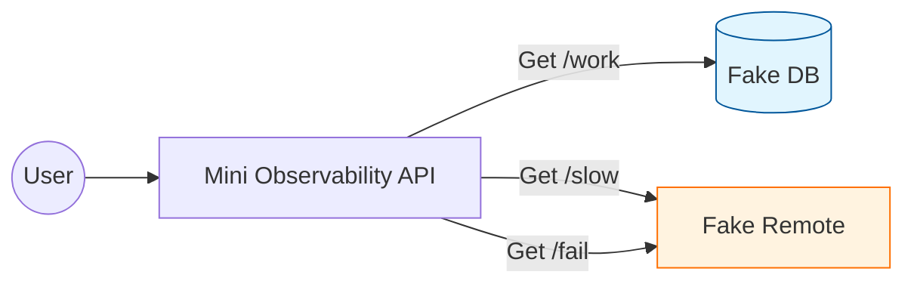

# 第03章：題材を決める🧱💻（Node API中心＋必要ならフロント任意）

この章は「観測（ログ/メトリクス/トレース）を練習するための**“実験場”**を固定する」回だよ〜！🧪✨
題材が毎回フラフラすると、あとでログやトレースを入れる時に迷子になりがち😵‍💫 なので先に**小さく決め切る**のが勝ちです🏁💕

ちなみに本日時点（2026-01-17）だと、Node は v24 が Active LTS、v25 が Current だよ📌（公式のリリース表に出てる）([Node.js][1])
TypeScript は 5.9 系が現行ラインで、公式リリースアナウンスもあるよ🧡([Microsoft for Developers][2])
（TypeScript 6/7 の話も進んでるけど、教材は安定版の 5.9 前提で進めるのが安心🌸）([Microsoft for Developers][3])

---

## この章のゴール🎯✨

* 「この教材で観測する対象」を**1つに固定**できる🔒
* **成功 / 遅延 / 失敗**の3パターンを、HTTP で叩けるようにする🎯
* 仕様（APIの形）を軽く文章化して、後の章でブレないようにする📄✨

---

## 題材に必要な条件（これだけ守ればOK）✅✨

観測の練習用なので、アプリの出来より「観測しがい」が大事だよ🫶

**必須条件（ミニマム）**

* HTTP の入口がある（リクエスト単位で追える）🌐
* 非同期がある（await がある・並行があると最高）🧵
* 外部I/Oっぽい処理がある（DB風 / API風）📦
* 成功・遅延・失敗が**意図的に再現**できる🎭

---

## 今回の題材：Mini Observability API 🧪🚀


教材用に、めちゃ小さい API を作るよ！
名前は好きでOKだけど、ここでは **Mini Observability API** にするね😊✨

### エンドポイント設計（固定しよう）🔩

| Endpoint       | 目的   | 期待する挙動                 |
| -------------- | ---- | ---------------------- |
| `GET /work`    | 通常成功 | だいたい速い（例：100〜300ms）🙂  |
| `GET /slow`    | 遅い成功 | わざと遅延（例：1500〜3000ms）🐢 |
| `GET /fail`    | 失敗   | 例外を投げて 500 を返す💥       |
| `GET /healthz` | 生存確認 | すぐ返す（超速）🫧             |

> **ポイント**：あとでログ/メトリクス/トレースを入れると、
> `/slow` はレイテンシ原因探しに使えるし、`/fail` はエラー追跡に使えるよ🔍✨



---

## “外部I/O風”の中身（リアルじゃなくてOK）📦✨

今回は教材なので、ガチDBや外部APIに繋がなくてもOK！
代わりに **Fake DB / Fake Remote** を作って、遅延と失敗をコントロールするよ🎮

* Fake DB（DB風）🗃️：`findUser()` がたまに遅い、など
* Fake Remote（外部API風）🌍：`callPayment()` がたまに失敗、など

これで「現場っぽい観測」ができるようになるの〜！✨

---

## まずは“仕様書（たたき台）”を作る📄🧾（AIを使ってOK🤖）

ここが超大事。コードより先に、1枚でいいから仕様を固定するよ📌

### 仕様書テンプレ（そのまま使ってOK）📝

* 概要：Mini Observability API
* 目的：成功/遅延/失敗を再現して観測を練習する
* エンドポイント：上の表
* レスポンス共通：JSONで返す（`ok`, `data`, `error` など）
* 遅延ルール：`/slow` は 1500〜3000ms
* 失敗ルール：`/fail` は必ず 500（メッセージ付き）

### AIに投げるプロンプト例🤖✨

（コピペして使ってね）

* 「Mini Observability API の OpenAPI っぽい仕様を、`/work` `/slow` `/fail` `/healthz` で作って。レスポンス例もつけて。初心者向けで簡潔に。」
* 「`/slow` は 1500〜3000ms 遅延、`/fail` は例外→500 に固定。仕様書を Markdown で1枚にまとめて。」

---

## 最小実装：3パターンが動く“実験場”を作る🧱⚙️

ここでは **とにかく動く** を優先しよう😊✨
（後の章で観測をどんどん入れるから、今は美しさより再現性💪）

### 依存関係（軽め）📦

* サーバ：Express（シンプルで学習向き）
* TS実行：`tsx`（TSをそのまま実行できてラク）⚡([GitHub][4])
* TypeScript：5.9 系（現行ライン）([Microsoft for Developers][2])

### コマンド例（ざっくり）🖥️✨

```bash
mkdir mini-observability-api
cd mini-observability-api
npm init -y

npm i express
npm i -D typescript tsx @types/node @types/express

npx tsc --init
```

> `tsc --init` は最近の TypeScript だと、以前よりスッキリした初期 tsconfig を作りやすくなってるよ🧼✨([TypeScript][5])

---

## コード（最小セット）🧩✨

### `src/server.ts`

```ts
import express from "express";

const app = express();
app.use(express.json());

const sleep = (ms: number) => new Promise((r) => setTimeout(r, ms));

// Fake DB（DBっぽい遅延）
async function fakeFindUser(userId: string) {
  await sleep(50 + Math.floor(Math.random() * 80)); // 50〜130ms
  return { userId, name: "komiyamma", plan: "mini" };
}

// Fake Remote（外部APIっぽい遅延＆失敗）
async function fakeRemoteCall(mode: "ok" | "slow" | "fail") {
  if (mode === "slow") {
    await sleep(1500 + Math.floor(Math.random() * 1500)); // 1500〜3000ms
    return { provider: "fake-remote", result: "slow-ok" };
  }
  if (mode === "fail") {
    await sleep(80);
    throw new Error("FakeRemoteError: payment gateway failed");
  }
  await sleep(80 + Math.floor(Math.random() * 120)); // 80〜200ms
  return { provider: "fake-remote", result: "ok" };
}

// health
app.get("/healthz", (_req, res) => {
  res.json({ ok: true, data: { status: "up" } });
});

// success
app.get("/work", async (_req, res) => {
  const user = await fakeFindUser("u-001");
  const remote = await fakeRemoteCall("ok");
  res.json({ ok: true, data: { user, remote } });
});

// slow success
app.get("/slow", async (_req, res) => {
  const user = await fakeFindUser("u-001");
  const remote = await fakeRemoteCall("slow");
  res.json({ ok: true, data: { user, remote } });
});

// fail
app.get("/fail", async (_req, res) => {
  try {
    const user = await fakeFindUser("u-001");
    const remote = await fakeRemoteCall("fail");
    res.json({ ok: true, data: { user, remote } });
  } catch (e) {
    res.status(500).json({
      ok: false,
      error: { message: e instanceof Error ? e.message : "Unknown error" },
    });
  }
});

app.listen(3000, () => {
  console.log("Mini Observability API listening on http://localhost:3000");
});
```

### `package.json` の scripts（例）🧷

```json
{
  "scripts": {
    "dev": "tsx watch src/server.ts"
  }
}
```

---

## 動作チェック（3パターン確認）🧪✨

```bash
npm run dev
```

別ターミナルで叩く（Windowsなら `curl.exe` が安心）💡

```bash
curl.exe http://localhost:3000/healthz
curl.exe http://localhost:3000/work
curl.exe http://localhost:3000/slow
curl.exe http://localhost:3000/fail
```

* `/work`：だいたい速い🙂
* `/slow`：明らかに遅い🐢
* `/fail`：500 が返る💥

この「差」があるだけで、後の章のログ・メトリクス・トレースがめちゃ映えるよ📈🧵🪵✨

---

## ミニ演習🎯（10〜20分）💖

1. `/work` のレスポンスに `timestamp` を足す⏰
2. `/slow` の遅延を「1500〜3000msのランダム」に調整🐢
3. `/fail` のエラー文言を「種別っぽく」する（例：`FakeRemoteTimeout` とか）🏷️

---

## よくある失敗（今つぶす）🧯✨

* **遅延が再現できない**：ランダムじゃなく固定遅延（例：2000ms）でもOK！まず再現性📌
* **失敗がブレる**：`/fail` は「必ず失敗」で固定がラク💥
* **題材がデカくなる**：最初はエンドポイント4本で十分！増やすのは後で🧸✨

---

## 次の章へのつなぎ🔗✨

次は VS Code とAIを使って、この実験場に「観測の下準備」を入れていくよ🧰🤖
今日作った `/work` `/slow` `/fail` が、ログ・メトリクス・トレースの“教材の舞台”になる感じ🎭✨

必要なら、この題材を「注文API🍔」「課題提出API📚」「ゲームスコアAPI🎮」みたいに世界観だけ変える案も出せるよ〜🥳💗

[1]: https://nodejs.org/en/about/previous-releases?utm_source=chatgpt.com "Node.js Releases"
[2]: https://devblogs.microsoft.com/typescript/announcing-typescript-5-9/?utm_source=chatgpt.com "Announcing TypeScript 5.9"
[3]: https://devblogs.microsoft.com/typescript/progress-on-typescript-7-december-2025/?utm_source=chatgpt.com "Progress on TypeScript 7 - December 2025"
[4]: https://github.com/privatenumber/tsx?utm_source=chatgpt.com "privatenumber/tsx: ⚡️ TypeScript Execute | The easiest ..."
[5]: https://www.typescriptlang.org/docs/handbook/release-notes/typescript-5-9.html?utm_source=chatgpt.com "Documentation - TypeScript 5.9"
