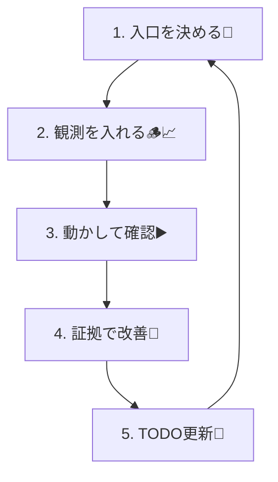

# 第04章：VS CodeとAIで“観測の下準備”🧰🤖✨

[](https://code.visualstudio.com/docs/copilot/getting-started-chat?utm_source=chatgpt.com)

この章は「観測（ログ→確認→改善）」を**毎回ラクに回せる作業台**を作る回だよ〜😆💖
コードを書く前に、**回し方（型）**を先に作っちゃうのがコツ！🌀✅

---

## 0) この章のゴール🎯✨

* どの章でも使う「観測の型」を固定する（迷子にならない🧭）
* VS Codeで **実行・テスト・デバッグ** がワンアクションになる（楽ちんボタン化🔘）
* AIに「いつも同じ品質」でテンプレやチェックリストを作ってもらえる（ブレない📏✨）
* 章ごとに使う「観測TODOテンプレ」を作る（やること漏れない📝✅）

---

## 1) “観測の型”はこれだけ覚えればOK🌀👀

毎回この順で回すよ〜👇✨

1. **入口を決める**（HTTPの入口 / 外部I/O / 例外の境界）🚪
2. **観測を入れる**（まずはログ、次にメトリクス、最後にトレース）🪵📈🧵
3. **動かして確認**（VS Codeのタスク or デバッグ）▶️
4. **証拠で改善**（ノイズ削る／不足足す／命名揃える）🧹🧩
5. **TODO更新**（次に入れる観測ポイントを1行追加）📝✅



---

## 2) VS Codeを“観測しやすい作業台”にする🧰✨


### 2-1) まず使う機能：Chat / Inline Chat / Agent🗣️⚡🤖

VS Codeのチャットは、用途で使い分けるのがコツだよ〜👇

* **Chat view**：相談・設計・複数ファイルの話に強い🧠
* **Inline chat**：その場で1〜数行直すのが速い⚡
* **Agent/Plan/Ask/Edit**：モードで得意分野が変わる（大きめ変更はAgentが便利）🤖✨
  （VS Codeのチャット機能とモード説明は公式にまとまってるよ）([Visual Studio Code][1])

### 2-2) “カスタム指示”で、AIをブレさせない📐🧠

AIって、何も決めないとログの粒度や命名が毎回ちょいズレるの…😵‍💫
だから**プロジェクトの憲法**を置いちゃう！

#### ✅ `.github/copilot-instructions.md` を作る（おすすめ）

VS Codeは、ワークスペース直下の **`.github/copilot-instructions.md`** を自動で参照できるよ🧾✨ ([Visual Studio Code][2])

例（そのまま置いてOK）👇

```md
## Observability rules (project-wide)

- Prefer structured logs (JSON). Avoid free-text only logs.
- Always include: requestId (or traceId), route, method, status, durationMs.
- Do NOT log: passwords, tokens, raw personal data, full request bodies.
- Use consistent keys: event, message, requestId, userIdHash, errorName, errorMessage.
- When adding logs, also add/update the "observability TODO" checklist.
- Keep log level rules:
  - debug: local investigation only
  - info: normal important events
  - warn: unexpected but handled
  - error: failures that need attention
```

---

## 3) “再利用プロンプト”で、観測テンプレを量産する📦✨

### 3-1) Prompt files を使う💾✨

VS Codeは **`.github/prompts`** に置いたプロンプトを `/コマンド` で呼び出せるよ！便利すぎ😳💖 ([Visual Studio Code][3])

#### ✅ 例：`.github/prompts/obs-todo.prompt.md`

```md
---
description: "観測TODOを章の内容に合わせて更新する"
---

次の章の作業内容を読んで、observability TODO を更新して。
- 漏れが出やすい観点（相関ID、エラー、外部I/O、遅延）を必ずチェック
- 追加するTODOは「1行で」「具体的に」「どこに入れるか」を含めて

対象テキスト:
{{selection}}
```

これで、チャットで
`/obs-todo`
って打つだけで、TODO更新が“儀式化”できるよ〜🪄✨

---

## 4) 実行・テスト・デバッグを“ボタン化”する🔘▶️🧪

### 4-1) Tasks（タスク）で「いつもの実行」を固定する🧷✨

タスクは「実行・テスト・lint」をVS Code内から回すための仕組みだよ（公式）([Visual Studio Code][4])

#### ✅ `.vscode/tasks.json`（例）

```json
{
  "version": "2.0.0",
  "tasks": [
    {
      "label": "dev",
      "type": "shell",
      "command": "npm run dev",
      "problemMatcher": [],
      "group": { "kind": "build", "isDefault": true }
    },
    {
      "label": "test",
      "type": "shell",
      "command": "npm test",
      "problemMatcher": [],
      "group": "test"
    },
    {
      "label": "lint",
      "type": "shell",
      "command": "npm run lint",
      "problemMatcher": []
    }
  ]
}
```

使い方：

* `Ctrl + Shift + P` → **Run Task** → `dev` を選ぶだけ▶️✨
  「毎回ターミナルで打つ」が減って、観測の改善に集中できるよ〜😆💕

---

### 4-2) デバッグを固定する（launch.json）🐛✨

VS Codeは Node/TS のデバッグを標準でサポートしてて、`launch.json` で設定できるよ（公式）([Visual Studio Code][5])

#### ✅ `.vscode/launch.json`（例：npm script を起動してデバッグ）

```json
{
  "version": "0.2.0",
  "configurations": [
    {
      "name": "Debug: dev",
      "type": "node",
      "request": "launch",
      "runtimeExecutable": "npm",
      "runtimeArgs": ["run", "dev"],
      "console": "integratedTerminal",
      "skipFiles": ["<node_internals>/**"]
    }
  ]
}
```

これで `F5` でデバッグ開始🎮✨
ブレークポイントもWatchも、ぜんぶ使えるよ〜！

---

## 5) ログを汚さず“覗き見”できる Logpoint が強すぎる💎👀✨

「ログ入れた→確認→消す」って、地味にだるい…😇
そんな時は **Logpoint**（止めないブレークポイント）！

* **コードを変更せず**にログを差し込める
* **止めずに** Debug Console に出る
* `{}` で変数も出せる

VS Code公式でも「ログ文を追加しなくて済むから便利」って説明されてるよ💎✨ ([Visual Studio Code][6])

#### ✅ 使い方（超かんたん）

1. 行番号の左（余白）を右クリック
2. **Add Logpoint**
3. メッセージに `route={req.path} status={res.statusCode}` みたいに書く（`{}`がポイント！）🪄

---

## 6) 章ごとに使う「観測TODOテンプレ」を作る📝✅✨

`docs/observability.todo.md` を作って、毎章ここを更新するよ〜！

```md
## Observability TODO ✅

## Common (always)
- [ ] requestId/traceId をログに入れる（入口で発行 or 受け取る）
- [ ] durationMs を入れる（入口〜出口）
- [ ] error は template（name/message/stack の方針）で統一
- [ ] 禁止事項：token/password/raw PII をログに入れない

## This chapter
- [ ] （第4章）VS Code task/dev/debug を整備して、観測ループを回せるようにする
- [ ] （第4章）copilot-instructions と prompt files を追加して、観測テンプレを再利用できるようにする

## Next
- [ ] 入口（HTTP）に最小ログを1本入れる
- [ ] 外部I/O（fetch/DB風）にログ or span を入れる
```

これがあると「何入れたっけ？」がゼロになるよ🥹💖

---

## 7) AIの“使い方の型”も固定しちゃう🤖📐✨

### 7-1) まずは“短い指示”＋“制約”が最強💪✨

コピペ用テンプレ👇（Chat/InlineどっちでもOK）

```txt
次の変更をして：
- 目的：観測（あとで調査できる）を強化
- 追加するログは構造化（key/value）で
- 必須キー：event, message, requestId, route, method, status, durationMs
- 禁止：token/password/raw PII
対象ファイル：#file:src/...
```

VS Codeのチャットは `#file` や `#codebase` みたいに**コンテキストを付ける**と強くなるよ（公式）([Visual Studio Code][1])

### 7-2) モデル選択もできるよ🧠🔁

VS Codeのチャットは、モデルを切り替えたり、サブスクによって利用できるモデルが変わったりするよ（公式）([Visual Studio Code][1])
※Copilot側で **GPT-5-Codex** みたいなモデルも選択肢に含まれてる（ドキュメントに一覧あり）([OpenTelemetry][7])

---

## 8) ミニ演習（10〜15分）🧪💖

### 演習A：Logpointで“観測ループ”を回す💎🌀

1. `dev` タスクで起動▶️
2. `/slow`（遅いAPI）に入る行に Logpoint を置く
3. `{}` で「処理時間に関係しそうな変数」を出す
4. Debug Console を見て、**“何が見えたら助かる？”** を1行メモ📝
5. `docs/observability.todo.md` の **This chapter** に1行追加✅

### 演習B：AIで“TODO更新”を自動化🤖📝

* `observability.todo.md` を選択して
* `/obs-todo`（さっき作ったprompt）を実行✨
* 出てきた案を、**自分の言葉で1行だけ修正**して採用（丸投げしないのが上達コツ😆💖）

---

## ちょい先取りメモ👀🧵📈

次の章以降で OpenTelemetry も触れていくけど、JSの世界はSDKや自動計装がどんどん整備されてて、まずは公式ガイドをベースに進めるのが安心だよ〜🧭✨ ([betterstack.com][8])

---

次は「第5章：Nodeの非同期が観測を難しくする理由」だね⏳🧵
ここまで作った **タスク・デバッグ・Logpoint・AIテンプレ** が、めっちゃ効いてくるよ〜！😆💖

[1]: https://code.visualstudio.com/docs/copilot/chat/copilot-chat "Get started with chat in VS Code"
[2]: https://code.visualstudio.com/docs/copilot/customization/custom-instructions?utm_source=chatgpt.com "Use custom instructions in VS Code"
[3]: https://code.visualstudio.com/docs/copilot/customization/prompt-files?utm_source=chatgpt.com "Use prompt files in VS Code"
[4]: https://code.visualstudio.com/docs/debugtest/tasks "Integrate with External Tools via Tasks"
[5]: https://code.visualstudio.com/docs/nodejs/nodejs-debugging?utm_source=chatgpt.com "Node.js debugging in VS Code"
[6]: https://code.visualstudio.com/docs/debugtest/debugging?utm_source=chatgpt.com "Debug code with Visual Studio Code"
[7]: https://opentelemetry.io/docs/languages/js/getting-started/nodejs/?utm_source=chatgpt.com "Node.js"
[8]: https://betterstack.com/community/guides/logging/how-to-install-setup-and-use-pino-to-log-node-js-applications/?utm_source=chatgpt.com "A Complete Guide to Pino Logging in Node.js"
