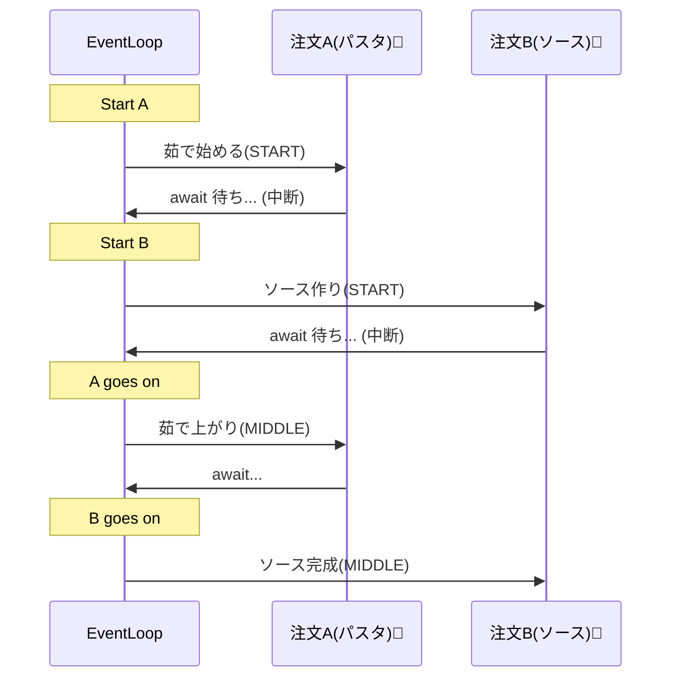

# 第05章：Nodeの非同期が観測を難しくする理由（超やさしく）⏳🧵😵‍💫➡️😊

## この章のゴール 🎯✨

* 「なんでログが混ざるの？」「なんでトレースが切れるの？」の理由を、**ふわっと図で説明**できるようになる🧠🫶
* “つながらない問題”が起きる場所を、**自分で指させる**ようになる👆🧵
* 次の章以降（境界・ポリシー・相関ID）で「何を決めるべきか」が腹落ちする💡✨

---

## 1) まず結論：Nodeは“同時進行”が当たり前だから、観測が絡まる🧶🌀


Nodeって、リクエストが来るたびに別スレッドが立つ…みたいな世界じゃなくて、**1つのイベントループの上で、たくさんの処理が交互に進む**感じなんだよね🧵🧵🧵

だから、何も工夫しないと…

* Aさんのリクエストのログ
* Bさんのリクエストのログ
* ついでに裏で動いてたタイマーのログ

が、**同じコンソールに混ざって出る**😇➡️😱

これが「観測が難しい」一番の入口だよ〜🚪✨

---

## 2) “await”があると何が起きる？（ここがミソ）🧠🧵


## ✅ 同期処理（まっすぐ一本道）🏃‍♀️💨

普通の同期関数は、だいたいこう👇
「呼んだら、終わるまで、そのまま進む」感じ。

## ✅ 非同期処理（いったん離れて、あとで戻る）🪃⏳

でも `await` が出ると…

1. いったん処理を中断して（その場で止まる）✋
2. “続き”を**あとで実行する予定**として予約して🗓️
3. その間に、別のリクエストや別の処理が進む🏃‍♂️🏃‍♀️🏃

…ってなるの！

つまり、**処理の続きが「別のタイミング」で再開**するから、ログやトレースの“文脈（誰の処理？）”が迷子になりやすい🐣💫

---

## 3) いちばんイメージしやすい“混ざる例”🍝🌀


「2人分の料理を同時に作ってるキッチン」みたいなもの👩‍🍳🍳

* Aのパスタ茹でる（待ち時間）⏳
* その間にBのソース作る🔥
* Aの茹で上がりに戻る🍝
* さらにBの盛り付け…🍽️

これをログにすると、**Aの話とBの話が交互に出る**のは自然なんだよね😂



---

## 4) ミニコードで“ログが混ざる”を体験しよ🧪😆


「同時に2リクエストが来た」つもりで、処理をわざと待たせる例だよ👇

```ts
import http from "node:http";

const sleep = (ms: number) => new Promise<void>(r => setTimeout(r, ms));

http.createServer(async (req, res) => {
  // ここでは “誰の処理か” を表す情報がない（わざと）
  console.log("START", req.url);

  await sleep(200); // ← ここで一旦中断して、別の処理が進める

  console.log("MIDDLE", req.url);

  await sleep(200);

  console.log("END", req.url);
  res.end("ok");
}).listen(3000);
```

## こういうログになりがち（例）😵‍💫🌀

* START /a
* START /b
* MIDDLE /a
* MIDDLE /b
* END /a
* END /b

混ざってるでしょ？😂
この時点ではまだURLが出てるからマシだけど、現実はもっと複雑で、**DB・外部API・ジョブ・イベント**が挟まって「誰のログ？」になりやすいの🥲

---

## 5) 「つながらない」問題の正体はコレ🔎🧵

観測（ログ/メトリクス/トレース）って、本当は **“文脈（Context）”** を持ちたいのね。

* 今の処理は誰のリクエスト？👤
* どの操作の続き？🔗
* どのSpanの子？🧵

でも Node の非同期は、実行の“続き”が飛びやすいから、**自動で文脈を持ち続けるのが難しい**。

だから Node では昔から「非同期の文脈を追跡する仕組み」が重要で、公式にも AsyncLocalStorage みたいなAPIが用意されてるよ（非同期をまたいで状態を保つためのもの）📦✨ ([Node.js][1])
（そして低レベルな async_hooks の直利用は強く推奨されてなくて、代替として AsyncLocalStorage が案内されてるよ）([Node.js][2])

---

## 6) トレースが必要になる理由（超やさしく）🧵🧭

ログは「点」🪵
トレースは「点を線でつなぐ」🧵✨

OpenTelemetry でも、Span を “Context” に入れて、子Spanを作る側へ引き継ぐ必要があるよ〜って説明してるよ📚 ([OpenTelemetry][3])

でも非同期でその Context が途切れると…

* 親子関係がつながらない😢
* 「この遅延、どの処理が原因？」が追えない😵‍💫
* ログ・メトリクス・トレースがバラバラ事件💥

になりやすいの。

---

## 7) いまどきの“現場の答え”：AsyncLocalStorage（など）で文脈を保つ🔗✨


多くのAPMや計装（OpenTelemetry含む）は、**AsyncLocalStorage を使ってトレース文脈を伝播**するのが王道になってるよ〜🧵✨
実際、OpenTelemetry の Node向けContextManager実装として async_hooks を使うパッケージも提供されてる（2026年1月時点でも更新されてるよ）📦 ([npm][4])

そして最近のNode界隈だと、AsyncLocalStorage（※Node 24より前は async_hooks 上の実装）を前提にした計測が広く行われている、という説明も公式ブログ側で触れられてるよ🧩 ([Node.js][5])

> ※ここは“仕組みの話”で、今の章では「だから混ざるんだ！」が分かればOKだよ😊🫶

---

## 8) 2026年の“最新っぽい注意点”⚠️🧯（やさしく）

非同期の追跡は便利なんだけど、裏では async_hooks などの仕組みが動くことが多くて、セキュリティや挙動の変更が入ることもあるよ〜という話が出てる（2026年1月のNode公式セキュリティリリース周り）🛡️ ([Node.js][6])

あと、2026年1月時点のリリース状況だと **Node 24 がActive LTS、Node 25 がCurrent** だよ📅✨ ([Node.js][7])
（＝“ちゃんと追従しておく”のが観測の土台にもなる、ってイメージ！）

---

## 9) ミニ演習：1リクエストの処理フローを矢印で書く🗺️🖊️✨

題材はなんでもOK！「APIが1回叩かれた」として👇みたいに書いてみてね。

例：

* 入口：HTTP受信
  → 認証
  → 業務処理
  → 外部API呼び出し（await）
  → DBっぽい処理（await）
  → レスポンス返す

## ✅ チェックポイント👀

* await がある場所に「ここで離れる🪃」って印をつける
* 並行処理（Promise.all とか）があったら「混ざる🌀」って印をつける

ここに印が多いほど、**観測は“つながる工夫”が必要**になるよ💡✨

---

## 10) AIに頼むと速いこと🤖💨（おすすめプロンプト例）

* 「この処理フローを、初心者向けに“混ざる理由”を1分で説明する文章にして」📝
* 「await/Promise.all/イベントで文脈が切れそうな場所を指摘して、チェックリスト化して」✅
* 「ログが混ざった時に“同一リクエストを追える情報”として何が必要か、候補を10個出して」🏷️✨

---

## 11) まとめ📌✨

* Nodeは非同期で処理が交互に進むから、ログが混ざるのは自然🍝🌀
* await は「いったん離れて、あとで戻る」動きなので、文脈が迷子になりやすい🪃😵‍💫
* だから観測では「文脈（Context）を保つ」仕組みが重要になり、AsyncLocalStorage や OpenTelemetry の Context につながっていくよ🔗🧵 ([Node.js][1])

---

## 次章へのつながり🚧✨

次（第6章）は、この“混ざる世界”の中で
**「どこを観測の境界にする？」**を決めていくよ🚪🧭✨
（入口・業務・外部I/O…どこで観測するとブレないか！）

必要なら、この章のミニコードを「わざと壊して混ぜるパターン集」も作るよ😆🧨

[1]: https://nodejs.org/api/async_context.html?utm_source=chatgpt.com "Asynchronous context tracking | Node.js v25.3.0 ..."
[2]: https://nodejs.org/api/async_hooks.html?utm_source=chatgpt.com "Async hooks | Node.js v25.3.0 Documentation"
[3]: https://opentelemetry.io/docs/languages/js/context/?utm_source=chatgpt.com "Context"
[4]: https://www.npmjs.com/package/%40opentelemetry/context-async-hooks?utm_source=chatgpt.com "@opentelemetry/context-async-hooks"
[5]: https://nodejs.org/en/blog/vulnerability/january-2026-dos-mitigation-async-hooks?utm_source=chatgpt.com "Mitigating Denial-of-Service Vulnerability from ..."
[6]: https://nodejs.org/en/blog/vulnerability/december-2025-security-releases?utm_source=chatgpt.com "Tuesday, January 13, 2026 Security Releases"
[7]: https://nodejs.org/en/about/previous-releases?utm_source=chatgpt.com "Node.js Releases"
