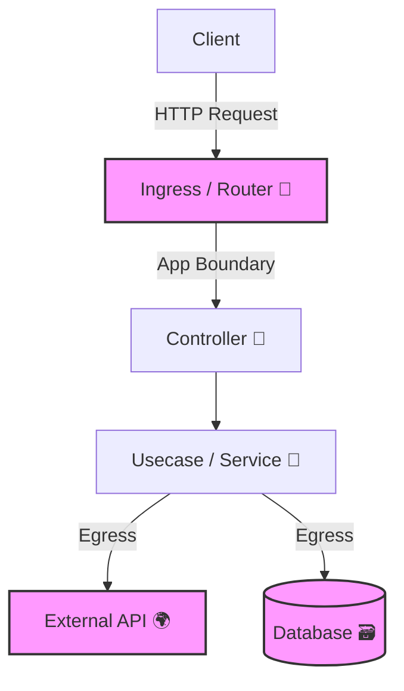

# 第06章：観測の“境界”をTS用に決める🚧✨

（＝「どこでログ/メトリクス/トレースを出す？」を“設計として”決める回だよ😊🧠）

---

## この章のゴール🎯✨

* 「観測する場所」を **勘じゃなくルール**で決められるようになる🙆‍♀️
* あとで章が進んでもブレないように、**境界（boundary）マップ**を作れる🗺️✨
* “5つだけ”計測ポイントを選び、理由を1行で言える🖐️💡

---

## 1) まず「観測の境界」ってなに？🤔🚧

ざっくり言うと…

> **コードの中で「ここから先は別世界（別の責任）」って線を引くこと**だよ✍️✨

境界を決めないとどうなるかというと…😇💥

* ログが増えすぎて読めない🪵🌪️
* 逆に必要なログがなくて詰む😵‍💫
* “遅い”の原因が外部なのか自分なのか分からない⏱️❓
* チームや将来の自分が「どこに何を書くの？」で迷子になる🧭💦

---

## 2) TS/Nodeでよくある「境界」6種類🧩✨


ここだけ覚えると一気に楽になるよ😊🌸

### A. 入口（Ingress）🌐🚪

例：HTTPリクエストが入ってきた瞬間（/work /slow /fail）

* ここで「このリクエストの旅が始まる！」って決める🧵✨
* **requestId / traceの起点**を作る定番ポイント🔗

### B. 出口（Egress）🚪🌍

例：外部I/O（fetch / DB / Redis / ファイル / 外部API）

* 遅さ・失敗の主犯になりやすい😇💥
* 「呼んだ」「返ってきた」「どれくらい」「失敗理由」みたいに測りやすい📏⏱️

### C. アプリ境界（App Boundary）🧱

例：ルーティング、ミドルウェア、コントローラ入口

* “共通処理”を置けるから、観測を **散らかさない**ために超重要🧹✨

### D. 業務境界（Domain/Usecase）💼✨

例：「注文を確定する」「ユーザー登録する」みたいな“目的の単位”

* “ユーザー価値の単位”で観測すると、調査がめっちゃ速い💨
* ログ/トレース名が分かりやすくなる😊

### E. エラー境界（Error Boundary）🧯⚠️

例：例外を「まとめて」捕まえる場所（グローバルハンドラ）

* ここを決めないと、例外が散乱して原因不明になりがち😵‍💫
* “ここで必ず整形して記録する”ができる✨

### F. （任意）フロント境界（UI Boundary）🪟✨

例：クリック→API呼び出し→結果表示

* うまく繋がると「ユーザー操作からの旅」が見える🌐🔗
* ただし今回は任意でOK🙆‍♀️（後の章で強くなる）

---

## 3) 境界を決める“超かんたん判定”✅✨

迷ったらこの5問でOKだよ😊💡

1. **外部I/O？**（DB/HTTP/ファイル）→ だいたい境界！🚪🌍
2. **失敗しやすい？** → 境界候補！🧯
3. **遅くなりやすい？** → 境界候補！⏱️
4. **「目的の単位」を説明できる？**（登録/購入/検索）→ 業務境界！💼
5. **共通処理にできる？**（全リクエスト共通）→ アプリ境界！🧱

---

## 4) まずは“地図”を描こう🗺️✨（境界マップ）

題材（Node API中心）だと、こんな感じが王道だよ👇😊



この“線”が引けたら、観測設計が一気に整理できるよ🧹✨

---

## 5) ミニ演習：計測ポイントを「5つだけ」選ぶ

🖐️✨

**ルール：最初は欲張らない！**（5つがちょうどいい😌🌸）

おすすめの“最強スターター5点”はこれ👇

1. **Ingress開始**：リクエスト受信（開始ログ/開始トレース）🌐🚪
2. **Ingress終了**：レスポンス返却（ステータス/所要時間）🏁⏱️
3. **Usecase開始**：業務が始まった（何をするかが分かる）💼✨
4. **Egress（外部I/O）**：外部呼び出し（時間・結果・失敗）🚪🌍
5. **Error境界**：例外を捕まえる（分類して記録）🧯⚠️

> これだけで「遅い？どこ？」「失敗した？なぜ？」の入口が揃うよ😊✨

---

## 6) requestId（相関ID）を“境界で”作る🔗✨


ログを繋ぐには、**同じIDを同じリクエスト中ずっと持つ**のが基本だよ😊
Nodeでは `AsyncLocalStorage` を使うパターンが定番として紹介されてるよ（request context を保つ）🔗🧵 ([GitHub][1])


### 超ミニ例：AsyncLocalStorageで requestId を配る🪄✨

（Express想定だけど、考え方は他フレームワークでも同じ😊）

```ts
import { AsyncLocalStorage } from "node:async_hooks";
import { randomUUID } from "node:crypto";
import type { Request, Response, NextFunction } from "express";

type RequestContext = { requestId: string };

export const als = new AsyncLocalStorage<RequestContext>();

export function withRequestContext(req: Request, res: Response, next: NextFunction) {
  const requestId = (req.header("x-request-id") ?? randomUUID()).toString();

  als.run({ requestId }, () => {
    res.setHeader("x-request-id", requestId); // クライアントにも返すと便利✨
    next();
  });
}

export function getRequestId(): string | undefined {
  return als.getStore()?.requestId;
}
```

これを **Ingress（ミドルウェア）** に置けば、以降どこでも `getRequestId()` で同じIDが取れるよ🔗😊

---

## 7) 「ログ/メトリクス/トレース」を境界に割り当てる🎒✨


ここは“設計の勝ちポイント”だよ😎✨
（OpenTelemetryは Node.jsでトレース/メトリクスを始める公式手順があるよ🧵📈 ([OpenTelemetry][2])）

### 境界ごとのおすすめ出し分け（最初はこれでOK）✅

* **Ingress（入口）**：

  * ログ：`start/end`、status、duration、requestId
  * メトリクス：リクエスト数、エラー数、レイテンシ
  * トレース：root span（後の章で本格導入🧵✨）

* **Egress（外部I/O）**：

  * ログ：外部先、結果、失敗理由
  * メトリクス：外部呼び出し時間、失敗率
  * トレース：外部I/O span（めちゃ効く🔥）

* **Domain（業務）**：

  * ログ：何をしようとしてるか（“目的の名前”）
  * メトリクス：成功数/失敗数（価値に近い指標）
  * トレース：usecase span（後でやる）

---

## 8) ロガーは“構造化”がラク🧱🪵✨（ちょい最新メモ）

Nodeの本番ログで **JSON構造化**がよく選ばれる流れは強いまま😊
Pinoは「ログ処理を別スレッド/別プロセス側へ寄せる」設計が推奨されてるよ🌲⚙️ ([GitHub][3])
（この章では“どこで出すか”が主役なので、細かい設定は後でOK👌）

それと、OpenTelemetryのNode向け公式ドキュメントでは、**ログ周りはまだ発展途上**という注意もあるよ📝 ([OpenTelemetry][2])
→ だから現場では「ログはPino等」「トレース/メトリクスはOpenTelemetry」みたいに分けることが多いよ😊🧩

---

## 9) AIに手伝ってもらうプロンプト例🤖✨

“境界”は設計なので、AIに「言葉を整える」役をやってもらうのが最高だよ💡😊

### ①「5つの計測ポイント」をレビューしてもらう

```text
以下の境界マップに対して、観測ポイントを5つだけ選びました。
・(1) HTTP受信
・(2) HTTP応答
・(3) Usecase開始
・(4) 外部API呼び出し
・(5) 例外ハンドラ
過不足や、より良い命名（ログのevent名案）を提案して。
初心者にも分かる理由を1行ずつ添えて。
```

### ②「なぜそこ？」を1行に圧縮してもらう

```text
観測ポイントの「なぜそこ？」を、1行で分かりやすく書き直して。
女子大生向けのやさしい口調で、絵文字多めで。
```

---

## 10) この章の成果物📦✨（ここまでできたら勝ち！）

最後に、これが揃ってたらOKだよ😊✅

* ✅ 境界マップ（Ingress/App/Domain/Egress/Error）🗺️
* ✅ 観測ポイント5つ🖐️
* ✅ 各ポイントの「理由1行」💡
* ✅ requestIdの作成場所＝Ingressで固定🔗
* ✅ “外部I/Oは境界”の方針が入った🚪🌍

---

## おまけ：2026年のNode版数の“今”だけ軽く📌

Nodeはリリースラインが複数あって、**LTSを選ぶ**のが基本の流れだよ😊
現時点だと v24 が Active LTS、v25 が Current として案内されてる（更新日も見える）よ📅✨ ([nodejs.org][4])
（セキュリティアップデートも定期で出るので、追従は大事だよ🛡️ ([nodejs.org][5])）

---

次の章（第7章）では、この章で決めた境界を前提にして、**観測ポリシーを1枚に固定**して「ブレない運用ルール」を作っていくよ📄✨
必要なら、第6章の成果物フォーマット（コピペ用テンプレ）も作るね😊🧡

[1]: https://github.com/goldbergyoni/nodebestpractices?utm_source=chatgpt.com "The Node.js best practices list (July 2024)"
[2]: https://opentelemetry.io/docs/languages/js/getting-started/nodejs/?utm_source=chatgpt.com "Node.js"
[3]: https://github.com/pinojs/pino?utm_source=chatgpt.com "pinojs/pino: 🌲 super fast, all natural json logger"
[4]: https://nodejs.org/en/about/previous-releases?utm_source=chatgpt.com "Node.js Releases"
[5]: https://nodejs.org/en/blog/vulnerability/december-2025-security-releases?utm_source=chatgpt.com "Tuesday, January 13, 2026 Security Releases"
