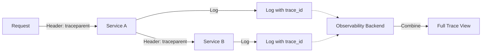

# 第07章：観測ポリシー1枚化📄✨（後でブレない！）

この章は「ログ/メトリクス/トレースを、**迷わず同じルールで**出し続けるための“校則”を1枚にまとめる」回だよ〜😺🫶
ここが決まると、後の章（ログ編・メトリクス編・トレース編）がぜんぶスムーズになる✨

---

## 7.0 この章のゴール🎯✨

* 「観測ポリシー（1枚）」を書ける📄🖊️
* **命名のゆれ**（traceId/trace_id/TraceID…）を根絶できる🧹✨
* 「入れちゃダメ」も明確にして事故を防げる🛡️🔒
* 後から誰が読んでも、**同じ調査導線**で辿れるようになる🧭🔗

---

## 7.1 なんで“1枚”が最強なの？💪📄


観測って、気づくとこうなるの…🥲

* Aさん「requestId」
* Bさん「reqId」
* Cさん「request_id」
  → 検索が地獄😇🔥

だから、**1枚に固定**して「迷ったらこれ！」にするのが勝ち✨
さらに、分散トレースをやるなら **W3C Trace Context（traceparent / tracestate）**みたいな標準があるので、そこに寄せるほど後でラクになるよ〜🔗🌍 ([W3C][1])



---

## 7.2 “1枚ポリシー”に入れる項目（最小セット）🧩✨

「盛り盛り」にしないで、まずはこれだけでOK🙆‍♀️💕

### A. 共通の考え方（3つだけ）🫶

1. **検索できる**（構造化・キー固定）🔎
2. **つながる**（同じIDをログ/メト/トレで共有）🔗
3. **安全**（秘密情報・個人情報を入れない）🔒

### B. 共通ID（これが背骨🦴）🔗

* **traceparent / tracestate**：サービス間のトレース文脈は標準ヘッダで運ぶ（W3C） ([W3C][1])
* ログ相関：ログに **TraceId / SpanId** を載せられると強い（OpenTelemetryのログモデルもここを前提にしてる） ([OpenTelemetry][2])

### C. “名前”を標準に寄せる（将来の自分が助かる）🏷️✨

OpenTelemetryのSemantic Conventions（属性名の標準）があるから、**可能なら寄せる**のがおすすめ！ ([OpenTelemetry][3])
たとえば環境名は `deployment.environment.name` が推奨（旧 `deployment.environment` は置き換え） ([OpenTelemetry][4])

---

## 7.3 コピペして埋めるだけ！観測ポリシー（1枚テンプレ）📄🫶

下のテンプレをそのまま使って、（　）を埋めてね✨

```md
## 観測ポリシー（1枚）v1.0 📄✨

## 1) 目的 🎯
- 調査の時間を減らす（「再現できない」を前提に辿れるようにする）
- Logs / Metrics / Traces の“同じ導線”を作る

## 2) まず守る3原則 🫶
- 検索できる（構造化・キー固定）
- つながる（共通IDで相関）
- 安全（秘密/個人情報を出さない）

## 3) 共通ID・伝播ルール 🔗
- サービス間の伝播は W3C Trace Context（traceparent / tracestate）を基本とする
- ログには可能なら trace_id / span_id を入れる（入れられない場合は request_id だけでも必須）

### 共通フィールド（必須）
- service.name: （例: "my-api"）
- deployment.environment.name: （例: "dev" | "staging" | "prod"）
- service.version: （例: "1.2.3"）
- request_id: （HTTP 1リクエストで一意）
- trace_id: （あれば必須）
- span_id: （あれば必須）

## 4) Logs（構造化ログ）🪵✨
### 形式
- JSON（1行）
### 必須フィールド
- timestamp, level, message
- service.name, deployment.environment.name, service.version
- request_id（+ trace_id/span_id が取れるなら入れる）
- http.method, http.route, http.status_code, duration_ms（HTTP入口ログは基本入れる）
### ルール
- message は短く、人間が読める文章
- 詳細は properties に入れる（検索しやすいキーで）
- エラー時は error.name / error.message / error.stack（stackは必要最小限）
### 禁止（絶対ダメ）🚫
- パスワード/トークン/秘密鍵/クレカ/メール本文/個人特定情報
- 生の userId をそのままログに出す（必要なら匿名化IDにする）

### ログレベル（迷ったらこれ）
- debug: 開発/検証用の詳細
- info: 通常の成功イベント（入口/出口など）
- warn: 失敗ではないが異常の予兆
- error: 失敗。原因調査に必要な情報を揃えて出す

## 5) Metrics（最低限）📈✨
- まずは RED（Rate / Errors / Duration）を揃える
- ラベルは低カーディナリティ（例: route, method, status_class）
- 禁止ラベル：userId、requestId、traceId、商品IDなど増え続けるもの

## 6) Traces（最低限）🧵✨
- HTTPサーバーspan名："{method} {route}"（routeが取れる場合）
- 重要な外部I/O（DB/HTTP/Queue）ではspanを切る
- 属性は標準名（Semantic Conventions）に寄せる

## 7) 運用 ✅
- ポリシー変更は v を上げる（v1.1, v1.2…）
- “例外ルール”を作るときは理由を1行書く
```

※ テンプレの「標準名に寄せる」は、OpenTelemetryのSemantic Conventionsが土台だよ〜📚✨ ([OpenTelemetry][3])

---

## 7.4 具体例（これくらいの粒度でOK）🧁✨

### ✅ 良いログ（1行JSONのイメージ）🪵

```json
{
  "timestamp": "2026-01-17T12:34:56.789Z",
  "level": "info",
  "message": "request completed",
  "service": { "name": "my-api", "version": "1.2.3" },
  "deployment": { "environment": { "name": "prod" } },
  "request_id": "req_01H...",
  "trace_id": "0af7651916cd43dd8448eb211c80319c",
  "span_id": "b7ad6b7169203331",
  "http": { "method": "GET", "route": "/work", "status_code": 200 },
  "duration_ms": 23,
  "properties": { "feature": "work" }
}
```

### ❌ ダメログ例😱

* `console.log("error!!")`（情報ゼロ）
* `userId=123456`（生IDは危険＆増える）
* `token=...`（一発アウト🔒）

---

## 7.5 ミニ演習（20〜30分）⏱️📝✨

### 演習1：必須フィールドを“固定”する📌

ポリシーの「必須フィールド」を **あなたの題材API** に合わせて埋めてね！
（routeの候補：`/work` `/slow` `/fail` みたいなやつ✨）

### 演習2：禁止リストを5個書く🚫✍️

「絶対にログに入れないもの」を5個。
書けたらOK！これだけで事故が激減する🛡️

### 演習3：ログレベルの例文を1つずつ作る🎚️

* debugの例
* infoの例
* warnの例
* errorの例
  → “その場で”自然に書けるようになると強い💪✨

---

## 7.6 AIで爆速に仕上げるコツ🤖⚡

そのままコピペで使えるプロンプト例だよ〜🫶

```text
次の「観測ポリシー（1枚）」を、初心者でも運用できるように短く整えて。
- 命名ゆれが起きないようにキー名を統一して
- 禁止事項（秘密情報/個人情報）を具体例つきで強化して
- Logs/Metrics/Traces が同じ導線で調査できるように、共通IDのルールを明確化して
（ここにポリシー貼る）
```

```text
このAPI（/work /slow /fail）向けに、
- 良いログ例を3つ（成功/遅延/失敗）
- ダメログ例を3つ（なぜダメかも）
を作って。ログは1行JSONで。
```

---

## 7.7 チェックリスト（提出前の最終確認✅✨）

* [ ] ログのキー名がブレない（trace_id か traceId、どっちかに統一）🧹
* [ ] request_id は必ず入る🔗
* [ ] trace_id / span_id は可能なら入る🧵（OpenTelemetryのログモデルでも重要フィールド） ([OpenTelemetry][2])
* [ ] 環境名は `deployment.environment.name` を使う（旧属性に注意）🏷️ ([OpenTelemetry][4])
* [ ] 秘密情報NGが明文化されてる🔒
* [ ] Span名・HTTP属性は標準に寄せる方針がある📚 ([OpenTelemetry][5])

---

## 7.8 “最新情報”メモ（今どうなってる？）🗞️✨

* TypeScript は npm 上の最新が **5.9.3** として公開されてるよ（現時点の安定版目安） ([npm][6])
* Node.js は **v24（Krypton）が Active LTS** として案内されてる（運用ではLTS系が基本） ([nodejs.org][7])
* OpenTelemetry JS は SDK 2.x が出ていて、Node.js向けガイドでは **ログの例がまだ整備途上** という扱いもある（だから“ポリシーで先に型を固定”が効く！） ([OpenTelemetry][8])

---

## 7.9 まとめ🎀✨

* 第7章は「観測の校則」を1枚にする回📄
* **検索できる／つながる／安全** の3原則だけは絶対に守る🫶
* 標準（W3C Trace Context / OpenTelemetry SemConv）に寄せると、将来の連携やツール変更がラク🔗✨ ([W3C][1])

次のログ編（第8章）からは、このポリシーを“前提”にして、ログの良し悪しを一気に見分けられるようにしていくよ〜🪵😺✨

[1]: https://www.w3.org/TR/trace-context/?utm_source=chatgpt.com "Trace Context"
[2]: https://opentelemetry.io/docs/specs/otel/logs/data-model/?utm_source=chatgpt.com "Logs Data Model"
[3]: https://opentelemetry.io/docs/specs/semconv/?utm_source=chatgpt.com "OpenTelemetry semantic conventions 1.39.0"
[4]: https://opentelemetry.io/docs/specs/semconv/registry/attributes/deployment/?utm_source=chatgpt.com "Deployment"
[5]: https://opentelemetry.io/docs/specs/semconv/http/http-spans/?utm_source=chatgpt.com "Semantic conventions for HTTP spans"
[6]: https://www.npmjs.com/package/typescript?activeTab=versions&utm_source=chatgpt.com "typescript"
[7]: https://nodejs.org/en/about/previous-releases?utm_source=chatgpt.com "Node.js Releases"
[8]: https://opentelemetry.io/blog/2025/otel-js-sdk-2-0/?utm_source=chatgpt.com "Announcing the OpenTelemetry JavaScript SDK 2.0"
