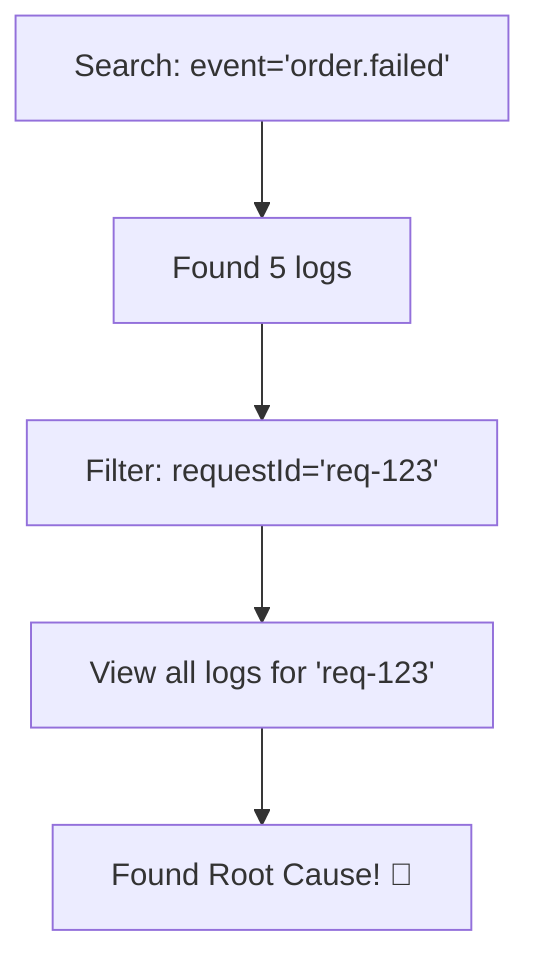

# 第08章：良いログ / ダメログ 😇😱（検索できるログ）

> この章のテーマはひとことで言うと
> **「未来の自分（or チーム）が、迷子にならないログ」**だよ〜👀🧭✨

---

## 0) まず最重要：ログは“書く”より“探す”が本番 🔎✨


障害対応や調査って、だいたいこうなるよね👇

1. **いま何が起きてる？**（ざっくり把握）
2. **どこで？**（入口？DB？外部API？）
3. **なぜ？**（原因の仮説）
4. **証拠は？**（ログで裏取り）

このときログが **検索できない**と、調査が「運ゲー」になる😱🎰
逆に検索できるログなら、**“すぐ絞れる→すぐ辿れる”** から超ラク😊✨

---

## 1) ダメログあるある 😱🪵（調査を殺すログ）


### ダメ①：気持ちログ（情報が無い）

* 「処理失敗しました」
* 「エラーです」
* 「なんかおかしい」

👉 **何が / どこで / どの入力で / どのユーザーで / どのリクエストで** が無いと詰む💥

---

### ダメ②：文章に全部埋め込む（検索しにくい）


* `User 12345 purchased item 98765 price 1200 ...`

👉 数字が埋まってると、あとで **「userId=12345」みたいに機械的に絞れない**😵‍💫

---

### ダメ③：フォーマットが毎回違う（揺れログ）

* `userId` / `user_id` / `uid` が混在
* `requestId` / `reqId` / `rid` が混在

👉 **同じ意味なのに検索が分裂**して地獄👿

---

### ダメ④：1行に全部盛り（ノイズ）

* 成功でも失敗でも同じ熱量で長文ログ
* 毎回巨大なオブジェクトを `JSON.stringify()` して出す

👉 **必要なログがノイズに埋もれる**🫠

---

### ダメ⑤：秘密や個人情報をそのまま出す（危険）

* パスワード、トークン、Cookie、認証ヘッダ
* メール、住所、カード、個人特定ID など

👉 事故ったときの被害がヤバい⚠️
（しかもログ基盤に残り続ける…😱）

---

## 2) 良いログの合言葉：**イベント + 文脈 + 結果** ✅✨


ログを「検索できる形」にするコツはこれ👇

### ✅ (A) イベント名を付ける（何が起きた？）

例：

* `order.create.started`
* `order.create.succeeded`
* `order.create.failed`
* `external.payment.request`
* `db.query.slow`

👉 これだけで **検索の入口が爆速**🚀



---

### ✅ (B) 文脈は“フィールド”で持つ（あとで絞る用）

例：

* `requestId`（相関ID）
* `trace.id` / `span.id`（トレース連携）
* `userId`（※匿名化/ハッシュ推奨）
* `orderId`
* `http.method`, `http.route`
* `duration_ms`
* `error.type`, `error.message`

**ECS でも `trace.id` はトップレベルで扱う**前提になってるよ（ネストじゃない）📌 ([Elastic][1])
OpenTelemetry 側もログとトレースを結びたいので、**trace/span のIDをログに載せる**運用を推してるよ🔗 ([OpenTelemetry][2])

---

### ✅ (C) 結果を“判定できる形”で残す（成功/失敗/遅い）

* 成功なら：`status: "ok"`
* 失敗なら：`status: "error"` + `error.*`
* 遅いなら：`duration_ms`（数値！）

👉 「遅いの何件？」みたいな集計もできる📈✨

---

## 3) “検索できるログ”の最小セット（まずはこれだけでOK）🧩✨


最初は欲張らずに、この **8点セット** だけ固定しよ👇

1. `event`（イベント名）
2. `level`（info/warn/error…）
3. `message`（人間向け一言）
4. `requestId`（ログをつなぐID）
5. `trace.id`（後でトレースと合流）
6. `service`（サービス名）
7. `env`（prod/stg/dev など）
8. `version`（ビルド/リリース識別）

> OpenTelemetry JS は Traces/Metrics は安定寄りだけど、**Logs はまだ “Development” 扱い**なので、今は「ログ自体をキレイに作る」ほうが勝ちやすいよ😊 ([OpenTelemetry][3])

---

## 4) 例で体感！ダメログ → 良いログ ✍️✨


### ケース①：外部APIが失敗した

**😱 ダメ**

* `決済に失敗しました`

**😇 良い**

* event: `payment.charge.failed`
* 追加フィールド：`requestId`, `orderId`, `provider`, `http.status_code`, `duration_ms`, `error.type`

👉 これで「どの注文が」「どの決済会社で」「何msで」「何エラーか」が一瞬で分かる🔎✨

---

### ケース②：遅い処理を見つけたい

**😱 ダメ**

* `遅いです`

**😇 良い**

* event: `db.query.slow`
* 追加フィールド：`duration_ms`（数値！） `db.operation` `db.table`（※テーブル名はOK、SQL全文は慎重に）

👉 `event=db.query.slow AND duration_ms>1000` とかで狩れる🗡️✨

---

## 5) TypeScriptの“良いログ”の形（軽く雰囲気）🌲✨

JSONログを作るなら、Node界隈だと **Pino** が定番で強いよ（JSON前提＆速い）🌲
2026-01時点でも普通に現役で、最新版リリースも動いてるよ📦✨ ([GitHub][4])

```ts
import pino from "pino";

export const logger = pino({
  level: process.env.LOG_LEVEL ?? "info",
  base: {
    service: "example-api",
    env: process.env.NODE_ENV ?? "dev",
    version: process.env.APP_VERSION ?? "dev",
  },
});

// 例：良いログ（イベント + 文脈 + 結果）
logger.info(
  {
    event: "order.create.succeeded",
    requestId: "req-123",
    "trace.id": "4bf92f3577b34da6a3ce929d0e0e4736",
    "span.id": "00f067aa0ba902b7",
    orderId: "ord-999",
    duration_ms: 42,
    status: "ok",
  },
  "order created"
);
```

> `trace.id` / `span.id` をログに入れると、後でトレースと合流できて調査が超ラク🔗 ([OpenTelemetry][2])

---

## 6) 秘密をログに出さない！“マスキング”の基本 🫣🔒✨


Pino には **redact（伏せ字）**があるよ👍
ドキュメントでも `redact` は公式に案内されてる📌 ([GitHub][5])

```ts
import pino from "pino";

export const logger = pino({
  redact: [
    "req.headers.authorization",
    "req.headers.cookie",
    "password",
    "token",
  ],
});
```

👉 認証系は **絶対にそのまま出さない**のが基本だよ⚠️✨

---

## 7) エラーログの「最低限」テンプレ 🧯💥

エラーは “後で調べる” の主役！
OpenTelemetry の例外系セマンティクスも、ログに例外属性を載せる方向だよ🧾 ([OpenTelemetry][6])

**おすすめ最低セット👇**

* `event`: `*.failed`
* `status`: `"error"`
* `error.type`
* `error.message`
* `error.stack`（長いので必要なときだけでもOK）
* `requestId`
* `trace.id` / `span.id`

---

## 8) ミニ演習：ダメログを良いログに変換しよう ✍️🌟

### お題（ダメログ）

1. `ログイン失敗`
2. `決済に失敗しました`
3. `DBが遅い`
4. `画像アップロード失敗`
5. `外部APIエラー`

### ルール

* それぞれ **event名** を付ける
* **requestId** を必ず入れる
* 「絞れるフィールド」を3つ以上追加する

---

### 解答例（ひとつだけ見せるね👀✨）

**2. 決済に失敗しました →**

* `event: "payment.charge.failed"`
* `requestId`
* `orderId`
* `provider`
* `http.status_code`
* `duration_ms`
* `error.type`, `error.message`

（残りはあなたが作ってOK！AIに添削させると爆速🤖✨）

---

## 9) AIに頼るときの“良いお願いの仕方”🤖📝✨


コピペで使えるよ👇

> 「次のログ文言を、検索しやすい構造化ログに直して。
> event名も付けて、requestId/trace.id/span.id を前提に、絞り込み用フィールドを最低3つ入れて。
> 個人情報や秘密（token/password/auth header）は絶対に出さないで。」

---

## 10) 章末チェック ✅💮（ここだけ押さえたら勝ち）

* [ ] ログは「書く」より「**探す**」が本番🔎
* [ ] **イベント名**がある（`xxx.yyy.succeeded` みたいに）🏷️
* [ ] 文脈は文章じゃなく **フィールド**で持ってる🧩
* [ ] `requestId` は必須（つなぐ）🔗
* [ ] `trace.id` / `span.id` を入れると将来めっちゃ強い🔗 ([OpenTelemetry][2])
* [ ] 秘密は `redact` などで伏せる🔒 ([GitHub][5])

---

次の第9章（構造化ログ入門🧱✨）では、いま作った「良いログの型」を、**JSONとして安定運用する設計**に落としていくよ〜😊📦✨

[1]: https://www.elastic.co/docs/reference/ecs/ecs-tracing?utm_source=chatgpt.com "Elastic Common Schema (ECS) - Tracing fields"
[2]: https://opentelemetry.io/docs/specs/otel/logs/?utm_source=chatgpt.com "OpenTelemetry Logging"
[3]: https://opentelemetry.io/docs/languages/js/?utm_source=chatgpt.com "JavaScript"
[4]: https://github.com/pinojs/pino/releases?utm_source=chatgpt.com "Releases · pinojs/pino"
[5]: https://github.com/pinojs/pino/blob/main/docs/redaction.md?utm_source=chatgpt.com "pino/docs/redaction.md at main · pinojs/pino"
[6]: https://opentelemetry.io/docs/specs/semconv/exceptions/exceptions-logs/?utm_source=chatgpt.com "Semantic conventions for exceptions in logs"
