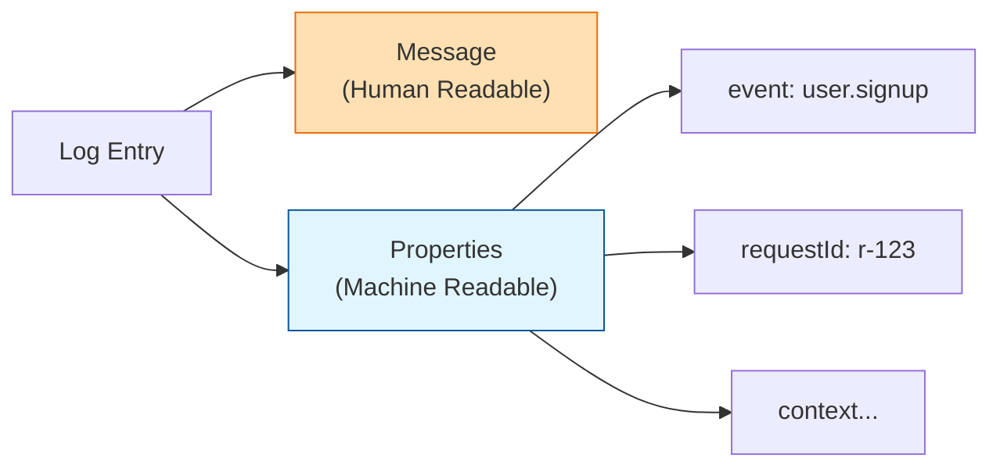

# 第09章：構造化ログ入門 🧱✨

（JSONの考え方：**「あとで絞り込めるログ」**にするよ！🔍）

---

## 0. この章でできるようになること 🎯✨

この章を終えると…👇

* **「構造化ログって何？」**を一言で説明できる 🗣️✨
* 文字列ログを **JSONログに変換**できる 🧱➡️🧱
* ログに入れる **キー（項目）をブレないように固定**できる 🏷️📌
* **PowerShellで絞り込み**できる（地味に超大事）💻🔎
* **秘密情報が漏れない**ログの出し方がわかる 🕵️‍♀️🛡️

---

## 1. 構造化ログってなに？🧩✨


### ふつうのログ（つらい…）😵‍💫

* 文章だけだと、後から「検索しにくい」「機械で集計しにくい」
* 表記ゆれで死ぬ（例：`userId` / `user_id` / `userid`）💀

### 構造化ログ（うれしい！）😇✨

**1行がJSON**になっていて、機械が読みやすいログのこと！
あとで **「eventがこれ」「requestIdがこれ」**って条件でスパッと絞れる🔍✨



> いまのNode界隈でも、JSONの構造化ログは“観測パイプライン”に乗せやすい基本形だよ〜🌲✨ ([GitHub][1])

---

## 2. いちばん大事な考え方 🧠💡

### 「message + properties」方式にする 🧱✨

構造化ログの基本はこれ👇

* `message`：人間が読む短文 🧑‍💻💬（1行で状況がわかる）
* `properties`：機械が絞るためのキーと値 🏷️🔍（JSONの中身）

たとえば…

* message: `"signup failed"`
* properties: `{ event:"user.signup", reason:"email_taken", requestId:"..." }`

**人間が理解しやすい + 機械が集計しやすい**の両取りだよ🥳✨

---

## 3. JSONログの形はこうする 🧾✨

### 1行1JSONが最強 ✅

ログは基本 **NDJSON（改行区切りJSON）**が扱いやすいよ！
（ログ基盤やツールがだいたいこの形で喜ぶ😊）

例👇（1行が1イベント）

```json
{"time":"2026-01-17T12:00:00.000Z","level":"info","event":"user.signup","requestId":"r-123","msg":"signup started"}
{"time":"2026-01-17T12:00:00.120Z","level":"warn","event":"user.signup","requestId":"r-123","reason":"email_taken","msg":"signup failed"}
```

---

## 4. まず固定する 最小必須フィールド 🏷️📌

「まずこれだけは毎回入れる」っていうセットを決めると、後で楽！🥹✨

| フィールド       | 目的       | 例                   |
| ----------- | -------- | ------------------- |
| `time`      | いつ起きた？   | `"2026-01-17T..."`  |
| `level`     | 重要度      | `"info"` / `"warn"` |
| `event`     | 何が起きた？   | `"user.signup"`     |
| `msg`       | 人間向け説明   | `"signup failed"`   |
| `service`   | どのサービス？  | `"toy-api"`         |
| `env`       | 環境       | `"dev"` / `"prod"`  |
| `version`   | リリース識別   | `"1.3.0"`           |
| `requestId` | 1リクエスト追跡 | `"r-..."`           |

ポイントは **eventを必ず入れる**こと！
「msgで検索」より「eventで検索」の方が圧倒的に強いよ💪🔥

---

## 5. ライブラリは何を使う？🌲🧰

### まずは Pino 推し 🥇✨

Pinoは **JSONがデフォルト**で、ログのオーバーヘッドを小さくしやすい設計だよ🌲 ([GitHub][1])
（あとから基盤に流すときも相性良い👍）

Winstonも定番で柔軟なんだけど、まずは「JSONが自然に出る」方が学習がスムーズ😊
（Winstonを選ぶなら“出力先が多彩に必要”な時に強いイメージ） ([Better Stack][2])

---

## 6. 実装してみよう TypeScript + Pino 🧪✨

### 6.1 インストール 📦

```bash
npm i pino
npm i -D pino-pretty
```

### 6.2 loggerを1ファイルにまとめる 🧱

`src/log.ts`

```ts
import pino from "pino";

export const logger = pino({
  level: process.env.LOG_LEVEL ?? "info",

  // 毎回共通で付けたい情報（ブレ防止✨）
  base: {
    service: "toy-api",
    env: process.env.NODE_ENV ?? "development",
    version: process.env.APP_VERSION ?? "dev",
  },

  // 秘密情報はログに残さない（超重要🛡️）
  redact: {
    paths: [
      "req.headers.authorization",
      "req.headers.cookie",
      "*.password",
      "*.token",
    ],
    remove: true,
  },
});
```

Pinoの`redact`は「特定キーをマスク/除去」できる機能だよ🛡️✨（`remove: true`でキーごと消せる） ([GitHub][3])

### 6.3 使う側はこう ✍️

```ts
import { logger } from "./log";

logger.info(
  { event: "user.signup", requestId: "r-123", emailDomain: "example.com" },
  "signup started"
);

logger.warn(
  { event: "user.signup", requestId: "r-123", reason: "email_taken" },
  "signup failed"
);
```

✅ **msgは短く**
✅ **絞り込みは event / reason / requestId でやる**
この形がいちばん気持ちいいよ😊✨

---

## 7. エラーは 文字列じゃなくて 構造として出す 💥🧯

エラーを`msg`にベタ貼りすると、後で集計できなくて困る😢

Pinoはエラー用の標準シリアライザが用意されてて、`err`として渡すのが定番だよ🧯✨ ([npm][4])

```ts
try {
  throw new Error("DB timeout");
} catch (err) {
  logger.error(
    { event: "db.query", requestId: "r-123", err },
    "db query failed"
  );
}
```

---

## 8. ローカルでは見やすくしたい 👀✨

開発中にJSONがつらいときは **pino-pretty** を使うと幸せ😊

```bash
node dist/server.js | npx pino-pretty
```

本番は **基本JSONのまま**でOK！（“加工は外で”が強い）

---

## 9. Windowsでログを絞り込む PowerShell編 🔎💻

ログがNDJSON（1行1JSON）なら、PowerShellでこうできるよ✨

### 9.1 eventで絞る 🏷️

```powershell
Get-Content .\app.log |
  ForEach-Object { $_ | ConvertFrom-Json } |
  Where-Object { $_.event -eq "user.signup" } |
  Select-Object time, level, requestId, msg, reason
```

### 9.2 requestIdで追跡 🔗

```powershell
Get-Content .\app.log |
  Select-String '"requestId":"r-123"'
```

---

## 10. ありがち事故あるある 😱⚠️

### やっちゃダメ ❌

* `msg`に情報を詰め込みすぎ（機械が拾えない）📦💥
* キー名が毎回違う（`userId`/`user_id`地獄）🌀
* **トークン/パスワード/Cookie**をログに出す（漏れたら終わり）🧨
* 巨大オブジェクトを丸ごと出す（ログ代が爆増💸）

### やると最高 ✅

* `event`を必須にする 🏷️
* `requestId`を必須にする 🔗
* 「最小必須セット」を守る 📌
* 秘密は`redact`で除去 🛡️ ([GitHub][3])

---

## 11. ミニ演習 🎒✨

### 演習A：必須フィールドを決めよう 🏷️📝

あなたの題材APIで、最低限これを決めてね👇

* `event`の命名ルール（例：`domain.action`）
* `requestId`の形式（例：`r-<random>`）
* `service/env/version`の埋め方

### 演習B：ダメログをJSONに変換 ✍️➡️🧱

ダメ例😢

* `"user signup failed: email already exists"`

良い例😊

* `{ event:"user.signup", reason:"email_taken", requestId:"...", ... } + msg`

### 演習C：PowerShellで3条件フィルタ 🔍✨

* `event = user.signup`
* `level = warn以上`
* `reason = email_taken`

---

## 12. AIの使いどころ 🤖✨

（そのままコピペでOK系！）

* **ログスキーマ表を作る**
  「このAPIに必要な構造化ログのキー一覧を、必須/任意に分けて表にして。命名は統一して、event例も3つ出して」

* **msgを短く整える**
  「このログmsgを“人間が一瞬で理解できる短文”に整えて。10案」

* **redact候補を洗い出す**
  「このアプリでログに出しちゃダメな項目を列挙して、redact paths例も作って」

---

## 13. 今どきメモ 2026アップデート感 🆕✨

* Nodeは最近 **TypeScriptをそのまま実行**できる流れが強くて、v22.18.0以降は“消せる型”だけなら追加フラグなしで動くよ（学習が楽になるやつ！） ([nodejs.org][5])
* OpenTelemetry JavaScriptは、**Traces/MetricsはStable**だけど **LogsはDevelopment**扱いなので、ログはまず“JSONで整える”が堅実だよ🧵📈🪵 ([OpenTelemetry][6])

---

## 14. 章末チェック ✅✨

次の質問にサクッと答えられたら勝ち！🥳

1. 構造化ログの「message + properties」って何？🧱
2. `event`を必須にする理由は？🏷️
3. `requestId`があると何が嬉しい？🔗
4. 秘密情報を守る仕組みは？🛡️

---

## 次章の予告 🎚️✨

次は **ログレベル運用**！
「debug/info/warn/errorをどう分けると、本番が静かで、でも困らないの？」っていう **運用のセンス**を作っていくよ〜😊🎛️

[1]: https://github.com/pinojs/pino?utm_source=chatgpt.com "pinojs/pino: 🌲 super fast, all natural json logger"
[2]: https://betterstack.com/community/guides/logging/how-to-install-setup-and-use-winston-and-morgan-to-log-node-js-applications/?utm_source=chatgpt.com "A Complete Guide to Winston Logging in Node.js"
[3]: https://github.com/pinojs/pino/blob/main/docs/redaction.md?utm_source=chatgpt.com "pino/docs/redaction.md at main · pinojs/pino"
[4]: https://www.npmjs.com/package/pino-std-serializers?utm_source=chatgpt.com "pino-std-serializers"
[5]: https://nodejs.org/en/learn/typescript/run-natively?utm_source=chatgpt.com "Running TypeScript Natively"
[6]: https://opentelemetry.io/docs/languages/js/?utm_source=chatgpt.com "JavaScript"
