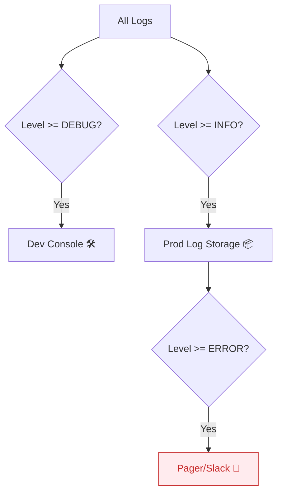

# 第10章：ログレベル運用🎚️（本番をうるさくしない）

（debug / info / warn / error をどう使い分ける？🤔）

---

## 0. この章でできるようになること 🎯✨

この章を終えると…👇

* **「このログは info？ debug？」**で迷わなくなる 😌
* **本番環境のログ量**を適切にコントロールできる 🎛️
* **「警告（warn）」と「エラー（error）」**の境界線がハッキリする 🚧
* 開発中は詳しく、本番は静かに、の切り替えができる 🔄

---

## 1. ログレベルって何のためにあるの？🤔

ズバリ、**「読む人と目的」**を分けるためだよ！👀✨

* **開発者（Debug）**：バグ調査のために、変数の予期せぬ値まで見たい 🐛
* **運用者（Info/Warn）**：「正常に動いてるかな？」「何か予兆はないかな？」を知りたい 🚦
* **緊急対応マン（Error）**：「今すぐ起きろ！！直せ！！」を知りたい 🚨

全部 `console.log` だと、本番でスパムログに埋もれて**本当にヤバいエラー**を見逃しちゃうよね😱💥

---

## 2. 定番の4段階レベル（Node/Pino推奨）🎚️✨


Pino や一般的なロガーで使われる標準的なレベルはこの4つ！
（Trace や Fatal もあるけど、まずはこの4つで十分だよ😊）

| レベル | 意味 | 出す頻度（目安） | アクション（見た時） |
| :--- | :--- | :--- | :--- |
| **DEBUG** | 開発・デバッグ用詳細 | めっちゃ出る | ふーん（調査時以外は見ない） |
| **INFO** | 正常動作の証跡 | 1リクエスト数行 | 順調だな😊 |
| **WARN** | **異常だが継続可能** | たまに出る | おっと？（要チェック・改善検討） |
| **ERROR** | **処理失敗・継続不可** | 出ちゃダメ | **起きて！！対応して！！** 🚨 |



---

## 3. レベル別「出すログ」の具体例 📝

「迷ったらこうする」の基準を持っておこう！🏃‍♀️💨

### ✅ DEBUG (development only)
本番では基本オフにするやつ🔕

* `Function X called with args: {...}`（入り口）
* `User state updated: before={...}, after={...}`（変化）
* SQLのクエリ全文（機密情報に注意しつつ）

### ✅ INFO (Production OK)
「何が起きたか」のあらすじ📖

* `Server listening on port 3000` 🚀
* `Request completed: 200 OK (150ms)` ✅
* `Batch job started / finished` ⚙️
* `User logged in: userId=u-123` 🔑

### ✅ WARN (Attention)
「失敗したけど、リトライした」「変だけど、落ちてはいない」やつ🤔

* `DB connection slow (500ms), retrying...` 🐢
* `Input validation failed (400 Bad Request)` ✋
  * （400系はクライアントのミスなので、サーバーのエラーではない＝WARNが妥当）
* `Deprecated API usage detected` ⚠️

### ✅ ERROR (Action Required)
「誰かが対応しないといけない」やつ🚑

* `DB connection failed (Timeout)` 💥
* `Unhandled Exception` 🧨
* `Payment Gateway rejected unexpectedly (500)` 💸
* 「注文確定処理が途中で止まった」など、データの整合性が危ない時

---

## 4. 運用ルールの鉄則 📜🔒

### 鉄則①：本番は `INFO` 以上にする 🚀
`DEBUG` を本番で出すと、ログ代（SaaS料金）が爆発するし、I/O負荷でアプリが遅くなるよ💸🐢
環境変数 `LOG_LEVEL=info` で制御できるように実装しよう！

### 鉄則②：`ERROR` は「深夜に電話していい時」だけ ☎️
「ユーザーの入力ミス（400）」で `ERROR` を出してると、アラートが鳴りすぎて**オオカミ少年**になるよ🐺💦
「システム側の不具合」だけを `ERROR` にしよう！

### 鉄則③：`WARN` は「0件を目指す」 🧹
`WARN` は無視されがちだけど、「いつかエラーになる予兆」や「ユーザー体験の低下」が含まれてるよ。
定期的に見直して、原因を潰すか、INFO/DEBUGに降格させよう📉

---

## 5. 実装例：環境変数で切り替える 💻🎛️

Pino ならこう書くだけでOK！🌲✨

```ts
import pino from "pino";

const logger = pino({
  // 環境変数 LOG_LEVEL がなければ 'info' をデフォルトに
  level: process.env.LOG_LEVEL || "info", 
  
  // その他の設定（前章参照）
  base: { service: "toy-api" },
});

// 使うとき
logger.debug("これは開発中しか出ないよ");
logger.info("これは本番でも出るよ");
```

**実行するとき：**

```bash
# 開発時（全部見たい）
export LOG_LEVEL=debug
node dist/index.js

# 本番時（静かにしたい）
export LOG_LEVEL=info
node dist/index.js
```

これでコードを書き換えずに運用を変えられるね！👏✨

---

## 6. クイズ：どっちのレベル？ 🕵️‍♀️

直感で選んでみて！

1. **「ユーザーがパスワードを間違えた」** 👉 ( INFO / WARN / ERROR ) ?
   * 答え：**WARN**（またはINFO）。攻撃の予兆かもしれないけど、システムのエラーではないからERRORではないよ🙅‍♀️

2. **「DBに接続できなくて起動しない」** 👉 ( WARN / ERROR ) ?
   * 答え：**ERROR**（FATAL）。サービスが提供できない緊急事態！🚨

3. **「APIレスポンスが 0.01秒 遅かった」** 👉 ( INFO / DEBUG ) ?
   * 答え：**DEBUG**（またはメトリクス）。個々の微細な遅延をINFOで出すとログが溢れるよ🌊

---

## まとめ 📝

* ログレベルは**「運用者へのメッセージ」** 💌
* 本番は **INFO以上** にして、お財布とパフォーマンスを守る 🛡️
* **ERROR** は「対応が必要な時」だけにする（オオカミ少年防止） 🐺
* **WARN** は「未来のエラー」かも。定期的に掃除しよう 🧹

次は **エラー設計**！
「例外（Error）をどう投げて、どう拾うか？」のルールを決めていくよ～🧯💥
