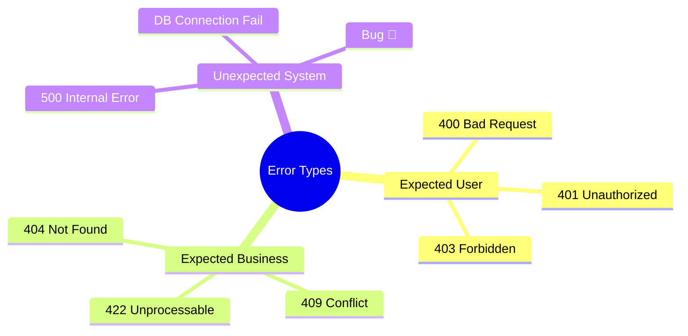

# 第11章：エラー設計の入口🧯💥（例外を暴れさせない）

この章は「ログ編」のど真ん中だよ🪵✨
ここでやりたいのは、**例外（throw）が“現場で役に立つ形”で流れるように整えること**💪🥺
「エラーが起きた！」で終わらせず、**原因に近づけるログ**へつなげようね🔎🧠✨

---

## 1) 今日のゴール🎯✨

できるようになったら勝ち〜！🏆💕

* 「このエラーは想定内？想定外？」を分けて考えられる😇😱
* 例外を**境界（HTTPの入口など）で回収**して、ログが散らからない🧹✨
* エラーに **code / status / cause** を持たせて、あとで追える🔗
* “見せていい情報”と“隠すべき情報”を分けられる🙈🔐

---

## 2) まずは超重要：エラーは「設計」だよ🧩✨

例外って、放っておくとこうなりがち👇😵‍💫

* どこで起きたかわからない（ログが足りない）
* あちこちでログ出しすぎて、同じエラーが10回出る😇💥
* `throw new Error(err as any)` とかで、**原因（元のエラー）が消える**🫥
* 本番でユーザーに「stack trace」が見える（最悪）😱🔥

なので方針はこれだけ覚えてね👇💡✨

✅ **投げる場所は“近いところ”**（原因がわかる場所）
✅ **ログる場所は“境界”**（HTTPの出口・キュー処理の入口/出口など）
✅ **再throwは cause でつなぐ**（原因を持ち運ぶ）

いまの JavaScript/Node だと `Error` に `cause` を持てるのが標準になってるよ（原因チェーン用）🔗✨ ([MDN Web Docs][1])

---

## 3) エラーを3種類に分けるだけで、人生ラクになる🧠✨


ここ、超シンプルにいこう〜！🌸

## A. 想定内（ユーザー原因）😌📝

例：入力が足りない、形式が違う、権限がない
👉 **400 / 401 / 403** あたりにしやすい

## B. 想定内（ビジネス的に起こりうる）🧾✨

例：在庫なし、期限切れ、状態が合わない
👉 **409 / 422** みたいな “仕様の失敗”

## C. 想定外（バグ・事故・外部障害）😱⚡

例：DB落ちた、コードのバグ、未考慮の例外
👉 基本 **500**（中身はログで追う）



💡ポイント：
**「想定内」はユーザー向けメッセージが必要**、**「想定外」は安全な固定文言**が基本だよ🙈🔐

---

## 4) “境界で拾う”ってどういうこと？🚧✨

たとえば HTTP API なら、処理の流れはざっくりこう👇

リクエスト🌐 → ルート処理 → サービス層 → 外部I/O（DB/HTTP） → レスポンス📦

このとき：

* **サービス層/外部I/O付近**：原因がわかるので、必要なら `throw`（ただしログは我慢）😤
* **HTTPの出口（エラーハンドラ）**：ここでまとめてログ＆レスポンス整形🎁✨

Express なら、エラーは `next(err)` で後ろのエラーハンドラに渡すのが基本だよ🧯 ([expressjs.com][2])
さらに、**エラーハンドリング用ミドルウェアは引数が4つ**（`(err, req, res, next)`）って決まりがあるよ📌 ([expressjs.com][3])

---

## 5) 最小で強い「アプリ用エラー型」を作ろう🧱✨

ここでの狙いは👇

* HTTP ステータスに変換しやすい
* エラーコードで分類できる
* `cause` で原因を持ち運べる
* ログに出して良い情報をコントロールできる

TypeScript 側も `ErrorOptions` として `cause?: unknown` が定義されてるので、型的にも扱いやすいよ🧷✨ ([GitHub][4])

```ts
// src/errors.ts
export type AppErrorCode =
  | "VALIDATION_FAILED"
  | "UNAUTHORIZED"
  | "FORBIDDEN"
  | "NOT_FOUND"
  | "CONFLICT"
  | "UPSTREAM_FAILED"
  | "INTERNAL";

export class AppError extends Error {
  public readonly code: AppErrorCode;
  public readonly status: number;
  public readonly isOperational: boolean; // 想定内かどうか
  public readonly safeMessage: string;    // ユーザーに返してOKな文言
  public readonly details?: Record<string, unknown>;

  constructor(args: {
    code: AppErrorCode;
    status: number;
    message: string;          // 開発者向け（ログ向け）
    safeMessage: string;      // ユーザー向け（安全）
    isOperational: boolean;
    cause?: unknown;
    details?: Record<string, unknown>;
  }) {
    super(args.message, { cause: args.cause }); // causeで“元の原因”を保持✨
    this.name = "AppError";
    this.code = args.code;
    this.status = args.status;
    this.isOperational = args.isOperational;
    this.safeMessage = args.safeMessage;
    this.details = args.details;
  }
}

// 便利関数：想定内エラーをサクッと作る💡
export const badRequest = (safeMessage: string, details?: Record<string, unknown>) =>
  new AppError({
    code: "VALIDATION_FAILED",
    status: 400,
    message: `Validation failed: ${safeMessage}`,
    safeMessage,
    isOperational: true,
    details,
  });
```

🧡ここがえらいポイント：
`super(message, { cause })` の形で **原因が繋がる**よ🔗✨ ([MDN Web Docs][1])

---

## 6) “causeで包む”練習をしよう🔗✨（原因を消さない）

外部API呼び出しに失敗した時の例ね👇

```ts
// src/upstream.ts
import { AppError } from "./errors";

export async function fetchProfile(userId: string) {
  try {
    const res = await fetch(`https://example.com/users/${userId}`);
    if (!res.ok) {
      throw new Error(`Upstream responded ${res.status}`);
    }
    return await res.json();
  } catch (cause) {
    // ✅ “上流の失敗”として包み直す（原因は cause に残す）
    throw new AppError({
      code: "UPSTREAM_FAILED",
      status: 502,
      message: "Failed to fetch profile from upstream",
      safeMessage: "サーバー側で一時的な問題が起きました🙏 もう一度試してね。",
      isOperational: true,
      cause,
      details: { userIdHint: userId.slice(0, 3) + "***" }, // 生IDを避ける例🙈
    });
  }
}
```

`cause` は「元のエラーが何だったか」を残すための仕組みだよ🧠🔗 ([MDN Web Docs][1])

---

## 7) ログはどこで出す？答え：基本“境界だけ”🧹✨

よくある事故👇😇💥

* サービス層で `logger.error(...)`
* ルートでも `logger.error(...)`
* エラーハンドラでも `logger.error(...)`

→ **同じエラーが3回出る**（調査が逆にしんどい）🫠

なのでルールはこれ💡

✅ **throw する場所：原因に近いところ（でもログは我慢）**
✅ **logger する場所：境界（HTTPの最後のエラーハンドラ）**

Express の例（エラーハンドラでまとめて処理）👇

```ts
// src/errorHandler.ts
import type { Request, Response, NextFunction } from "express";
import { AppError } from "./errors";

function serializeError(err: unknown) {
  if (err instanceof Error) {
    return {
      type: err.name,
      message: err.message,
      stack: err.stack,
      cause: (err as any).cause, // まずはそのまま（後で整形してOK）
    };
  }
  return { type: "UnknownThrown", value: err };
}

export function errorHandler(err: unknown, req: Request, res: Response, _next: NextFunction) {
  const isAppError = err instanceof AppError;

  const status = isAppError ? err.status : 500;
  const safeMessage = isAppError ? err.safeMessage : "サーバーで問題が起きました🙏";

  // ✅ ここで1回だけログる（構造化ログ）
  console.error(JSON.stringify({
    level: status >= 500 ? "error" : "warn",
    msg: "request failed",
    status,
    method: req.method,
    path: req.path,
    // requestId/traceId は第14章以降で合流できるよ🔗✨
    err: serializeError(err),
  }));

  res.status(status).json({ message: safeMessage });
}
```

---

## 8) 例外ログのテンプレ項目🧾✨（この章のミニ演習ここ！）

「困った時に欲しい情報」だけを“固定セット”にしよ〜📌😊

## ✅ 最小セット（まずこれでOK）🧡

* `level`（error/warn）
* `msg`（短い定型文）
* `status`（HTTPなら）
* `method`, `path`
* `err.type`, `err.message`, `err.stack`
* `err.cause`（あるなら）

## ✅ 余裕が出たら（でも載せすぎ注意）⚠️

* `userId`（**生IDは避ける**：短縮/ハッシュ/別キー）🙈
* `operation`（何の処理か）
* `paramsHint`（個人情報を除いたヒント）

💡`cause` 付きのエラーは、ロガー側で “いい感じに” 連結してくれる仕組みもあるよ（例：Pino の標準シリアライザ）🪵✨ ([GitHub][5])

---

## 9) “AIに頼むと速い”コーナー🤖✨（コピペでOK）

## ① 例外ログテンプレの抜け漏れチェック🔍

「下のログ項目で、障害調査に足りないものがあったら追加案を出して。個人情報は載せない前提で！」

* level, msg, status, method, path, err(type/message/stack/cause)

## ② エラー分類の練習（想定内/外）🎭

「このAPI仕様の失敗ケースを、想定内（ユーザー起因/業務起因）と想定外に分類して、HTTP status と error code を提案して」

## ③ safeMessage を自然な日本語に整える📝✨

「この safeMessage を、短くて優しくて不安にさせない言い方に直して。絵文字は控えめでOK」

---

## 10) よくある地雷🔥（ここだけは避けて〜！）

* `throw "error"` みたいに **文字列をthrow**（型も情報も壊れる）😱
* `catch (e) { throw new Error("X: " + e) }` で **原因を潰す**🫥
  → `cause` で包もうね🔗 ([MDN Web Docs][1])
* 想定内エラーなのに 500 にしちゃう（ユーザーが悪者になる）🥺
* safeMessage に内部情報（SQL/URL/キー）を入れる（漏洩）🔐💦

---

## ミニ演習🎯（15〜25分）⏳✨

1. 自分のAPI題材で「想定内エラー」3つ書く📝
2. それぞれに `code / status / safeMessage` を決める🏷️
3. 1つだけ `cause` で包む例を作る（外部I/O失敗とか）🔗
4. エラーハンドラで **ログが1回しか出ない**ことを確認✅

---

## まとめ🌸✨

この章の合言葉はこれ〜！📣💕

* **投げるのは近く、ログるのは境界で1回だけ**🧯
* **cause で原因をつなぐ**🔗 ([MDN Web Docs][1])
* **safeMessage と内部messageを分ける**🙈🔐
* **エラー分類（想定内/外）を決めるだけで運用がラク**😊

次の第12章では、さらに「unhandled系の事故」を防ぐ話に進むよ⚠️🧨（Promiseの取りこぼし対策）✨

[1]: https://developer.mozilla.org/en-US/docs/Web/JavaScript/Reference/Global_Objects/Error/cause?utm_source=chatgpt.com "Error: cause - JavaScript - MDN Web Docs"
[2]: https://expressjs.com/en/advanced/best-practice-performance.html?utm_source=chatgpt.com "Performance Best Practices Using Express in Production"
[3]: https://expressjs.com/en/guide/using-middleware.html?utm_source=chatgpt.com "Using middleware"
[4]: https://github.com/microsoft/TypeScript/blob/main/src/lib/es2022.error.d.ts?utm_source=chatgpt.com "TypeScript/src/lib/es2022.error.d.ts at main"
[5]: https://github.com/pinojs/pino-std-serializers/blob/master/Readme.md?utm_source=chatgpt.com "Readme.md - pinojs/pino-std-serializers"
