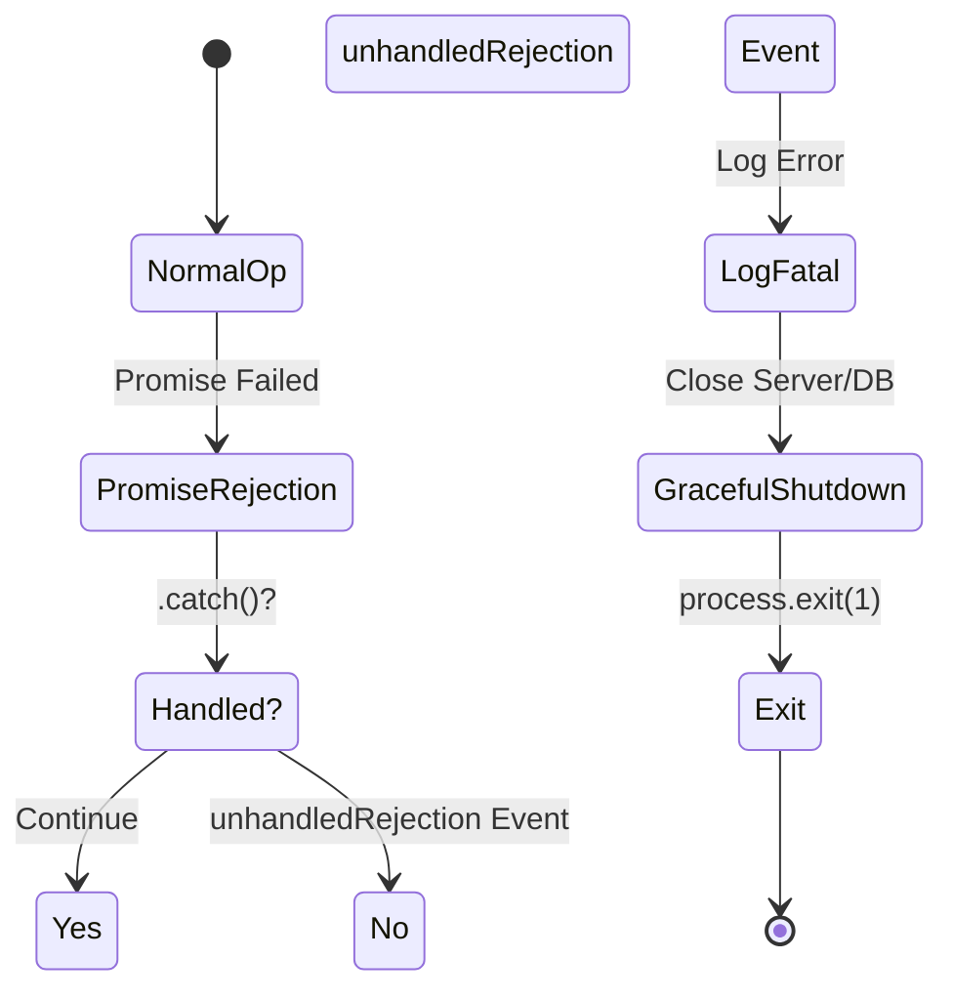

# 第12章：unhandled系の事故を防ぐ⚠️🧨（TS/Nodeの定番トラブルを減らす）

## この章のゴール🎯✨

* 「**unhandledRejection** と **uncaughtException** の違い」をやさしく説明できる🧠💡
* “取りこぼし”を減らるための **書き方の型** が身につく✍️✅
* 最後の砦として **プロセス全体の安全ネット** を作れる🕸️🛡️

---

## 1) そもそも「unhandled系」って何が起きてるの？😵‍💫


Nodeには、大きく2種類の“事故”があるよ💥

* **unhandledRejection**：Promiseが失敗（reject）したのに、誰も `.catch()` も `try/catch` もしてない🙈
* **uncaughtException**：例外が投げられたのに、どこにも捕まらずに最上流まで来ちゃった🙀

で、ここが超重要👇
いまのNodeは **unhandledRejectionを放置すると、最終的に uncaughtException 扱いになって落ちる** ことがあるよ⚠️（挙動は `--unhandled-rejections` で変えられる）([nodejs.org][1])

---

## 2) 2026年1月時点の「Nodeの最新前提」だけ押さえよう🧷✨


* 2026年1月時点だと、**Node v24 が Active LTS**、v25 は Current（最新版系列）だよ📌([nodejs.org][2])
* `--unhandled-rejections` の **デフォルトは `throw`**（v15でデフォルトが warning から変更された）だよ⚙️([nodejs.org][3])

`--unhandled-rejections=mode` の要点だけサクッと👇（覚えやすい形🍬）

* **throw（デフォルト）**：まず `unhandledRejection` を出す。**ハンドラが無いなら** `uncaughtException` として落とす([nodejs.org][3])
* **strict**：即 `uncaughtException` 扱いで落としに行く（ただし状況により `unhandledRejection` も出る）([nodejs.org][3])
* **warn / warn-with-error-code / none**：警告中心 or 無音など([nodejs.org][3])

---

## 3) まずは「事故を起こさない書き方の型」🧯✨（ここが本命！）

## 型A：async関数は「境界」で必ず握る🤝🧱


HTTPハンドラ（ルート）みたいな**入口**で、`try/catch` を固定するのが最強だよ💪✨

```ts
// 例：asyncハンドラを安全にする薄いラッパ（Express想定）
import type { Request, Response, NextFunction } from "express";

export const asyncHandler =
  (fn: (req: Request, res: Response, next: NextFunction) => Promise<void>) =>
  (req: Request, res: Response, next: NextFunction) => {
    void fn(req, res, next).catch(next); // ← “必ず” next に渡す（事故らない）
  };
```

ポイントは `void` もセットで使うところ🍀
「このPromiseはここで握ってるよ！」って明示できるよ🙆‍♀️

---

## 型B：`await` を忘れない（忘れやすい場所あるある）🧠⚠️


特にこれ事故りがち👇😇

* `array.map(async ...)` して、そのまま放置😵
* `forEach(async ...)`（※forEachは待ってくれない）😵‍💫
* タイマーやイベント内で `await` し忘れ😵‍💥

安全な置き換え例👇

```ts
// ✅ map(async ...) したら Promise.all / allSettled で回収する
const results = await Promise.all(items.map(async (x) => {
  return doWork(x);
}));

// ✅ 失敗も集計したいなら allSettled
const settled = await Promise.allSettled(items.map(doWork));
```

---

## 型C：Fire-and-forget（投げっぱなし）を“明示”する🎯💨


「待たない」こと自体はOKな場面もあるけど、**握らないのはNG**🙅‍♀️

```ts
// ✅ 投げっぱなしにするなら、内部で必ず握る
export function fireAndForget(p: Promise<unknown>, log: (e: unknown) => void) {
  void p.catch(log); // ここで“握る”
}

// 使う側
fireAndForget(sendAnalytics(event), (e) => logger.error({ e }, "analytics failed"));
```

---

## 4) TS/リンターで「うっかり」を機械的に潰す🤖🔍✨


ここめっちゃ効くよ〜！
**“awaitし忘れ”をエラーにしてくれる**ルールがある👇

* `@typescript-eslint/no-floating-promises`：未処理Promiseを検出してくれる🧯([typescript-eslint.io][4])

設定の超ミニ例👇

```ts
// eslint.config.mjs（例）
export default [
  {
    rules: {
      "@typescript-eslint/no-floating-promises": "error",
    },
  },
];
```

これで「やばいPromise放置」がかなり減るよ🥹✨([typescript-eslint.io][4])

---

## 5) 最後の砦：「プロセス全体の安全ネット」🕸️🛡️（最終手段！）


## まず大前提⚠️

`uncaughtException` は**最後の最後**の仕組みで、**復旧して通常運転に戻るのは危険**ってNode公式も強く警告してるよ📣
基本は「ログ出して、できる範囲で片付けて、落として再起動」がお作法🧯🧹([nodejs.org][1])

---

## 安全ネットの実装例（最小）✨


* `unhandledRejection`：握り損ねたPromise失敗を捕まえる🧤
* `uncaughtException`：捕まえ損ねた例外を捕まえる🧤
* どっちも **ログ → 終了準備 → exit(1)** が基本線🚪💨



```ts
import process from "node:process";

type Logger = {
  fatal: (obj: unknown, msg?: string) => void;
  error: (obj: unknown, msg?: string) => void;
  info: (obj: unknown, msg?: string) => void;
};

export function installProcessSafetyNet(logger: Logger, opts?: { shutdown?: () => Promise<void> }) {
  process.on("unhandledRejection", (reason) => {
    logger.fatal(
      {
        kind: "unhandledRejection",
        reason,
      },
      "Unhandled promise rejection (will shutdown)"
    );

    // “ここで握ったから安心”ではなく、状態が壊れてる可能性があるので落としに行く
    void gracefulExit(1, logger, opts?.shutdown);
  });

  process.on("uncaughtException", (err) => {
    logger.fatal(
      {
        kind: "uncaughtException",
        err,
      },
      "Uncaught exception (will shutdown)"
    );

    void gracefulExit(1, logger, opts?.shutdown);
  });
}

async function gracefulExit(code: number, logger: Logger, shutdown?: () => Promise<void>) {
  try {
    // できる範囲で後片付け（サーバ停止、キュー停止、ログflush等）
    if (shutdown) await shutdown();
  } catch (e) {
    logger.error({ e }, "shutdown failed");
  } finally {
    process.exitCode = code;
    // exitCodeをセットした上で終了（最後に少しだけ猶予）
    setTimeout(() => process.exit(code), 250).unref();
  }
}
```

補足：Nodeは、例外が最上流まで来た場合はデフォルトでスタック出して exit code 1 で落ちるけど、`uncaughtException` ハンドラを付けるとその挙動を上書きしちゃうよ（だから自分で落とす方針が必要）([nodejs.org][1])

---

## 6) 開発時に“わざと早く落とす”のもアリ🧪💥

「事故を隠さない」ために、開発中だけ厳しくするのはよくある作戦だよ🧠✨

* `--unhandled-rejections=strict` で早めに表面化させる
* ちなみにモードの定義はNode公式にまとまってるよ([nodejs.org][3])

（PowerShell例）

```ps1
## そのターミナルだけ strict にしたいとき
$env:NODE_OPTIONS="--unhandled-rejections=strict"
npm run dev
```

---

## 7) ミニ演習（この章の手を動かすパート🧤✨）

## 演習1：わざと事故を起こして、ログに出す🧨

1. `/fail` みたいなエンドポイントで、Promiseを reject して `.catch()` しないコードを作る😈
2. `installProcessSafetyNet()` を入れる✅
3. どんなログが出るか見る👀📝
4. ついでに `--unhandled-rejections=strict` でも挙動を見る🔧

## 演習2：「入口で握る」ラッパを導入して、事故が消えるのを確認🎀

1. `asyncHandler` を導入する
2. ルートを全部 `asyncHandler(...)` 経由にする
3. “プロセスの安全ネット” が鳴る回数が減るのを体感する📉✨

---

## 8) Copilot/Codexに頼むときの指示文（そのまま貼ってOK）🤖💬✨

* 「Expressのasyncルートを全部 `asyncHandler` で包んで、例外は next(err) に流して」
* 「未処理Promiseを検出するために `@typescript-eslint/no-floating-promises` を有効化して、設定例を出して」
* 「unhandledRejection/uncaughtException を拾って、logger.fatal → graceful shutdown → exit(1) の流れを実装して」

---

## 9) 仕上げのチェックリスト✅🧡

* [ ] asyncの入口（HTTPなど）で `try/catch` or 共通ラッパを固定してる？🧱
* [ ] `map(async...)` は `Promise.all` / `allSettled` で回収してる？🧺
* [ ] 投げっぱなしは `void p.catch(...)` などで“握る”のを明示してる？💨
* [ ] `no-floating-promises` で “awaitし忘れ” を機械的に止めてる？🛑([typescript-eslint.io][4])
* [ ] `unhandledRejection` / `uncaughtException` は「最後の砦」で、ログ→終了の方針になってる？🧯([nodejs.org][1])
* [ ] 開発中は `--unhandled-rejections=strict` で早期発見できる？🔍([nodejs.org][3])

---

次の第13章は、落ちたときに「どの行で死んだの？」を**ビルド後でも読める**ようにする回（source map）だよ🗺️✨
この12章の安全ネットがあると、13章のありがたみが一気に増すよ〜🥰💖

[1]: https://nodejs.org/api/process.html "Process | Node.js v25.3.0 Documentation"
[2]: https://nodejs.org/en/about/previous-releases?utm_source=chatgpt.com "Node.js Releases"
[3]: https://nodejs.org/api/cli.html "Command-line API | Node.js v25.3.0 Documentation"
[4]: https://typescript-eslint.io/rules/no-floating-promises/?utm_source=chatgpt.com "no-floating-promises"
