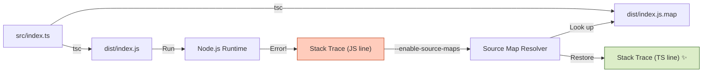

# 第13章：source mapと“読めるエラー”🗺️✨（ビルド後でも迷子にならない！）

この章のゴールはこれ👇
**「distの行番号じゃなくて、ちゃんと `src` のTSコードの行でエラー原因に辿り着ける」**ようになること！🚀💕

---

## 1) なんでビルド後のエラーって読みにくいの？😵‍💫


TypeScriptは実行するとき、だいたいこんな流れになるよね👇

* `src/**/*.ts`（人間が書いたTS）
* ↓ `tsc` でビルド
* `dist/**/*.js`（機械が実行するJS）

で、Nodeが出すスタックトレース（エラーの道筋）は、基本 **JS側（dist）** を指しがち…😇
すると、

* 「え、distの 742行目って何…？」
* 「そこ、生成物だから読めない…😭」

ってなる。

そこで救世主が **source map（ソースマップ）** 🗺️✨
Nodeに「このJSはTSから作られたよ！元の場所はこっち！」って教えてあげる仕組みだよ〜！



---

## 2) Node側の“source map対応”の今どき事情🧠✨

Nodeは **`--enable-source-maps`** を付けると、**スタックトレースを元ソース（TS）基準に寄せて表示**してくれるよ✅
この機能は **Node v12.12.0 で追加**されて、今は普通に使えるやつだよ〜！([nodejs.org][1])

ただし注意点もある👇
`--enable-source-maps` は **`Error.stack` を参照した時にコスト（遅くなる可能性）**があるよ、ってNode公式も書いてる！([nodejs.org][2])
なので「毎リクエストでstack作る」みたいなのは避けよ〜⚠️

---

## 3) TS側の設定：tsconfigでsource mapを出す🧩🗺️

まずはTypeScriptに「source mapも一緒に出してね！」ってお願いするよ！

ポイントはこれ👇

* `sourceMap: true`（`.js.map` ファイルを吐く）
* `inlineSources: true`（ソース内容をmapに埋め込む。後から追いやすい）([TypeScript][3])

`inlineSourceMap` っていう“JSにmapを埋め込む方式”もあるけど、これは `sourceMap` と排他（どっちか）だよ〜！([TypeScript][4])

例（おすすめ構成）👇

```jsonc
// tsconfig.json
{
  "compilerOptions": {
    "target": "ES2023",
    "module": "NodeNext",
    "moduleResolution": "NodeNext",

    "outDir": "dist",
    "rootDir": "src",

    "sourceMap": true,
    "inlineSources": true,

    "strict": true
  }
}
```

> `inlineSources` は **「ソースをmapに埋め込む」**オプションで、`sourceMap` か `inlineSourceMap` が必要だよ([TypeScript][3])
> （運用で“mapはあるけど元ソースが無い”みたいな事故が減る👍）

---

## 4) Nodeの起動方法：`--enable-source-maps` を付ける🚀🗺️

いちばん簡単でWindowsでも事故らないのは、**nodeコマンドに直接つける**やつ👇

```jsonc
// package.json
{
  "scripts": {
    "build": "tsc",
    "start": "node --enable-source-maps dist/index.js"
  }
}
```

これで「スタックトレースがTSの位置に戻る」ようになる✨

Node公式的にも、source mapの解析は **`--enable-source-maps` を付けて起動する必要がある**って説明になってるよ([nodejs.org][5])

---

## 5) ミニ実験：わざと落として“読める”か確認しよ💥👀

### サンプル（落ちるAPIっぽいやつ）

```ts
// src/index.ts
import http from "node:http";

function explode() {
  const user = { id: "u-123" };
  // わざと落とす💥
  throw new Error(`BOOM! userId=${user.id}`);
}

const server = http.createServer((req, res) => {
  if (req.url === "/fail") {
    explode();
  }
  res.statusCode = 200;
  res.end("ok");
});

server.listen(3000, () => {
  console.log("listening on http://localhost:3000");
});
```

### 実行

1. `npm run build`
2. `npm run start`
3. ブラウザで `http://localhost:3000/fail` を開く

✅ ここで理想は、スタックトレースがこうなること👇

* `dist/index.js:???` じゃなくて
* `src/index.ts:（explodeの行番号）` が出る✨

---

## 6) “リリース版の識別”もセットでやろう🏷️✨（超大事！）

source mapでTS行に戻れるようになっても、運用で詰みがちなのがこれ👇

> 「そのエラー、**どのビルド（バージョン）**で起きたの？🤔」

だからログには最低限これを入れたい👇

* `appVersion`（アプリのバージョン）
* `buildSha`（GitのコミットSHA）
* `buildTime`（ビルド日時）
* `runtime`（nodeのバージョン）

### 例：build情報をまとめる（超ミニ）

```ts
// src/obs/buildInfo.ts
export const buildInfo = {
  appVersion: process.env.APP_VERSION ?? "dev",
  buildSha: process.env.BUILD_SHA ?? "dev",
  buildTime: process.env.BUILD_TIME ?? "dev",
  node: process.version
} as const;
```

### 例：エラー時に一緒に出す（構造化ログ風）

```ts
// src/obs/logger.ts
import { buildInfo } from "./buildInfo";

export function logError(message: string, err: unknown, extra: Record<string, unknown> = {}) {
  const e = err instanceof Error ? err : new Error(String(err));
  const payload = {
    level: "error",
    message,
    ...buildInfo,
    ...extra,
    error: {
      name: e.name,
      message: e.message,
      stack: e.stack
    }
  };
  console.error(JSON.stringify(payload));
}
```

### 使う側

```ts
// src/index.ts（さっきの例に足すならこんな感じ）
import http from "node:http";
import { logError } from "./obs/logger";

function explode() {
  const user = { id: "u-123" };
  throw new Error(`BOOM! userId=${user.id}`);
}

const server = http.createServer((req, res) => {
  try {
    if (req.url === "/fail") explode();
    res.statusCode = 200;
    res.end("ok");
  } catch (e) {
    logError("request failed", e, { path: req.url });
    res.statusCode = 500;
    res.end("error");
  }
});

server.listen(3000);
```

これでログを見る人が、
「どのビルドの、どのTS行で落ちたか」
まで一気に追えるよ〜！🔍✨

---

## 7) よくある詰みポイント集（ここだけ見れば救われる）🧯✨

### ✅ `.map` が配置されてない

ビルドしても **`.js.map` がデプロイに入ってない**と当然戻れない😭
→ **`dist/*.map` が本番にも存在するか**チェック！

### ✅ `--enable-source-maps` を付け忘れる

mapファイルがあっても、Nodeが使わなかったら意味ないよ〜！
→ `node --enable-source-maps ...`

### ✅ stackを取りすぎて遅くなる

Node公式も「source map有効時、`Error.stack` 参照にレイテンシが出ることがあるよ」って注意してるよ⚠️([nodejs.org][2])
→ **本当に必要なとき（例：error時）だけstackを記録**が安心！

### ✅ APM/監視ツール側でもsource mapが必要なことがある

たとえばNew Relicも、TS/Babelみたいな“変換済み”アプリでは **source mapを有効化すると、より意味のあるエラートレースになる**って案内してるよ([docs.newrelic.com][6])

---

## 8) チェックリスト✅📝（この章の完成条件）

* [ ] `tsconfig.json` で `sourceMap: true` にした
* [ ] （おすすめ）`inlineSources: true` も入れた([TypeScript][3])
* [ ] 起動を `node --enable-source-maps ...` にした([nodejs.org][1])
* [ ] 意図的に落として、`src/**/*.ts` の行番号で出るのを確認した
* [ ] ログに `appVersion / buildSha / buildTime` を入れた🏷️✨
* [ ] stackは「必要なときだけ」出す運用にした⚠️([nodejs.org][2])

---

## 9) ミニ演習🎒✨（手を動かすと一気に身につく！）

### 演習A：map無しの世界を体験する😱

1. `dist/*.map` を一旦消して動かす
2. `/fail` で落とす
3. 「読みにくさ」を味わう

→ そのあと戻して「神…🙏」ってなるやつ😂

### 演習B：build情報を“毎回同じ形”で出す🧩

ログに必ず `buildSha` が入るようにして、エラー調査が楽になるのを体感しよ〜！

---

## 10) Copilot/Codexに頼るときの指示文（そのままコピペOK）🤖💬✨

* 「TypeScriptのNodeプロジェクトでsource mapを有効化したtsconfig.jsonを作って。`sourceMap` と `inlineSources` を入れて、出力はdistにして」
* 「node:httpのサンプルAPIを作って、`/fail` で例外を投げるようにして。try/catchでログをJSONで出して、error.stackも出して」
* 「build/version情報（APP_VERSION, BUILD_SHA, BUILD_TIME）を共通フィールドとしてログに混ぜるユーティリティを作って」

---

## 今どきのバージョン感だけチラ見👀✨（参考）

* TypeScript は npm 上の “Latest” が **5.9.3**（時点情報）だよ([npm][7])
* Nodeは **v24がActive LTS**、**v25がCurrent** という整理になってるよ([nodejs.org][8])

（source map周りはこのへんのNodeならぜんぜんOK👌）

---

次の章（第14章）は、いよいよ **相関IDでログを“つなぐ”🔗✨** に入るよ〜！
第13章のsource mapが効いてると、第14章の“追跡の気持ちよさ”が爆上がりするので、ここはぜひ手で試してね😉🫶💕

[1]: https://nodejs.org/download/release/v16.9.0/docs/api/cli.html?utm_source=chatgpt.com "Command-line options | Node.js v16.9.0 Documentation"
[2]: https://nodejs.org/api/cli.html?utm_source=chatgpt.com "Command-line API | Node.js v25.3.0 Documentation"
[3]: https://www.typescriptlang.org/tsconfig/inlineSources.html?utm_source=chatgpt.com "TSConfig Option: inlineSources"
[4]: https://www.typescriptlang.org/tsconfig/inlineSourceMap.html?utm_source=chatgpt.com "TSConfig Option: inlineSourceMap"
[5]: https://nodejs.org/download//nightly/v22.0.0-nightly20240420d545984a02/docs/api/module.html?utm_source=chatgpt.com "node:module API"
[6]: https://docs.newrelic.com/docs/apm/agents/nodejs-agent/installation-configuration/enable-source-maps/?utm_source=chatgpt.com "Enable source maps support"
[7]: https://www.npmjs.com/package/typescript?utm_source=chatgpt.com "typescript"
[8]: https://nodejs.org/en/about/previous-releases?utm_source=chatgpt.com "Node.js Releases"
