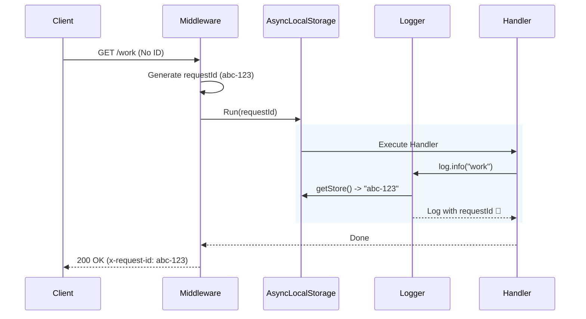

# 第14章：相関IDでログを“つなぐ”🔗✨（API内）

今日は「ログが混ざって地獄😇」を、**相関ID（Correlation ID）**で一気に解決しちゃう回だよ〜！🧩💖
結論：**1リクエスト＝1つのID**を発行して、**そのIDを全部のログに必ず付ける**だけで、調査効率が爆上がりするよ🔥

---

## 0. まず“あるある地獄”を見て…😵‍💫🌀

同時アクセスがあるとログがこうなる👇（IDなし）

```txt
start /work
start /slow
db query ok
start /work
timeout!!
done /work
done /slow
```

「え、timeoutって誰の？どのリクエストの話？？？」ってなるやつ😇

そこで相関IDを付けると👇

```txt
{"msg":"start","path":"/work","requestId":"a1"}
{"msg":"start","path":"/slow","requestId":"b9"}
{"msg":"db query ok","requestId":"a1"}
{"msg":"timeout!!","requestId":"b9"}
{"msg":"done","path":"/work","requestId":"a1"}
{"msg":"done","path":"/slow","requestId":"b9"}
```

**requestIdで検索するだけ**で、1リクエストの物語が全部つながる🎬✨

---

## 1. 相関IDってなに？🔗🪪


* **相関ID**：同じ処理のログを結びつけるための「タグ」🏷️
* Node/TSだとリクエストが非同期で混ざるから、**“つなぐ鍵”**が必要になるよ🔑✨

さらに将来トレース（OpenTelemetry）へ進むなら、HTTPの標準ヘッダー **`traceparent`**（W3C Trace Context）も超重要になるよ🌍🧵
`traceparent` には **trace-id** が入ってて、分散トレーシングの軸になるの。 ([W3C][1])

---

## 2. 設計の落とし所（迷わない版）📌✨

この章では、まずAPI内のログをつなぐ目的でこう決めるよ：

* ログ共通フィールド：**`requestId`**（固定）🔒
* 受け取り：リクエストに **`X-Request-Id`** があればそれを採用（なければ生成）🎁
* 返す：レスポンスにも **`X-Request-Id`** を必ず付けて返す📮
* 非同期でも迷子にならない：**AsyncLocalStorage**で“文脈”を保持する🧠🧵

Node公式も、非同期コンテキストの用途では **AsyncLocalStorage推奨**ってはっきり言ってるよ✅ ([nodejs.org][2])

---

## 3. 実装：AsyncLocalStorageで“どこからでもrequestId”にする🧵✨

ここからは **「1回作ったらずっと使える型」**を作るよ！🛠️💕

### 3-1) `context.ts`（リクエストの文脈置き場）📦

```ts
// src/context.ts
import { AsyncLocalStorage } from "node:async_hooks";

export type RequestContext = {
  requestId: string;
  traceparent?: string;
  traceId?: string;
};

const als = new AsyncLocalStorage<RequestContext>();

export function runWithContext<T>(ctx: RequestContext, fn: () => T): T {
  return als.run(ctx, fn);
}

export function getContext(): RequestContext | undefined {
  return als.getStore();
}
```

> AsyncLocalStorageは「非同期をまたいでも、今のリクエスト情報を取り出せる」ための公式機能だよ🧠✨ ([nodejs.org][2])

---

### 3-2) `traceparent.ts`（将来のためにtrace-idも拾えるように）🧵🌍

`traceparent` は `version-traceid-parentid-flags` の形（W3C標準）だよ。 ([W3C][1])

```ts
// src/traceparent.ts
export function tryParseTraceId(traceparent: string | undefined): string | undefined {
  if (!traceparent) return;

  const parts = traceparent.split("-");
  if (parts.length !== 4) return;

  const traceId = parts[1];
  if (/^[0-9a-f]{32}$/i.test(traceId) && traceId !== "0".repeat(32)) {
    return traceId;
  }
}
```

---

### 3-3) `logger.ts`（ログ出すだけで自動でrequestIdが入る✨）🪵💖

Pinoは **`child()` で共通フィールドを“貼り付けたlogger”を作れる**のが強いよ🌲 ([GitHub][3])
ここでは「ラッパー関数」で雑に安全にいくね😺

```ts
// src/logger.ts
import pino from "pino";
import { getContext } from "./context";

const base = pino({
  level: process.env.LOG_LEVEL ?? "info",
});

function withCtx(obj: Record<string, unknown> = {}) {
  const ctx = getContext();
  if (!ctx) return obj;

  // requestIdは絶対、traceIdは取れたら
  return {
    requestId: ctx.requestId,
    ...(ctx.traceId ? { traceId: ctx.traceId } : {}),
    ...obj,
  };
}

export const log = {
  debug(obj: Record<string, unknown>, msg?: string) {
    base.debug(withCtx(obj), msg);
  },
  info(obj: Record<string, unknown>, msg?: string) {
    base.info(withCtx(obj), msg);
  },
  warn(obj: Record<string, unknown>, msg?: string) {
    base.warn(withCtx(obj), msg);
  },
  error(obj: Record<string, unknown>, msg?: string) {
    base.error(withCtx(obj), msg);
  },
};
```

---

## 4. Expressに組み込む（これで完成！）🚀✨

### 4-1) `app.ts`（ミドルウェアでrequestId発行→ALSに保存→ログ自動付与）



```ts
// src/app.ts
import express from "express";
import { randomUUID } from "node:crypto";
import { runWithContext } from "./context";
import { tryParseTraceId } from "./traceparent";
import { log } from "./logger";

const app = express();

app.use((req, res, next) => {
  const incoming = req.headers["x-request-id"];
  const requestId = typeof incoming === "string" && incoming.length > 0 ? incoming : randomUUID();

  res.setHeader("X-Request-Id", requestId);

  const traceparent = typeof req.headers["traceparent"] === "string" ? req.headers["traceparent"] : undefined;
  const traceId = tryParseTraceId(traceparent);

  runWithContext({ requestId, traceparent, traceId }, () => {
    const start = Date.now();

    log.info({ method: req.method, path: req.path }, "request start 🟢");

    res.on("finish", () => {
      const durationMs = Date.now() - start;
      log.info({ statusCode: res.statusCode, durationMs }, "request end ✅");
    });

    next();
  });
});

app.get("/work", async (_req, res) => {
  log.info({}, "doing work 💪✨");
  await new Promise((r) => setTimeout(r, 120));
  res.json({ ok: true });
});

app.get("/slow", async (_req, res) => {
  log.info({}, "slow start 🐢");
  await new Promise((r) => setTimeout(r, 800));
  res.json({ ok: true });
});

app.get("/fail", async (_req, _res) => {
  log.warn({}, "about to fail 💥");
  throw new Error("boom");
});

// 例外をまとめてログ＆レスポンス
app.use((err: unknown, _req: express.Request, res: express.Response, _next: express.NextFunction) => {
  log.error({ err }, "unhandled error 🔥");

  // requestId をクライアントに返すと、問い合わせが秒速になる📮✨
  const requestId = String(res.getHeader("X-Request-Id") ?? "");
  res.status(500).json({ ok: false, requestId });
});

app.listen(3000, () => {
  log.info({ port: 3000 }, "listening 🚀");
});
```

AsyncLocalStorageは「非同期の途中でも同じ文脈を取り出せる」ため、ログが混ざっても `requestId` で追えるようになるよ🧵✨ ([nodejs.org][2])

---

## 5. 動作確認（WindowsのPowerShell想定）🪟✅

### 5-1) requestIdを自分で渡してみる🎁

```powershell
curl.exe -H "X-Request-Id: demo-001" http://localhost:3000/work
```

ログに `requestId:"demo-001"` が入ってたら勝ち🏆✨

### 5-2) 同時アクセスで“混ざる地獄”を叩き潰す👊🔥

```powershell
1..10 | ForEach-Object {
  Start-Job -ScriptBlock { curl.exe http://localhost:3000/slow | Out-Null }
}
```

ログがぐちゃぐちゃに並んでも、**requestIdで検索すると1本の線で追える**よ🔍🔗

---

## 6. さらに一歩：`traceparent` を尊重すると未来が楽🌍🧵✨

`traceparent` は分散トレースの標準ヘッダーで、trace-idが入るよ。 ([W3C][1])
OpenTelemetryでは **コンテキスト伝播（Context Propagation）**で、ログ/トレース/メトリクスを相関させるのが基本思想なの。 ([OpenTelemetry][4])

そしてログ側も、OpenTelemetryは **LogRecordsにTraceId/SpanIdを入れて相関できる**ように設計されてるよ🧩✨ ([OpenTelemetry][5])

なので今の段階でも、

* `traceparent` が来たら拾う（`traceId`取る）
* ログに `traceId` も載せる（取れたら）

ってやっておくと、後でトレース編に入ったとき気持ちよく繋がる💖

---

## 7. ミニ演習（この章のゴール🎯✨）

### 演習A：固定セットを決める📌

ログに毎回入る共通フィールドを **3つ**に絞って決めてね🫶
おすすめはこれ👇

* `requestId`（必須）
* `path`（必須）
* `durationMs`（あると神）

### 演習B：`/fail` でrequestIdを返す📮

500のレスポンスに `requestId` を返すようにして、
「問い合わせで requestId 教えてください🙏」ができるようにする✨

---

## 8. AIに手伝ってもらう（超実用）🤖💖

そのまま貼って使えるプロンプト例だよ👇

* 「Expressで `AsyncLocalStorage` を使って requestId を自動でログに付けたい。middlewareとloggerの最小構成をTypeScriptで書いて」
* 「`traceparent` から trace-id を取り出す関数を書いて。フォーマットチェックも入れて」
* 「Pinoで `requestId` を必ず含むログラッパーを作って。型安全にしたい」

---

## 9. まとめ（この章で身についたこと）🎁✨

* **相関ID（requestId）**で、混ざったログが“つながる”🔗
* **AsyncLocalStorage**で、非同期でも requestId をどこからでも取れる🧠🧵 ([nodejs.org][2])
* 将来のトレースに備えて **`traceparent` / `traceId`**も拾えると強い🌍✨ ([W3C][1])

---

次の章（第15章）は「フロント→APIまでつなぐ」発想🌐🔗で、さらに“神視点”に近づくよ〜！😺✨

[1]: https://www.w3.org/TR/trace-context/?utm_source=chatgpt.com "Trace Context"
[2]: https://nodejs.org/api/async_context.html?utm_source=chatgpt.com "Asynchronous context tracking | Node.js v25.3.0 ..."
[3]: https://github.com/pinojs/pino/blob/main/docs/api.md?utm_source=chatgpt.com "pino/docs/api.md at main · pinojs/pino"
[4]: https://opentelemetry.io/docs/concepts/context-propagation/?utm_source=chatgpt.com "Context propagation"
[5]: https://opentelemetry.io/docs/specs/otel/logs/?utm_source=chatgpt.com "OpenTelemetry Logging"
