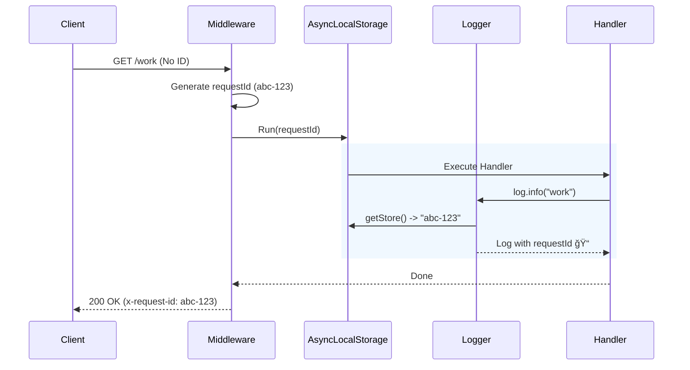

# 第14章：相関IDã§ãƒ­ã‚°ã‚’“ã¤ãªãâ€ğŸ”—✨（API内）

今日ã¯ã€Œãƒ­ã‚°ãŒæ··ã–ã£ã¦åœ°ç„😇ã€ã‚’ã€**相関ID（Correlation ID）**ã§ä¸€æ°—ã«è§£æ±ºã—ã¡ã‚ƒã†å›ã ã‚ˆã€œï¼ğŸ§©ğŸ’–
çµè«–：**1リクエストï¼1ã¤ã®ID**を発行ã—ã¦ã€**ãã®IDを全部ã®ãƒ­ã‚°ã«å¿…ãšä»˜ã‘ã‚‹**ã ã‘ã§ã€èª¿æŸ»åŠ¹ç‡ãŒçˆ†ä¸ŠãŒã‚Šã™ã‚‹ã‚ˆğŸ”¥

---

## 0. ã¾ãšâ€œã‚ã‚‹ã‚る地ç„â€ã‚’見ã¦â€¦ğŸ˜µâ€ğŸ’«ğŸŒ€


åŒæ™‚アクセスãŒã‚ã‚‹ã¨ãƒ­ã‚°ãŒã“ã†ãªã‚‹ğŸ‘‡ï¼ˆIDãªã—）

```txt
start /work
start /slow
db query ok
start /work
timeout!!
done /work
done /slow
```

「ãˆã€timeoutã£ã¦èª°ã®ï¼Ÿã©ã®ãƒªã‚¯ã‚¨ã‚¹ãƒˆã®è©±ï¼Ÿï¼Ÿï¼Ÿã€ã£ã¦ãªã‚‹ã‚„ã¤ğŸ˜‡

ãã“ã§ç›¸é–¢IDを付ã‘ã‚‹ã¨ğŸ‘‡

```txt
{"msg":"start","path":"/work","requestId":"a1"}
{"msg":"start","path":"/slow","requestId":"b9"}
{"msg":"db query ok","requestId":"a1"}
{"msg":"timeout!!","requestId":"b9"}
{"msg":"done","path":"/work","requestId":"a1"}
{"msg":"done","path":"/slow","requestId":"b9"}
```

**requestIdã§æ¤œç´¢ã™ã‚‹ã ã‘**ã§ã€1リクエストã®ç‰©èªãŒå…¨éƒ¨ã¤ãªãŒã‚‹ğŸ¬âœ¨

---

## 1. 相関IDã£ã¦ãªã«ï¼ŸğŸ”—🪪


* **相関ID**：åŒã˜å‡¦ç†ã®ãƒ­ã‚°ã‚’çµã³ã¤ã‘ã‚‹ãŸã‚ã®ã€Œã‚¿ã‚°ã€ğŸ·ï¸
* Node/TSã ã¨ãƒªã‚¯ã‚¨ã‚¹ãƒˆãŒéåŒæœŸã§æ··ã–ã‚‹ã‹ã‚‰ã€**“ã¤ãªãéµâ€**ãŒå¿…è¦ã«ãªã‚‹ã‚ˆğŸ”‘✨

ã•ã‚‰ã«å°†æ¥ãƒˆãƒ¬ãƒ¼ã‚¹ï¼ˆOpenTelemetry）ã¸é€²ã‚€ãªã‚‰ã€HTTPã®æ¨™æº–ヘッダー **`traceparent`**（W3C Trace Context）も超é‡è¦ã«ãªã‚‹ã‚ˆğŸŒğŸ§µ
`traceparent` ã«ã¯ **trace-id** ãŒå…¥ã£ã¦ã¦ã€åˆ†æ•£ãƒˆãƒ¬ãƒ¼ã‚·ãƒ³ã‚°ã®è»¸ã«ãªã‚‹ã®ã€‚ ([W3C][1])

---

## 2. 設計ã®è½ã¨ã—所（迷ã‚ãªã„版）📌✨

ã“ã®ç« ã§ã¯ã€ã¾ãšAPI内ã®ãƒ­ã‚°ã‚’ã¤ãªã目的ã§ã“ã†æ±ºã‚るよ：

* ログ共通フィールド：**`requestId`**（固定）🔒
* å—ã‘å–り：リクエスト㫠**`X-Request-Id`** ãŒã‚ã‚Œã°ãれをæ¡ç”¨ï¼ˆãªã‘ã‚Œã°ç”Ÿæˆï¼‰ğŸ
* è¿”ã™ï¼šãƒ¬ã‚¹ãƒãƒ³ã‚¹ã«ã‚‚ **`X-Request-Id`** ã‚’å¿…ãšä»˜ã‘ã¦è¿”ã™ğŸ“®
* éåŒæœŸã§ã‚‚è¿·å­ã«ãªã‚‰ãªã„：**AsyncLocalStorage**ã§â€œæ–‡è„ˆâ€ã‚’ä¿æŒã™ã‚‹ğŸ§ ğŸ§µ

Nodeå…¬å¼ã‚‚ã€éåŒæœŸã‚³ãƒ³ãƒ†ã‚­ã‚¹ãƒˆã®ç”¨é€”ã§ã¯ **AsyncLocalStorageæ¨å¥¨**ã£ã¦ã¯ã£ãり言ã£ã¦ã‚‹ã‚ˆâœ… ([nodejs.org][2])

---

## 3. 実装：AsyncLocalStorageã§â€œã©ã“ã‹ã‚‰ã§ã‚‚requestIdâ€ã«ã™ã‚‹ğŸ§µâœ¨

ã“ã“ã‹ã‚‰ã¯ **「1å›ä½œã£ãŸã‚‰ãšã£ã¨ä½¿ãˆã‚‹å‹ã€**を作るよï¼ğŸ› ï¸ğŸ’•

### 3-1) `context.ts`（リクエストã®æ–‡è„ˆç½®ã場）📦


```ts
// src/context.ts
import { AsyncLocalStorage } from "node:async_hooks";

export type RequestContext = {
  requestId: string;
  traceparent?: string;
  traceId?: string;
};

const als = new AsyncLocalStorage<RequestContext>();

export function runWithContext<T>(ctx: RequestContext, fn: () => T): T {
  return als.run(ctx, fn);
}

export function getContext(): RequestContext | undefined {
  return als.getStore();
}
```

> AsyncLocalStorageã¯ã€ŒéåŒæœŸã‚’ã¾ãŸã„ã§ã‚‚ã€ä»Šã®ãƒªã‚¯ã‚¨ã‚¹ãƒˆæƒ…報をå–り出ã›ã‚‹ã€ãŸã‚ã®å…¬å¼æ©Ÿèƒ½ã ã‚ˆğŸ§ âœ¨ ([nodejs.org][2])

---

### 3-2) `traceparent.ts`（将æ¥ã®ãŸã‚ã«trace-idも拾ãˆã‚‹ã‚ˆã†ã«ï¼‰ğŸ§µğŸŒ


`traceparent` 㯠`version-traceid-parentid-flags` ã®å½¢ï¼ˆW3C標準）ã ã‚ˆã€‚ ([W3C][1])

```ts
// src/traceparent.ts
export function tryParseTraceId(traceparent: string | undefined): string | undefined {
  if (!traceparent) return;

  const parts = traceparent.split("-");
  if (parts.length !== 4) return;

  const traceId = parts[1];
  if (/^[0-9a-f]{32}$/i.test(traceId) && traceId !== "0".repeat(32)) {
    return traceId;
  }
}
```

---

### 3-3) `logger.ts`（ログ出ã™ã ã‘ã§è‡ªå‹•ã§requestIdãŒå…¥ã‚‹âœ¨ï¼‰ğŸªµğŸ’–


Pino㯠**`child()` ã§å…±é€šãƒ•ã‚£ãƒ¼ãƒ«ãƒ‰ã‚’“貼り付ã‘ãŸloggerâ€ã‚’作れる**ã®ãŒå¼·ã„よ🌲 ([GitHub][3])
ã“ã“ã§ã¯ã€Œãƒ©ãƒƒãƒ‘ー関数ã€ã§é›‘ã«å®‰å…¨ã«ã„ãã­ğŸ˜º

```ts
// src/logger.ts
import pino from "pino";
import { getContext } from "./context";

const base = pino({
  level: process.env.LOG_LEVEL ?? "info",
});

function withCtx(obj: Record<string, unknown> = {}) {
  const ctx = getContext();
  if (!ctx) return obj;

  // requestIdã¯çµ¶å¯¾ã€traceIdã¯å–ã‚ŒãŸã‚‰
  return {
    requestId: ctx.requestId,
    ...(ctx.traceId ? { traceId: ctx.traceId } : {}),
    ...obj,
  };
}

export const log = {
  debug(obj: Record<string, unknown>, msg?: string) {
    base.debug(withCtx(obj), msg);
  },
  info(obj: Record<string, unknown>, msg?: string) {
    base.info(withCtx(obj), msg);
  },
  warn(obj: Record<string, unknown>, msg?: string) {
    base.warn(withCtx(obj), msg);
  },
  error(obj: Record<string, unknown>, msg?: string) {
    base.error(withCtx(obj), msg);
  },
};
```

---

## 4. Expressã«çµ„ã¿è¾¼ã‚€ï¼ˆã“ã‚Œã§å®Œæˆï¼ï¼‰ğŸš€âœ¨


### 4-1) `app.ts`（ミドルウェアã§requestId発行→ALSã«ä¿å­˜â†’ログ自動付ä¸ï¼‰


```mermaid
sequenceDiagram
    participant Client
    participant Middleware
    participant ALS as AsyncLocalStorage
    participant Logger
    participant Handler

    Client->>Middleware: GET /work (No ID)
    Middleware->>Middleware: Generate requestId (abc-123)
    Middleware->>ALS: Run(requestId)
    
    rect rgb(240, 248, 255)
        ALS->>Handler: Execute Handler
        Handler->>Logger: log.info("work")
        Logger->>ALS: getStore() -> "abc-123"
        Logger-->>Handler: Log with requestId ğŸ“
    end
    
    Handler-->>Middleware: Done
    Middleware-->>Client: 200 OK (x-request-id: abc-123)
```

```ts
// src/app.ts
import express from "express";
import { randomUUID } from "node:crypto";
import { runWithContext } from "./context";
import { tryParseTraceId } from "./traceparent";
import { log } from "./logger";

const app = express();

app.use((req, res, next) => {
  const incoming = req.headers["x-request-id"];
  const requestId = typeof incoming === "string" && incoming.length > 0 ? incoming : randomUUID();

  res.setHeader("X-Request-Id", requestId);

  const traceparent = typeof req.headers["traceparent"] === "string" ? req.headers["traceparent"] : undefined;
  const traceId = tryParseTraceId(traceparent);

  runWithContext({ requestId, traceparent, traceId }, () => {
    const start = Date.now();

    log.info({ method: req.method, path: req.path }, "request start 🟢");

    res.on("finish", () => {
      const durationMs = Date.now() - start;
      log.info({ statusCode: res.statusCode, durationMs }, "request end ✅");
    });

    next();
  });
});

app.get("/work", async (_req, res) => {
  log.info({}, "doing work 💪✨");
  await new Promise((r) => setTimeout(r, 120));
  res.json({ ok: true });
});

app.get("/slow", async (_req, res) => {
  log.info({}, "slow start ğŸ¢");
  await new Promise((r) => setTimeout(r, 800));
  res.json({ ok: true });
});

app.get("/fail", async (_req, _res) => {
  log.warn({}, "about to fail 💥");
  throw new Error("boom");
});

// 例外をã¾ã¨ã‚ã¦ãƒ­ã‚°ï¼†ãƒ¬ã‚¹ãƒãƒ³ã‚¹
app.use((err: unknown, _req: express.Request, res: express.Response, _next: express.NextFunction) => {
  log.error({ err }, "unhandled error 🔥");

  // requestId をクライアントã«è¿”ã™ã¨ã€å•ã„åˆã‚ã›ãŒç§’速ã«ãªã‚‹ğŸ“®âœ¨
  const requestId = String(res.getHeader("X-Request-Id") ?? "");
  res.status(500).json({ ok: false, requestId });
});

app.listen(3000, () => {
  log.info({ port: 3000 }, "listening 🚀");
});
```

AsyncLocalStorageã¯ã€ŒéåŒæœŸã®é€”中ã§ã‚‚åŒã˜æ–‡è„ˆã‚’å–り出ã›ã‚‹ã€ãŸã‚ã€ãƒ­ã‚°ãŒæ··ã–ã£ã¦ã‚‚ `requestId` ã§è¿½ãˆã‚‹ã‚ˆã†ã«ãªã‚‹ã‚ˆğŸ§µâœ¨ ([nodejs.org][2])

---

## 5. 動作確èªï¼ˆWindowsã®PowerShell想定）🪟✅

### 5-1) requestIdを自分ã§æ¸¡ã—ã¦ã¿ã‚‹ğŸ

```powershell
curl.exe -H "X-Request-Id: demo-001" http://localhost:3000/work
```

ログ㫠`requestId:"demo-001"` ãŒå…¥ã£ã¦ãŸã‚‰å‹ã¡ğŸ†âœ¨

### 5-2) åŒæ™‚アクセスã§â€œæ··ã–る地ç„â€ã‚’å©ãæ½°ã™ğŸ‘ŠğŸ”¥

```powershell
1..10 | ForEach-Object {
  Start-Job -ScriptBlock { curl.exe http://localhost:3000/slow | Out-Null }
}
```

ログãŒãã¡ã‚ƒãã¡ã‚ƒã«ä¸¦ã‚“ã§ã‚‚ã€**requestIdã§æ¤œç´¢ã™ã‚‹ã¨1本ã®ç·šã§è¿½ãˆã‚‹**よğŸ”🔗

---

## 6. ã•ã‚‰ã«ä¸€æ­©ï¼š`traceparent` ã‚’å°Šé‡ã™ã‚‹ã¨æœªæ¥ãŒæ¥½ğŸŒğŸ§µâœ¨


`traceparent` ã¯åˆ†æ•£ãƒˆãƒ¬ãƒ¼ã‚¹ã®æ¨™æº–ヘッダーã§ã€trace-idãŒå…¥ã‚‹ã‚ˆã€‚ ([W3C][1])
OpenTelemetryã§ã¯ **コンテキストä¼æ’­ï¼ˆContext Propagation）**ã§ã€ãƒ­ã‚°/トレース/メトリクスを相関ã•ã›ã‚‹ã®ãŒåŸºæœ¬æ€æƒ³ãªã®ã€‚ ([OpenTelemetry][4])

ãã—ã¦ãƒ­ã‚°å´ã‚‚ã€OpenTelemetry㯠**LogRecordsã«TraceId/SpanIdを入れã¦ç›¸é–¢ã§ãã‚‹**よã†ã«è¨­è¨ˆã•ã‚Œã¦ã‚‹ã‚ˆğŸ§©âœ¨ ([OpenTelemetry][5])

ãªã®ã§ä»Šã®æ®µéšã§ã‚‚ã€

* `traceparent` ãŒæ¥ãŸã‚‰æ‹¾ã†ï¼ˆ`traceId`å–る）
* ログ㫠`traceId` も載ã›ã‚‹ï¼ˆå–ã‚ŒãŸã‚‰ï¼‰

ã£ã¦ã‚„ã£ã¦ãŠãã¨ã€å¾Œã§ãƒˆãƒ¬ãƒ¼ã‚¹ç·¨ã«å…¥ã£ãŸã¨ãæ°—æŒã¡ã‚ˆã繋ãŒã‚‹ğŸ’–

---

## 7. ミニ演習（ã“ã®ç« ã®ã‚´ãƒ¼ãƒ«ğŸ¯âœ¨ï¼‰

### 演習A：固定セットを決ã‚る📌

ログã«æ¯å›å…¥ã‚‹å…±é€šãƒ•ã‚£ãƒ¼ãƒ«ãƒ‰ã‚’ **3ã¤**ã«çµã£ã¦æ±ºã‚ã¦ã­ğŸ«¶
ãŠã™ã™ã‚ã¯ã“れ👇

* `requestId`（必須）
* `path`（必須）
* `durationMs`（ã‚ã‚‹ã¨ç¥ï¼‰

### 演習B：`/fail` ã§requestIdã‚’è¿”ã™ğŸ“®

500ã®ãƒ¬ã‚¹ãƒãƒ³ã‚¹ã« `requestId` ã‚’è¿”ã™ã‚ˆã†ã«ã—ã¦ã€
「å•ã„åˆã‚ã›ã§ requestId æ•™ãˆã¦ãã ã•ã„ğŸ™ã€ãŒã§ãるよã†ã«ã™ã‚‹âœ¨

---

## 8. AIã«æ‰‹ä¼ã£ã¦ã‚‚らã†ï¼ˆè¶…実用）🤖💖

ãã®ã¾ã¾è²¼ã£ã¦ä½¿ãˆã‚‹ãƒ—ロンプト例ã ã‚ˆğŸ‘‡

* 「Express㧠`AsyncLocalStorage` を使ã£ã¦ requestId を自動ã§ãƒ­ã‚°ã«ä»˜ã‘ãŸã„。middlewareã¨loggerã®æœ€å°æ§‹æˆã‚’TypeScriptã§æ›¸ã„ã¦ã€
* 「`traceparent` ã‹ã‚‰ trace-id ã‚’å–り出ã™é–¢æ•°ã‚’書ã„ã¦ã€‚フォーãƒãƒƒãƒˆãƒã‚§ãƒƒã‚¯ã‚‚入れã¦ã€
* 「Pino㧠`requestId` ã‚’å¿…ãšå«ã‚€ãƒ­ã‚°ãƒ©ãƒƒãƒ‘ーを作ã£ã¦ã€‚å‹å®‰å…¨ã«ã—ãŸã„ã€

---

## 9. ã¾ã¨ã‚（ã“ã®ç« ã§èº«ã«ã¤ã„ãŸã“ã¨ï¼‰ğŸâœ¨

* **相関ID（requestId）**ã§ã€æ··ã–ã£ãŸãƒ­ã‚°ãŒâ€œã¤ãªãŒã‚‹â€ğŸ”—
* **AsyncLocalStorage**ã§ã€éåŒæœŸã§ã‚‚ requestId ã‚’ã©ã“ã‹ã‚‰ã§ã‚‚å–れる🧠🧵 ([nodejs.org][2])
* å°†æ¥ã®ãƒˆãƒ¬ãƒ¼ã‚¹ã«å‚™ãˆã¦ **`traceparent` / `traceId`**も拾ãˆã‚‹ã¨å¼·ã„ğŸŒâœ¨ ([W3C][1])

---

次ã®ç« ï¼ˆç¬¬15章）ã¯ã€Œãƒ•ãƒ­ãƒ³ãƒˆâ†’APIã¾ã§ã¤ãªãã€ç™ºæƒ³ğŸŒğŸ”—ã§ã€ã•ã‚‰ã«â€œç¥è¦–点â€ã«è¿‘ã¥ãよ〜ï¼ğŸ˜ºâœ¨

[1]: https://www.w3.org/TR/trace-context/?utm_source=chatgpt.com "Trace Context"
[2]: https://nodejs.org/api/async_context.html?utm_source=chatgpt.com "Asynchronous context tracking | Node.js v25.3.0 ..."
[3]: https://github.com/pinojs/pino/blob/main/docs/api.md?utm_source=chatgpt.com "pino/docs/api.md at main · pinojs/pino"
[4]: https://opentelemetry.io/docs/concepts/context-propagation/?utm_source=chatgpt.com "Context propagation"
[5]: https://opentelemetry.io/docs/specs/otel/logs/?utm_source=chatgpt.com "OpenTelemetry Logging"
