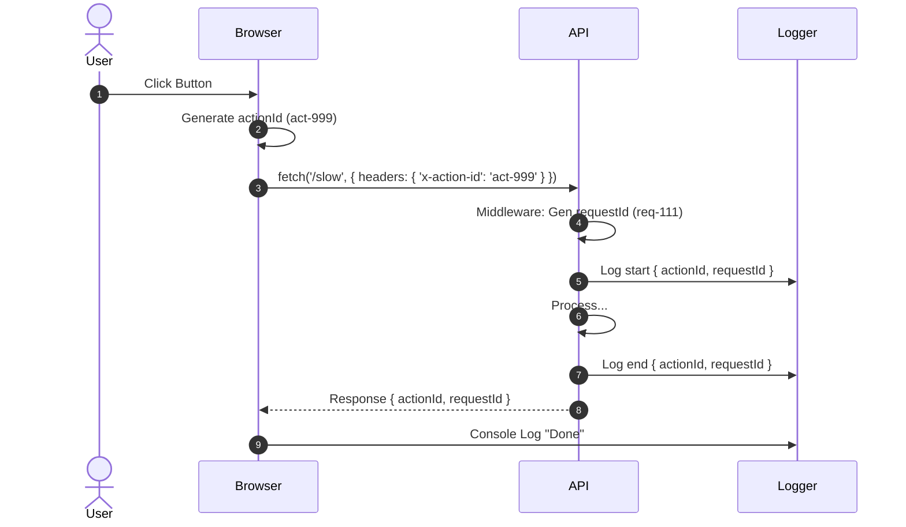

# 第15章：フロント→APIまで“つなぐ”発想🌐🔗（任意だけど超強い！）

この章はね、「ユーザーが押したボタン1回」から「APIの中で何が起きたか」までを、**迷子にならずに一直線で追えるようにする**話だよ〜🧭✨
ログだけ見ても「どの操作の話だっけ…？」ってなるのを防げるのが最大のごほうび🍬💕

---

## 1) まずゴールを“1文”で言うと？🎯✨

**ユーザー操作（フロント）にIDを付けて、APIのログ/トレースまで同じIDで追えるようにする**🔗🪵🧵

---

## 2) 何を“つなぐ”の？（3つのIDで整理）🧠📌


ここ、最初に整理すると超ラクだよ〜😊✨

* **① userActionId（ユーザー操作ID）**：クリック1回・送信1回など「操作」に付けるID🖱️
* **② requestId（リクエストID）**：HTTPリクエスト1本に付けるID📨
* **③ traceId（トレースID）**：分散トレースの“太い一本の糸”🧵（W3Cの `traceparent` が代表） ([W3C][1])

おすすめの考え方はこれ👇

* **最小構成**：① userActionId ＋ ② requestId
* **強い構成**：① userActionId ＋ ③ traceId（＋②もあると親切）



---

## 3) いきなりトレースは大変？→ まずは「userActionId」で勝てる🥇✨

分散トレース（traceparent系）は強いけど、導入がちょい重いこともあるのね🥺
だから第15章は **「まずは確実に効く」** ところから！

### ✅ userActionIdの良さ

* ログで「この操作の話！」ってすぐ絞れる🔍✨
* 失敗時の問い合わせ（ユーザー申告）と結びつけやすい📩
* トレース導入の前段としても最適🧱

---

## 4) 設計ルール（超だいじ）🛡️✨

### 4-1. IDは“漏れても困らない”にする🧼

* **ユーザー名・メール・会員ID（生）を入れない**🙅‍♀️
* どうしても必要なら

  * 「別システムで引けるキー」ではなく
  * **その場限り or 疑似ID（ランダム）**にするのが安全👍

### 4-2. IDの寿命を決める⌛

* userActionId：**操作1回**（クリック1回につき1つ）
* requestId：**リクエスト1本**
* sessionId：**ブラウザを開いてる間**（または短めの期限）

### 4-3. 名前を固定する（揺れ防止）🏷️

おすすめ例👇

* `action.id`（userActionId）
* `request.id`
* `trace.id`

---

## 5) ハンズオン①：フロントで userActionId を発行して API に渡す🖱️➡️📨✨

### 5-1. “操作の入口”でIDを作る🎟️

ブラウザは `crypto.randomUUID()` が使えるので、これが一番ラク💕

```ts
// actionId.ts
export function newActionId(): string {
  return crypto.randomUUID();
}
```

### 5-2. fetchをラップして「必ずヘッダーに付ける」🧰✨

「付け忘れ」が一番事故るので、**共通関数**に閉じ込めるのがコツだよ〜🧡

```ts
// fetchWithObs.ts
type ObsOptions = {
  actionId: string;
};

export async function fetchWithObs(input: RequestInfo | URL, init: RequestInit = {}, obs: ObsOptions) {
  const headers = new Headers(init.headers);

  // ここが第15章の主役✨
  headers.set("x-action-id", obs.actionId);

  // あると便利：画面や機能の名前（PIIじゃない範囲で）
  // headers.set("x-action-name", "checkout:submit");

  return fetch(input, { ...init, headers });
}
```

### 5-3. ボタン押下で actionId を発行 → API呼び出し🎯

```ts
import { newActionId } from "./actionId";
import { fetchWithObs } from "./fetchWithObs";

async function onClickSlow() {
  const actionId = newActionId();

  const res = await fetchWithObs("http://localhost:3000/slow", {}, { actionId });
  const json = await res.json();

  console.log("done", { actionId, json });
}
```

---

## 6) ハンズオン②：API側で受け取ってログを“つなぐ”🪵🔗✨

### 6-1. Expressのミドルウェアで拾う🧤

* `x-action-id` を受け取る
* `requestId` を新規発行（無ければ）
* **ログに必ず混ぜる**（超重要！）

```ts
import express from "express";
import crypto from "node:crypto";

const app = express();

function newRequestId() {
  return crypto.randomUUID();
}

app.use((req, res, next) => {
  const actionId = req.header("x-action-id") ?? null;
  const requestId = req.header("x-request-id") ?? newRequestId();

  // 後段で使えるように載せる（型はお好みでOK）
  (req as any).obs = { actionId, requestId };

  // ついでにレスポンスにも返すと、フロントの調査がめっちゃ楽✨
  res.setHeader("x-request-id", requestId);

  next();
});

app.get("/slow", async (req, res) => {
  const { actionId, requestId } = (req as any).obs;

  console.log("start /slow", { actionId, requestId });

  await new Promise((r) => setTimeout(r, 800));

  console.log("end /slow", { actionId, requestId });

  res.json({ ok: true, actionId, requestId });
});

app.listen(3000, () => console.log("server started"));
```

これで、ログがこういう感じで揃うよ〜🥰

* `start /slow { actionId, requestId }`
* `end /slow { actionId, requestId }`

**調査が一気に一本道**になる✨🧭

---

## 7) “別オリジン”のときの落とし穴：CORS🧨（でも直せる！）

フロントとAPIが別オリジン（例：ポートが違う）だと、**カスタムヘッダー**はCORSで止まりやすいの🥺
そのときは **サーバーが許可するヘッダー**を返す必要があるよ〜。
`Access-Control-Allow-Headers` は「そのヘッダー送っていいよ」って意味だよ📮✨ ([MDN Web Docs][2])
CORSの全体像もここが公式で安心🧠 ([MDN Web Docs][3])

たとえば `x-action-id` を許可したいなら（概念としては）👇みたいにする感じ！

* `Access-Control-Allow-Headers: x-action-id, content-type`

※ 実装は `cors` ミドルウェアでOK（allowedHeadersに追加）✨

---

## 8) 発展：traceparent（W3C）で“本物の分散トレース”に乗る🧵🚀

ここから先は「任意」だけど、めっちゃ強い世界🌈
W3C Trace Context では、HTTPヘッダー `traceparent` がトレースの親子関係を渡す標準だよ ([W3C][1])

### 8-1. ブラウザ側：OpenTelemetryでトレースを作る（概要）🌐

OpenTelemetryの公式手順だと、ブラウザでは `@opentelemetry/sdk-trace-web` と、ページロード計装の `@opentelemetry/instrumentation-document-load` などを使うよ ([OpenTelemetry][4])
さらに「まとめて自動計装」したい場合、`@opentelemetry/auto-instrumentations-web` みたいなメタパッケージもある（ただし依存は増える） ([OpenTelemetry][5])

### 8-2. Node側：OpenTelemetryで受け取って繋げる（概要）🖥️

Node.jsも公式のGetting Startedが用意されていて、トレースのスタート地点として超定番だよ ([OpenTelemetry][6])
Node側も `@opentelemetry/auto-instrumentations-node` をまとめ導入できるよ ([OpenTelemetry][5])

### 8-3. 追加情報を“載せる”なら baggage（ただし慎重に）🎒⚠️

`baggage` ヘッダーは「ユーザーが指定するkey-valueを伝搬」する仕様だよ ([W3C][7])
でも、載せすぎや個人情報は事故りやすいから、**最小・安全な情報だけ**にしよね🙅‍♀️💦

### 8-4. ここでもCORSが関門になりがち😵‍💫

分散トレーシング系のヘッダー（例：`baggage` や `traceparent`）も、環境によっては **“許可した先だけ”に付与**されたり、CORSで止まったりするよ〜。
たとえば Sentry の分散トレースでも、`baggage` や（任意で）`traceparent` を付ける場合にCORS注意が書かれてるよ ([docs.sentry.io][8])

---

## 9) ミニ演習（第15章の宿題）📝✨

### 🎯 お題

「遅いAPI（/slow）」を、**フロントのクリック1回**から追えるようにしてね！

### ✅ やること（最小セット）

1. フロントで `actionId` を発行
2. `x-action-id` を付けてAPIへ送る
3. APIのログに `{ actionId, requestId }` を必ず出す
4. ログを `actionId` で検索して、start→end が1本で追えるか確認🔍✨

---

## 10) AIの使いどころ（超おすすめ）🤖💖

### 🪄 プロンプト例（そのまま投げてOK）

* 「fetchをラップして、必ず x-action-id を付ける共通関数をTypeScriptで作って。例外時も actionId がログに残るようにして」
* 「Expressで requestId を発行してレスポンスヘッダーにも返すミドルウェアを書いて。型も付けて」
* 「CORSで x-action-id を許可する設定例を、必要最小限で書いて」

“付け忘れ防止”の設計はAIがかなり得意だよ〜🧠✨

---

## 11) よくある事故あるある😇💥（先に潰そ！）

* **actionIdを付ける場所がバラバラ** → 共通関数に封印しよ🧰
* **ログにactionIdを出してない** → つないだ意味が消える🫠
* **CORSでヘッダーが飛ばない** → `Access-Control-Allow-Headers` を確認📮 ([MDN Web Docs][2])
* **個人情報をIDに混ぜちゃう** → ぜったい避けよ🙅‍♀️💦
* **baggageに載せすぎ** → “最小・安全”が正義🎒⚠️ ([W3C][7])

---

## まとめ🌸✨

第15章の本質はこれだよ👇💕

* **ユーザー操作（actionId）を起点にする**🖱️
* **APIに渡して、ログで追えるようにする**🪵🔗
* 余裕が出たら **traceparent（W3C）で分散トレース**へ🧵🚀 ([W3C][1])

次の章でメトリクスやトレースに進んでも、**「つながってる」だけで調査力が段違い**になるよ〜😊💪✨

[1]: https://www.w3.org/TR/trace-context/?utm_source=chatgpt.com "Trace Context"
[2]: https://developer.mozilla.org/en-US/docs/Web/HTTP/Reference/Headers/Access-Control-Allow-Headers?utm_source=chatgpt.com "Access-Control-Allow-Headers header - HTTP - MDN Web Docs"
[3]: https://developer.mozilla.org/en-US/docs/Web/HTTP/Guides/CORS?utm_source=chatgpt.com "Cross-Origin Resource Sharing (CORS) - MDN Web Docs"
[4]: https://opentelemetry.io/docs/languages/js/getting-started/browser/?utm_source=chatgpt.com "Browser"
[5]: https://opentelemetry.io/ja/docs/languages/js/libraries/?utm_source=chatgpt.com "計装ライブラリの使用"
[6]: https://opentelemetry.io/docs/languages/js/getting-started/nodejs/?utm_source=chatgpt.com "Node.js"
[7]: https://www.w3.org/TR/baggage/?utm_source=chatgpt.com "Propagation format for distributed context: Baggage"
[8]: https://docs.sentry.io/platforms/javascript/guides/solid/tracing/distributed-tracing/dealing-with-cors-issues/?utm_source=chatgpt.com "Dealing with CORS Issues | Sentry for Solid"
