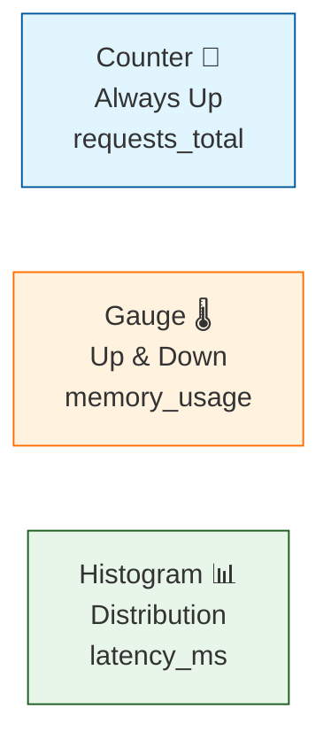

# 第16章：メトリクス入門📈✨（ログとの役割分担がわかる！）

この章は「**いま、システムが元気か？**」を **数字でパッと把握**できるようになる回だよ〜😊💕

---

## 16.1 メトリクスって何？📊👀

メトリクスは、ざっくり言うと **実行中のサービスを“数値で測る”**ものだよ📏✨
「測った瞬間（= metric event）」には、**数値だけじゃなくて時刻やメタデータ**も一緒にくっつく感じ🧷🕒
そして集めたメトリクスは、**可用性/性能の指標**になって、**アラート**や**スケール判断**にも使えるよ🚨📈
([OpenTelemetry][1])

---

## 16.2 ログ🪵とメトリクス📈とトレース🧵の「得意技」分担

イメージで覚えちゃお👇✨

* **ログ🪵**：出来事のメモ（「何が起きた？」を詳しく）
* **メトリクス📈**：健康診断の数値（「いま大丈夫？」を即答）
* **トレース🧵**：リクエストの旅日記（「どこで遅い？」を道案内）

メトリクスは **“集計された統計情報”**が得意で、**傾向**とか**異常検知**に強いよ💪✨
一方で「なぜそうなった？」はメトリクス単体だと弱いから、**ログ/トレースにバトンタッチ**する設計が超大事だよ🤝🧵
([OpenTelemetry][1])

---

## 16.3 メトリクスの基本パーツ🧱✨（Counter / Gauge / Histogram）


OpenTelemetry（OTel）では、メトリクスは **Instrument（計測器）**で測るよ🎛️
Instrumentには **名前・種類・単位（任意）・説明（任意）**があるよ📝
([OpenTelemetry][1])

### ① Counter（カウンター）🔢⬆️

**増え続ける**数（オドメーターみたいに戻らない）🚗💨
例：リクエスト数、成功数、エラー数
([OpenTelemetry][1])

### ② Gauge（ゲージ）🌡️🎚️

**その時点の値**（温度計・残量メーター）
JSだとよく **ObservableGauge（コールバックで観測するタイプ）**を使うよ👀
([OpenTelemetry][1])

### ③ Histogram（ヒストグラム）📊⏱️

**分布（ばらつき）**を見るやつ！
例：レスポンス時間（何msが多い？1秒超え何回？）
([OpenTelemetry][1])



---

## 16.4 まずは「3つだけ」選ぼう🥇🥈🥉（ミニ演習）

題材API（例：`/work` `/slow` `/fail` みたいなやつ）を想像して、**重要メトリクスを3つ**だけ選んでみよ🎯✨

おすすめの選び方はこれ👇💡

1. **いま混んでる？** → `inflight_requests`（Gauge）🌡️
2. **壊れてない？** → `requests_total` と `errors_total`（Counter）🔢
3. **遅くない？** → `request_duration`（Histogram）⏱️

> ポイント：まずは「質問」から逆算するのが勝ち🏆💕

---

## 16.5 実装してみよう💻✨（OTelで“数字を出す”最短コース）

OTelでは、メトリクスはざっくりこう流れるよ👇

* `MeterProvider`（Meterを作る工場）
* `Meter`（Instrumentを作る人）
* `Exporter`（外に出す人：コンソール / Collector / 監視基盤）
  ([OpenTelemetry][1])

### 16.5.1 まず Meter を作る🎛️✨

OTel JSでは `metrics.getMeter(...)` で Meter を取れるよ🧰
([OpenTelemetry][2])

---

## 16.6 例：Counter / Histogram / Gauge を1セットで入れる🧩💕

ここからは「わかるための最小構成」だよ😊
（※コードブロックはそのままコピペしてOK✂️✨）

### ① アプリ側：計測したい数字を置く（Counter / Histogram / ObservableGauge）

```ts
// metrics.ts
import { metrics } from "@opentelemetry/api";

const meter = metrics.getMeter("demo-service");

// 1) Counter: リクエスト数（増え続ける）
export const requestsTotal = meter.createCounter("demo.requests_total", {
  description: "Total number of HTTP requests",
  unit: "1",
});

// 2) Histogram: 処理時間の分布（ms）
export const requestDurationMs = meter.createHistogram("demo.request_duration", {
  description: "Distribution of request duration",
  unit: "milliseconds",
});

// 3) ObservableGauge: いま処理中の数（その時点の値）
let inflight = 0;

export const inflightGauge = meter.createObservableGauge("demo.inflight_requests", {
  description: "Number of in-flight requests",
  unit: "1",
});

inflightGauge.addCallback((result) => {
  result.observe(inflight);
});

export function incInflight() {
  inflight++;
}
export function decInflight() {
  inflight--;
}
```

* Counterの作り方＆`add(1)`の雰囲気：([OpenTelemetry][2])
* Histogramの雰囲気：([OpenTelemetry][2])
* ObservableGaugeの雰囲気：([OpenTelemetry][2])
* `description` / `unit` を付けるのおすすめ：([OpenTelemetry][2])

### ② 使う側：ルートで計測する（“1リクエスト”を数字にする）

```ts
// app.ts（超ミニ例）
import express from "express";
import { requestsTotal, requestDurationMs, incInflight, decInflight } from "./metrics";

const app = express();

app.get("/work", async (_req, res) => {
  const start = Date.now();
  incInflight();

  try {
    // なんか処理する（例：DB/外部APIのつもり）
    await new Promise((r) => setTimeout(r, 80));

    requestsTotal.add(1, { route: "/work", status: "200" });
    res.json({ ok: true });
  } catch (e) {
    requestsTotal.add(1, { route: "/work", status: "500" });
    throw e;
  } finally {
    requestDurationMs.record(Date.now() - start, { route: "/work" });
    decInflight();
  }
});

app.listen(3000, () => console.log("http://localhost:3000"));
```

ここで大事なのは👇✨

* **Counter**：回数を増やす🔢
* **Histogram**：時間を記録する⏱️
* **Gauge**：いま処理中の数を“観測”する🌡️

---

## 16.7 メトリクスを“外に出す”方法（ざっくり2択）🚚✨

OTelのメトリクスは、Exporterで外に出すよ📤
出し先は **コンソール**でもいいし、**Collector**でもいいし、**監視基盤**でもOKだよ〜😊
([OpenTelemetry][1])

### A) まずは学習向け：コンソールに出す🖥️✨

Nodeの公式チュートリアル例だと、`ConsoleMetricExporter` + `PeriodicExportingMetricReader` みたいにして **定期的に表示**できるよ📌
([OpenTelemetry][3])

### B) 実運用で多い：Prometheus / OTLP（Collector経由）📡✨

* Prometheusへは

  1. **PrometheusのOTLP Receiver + OTLP Exporter**
  2. もしくは **Prometheus Exporter（HTTPでscrapeされる）**
     のどっちでもいけるよ🙆‍♀️
     ([OpenTelemetry][4])

---

## 16.8 AI（Copilot等）に手伝ってもらう🤖💕

そのまま貼って使える“お願い文”いくね✨

* **メトリクス候補だし**
  「このAPIに必要なCounter/Gauge/Histogramを3つに絞って。目的も1行で添えて。属性は少なめで。」

* **命名を統一**
  「`demo.*` の命名規則を作って、一覧にして。unit/descriptionも埋めて。」

* **入れすぎチェック**
  「この属性（labels）は増えすぎる危険ある？“危険な例”も出して。」

---

## 16.9 よくあるミス集（先に潰す💥）😵‍💫➡️😊

* **メトリクスで“原因”まで追おうとする**
  → メトリクスは「異常の発見」が得意。原因はログ/トレースへ🔁🧵 ([OpenTelemetry][1])

* **とりあえず全部測る**
  → 最初は **3つだけ**でいいよ🥹🫶（増やすのは後でOK）

* **単位がない / 意味が曖昧**
  → `unit` と `description` を付けると未来の自分が助かるよ📝✨ ([OpenTelemetry][2])

---

## まとめ🌸✨

この章でできるようになったこと👇😊

* メトリクスの役割が「**いま大丈夫？**」だってわかった📈
* Counter / Gauge / Histogram の違いがわかった🔢🌡️📊
* TSで「数字を出す」最小実装イメージが持てた💻✨

次の第17章では、ここで触れた **Rate / Errors / Duration（RED）** を “型”として固めて、ダッシュボードや監視の土台を作っていくよ〜🚦⏱️🔥

[1]: https://opentelemetry.io/docs/concepts/signals/metrics/ "Metrics | OpenTelemetry"
[2]: https://opentelemetry.io/docs/languages/js/instrumentation/ "Instrumentation | OpenTelemetry"
[3]: https://opentelemetry.io/docs/languages/js/getting-started/nodejs/ "Node.js | OpenTelemetry"
[4]: https://opentelemetry.io/docs/languages/js/exporters/?utm_source=chatgpt.com "Exporters"
