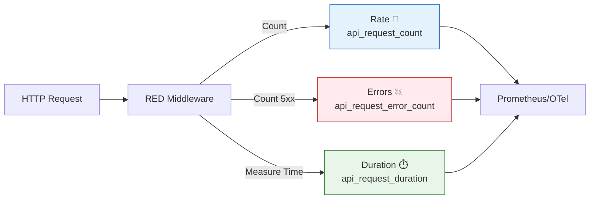

# 第17章：APIの基本指標を決める（Rate / Errors / Duration）🚦⏱️📈✨

この章はね、**「このAPI、今元気？😌 それともヤバい？😱」**を、数字でパッと言えるようにする回だよ〜！💪✨
しかも最小セットでいくよ👇

* **Rate（どれだけ来てる？）** 🚰
* **Errors（どれだけ失敗？）** 💥
* **Duration（どれだけ遅い？）** 🐢💨

これ、いわゆる **REDメソッド**（Rate/Errors/Duration）で、API監視の超王道だよ📌 ([prometheus.io][1])
さらにGoogle SREでも「まず見るべきは latency / traffic / errors（＋saturation）」って言ってるやつの、まさに **3本柱**なの🌟 ([sre.google][2])

---

## 1) まず“言葉の定義”を決めよう📝✨（ここが設計！）




同じ “エラー” でも人によって意味が違うと、ダッシュボードが地獄になる😇🔥
なので、ここで**チーム内の共通語**を作っちゃう！

## ✅ Rate（リクエスト量）🚰

**「一定時間に何回リクエストが来た？」**
例：RPS（requests per second）とか、RPM（per minute）とか。

* まずは **HTTPリクエスト数**が基本だよ（traffic） ([sre.google][2])

## ✅ Errors（失敗）💥

**「失敗って、どれ？」**を決めるのが超大事！

おすすめは **2階建て** 🏢✨

* **A. システムエラー（運用でつらい）**：HTTP **5xx** とか、例外で落ちたとか💣
* **B. 仕様上のエラー（ユーザー操作起因）**：HTTP **4xx** とか、バリデーションNGとか🙅‍♀️

> 「4xxはエラー扱いしない」もアリだけど、**“増えたら困る4xx”**（例：401急増）もあるから、
> **“数えるけど、アラートは別”**が扱いやすいよ😉✨

## ✅ Duration（遅さ）🐢

**「1リクエストに何秒かかった？」** ⏱️
ここで注意！⚠️

* 平均だけ見てると、**たまに激遅**が隠れる（“尻尾＝tail”が怖い）🐉
* だから **p95 / p99** を見る文化が強いよ〜 ([sre.google][2])

さらにGoogle SREは、**成功と失敗のレイテンシは分けて見よう**って言ってる！
失敗って速いこともあるから、混ぜると誤解するの🥲 ([sre.google][2])

---

## 2) この章のゴール：あなたのAPIの“トップ3指標”を確定🎯✨

ここで“決めるもの”はこの3つ👇（最小・最強セット💪）

## 🌟トップ3（例）

1. `api.request.count`（Rate）🚰
2. `api.request.error.count`（Errors）💥
3. `api.request.duration`（Duration）⏱️

**ポイント：名前は“あとで検索しやすい”のが正義🧁✨**
（章21でラベル爆発💣をやるから、ここでは控えめにね😇）

---

## 3) ラベル（属性）は“少なめ”が勝ち🏷️✨

最初におすすめの属性（少数精鋭🌟）👇

* `http.route`（例：`/work`, `/slow`, `/fail`）🗺️

  * これ、**低カーディナリティ**（種類が増えにくい）で良いって、OTelの規約でも推されてるよ✅ ([Microsoft Learn][3])
* `http.request.method`（GET/POST…）🧰
* `http.response.status_code`（200/500…）🔢

> `http.target` みたいな **生のパス**（`/user/12345` とか）をラベルに入れると爆発しがち💣
> だから **routeテンプレ**を使うのが基本だよ😉✨ ([Microsoft Learn][3])

---

## 4) 実装：まずは“自動で出るHTTPメトリクス”を見てみよ👀✨

OpenTelemetryのNode入門だと、**メトリクスもコンソールに出せる**よ📟
セットアップ例として、

* `@opentelemetry/sdk-node`
* `@opentelemetry/api`
* `@opentelemetry/auto-instrumentations-node`
* `@opentelemetry/sdk-metrics` …などを入れて
* `ConsoleMetricExporter` で確認する流れが載ってるよ✅ ([OpenTelemetry][4])

しかも TypeScript で `--import instrumentation.ts` する例は **Node 20+ が必要**って明記されてる🧠✨ ([OpenTelemetry][4])

---

## 5) 実装：RED用に“自分のメトリクス”も足す🧩✨（おすすめ！）

自動計測は便利なんだけど、HTTPの標準メトリクス名は移行期もあって揺れることがあるのね🥺
（HTTPメトリクスの安定性が “Mixed” で、互換性オプトインの話もあるよ）

だから、教材としては **自分の安定メトリクス名**も作ると強い💪✨
（もちろん、標準に寄せたい人は寄せてOK！）

## ✅ Expressにミドルウェアで足す例（Rate / Errors / Duration）

```ts
// metrics.ts
import type { Request, Response, NextFunction } from "express";
import { metrics } from "@opentelemetry/api";

const meter = metrics.getMeter("app");

const requestCount = meter.createCounter("api.request.count", {
  description: "Number of HTTP requests",
  unit: "1",
});

const errorCount = meter.createCounter("api.request.error.count", {
  description: "Number of failed HTTP requests (server-side)",
  unit: "1",
});

const duration = meter.createHistogram("api.request.duration", {
  description: "Duration of HTTP requests",
  unit: "s",
});

function getRoute(req: Request): string {
  // Expressのルーティングが取れるならテンプレ（低カーディナリティ）を使う✨
  // 取れない場合は fallback（ただし生パスは増えやすいので後で改善）
  const routePath = (req as any).route?.path as string | undefined;
  const baseUrl = req.baseUrl || "";
  if (routePath) return `${baseUrl}${routePath}`;
  return req.path || "unknown";
}

export function metricsMiddleware(req: Request, res: Response, next: NextFunction) {
  const start = process.hrtime.bigint();

  res.on("finish", () => {
    const end = process.hrtime.bigint();
    const seconds = Number(end - start) / 1e9;

    const attrs = {
      "http.route": getRoute(req),
      "http.request.method": req.method,
      "http.response.status_code": res.statusCode,
    };

    requestCount.add(1, attrs);
    duration.record(seconds, attrs);

    // まずは「運用でつらい」5xxだけを Errors にする（好みで調整OK）
    if (res.statusCode >= 500) {
      errorCount.add(1, attrs);
    }
  });

  next();
}
```

そして `app.ts` 側で使う：

```ts
import express from "express";
import { metricsMiddleware } from "./metrics";

const app = express();
app.use(metricsMiddleware);

app.get("/work", (req, res) => res.send("ok"));
app.get("/slow", async (req, res) => {
  await new Promise(r => setTimeout(r, 800));
  res.send("slow");
});
app.get("/fail", (req, res) => res.status(500).send("boom"));

app.listen(8080, () => console.log("http://localhost:8080"));
```

---

## 6) ダッシュボード/クエリの“見え方”を先にイメージしよ🧠📊✨

## ✅ Rate（どれだけ来てる？）🚰

* **RPS** を見たい（増えすぎ/減りすぎの異常に気づける）

## ✅ Errors（どれだけ失敗？）💥

* **エラー率**（失敗 / 全体）を見るのが鉄板！

## ✅ Duration（どれだけ遅い？）🐢

* 平均より **p95/p99**
* ヒストグラムを使うと、後から集計しやすいよ（Prometheusの世界でも王道） ([prometheus.io][1])

Prometheus系でヒストグラムを扱うと、`_count` / `_sum` が出て、`rate()` で平均も計算できるよ📌 ([prometheus.io][1])
さらに `histogram_quantile()` で p95 を集約できるのが強み✨ ([prometheus.io][1])

---

## 7) ミニ演習🎓✨（この章の“提出物”📝）

## 🎀演習A：あなたのAPIのトップ3指標を書く（1分！）

下を埋めてね👇（コピペして書いてOK💖）

* Rate：何を数える？（例：HTTPリクエスト数）🚰
* Errors：何を失敗とする？（例：5xx、または 4xx も別枠で）💥
* Duration：何の時間？（例：リクエスト全体の処理時間）⏱️

## 🎀演習B：“成功と失敗の遅さ”を分ける作戦を決める

* 例：`http.response.status_code` で分けて見る
* 例：成功/失敗でメトリクスを分ける（上級編）

Google SRE的にも「成功と失敗のレイテンシは分けて考えよう」派だよ🧠✨ ([sre.google][2])

---

## 8) AI（Copilot/Codex）活用コーナー🤖💖

使えるプロンプト例（そのまま投げてOK！）✨

* 「Expressのmiddlewareで request count / error count / duration histogram をOpenTelemetryで実装して。ラベルは route/method/status にして。」
* 「routeのカーディナリティが増えないように、req.pathじゃなくて Express route template を取る方法にして」
* 「5xxだけ errors にして、4xxは別カウンタにしたい。実装案ちょうだい」

---

## 9) 次章への伏線ちょい出し🧵✨

第17章で “何を見るか” は決まった！🎉
次は、その数字をちゃんと活かすために

* どんな型（Counter/Gauge/Histogram）にする？（第18〜）
* ラベル爆発をどう防ぐ？（第21）💣
* どう見せる？（第22）📊

…って流れで、どんどん強くなるよ〜💪💖

---

必要なら、この章の内容をあなたの題材（`/work /slow /fail` 以外）に合わせて、**「トップ3指標の具体名」**をこっちで作って、さらに **ダッシュボードの1枚設計**まで落としてあげるね😉📄✨

[1]: https://prometheus.io/docs/practices/histograms/ "Histograms and summaries | Prometheus"
[2]: https://sre.google/sre-book/monitoring-distributed-systems/ "Google SRE monitoring ditributed system - sre golden signals"
[3]: https://learn.microsoft.com/en-us/azure/azure-monitor/metrics/prometheus-opentelemetry-best-practices "PromQL best practices for OpenTelemetry metrics - Azure Monitor | Microsoft Learn"
[4]: https://opentelemetry.io/docs/languages/js/getting-started/nodejs/ "Node.js | OpenTelemetry"
