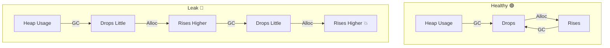

# 第18章：Node特有の健康指標① メモリ 🧠🫀📈

この章は「Node/TSのアプリが、いま元気か？」を**メモリ面から**チェックできるようになる回だよ〜！✨
“落ちる前に気づく”のが目的だよ🧯💥

---

## 1) この章のゴール 🎯✨

できるようになったら勝ち！💪😊

* **メモリの数字（RSS / heapUsed など）**を見て「何が起きてる？」が言える👀
* **最低限のメモリ系メトリクス**を実装して `/metrics` に出せる🧩
* **危険な増え方（リークっぽい）**を見分けられる🚨
* アラートの“ざっくり安全ライン”を作れる🔔

---

## 2) まず覚える：Nodeのメモリ5兄弟 👨‍👩‍👧‍👦🧠

Node には `process.memoryUsage()` っていう、メモリ内訳を取れる仕組みがあるよ✨
返ってくる代表がこの5つ👇（単位は **bytes**） ([nodejs.org][1])

| 名前             | ざっくり意味                  | 何に効く？               |
| -------------- | ----------------------- | ------------------- |
| `rss`          | **プロセスが掴んでる総メモリ**（OS目線） | 「本当にヤバい？」の最終判断🫀    |
| `heapTotal`    | JS用ヒープに **確保された総量**     | ヒープ確保の規模感📦         |
| `heapUsed`     | ヒープの **使用中（生きてる）**      | **リーク検知の主役**🕵️‍♀️  |
| `external`     | V8ヒープ外（C++バインディング等）     | Buffer/ネイティブ絡み疑い🔌  |
| `arrayBuffers` | Buffer系などの確保量           | **Buffer溜め込み**の疑い🧊 |

> 💡ポイント：`heapUsed` が増え続けるのは “リーク疑い” の代表例だよ〜 ([nodejs.org][1])

---

## 3) “危険な増え方”の見分け方 🚦📉📈




### ✅ 健康的な波（よくある）🌊🙂

* `heapUsed` が **ギザギザ**（増える→GCで落ちる→増える）
  → GC（ガベコレ）が働いてるサイン🧹

### 🚨 リークっぽい波（要注意）🧨

* `heapUsed` が **右肩上がり**で、GCが来ても戻らない📈📈📈
* 数時間〜数日でじわじわ増えて、ある日突然落ちる💥

### 🧩 ちょい罠：RSSは落ちないことがある 🪤

`heapUsed` が下がっても、`rss` があまり下がらないことがあるよ。
OSが「また使うかもだし、プロセスに持たせとこ」ってページを保持したりするからね🧠
（他プロセスの都合でページが戻ったりもする） ([GitHub][2])

---

## 4) “まず取るべき”メモリ系メトリクスセット 📦📊✨

この章では「最小で強い」セットにするよ🪄

* `process_memory_rss_bytes`（= rss）🫀
* `process_memory_heap_used_bytes`（= heapUsed）🕵️‍♀️
* `process_memory_heap_total_bytes`（= heapTotal）📦
* `process_memory_external_bytes`（= external）🔌
* `process_memory_arraybuffers_bytes`（= arrayBuffers）🧊
* `v8_heap_size_limit_bytes`（ヒープ上限）🚧

  * `v8.getHeapStatistics()` で取れるよ✨ ([nodejs.org][1])

> ヒープ上限の `heap_size_limit` は「デフォルト（環境依存） or `--max_old_space_size` で決まる」って扱いだよ ([nodejs.org][3])

---

## 5) 実装してみよう：/metrics にメモリを出す 🧩🚀

ここは **Prometheus形式**でいくよ！（シンプルで強い✨）

### 5-1) まずは最短：prom-client で箱を作る 📦

> ⚠️メモ：`collectDefaultMetrics()` の一部（FD系やメモリ系の一部）は Linux 限定のものがあるよ、って注意があるの。だから **自前でメモリGaugeを用意**するとWindowsでも安定するよ👍 ([GitHub][4])

#### `src/metrics/memory.ts`

```ts
import client from "prom-client";
import v8 from "node:v8";

const rss = new client.Gauge({
  name: "process_memory_rss_bytes",
  help: "Resident Set Size (bytes).",
});

const heapTotal = new client.Gauge({
  name: "process_memory_heap_total_bytes",
  help: "V8 heap total (bytes).",
});

const heapUsed = new client.Gauge({
  name: "process_memory_heap_used_bytes",
  help: "V8 heap used (bytes).",
});

const external = new client.Gauge({
  name: "process_memory_external_bytes",
  help: "V8 external memory (bytes).",
});

const arrayBuffers = new client.Gauge({
  name: "process_memory_arraybuffers_bytes",
  help: "ArrayBuffers / Buffer-like memory (bytes).",
});

const heapLimit = new client.Gauge({
  name: "v8_heap_size_limit_bytes",
  help: "V8 heap size limit (bytes).",
});

const heapUsedRatio = new client.Gauge({
  name: "v8_heap_used_ratio",
  help: "heapUsed / heap_size_limit (0.0 - 1.0).",
});

export function collectMemoryMetrics() {
  const m = process.memoryUsage(); // rss/heapTotal/heapUsed/external/arrayBuffers が取れるよ :contentReference[oaicite:6]{index=6}
  rss.set(m.rss);
  heapTotal.set(m.heapTotal);
  heapUsed.set(m.heapUsed);
  external.set(m.external);
  arrayBuffers.set(m.arrayBuffers);

  const hs = v8.getHeapStatistics();
  heapLimit.set(hs.heap_size_limit); // heap_size_limit の説明は v8 doc にあるよ :contentReference[oaicite:7]{index=7}
  heapUsedRatio.set(m.heapUsed / hs.heap_size_limit);
}
```

#### `src/server.ts`（例：Express）

```ts
import express from "express";
import client from "prom-client";
import { collectMemoryMetrics } from "./metrics/memory.js";

const app = express();

// ここは“ついで”でOK（Windowsで取れないものがあっても、自前メトリクスが主役）
client.collectDefaultMetrics();

app.get("/metrics", async (_req, res) => {
  collectMemoryMetrics();

  res.setHeader("Content-Type", client.register.contentType);
  res.end(await client.register.metrics());
});

app.get("/work", async (_req, res) => {
  // 何か仕事してる体でOK
  res.json({ ok: true });
});

app.listen(3000, () => {
  console.log("http://localhost:3000");
});
```

### 5-2) 動作チェック（Windows）🪟✅

PowerShellで👇

```powershell
## /work 叩く
irm http://localhost:3000/work

## /metrics 見る
irm http://localhost:3000/metrics | Select-String "process_memory_|v8_heap_"
```

---

## 6) “危険ライン（目安）”を決める 🚨📏

いきなり完璧は無理！なので**まずは目安でOK**にするよ😊✨

### 6-1) まず一番わかりやすい：比率で見る 📌

`v8_heap_used_ratio = heapUsed / heap_size_limit`

* **0.70 超えが続く**：黄色信号🟡（GC頻発＆遅くなりがち）
* **0.85 超えが続く**：赤信号🔴（OOMが近い）

> ヒープ上限は `v8.getHeapStatistics()` で取れるよって公式にも書いてあるよ ([nodejs.org][1])

### 6-2) “増え続け”検知も超大事 📈🧨

リークは「しきい値」より「傾き」が強い！

* 例：`heapUsed` が 10分で +50MB 以上増え続けるなら警戒…みたいなルールにすると良いよ🕵️‍♀️

---

## 7) アラートが鳴ったら：3分トリアージ手順 ⏱️🧯

### Step 1：まず `heapUsed` と `rss` を見る 👀

* `heapUsed` が増え続ける → **JSオブジェクト保持（リーク）**疑い🧟‍♀️
* `rss` だけ増える / `external` が大きい → **Buffer / ネイティブ / 画像 / 圧縮**疑い🧊🔌

### Step 2：ヒープ上限に近いかチェック 🚧

`heapUsedRatio` が高い状態で張り付くなら、OOMが近いかも💥
（`heap_size_limit` の意味は v8 doc にあるよ） ([nodejs.org][3])

### Step 3：原因調査に入る（次章以降にも繋がるよ）🧵

* まずは **Heap Snapshot** が超強い🧠📸
  Nodeを `--inspect` で起動して、Inspectorの Memory タブからスナップショット取れるよ ([nodejs.org][5])
* もっと低レベルに見るなら `--trace-gc` でGCログも出せる（ただしログ爆増注意） ([nodejs.org][6])

---

## 8) ミニ演習：わざとリークさせて見抜く 🧪🕵️‍♀️

### 8-1) “ダメな例”を作る（グローバル溜め込み）😱

```ts
// server.ts のどこか上の方に…
const leakBag: Buffer[] = [];

app.get("/leak", (_req, res) => {
  // 1回アクセスで 5MB 追加（わざと）
  leakBag.push(Buffer.alloc(5 * 1024 * 1024));
  res.json({ size: leakBag.length });
});
```

### 8-2) 叩いて観察 👀📈

```powershell
1..30 | % { irm http://localhost:3000/leak | Out-Null }
irm http://localhost:3000/metrics | Select-String "process_memory_heap_used_bytes|process_memory_rss_bytes|v8_heap_used_ratio"
```

✅ ここでの学び

* `heapUsed` が右肩上がりになったら「保持してる！」って感覚が掴めるよ😊

### 8-3) “直す”方向性（超ざっくり）🧯✨

* グローバルに溜めない（必要なら **LRU** にする）🧊
* Listener を増やしっぱなしにしない（`on` したら `off`）🎧
* 大きいBufferは使い回し/ストリーム化を検討🚰

---

## 9) AIの使いどころ（楽して強くなる🤖✨）

### ✅ 使ってOKなお願い例 💬

* 「このアプリにメモリGaugeを追加して、/metricsに出して」🧩
* 「heapUsed と rss の違いを、初心者向けに一言でまとめて」📝
* 「このメトリクス名、命名ゆれ直して」🏷️

### ⚠️ 1個だけ注意 ☝️

アラート閾値は“正解”がないから、AI案は**たたき台**にして
最後は「自分のアプリの平常値」を見て決めるのが安全だよ🛡️😊

---

## 10) まとめ 🎀✨

* メモリは **`heapUsed`（リーク検知）**と **`rss`（最終危険度）**が二大エース🕵️‍♀️🫀 ([nodejs.org][1])
* `v8.getHeapStatistics()` の `heap_size_limit` を取って **比率**で見ると超わかりやすい🚧✨ ([nodejs.org][3])
* 調査の切り札は **Heap Snapshot（--inspect）**📸、必要なら **GC trace（--trace-gc）**🧹 ([nodejs.org][5])
* Windowsでも安定させるために、メモリ系は **自前Gauge**にしておくと強いよ👍 ([GitHub][4])

---

次の章（イベントループ遅延⏳⚙️）と合わせると、「遅い・詰まる・落ちる」が一気に見えるようになるよ〜！🚀✨

[1]: https://nodejs.org/en/learn/diagnostics/memory/understanding-and-tuning-memory "Node.js — Understanding and Tuning Memory"
[2]: https://github.com/nodejs/help/issues/4201?utm_source=chatgpt.com "Node.js process rss going down but heapTotal and ..."
[3]: https://nodejs.org/api/v8.html?utm_source=chatgpt.com "V8 | Node.js v25.3.0 Documentation"
[4]: https://github.com/siimon/prom-client "GitHub - siimon/prom-client: Prometheus client for node.js"
[5]: https://nodejs.org/en/learn/diagnostics/memory/using-heap-snapshot?utm_source=chatgpt.com "Using Heap Snapshot"
[6]: https://nodejs.org/en/learn/diagnostics/memory/using-gc-traces?utm_source=chatgpt.com "Tracing garbage collection"
