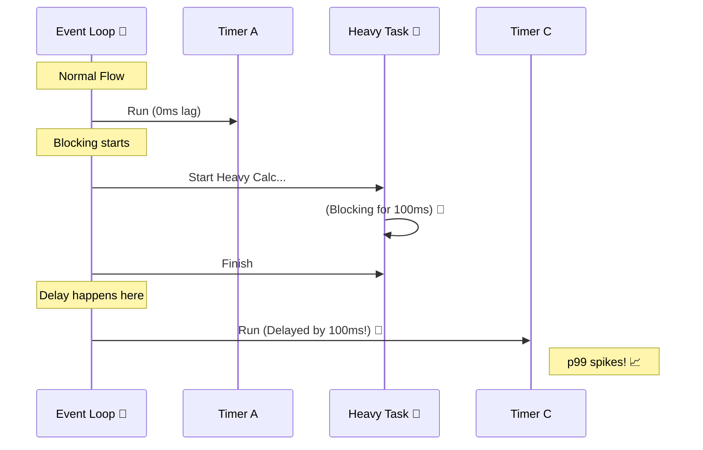

# 第19章：Node特有の健康指標② イベントループ遅延 ⏳⚙️🧵✨

「なんか全体がモッサリ…😵‍💫 でもメモリは大丈夫そう…」みたいな時、**イベントループ遅延（Event Loop Delay / Lag）**が犯人のこと、めっちゃ多いです👀✨
この章では、**“詰まり”を数値で検知して、原因に近づく道筋**を作ります🧭💡

---

## 1) まずイメージ：イベントループは“1人レジ”🧍‍♀️🛒




Node.jsのメインスレッド（イベントループ）は、ざっくり言うと **「順番に処理する1本のレーン」**です🎢

* ふだん：I/O（DBやHTTP）は待ってる間に別の仕事できる🧵✨
* でも：**重い同期処理（CPU計算 / 巨大JSON / sync I/O）**が来ると、レーンが詰まる🚧💥
* 結果：タイマーが遅れる、レスポンスが遅れる、p99が跳ねる🏃‍♂️💨

この「タイマーが遅れて発火する遅れ」を観測するのが、**monitorEventLoopDelay**です。Node公式の `perf_hooks.monitorEventLoopDelay()` は、**libuvのイベントループに紐づいたタイマー遅延**でイベントループの遅れをサンプルし、**ナノ秒で報告**します⏱️（これがまさに狙い） ([nodejs.org][1])

---

## 2) この章のゴール 🎯✨

できるようになればOKです😊🫶

* ✅ **イベントループ遅延（p50/p95/p99）**を取って、ダッシュボードに出せる
* ✅ **症状 → 原因候補**をパターンで当てられる（詰まり探偵🕵️‍♀️）
* ✅ “とりあえずCPU/メモリだけ見る”から卒業できる🎓✨

---

## 3) まず見るべき指標セット 🧰📈

### A. イベントループ遅延（Delay / Lag）⏳

* **min / mean / max**
* **p50 / p90 / p99**（特に p99が超重要🔥）
* Nodeの `monitorEventLoopDelay()` は **`IntervalHistogram`** を返して、`min/max/mean/stddev` や `percentile(99)` みたいな値が取れます ([nodejs.org][1])

### B. イベントループ利用率（ELU）⚙️

「どれくらい忙しいか」を見る相棒です🤝✨
`eventLoopUtilization()` は、イベントループが **idle / active** だった累積時間と、計算済みの **utilization（ELU）** を返します ([nodejs.org][1])
しかも差分計算もできるので、**5秒ごと**みたいに区切って「今のELU」を作れます ([nodejs.org][1])

> Delay = 「遅れてる？」⏳
> ELU   = 「忙しすぎ？」⚙️
> 2つセットで見ると、**“なぜp99が悪いのか”が急に分かる**ようになります😊✨

---

## 4) “良い/危ない”の目安（最初の仮置き）🚦✨

最初はこのくらいの温度感でOKです（あとであなたのサービスに合わせて調整🎛️）

例として、イベントループ遅延の健康判定を

* **HEALTHY: p99 < 100ms**
* **WARNING: p95 > 50ms or p99 100–250ms**
* **CRITICAL: p99 > 250ms**
  みたいに整理してる例があります🧪 ([devcenter.upsun.com][2])

さらにSLOの“出発点”として

* **ELU(p95, 5分) < 0.75**
* **イベントループ遅延(p99, 5分) < 200ms**
  みたいな現場寄りの目安も提案されています（あくまでスタート地点ね🙏） ([Medium][3])

---

## 5) 実装：イベントループ遅延をTSで計測する 🧪🧰✨

### 5-1. いちばん素直：`monitorEventLoopDelay()` を使う⏳

ポイントは2つだけ💡

* **値はナノ秒**（msに直す） ([nodejs.org][1])
* **resolution（ms）**はサンプリング間隔（細かいほど精密、でも多少コスト） ([nodejs.org][1])

```ts
// src/observability/eventLoopDelay.ts
import { monitorEventLoopDelay } from "node:perf_hooks";

const histogram = monitorEventLoopDelay({ resolution: 20 }); // 20msごとにサンプル
histogram.enable();

const nsToMs = (ns: number) => ns / 1e6;

export type EventLoopDelaySnapshot = {
  p50Ms: number;
  p95Ms: number;
  p99Ms: number;
  maxMs: number;
  meanMs: number;
};

export function sampleEventLoopDelayAndReset(): EventLoopDelaySnapshot {
  // 取り方はシンプル：percentile() が使える✨ :contentReference[oaicite:8]{index=8}
  const p50 = nsToMs(histogram.percentile(50));
  const p95 = nsToMs(histogram.percentile(95));
  const p99 = nsToMs(histogram.percentile(99));

  const max = nsToMs(histogram.max);
  const mean = nsToMs(histogram.mean);

  // 1サンプル窓を作りたいのでリセット（運用の好みでOK）
  histogram.reset();

  return { p50Ms: p50, p95Ms: p95, p99Ms: p99, maxMs: max, meanMs: mean };
}
```

---

### 5-2. 相棒：ELU（Event Loop Utilization）も取る⚙️✨

ELUは「忙しさ」。Node公式いわく、CPU利用率っぽいけど **イベントループがevent provider（例: epoll_wait）“の外”にいた割合**です ([nodejs.org][1])
（つまり **同期で詰まるとELUが1に張り付く**こともある…！😇）

```ts
// src/observability/elu.ts
import { eventLoopUtilization } from "node:perf_hooks";

let last = eventLoopUtilization();

export function sampleElu(): number {
  // 差分が取れるのが便利✨ :contentReference[oaicite:10]{index=10}
  const current = eventLoopUtilization(last);
  last = eventLoopUtilization();
  return current.utilization; // 0.0〜1.0 :contentReference[oaicite:11]{index=11}
}
```

---

## 6) まずは“ログで見える化”して感覚を掴む 👀🪵✨

メトリクス基盤に入れる前に、**5秒ごとにログ**でも全然OKです😊
（このあと第22章でダッシュボードに載せると一気に強くなる💪📊）

```ts
// src/observability/loopHealthLogger.ts
import { sampleEventLoopDelayAndReset } from "./eventLoopDelay";
import { sampleElu } from "./elu";

export function startLoopHealthLogger() {
  setInterval(() => {
    const d = sampleEventLoopDelayAndReset();
    const elu = sampleElu();

    console.log(
      JSON.stringify({
        msg: "loop_health",
        elu,
        eventLoopDelayMs: {
          p50: d.p50Ms,
          p95: d.p95Ms,
          p99: d.p99Ms,
          max: d.maxMs,
          mean: d.meanMs,
        },
      })
    );
  }, 5000);
}
```

---

## 7) “メトリクスとして出す”なら：Prometheusが最短 🏁📈✨

`prom-client` の `collectDefaultMetrics()` を使うと、**イベントループ遅延系のメトリクスが最初から揃います**🎁✨
例：`nodejs_eventloop_lag_p99_seconds` など（秒単位） ([tessl.io][4])
サンプリング精度は `eventLoopMonitoringPrecision`（ms）で調整できます ([tessl.io][4])

```ts
// src/metrics/prometheus.ts
import express from "express";
import { collectDefaultMetrics, register } from "prom-client";

collectDefaultMetrics({
  eventLoopMonitoringPrecision: 10, // ms（細かいほど精密、コスト増） :contentReference[oaicite:14]{index=14}
});

export function mountMetricsEndpoint(app: express.Express) {
  app.get("/metrics", async (_, res) => {
    res.setHeader("Content-Type", register.contentType);
    res.end(await register.metrics());
  });
}
```

👉 これで `nodejs_eventloop_lag_p99_seconds` とかが取れます（まずは“あるだけで勝ち”🥳） ([tessl.io][4])

---

## 8) OTel派なら：Nodeランタイム計測を自動で生やせる 🌱🧵✨

OpenTelemetry側でも、Nodeランタイム指標の“意味づけ”が進んでいて、イベントループ遅延は
`nodejs.eventloop.delay.p99`（単位s）みたいに **分割されたGauge**として扱う設計になっています（Nodeがヒストグラム全体を返さない前提） ([OpenTelemetry][5])

また、`@opentelemetry/instrumentation-runtime-node` は `monitoringPrecision`（ms）でELU集計の粒度を決められます ([app.unpkg.com][6])

---

## 9) ミニ演習：わざと詰まらせてグラフを動かす 🧪💥📈

「体験」すると一気に腹落ちします😊✨
**“わざとCPUを塞ぐ”**エンドポイントを作って、p99が跳ねるのを見るよ👀🔥

```ts
// src/routes/block.ts
import type { Request, Response } from "express";

function busyWait(ms: number) {
  const end = Date.now() + ms;
  while (Date.now() < end) {
    // 何もしない（=イベントループを塞ぐ😱）
  }
}

export function blockRoute(req: Request, res: Response) {
  const ms = Number(req.query.ms ?? 200);
  busyWait(ms);
  res.json({ ok: true, blockedMs: ms });
}
```

### 観察ポイント👀✨

* `/block?ms=200` を連打すると…

  * ✅ **eventLoopDelay p99 が上がる**
  * ✅ **ELUが上がる**
  * ✅ リクエストレイテンシも悪化（第17章のREDと繋がる）🚦⏱️

---

## 10) 症状 → 原因候補（すぐ使える早見表）🧾🔍✨

| 観測の形👀              | ありがちな原因😇                      | 次の一手🧭                                                      |
| ------------------- | ------------------------------ | ----------------------------------------------------------- |
| p99だけ尖る🏔️          | 特定リクエストで重い同期処理                 | “遅いリクエスト”をログ/トレースで特定（第28章へ）                                 |
| p50もp99も全体的に高い😵‍💫 | 恒常的にCPU過負荷、並列やりすぎ              | 仕事量を減らす/並列数を制限/重い処理をオフロード                                   |
| ELUが高いのにCPUが低め🤔    | 同期ブロック（spawnSync等）でイベントループが止まる | 同期APIを排除（Node公式の例でもブロックでELU=1になる） ([nodejs.org][1])         |
| maxがたまにドカン💥        | “たまに来る巨大入力”でJSON/検証/圧縮が重い      | 入力サイズ制限、分割、Worker threads検討（例あり） ([devcenter.upsun.com][2]) |

---

## 11) ちょい上級：uvの内部指標もヒントになる🧠🧪

Nodeには `performance.nodeTiming.uvMetricsInfo` で **loopCount / events / eventsWaiting** を取れる機能もあります（比較的新しめ） ([nodejs.org][1])
「イベントが溜まってる？」みたいな当たりをつける材料になります🎯✨
（集計タイミングは `setImmediate` の中が推奨、という注意もあります） ([nodejs.org][1])

---

## 12) AI活用（この章向け）🤖💖

### そのまま貼って使えるお願い文🎀

* 「`monitorEventLoopDelay` と `eventLoopUtilization` を5秒ごとにサンプルして、JSONログに出すモジュールをTSで作って。p50/p95/p99/max/meanをmsで。」
* 「イベントループ遅延が悪化した時の原因候補を、**“同期処理”観点で**優先度つきで10個出して。対策も1行ずつ。」
* 「/block エンドポイントで詰まりを再現したので、観測ログ例から“どう読めばいいか”を説明して。」

---

## まとめ 🎉✨（この章で一番大事なこと）

* **イベントループ遅延 = Nodeの“詰まり”メーター**⏳
* **p99**を見れば「ユーザーが痛い瞬間」が見える🔥
* **ELU**とセットにすると「忙しすぎ？止まってる？」が判別できる⚙️
* 実装は `perf_hooks` だけで始められる（しかも公式が意図を明言してる） ([nodejs.org][1])
* Prometheusなら `prom-client` のデフォルトメトリクスで最短導入できる📈 ([tessl.io][4])
* OTelでも意味づけ（メトリクス名）が整理されてきてる🧵 ([OpenTelemetry][5])

---

次の第20章（ビジネスメトリクス）に行く前に、もしよければ😊
あなたの題材API（/work /slow /fail）に合わせて、**「詰まりが起きやすい処理」候補**をこちらで“教材用にいい感じ”に仕込む案も出せますよ🧪💥✨

[1]: https://nodejs.org/api/perf_hooks.html "Performance measurement APIs | Node.js v25.3.0 Documentation"
[2]: https://devcenter.upsun.com/posts/event-loop-monitoring-in-nextjs-performance-guide/ "Event Loop Monitoring in Next.js: Performance Guide – Upsun Developer Center"
[3]: https://medium.com/%402nick2patel2/node-js-event-loop-utilization-slos-measure-alert-and-fix-tail-latency-in-prod-c84326a50ca4 "Node.js Event Loop Utilization SLOs: Measure, Alert, and Fix Tail Latency in Prod | by Codastra | Dec, 2025 | Medium"
[4]: https://tessl.io/registry/tessl/npm-prom-client/15.1.0/files/docs/default-metrics.md "tessl/npm-prom-client@15.1.x - Registry - Tessl"
[5]: https://opentelemetry.io/docs/specs/semconv/runtime/nodejs-metrics/ "Semantic conventions for Node.js runtime metrics | OpenTelemetry"
[6]: https://app.unpkg.com/%40opentelemetry/instrumentation-runtime-node%400.20.0/files/README.md "UNPKG"
