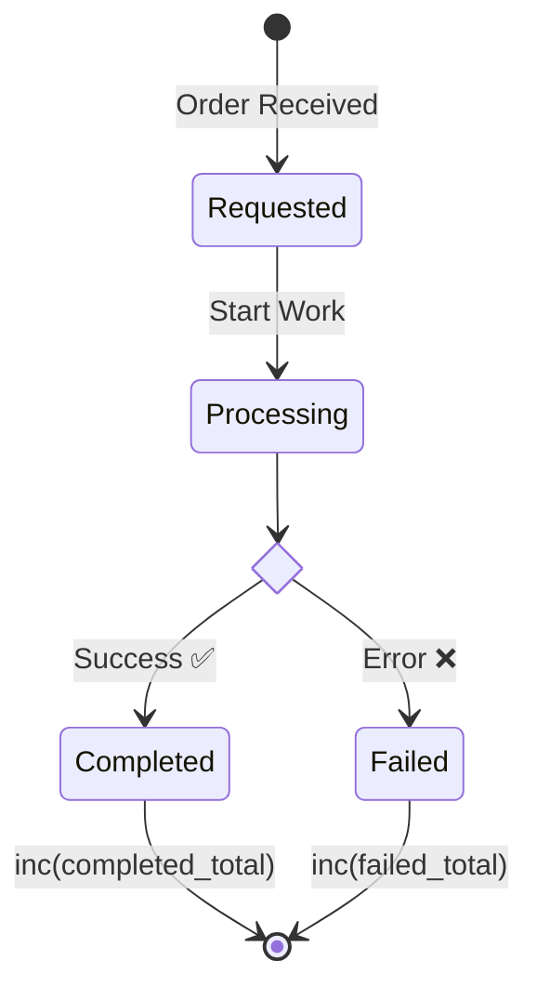

# 第20章：ビジネスメトリクス設計💰📈（価値を“数える”ってこういうこと！）

## この章のゴール🎯✨

* 「技術の数字（遅い/落ちる）」だけじゃなく、「価値の数字（成功した/売れた/完了した）」を設計できるようになる🙌
* **“成功数”と“失敗理由別カウント”**を、あとで運用しやすい形で作れるようになる🧠🏷️
* コードにメトリクスを入れて、ダッシュボードに載せるまでのイメージが持てる🚀📊

---

## 1) そもそもビジネスメトリクスって？🤔💡

**ビジネスメトリクス = 「ユーザーや事業にとっての“成果/価値”を表す数字」**だよ💎✨
たとえば…

* 技術メトリクス：レイテンシ、CPU、エラー率（“動いてる？”）⚙️
* ビジネスメトリクス：完了数、成功率、失敗理由の内訳、売上、申込数（“価値出てる？”）💰

ポイントはこれ👇
**「意思決定に使える数字」だけを数える**📌
（“見れたら嬉しい”だけで増やすと、運用が重くなってしんどい😵‍💫）

---

## 2) いきなり設計せず、先に“価値”を1行で決めよ✍️✨

まずこれを1行で書くのが最強📝💕

> このサービスの価値は「○○が□□できる」こと

例：

* 「ユーザーがレポート生成（work）を完了できる」
* 「注文が成立する」
* 「問い合わせが送信できる」

この1行が決まると、数えるべき“成功”がブレなくなるよ🧭✨

---

## 3) “成功”を状態遷移にする（めちゃ大事）🧱➡️🏁




ビジネスメトリクスは、だいたい **状態（ステータス）**で作ると強い💪✨

例（work APIっぽい世界）

* `requested`（受付）
* `processing`（処理中）
* `completed`（成功）✅
* `failed`（失敗）❌

ここまで分解できると、次が作れる👇

* 成功数（completedの回数）
* 失敗数（failedの回数）
* 失敗理由別（failedの“理由”の内訳）

---

## 4) “成功数”と“失敗理由別カウント”の設計テンプレ🧩✨

ビジネスメトリクスは、まずこの2本でOK🥰

### ✅ メトリクス①：成功数（価値が出た回数）

* 名前例：`work_completed_total`
* 型：Counter（積み上がる回数）
* 意味：成功した“成果”の回数

> PrometheusではCounterに `_total` を付けるのが慣習だよ📏✨ ([prometheus.io][1])

### ❌ メトリクス②：失敗理由別カウント

* 名前例：`work_failed_total{reason="timeout"}`
* 型：Counter
* 意味：失敗が増えてる理由を“すぐ特定”するため

**reason は「種類が増えすぎない」集合に限定！**
（次章の“ラベル爆発”につながるところ⚠️）

---

## 5) 失敗理由（reason）は“上限がある辞書”にする📚🧠

おすすめは、最初から**固定の候補**を決めちゃうやり方💡

例（work APIなら）👇

* `timeout`（外部I/Oが遅い）⏳
* `validation`（入力が不正）🧾
* `dependency`（外部サービス落ち）🔌
* `unknown`（分類不能）👻

🚫やっちゃダメ例（ラベル爆発＆危険）

* `reason="ユーザーID"`
* `reason="例外メッセージ全文"`
* `reason="リクエストID"`

「ユニーク値・無限に増える値」をラベルに入れると、監視基盤が重くなりやすい⚠️（cardinalityの事故） ([dash0.com][2])

---

## 6) 実装ハンズオン（Prometheus prom-client 版）🧪📈✨

初心者に一番わかりやすい形でいくよ🙌
（“どう数えるか”がスッと入る）

### 6-1) メトリクス定義（成功/失敗）🧱

```ts
import express from "express";
import { Counter, Registry, collectDefaultMetrics } from "prom-client";

const app = express();
app.use(express.json());

// レジストリ（メトリクスの保管庫）
const registry = new Registry();

// Node/プロセスの基本メトリクス（任意だけど便利）
collectDefaultMetrics({ register: registry }); // prom-client推奨のdefault metricsがあるよ :contentReference[oaicite:2]{index=2}

// ✅ 成功数
const workCompletedTotal = new Counter({
  name: "work_completed_total",
  help: "Number of completed work (business success)",
  registers: [registry],
});

// ❌ 失敗数（理由別）
const workFailedTotal = new Counter({
  name: "work_failed_total",
  help: "Number of failed work (business failure) by reason",
  labelNames: ["reason"] as const,
  registers: [registry],
});

// /metrics を公開（Prometheusがここを取りに来る）
app.get("/metrics", async (_req, res) => {
  res.setHeader("Content-Type", registry.contentType);
  res.send(await registry.metrics());
});
```

### 6-2) “成功”と“失敗理由”を数える場所（超重要）📌✨

「成功した瞬間」「失敗が確定した瞬間」で1回だけ増やすのがコツ🙆‍♀️

```ts
type FailReason = "timeout" | "validation" | "dependency" | "unknown";

function normalizeFailReason(e: unknown): FailReason {
  // ここは超ざっくり例！本番はルールを育ててOK👌
  const msg = e instanceof Error ? e.message : String(e);
  if (msg.includes("timeout")) return "timeout";
  if (msg.includes("validation")) return "validation";
  if (msg.includes("ECONNREFUSED") || msg.includes("dependency")) return "dependency";
  return "unknown";
}

app.post("/work", async (_req, res) => {
  try {
    // 例：外部I/Oや重い処理がある前提
    // await doWork();

    // ✅ 成功（価値が出た！）
    workCompletedTotal.inc(1);

    res.json({ ok: true });
  } catch (e) {
    const reason = normalizeFailReason(e);
    // ❌ 失敗（理由別にカウント）
    workFailedTotal.labels(reason).inc(1);

    res.status(500).json({ ok: false, reason });
  }
});
```

### 6-3) 動作チェック（WindowsのPowerShell想定）🪟✨

```powershell
## 成功を何回か
Invoke-RestMethod -Method Post -Uri http://localhost:3000/work -ContentType "application/json" -Body "{}"

## メトリクスを見る
Invoke-WebRequest http://localhost:3000/metrics | Select-Object -ExpandProperty Content
```

`work_completed_total` や `work_failed_total{reason="..."}` が増えてたら勝ち🏆🎉

---

## 7) “ビジネスメトリクス”の読み方（ダッシュボード脳）🧠📊✨

まずはこの3つを見るだけでOK🙆‍♀️

1. ✅ **成功数（今日/1時間/5分）**：価値が出てる？
2. ❌ **失敗数（同じ期間）**：価値が止まってない？
3. 🏷️ **失敗理由の内訳**：何が邪魔してる？

さらに強くするなら👇

* **成功率** = 成功 / (成功 + 失敗)
* **失敗理由トップ** = reason別のランキング

---

## 8) 発展：OpenTelemetryで“将来の統合”に寄せる🧵📈✨

この後トレースも扱う流れだから、最終的に **OTLPでまとめて送る**構成に寄せるのもアリ🙌
OpenTelemetryのMetrics APIは `MeterProvider → Meter → Instrument` みたいな構造だよ ([OpenTelemetry][3])

さらに、OTLP exporter は環境変数で設定できる（endpointとか）ので、運用に強い💪 ([OpenTelemetry][4])

※ちなみに、OTelのJSメトリクスexporter系パッケージは“experimental”表記が付くものもあるので、採用時はリリースノート確認が安心だよ📦👀 ([npm][5])

---

## 9) ミニ演習（この章の本題！）📝💕

あなたの題材APIで、次の2つを**自分の言葉で**決めてみてね✨

### 演習A：価値指標を2つ決める🎯

例：

* `work_completed_total`：価値が出た回数✅
* `work_failed_total{reason}`：価値を止める要因❌

### 演習B：説明文（1行）を添える✍️

* 何を数える？
* それが増えると何が嬉しい？
* それが増えすぎると何が困る？

---

## 10) AIにお願いするプロンプト例🤖💬✨

コピペで使ってOK！

* 「このサービスの“価値”を1行で言い切って。対象は○○。ユーザーのゴールは△△。」
* 「成功/失敗を状態遷移に分解して。イベント名も提案して。」
* 「失敗reasonの候補を“増えすぎない集合”で10個出して。分類ルールも添えて。」
* 「Prometheus向けにメトリクス名を整えて。Counterは `_total` の慣習に合わせて。」 ([prometheus.io][1])

---

## まとめ🎀✨

* ビジネスメトリクスは「価値を数える」💰📈
* まずは **成功数** と **失敗理由別カウント** の2本でOK✅❌
* reason（ラベル）は“増えすぎない辞書”に固定するのが勝ち🏷️✨
* 実装は「成功/失敗が確定した瞬間」に1回だけ増やす📌

次の第21章は、ここで出てきた「ラベル爆発（cardinality）」をガッツリ安全運用に落とし込むよ〜！⚠️🏷️🔥

[1]: https://prometheus.io/docs/practices/naming/?utm_source=chatgpt.com "Metric and label naming"
[2]: https://www.dash0.com/knowledge/prometheus-metrics?utm_source=chatgpt.com "Understanding the Prometheus Metric Types"
[3]: https://opentelemetry.io/docs/specs/otel/metrics/api/?utm_source=chatgpt.com "Metrics API"
[4]: https://opentelemetry.io/docs/languages/sdk-configuration/otlp-exporter/?utm_source=chatgpt.com "OTLP Exporter Configuration"
[5]: https://www.npmjs.com/package/%40opentelemetry/exporter-metrics-otlp-http?utm_source=chatgpt.com "@opentelemetry/exporter-metrics-otlp-http"
