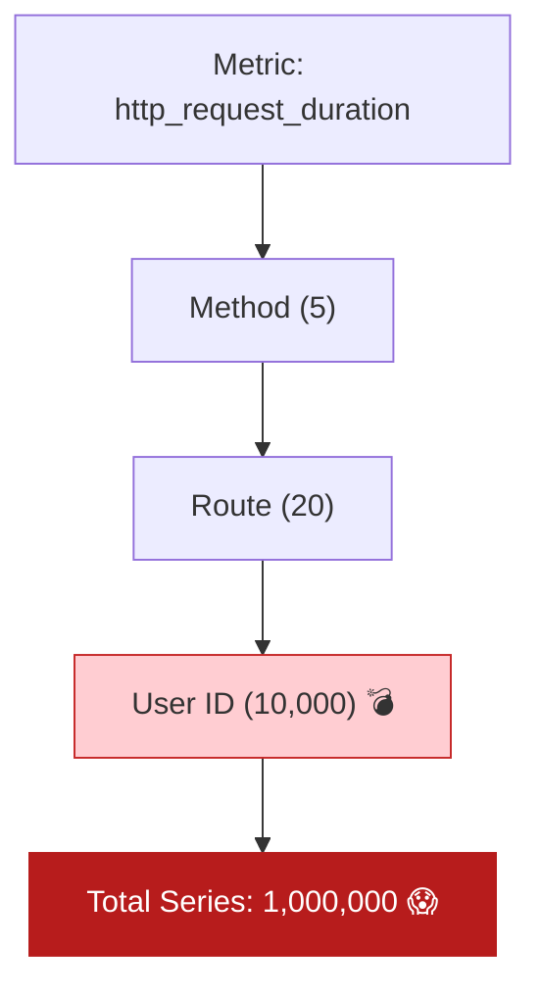

# 第21章：ラベル設計（爆発注意！）🏷️⚠️📈✨

この章は**「メトリクスのラベル（= 絞り込み用タグ）」を安全に設計**できるようになる回だよ〜！😊🎓
ラベルをミスると、メトリクスが**増殖して重くなる（＝cardinality爆発）**ので、ここは超大事🔥

---

## この章のゴール 🎯✨

* **cardinality（カーディナリティ）**を、図なしでも説明できる👀
* **OKなラベル / NGなラベル**を判断できる✅❌
* TypeScript（Node/Express想定）の計測で、**爆発しないラベル運用**を作れる🧩🛡️

---

## 1) まず「ラベル」ってなに？🏷️🧠

メトリクスはざっくりこう👇

* **メトリクス名**：例）`http.server.duration`（リクエスト処理時間）⏱️
* **値**：例）123ms
* **ラベル**：例）`method=GET`、`route=/users/:id`、`status=200`

この「ラベル」は、あとで
「GETだけ見たい」「このAPIだけ遅い？」みたいに**切り分けるためのタグ**だよ〜🔎✨

そして重要ポイント👇
**ラベルの組み合わせが1つ増えるたびに、別の時系列（time series）が増える**💥
Prometheus系だとこれが特に効いてくるよ〜😵‍💫（“ラベル＝強い、でも危険”）([prometheus.io][1])

---

## 2) cardinality（爆発）ってなに？💣📈




**cardinality =「ラベルの組み合わせの種類数」**だよ🧮✨

たとえば👇

* `method` が 5種類（GET/POST/...）
* `route` が 30種類
* `status` が 10種類（200/201/400/...）

だと、最大で
**5 × 30 × 10 = 1500 通り**
→ つまり最大1500本の時系列が生える🌱🌱🌱

ここに、もし `userId`（ユーザー数ぶん）とか `requestId`（リクエスト数ぶん）を入れたら…？
**時系列が無限に増えて、メモリ・保存・検索が重くなる**😇➡️😱

OpenTelemetry でも「属性（= ラベル相当）の組み合わせ数＝cardinality」と定義されていて、SDK側で**cardinality limit（上限）**を持つべきとされてるよ([OpenTelemetry][2])

---

## 3) まず結論：ラベルは「有限で」「分類っぽいもの」だけ🧁✅

ラベルにして良いのは、だいたいこの条件👇

* **値が有限（上限がある）**🧱
* **カテゴリ分けになる**📦
* **あとで切り分けたい軸**になってる🔎

逆にダメなのは👇

* **ユーザーごと**👤
* **リクエストごと**🧾
* **自由入力**📝（エラーメッセージ全文とか）
* **生のURL**🌐（`/users/12345` みたいなやつ）

このへんは定番NGとして色んな資料で繰り返し言われてるよ〜([Grafana Labs][3])

---

## 4) OK / NGラベル早見表📋✨（この章のメイン！）

| 目的       | OKラベル例 ✅                                      | NGラベル例 ❌                             | 理由               |
| -------- | --------------------------------------------- | ------------------------------------ | ---------------- |
| APIの切り分け | `route=/users/:id`                            | `path=/users/12345`                  | 具体値だと無限増殖😱      |
| HTTPの分類  | `method=GET`                                  | `userAgent=...`                      | UAは種類が多すぎがち🌀    |
| 結果の分類    | `status=200` / `status_class=2xx`             | `error_message="SQL timeout at ..."` | 自由テキストは爆発💥      |
| 依存先の分類   | `db_system=postgresql`                        | `db_statement="SELECT ..."`          | SQL全文は無限＆機密も怖い🫣 |
| ビジネス指標   | `result=success/fail` `reason=INVALID_COUPON` | `coupon_code=ABCD1234`               | コードは無限＆個別すぎ🥲    |

## 💡超大事：URLは「route（ルートテンプレ）」で持つ！

OpenTelemetryのHTTPメトリクスでも `http.route` を使うのが基本の発想になってるよ([OpenTelemetry][4])
Expressなどの計装は「routeを低cardinalityにする」前提で設計されてる話もあるよ([GitHub][5])

---

## 5) TypeScript（Express）で「良いrouteラベル」を作る🧩🛠️✨

## ✅目標：`/users/12345` を `/users/:userId` に正規化する！

Expressはうまく書くと `req.route?.path` が `/:userId` みたいな形を返してくれるよ👍
なので **「生path」じゃなく「テンプレroute」** を使うのがコツ🪄

---

## サンプル：爆発しないHTTPメトリクス（Prometheus exporter）📈✨

※ Prometheus exporter は `@opentelemetry/exporter-prometheus` が定番で、今も更新が続いてるよ([npm][6])

```ts
// instrumentation.ts
import { NodeSDK } from "@opentelemetry/sdk-node";
import { PrometheusExporter } from "@opentelemetry/exporter-prometheus";
import { getNodeAutoInstrumentations } from "@opentelemetry/auto-instrumentations-node";

const prometheusReader = new PrometheusExporter({
  port: 9464,
  endpoint: "/metrics",
});

export const otelSdk = new NodeSDK({
  metricReader: prometheusReader,
  instrumentations: [getNodeAutoInstrumentations()],
});

// アプリ起動より先に呼ぶ（最重要！）
export async function startOtel() {
  await otelSdk.start();
}
```

```ts
// app.ts
import express from "express";
import { metrics } from "@opentelemetry/api";
import { startOtel } from "./instrumentation";

await startOtel();

const app = express();

// Meter（メトリクス作る人）
const meter = metrics.getMeter("demo-meter");

// “時間”は histogram が使いやすいよ⏱️
const httpServerDurationMs = meter.createHistogram("http_server_duration_ms", {
  description: "HTTP server duration",
  unit: "ms",
});

// routeテンプレを作る（ここが本章のキモ！）
function getRouteTemplate(req: any): string {
  // Express: req.baseUrl + req.route.path がテンプレになりやすい
  const baseUrl = req.baseUrl ?? "";
  const routePath = req.route?.path ?? "";
  const merged = `${baseUrl}${routePath}`.trim();

  // 404などは route が取れないことがあるので “unknown” に寄せる
  return merged.length > 0 ? merged : "unknown";
}

function statusClass(code: number): string {
  const c = Math.floor(code / 100);
  return `${c}xx`;
}

// 観測ミドルウェア（finishで計測）
app.use((req, res, next) => {
  const start = performance.now();

  res.on("finish", () => {
    const duration = performance.now() - start;

    // ✅ラベルは「有限な分類」だけにする
    httpServerDurationMs.record(duration, {
      "http.method": req.method,
      "http.route": getRouteTemplate(req), // ← 生pathじゃない！！
      "http.status_class": statusClass(res.statusCode), // ← 200/201/204…をまとめるのもアリ
    });
  });

  next();
});

// 例：ルート
app.get("/users/:userId", async (_req, res) => {
  res.json({ ok: true });
});

app.listen(3000, () => {
  console.log("server started: http://localhost:3000");
  console.log("metrics:        http://localhost:9464/metrics");
});
```

## ここが「爆発しない」ポイント🌸

* ✅ `http.route=/users/:userId`（テンプレ）
* ✅ `http.status_class=2xx/4xx/5xx`（まとめる）
* ❌ `userId=12345` をラベルにしない
* ❌ `path=/users/12345` をラベルにしない

「1リクエストを追いたい」気持ちはわかるけど、それは**メトリクスじゃなくてログ/トレースの役目**だよ🧵🪵✨

---

## 6) ラベル設計の手順（迷子防止マニュアル）🗺️✨

## ステップA：このメトリクスで答えたい質問を1つ書く📝

例）

* 「どのAPIが遅い？」
* 「エラーが増えてるのはどの分類？」

## ステップB：切り口（= ラベル）を最大3つに絞る✂️

迷ったらこの3つが鉄板👇

* `route`（テンプレ）
* `method`
* `status_class`

## ステップC：各ラベルに「値の上限（想定）」を書く🧮

* `method`: 5種類くらい
* `status_class`: 3〜5種類
* `route`: 〜50（このくらいに抑えたい！）

---

## 7) “cardinality保険”をかける🛡️✨（やらかし防止）

## ✅保険1：unknown / other に寄せる

* routeが取れない
* 変な値が来る
* 値が長すぎる

こういう時は、**潔く `unknown`** に寄せるのが勝ち🏆✨

## ✅保険2：Resource属性の「ラベル化」に注意⚠️

OpenTelemetry → Prometheus変換で、Resource属性がラベルになって増えると **cardinality explosion** になりやすい、って話もあるよ([OpenTelemetry][7])
（例：`service.instance.id` が毎回変わると地獄…😇）

## ✅保険3：SDKのcardinality limitを理解する

OpenTelemetry Metrics SDKには **cardinality limit**（属性組み合わせの上限）の考えがあるよ([OpenTelemetry][2])
つまり「無限に増やす設計」は、どのみちどこかで詰む💥
だから最初から「増えない設計」にするのがいちばんラク😊

---

## 8) ミニ演習（超おすすめ）🎒✨

## 演習1：OK/NGラベル表を自分の題材APIで作る📋

* `/work` `/slow` `/fail` みたいな題材で
* 「このメトリクスに付けたいラベル」を10個書く
* そのうち **NGを5個** 自分で選んで理由を書く✍️

## 演習2：NG例をAIに大量生成させて感覚を固める🤖💥

AIへの指示例👇

```text
メトリクスのラベル設計で「cardinalityが爆発するNG例」を、
Web APIの文脈で30個ください。
例：userId, requestId, 生URL, エラーメッセージ全文…のように。
それぞれ「なぜダメか」も1行で。
```

## 演習3：routeテンプレ化できてるか確認🔎

ブラウザで `http://localhost:9464/metrics` を開いて、
`http_server_duration_ms` のラベルに **`/users/:userId` が出てるか**見てみてね👀✨

---

## 9) まとめ（この章の合言葉）🪄✨

* ラベルは **分類**。個体識別（ユーザー/リクエスト）に使わない🙅‍♀️
* URLは **生pathじゃなくてテンプレroute** にする🌐➡️🧩
* 「追跡したい！」はログ/トレースへ🪵🧵
* cardinalityは掛け算で増えるから、最初から絞る✂️📈

---

次の章（第22章）は、この安全なメトリクスを使って **“見せ方（ダッシュボードの下ごしらえ）”** を作っていくよ📊✨
「上から順に見れば迷子にならない画面」いっしょに作ろ〜！😊🫶

[1]: https://prometheus.io/docs/instrumenting/writing_exporters/?utm_source=chatgpt.com "Writing exporters"
[2]: https://opentelemetry.io/docs/specs/otel/metrics/sdk/?utm_source=chatgpt.com "Metrics SDK"
[3]: https://grafana.com/blog/how-to-manage-high-cardinality-metrics-in-prometheus-and-kubernetes/?utm_source=chatgpt.com "How to manage high cardinality metrics in Prometheus and ..."
[4]: https://opentelemetry.io/docs/specs/semconv/http/http-metrics/?utm_source=chatgpt.com "Semantic conventions for HTTP metrics"
[5]: https://github.com/open-telemetry/opentelemetry-js/issues/5051?utm_source=chatgpt.com "[instrumentation-http] custom client/server metric attributes"
[6]: https://www.npmjs.com/package/%40opentelemetry/exporter-prometheus?utm_source=chatgpt.com "@opentelemetry/exporter-prometheus"
[7]: https://opentelemetry.io/blog/2025/ux-research-prometheus-otel/?utm_source=chatgpt.com "How Should Prometheus Handle OpenTelemetry ..."
