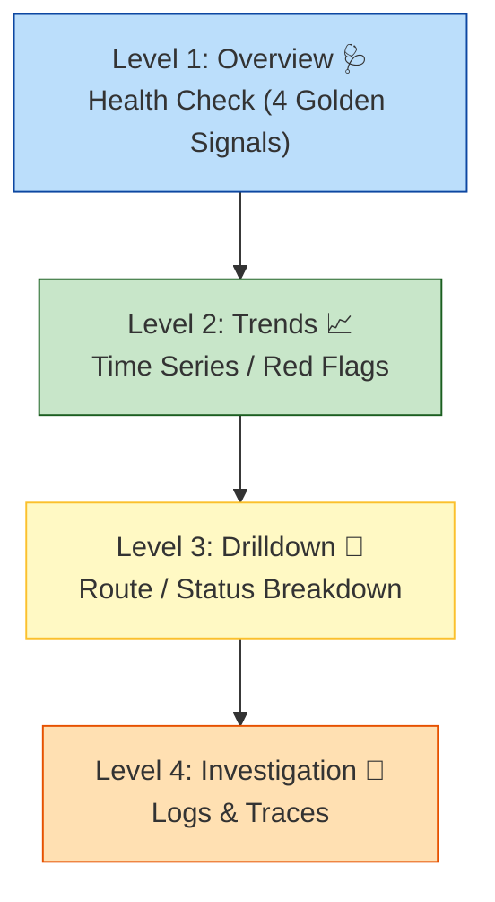

# 第22章：メトリクスの見せ方（ダッシュボードの下ごしらえ）👀📊✨

[](https://grafana.com/blog/2024/07/03/getting-started-with-grafana-best-practices-to-design-your-first-dashboard/?utm_source=chatgpt.com)


## この章のゴール 🎯

* 「まず何を見る？」の順番を**設計**できるようになる🧠✨
* ダッシュボードを見た人が、**次の一手（調査・復旧・判断）**にすぐ進める状態を作れる🚀
* 「なんかいっぱいグラフある…😵‍💫」を卒業して、**説明できる画面**にできる📣💕

---

## 0. ダッシュボードは“飾り”じゃなくて“意思決定の道具”🧰✨

ダッシュボードで一番大事なのは、「**見た結果、何を判断したいの？**」を先に決めることだよ☺️
グラフがキレイでも、判断につながらないと“観測の迷子”になりがち…🌀

そこでこの章は、**上から順に見る設計**＝「導線づくり」をやるよ🧭✨

---

## 1. まずは型を知ろう：「Overview → Drilldown」🧩🔎




Grafanaでも、ダッシュボードは大きく **2段構え**が基本になることが多いよ👇

* **Overview（全体）**：サービス全体が「大丈夫？」を見る
* **Drilldown（深掘り）**：どこが怪しいか「どこが？」を見る（コンポーネント・エンドポイント・インスタンス単位など）

この “Overview → Drilldown” は、ダッシュボード同士をリンクして掘っていく設計としてよく説明されてるよ🔗✨ ([Grafana Labs][1])

---

## 2. 最強の“上から見る順番”はコレ：4つの黄金シグナル 🥇✨

「何を上に置く？」問題の答えとして超有名なのが、**4つの黄金シグナル**👇

* **Latency（遅さ）**
* **Traffic（量）**
* **Errors（失敗）**
* **Saturation（詰まり具合）**

これは Google SRE の文脈で紹介される定番の考え方だよ📚✨ ([sre.google][2])

> つまり、ダッシュボードの上のほうは
> **「遅い？」「増えた？」「失敗してる？」「詰まってる？」**
> を最速で答えられる配置にするのがコツ💡

---

## 3. 第22章のメイン：おすすめ“ウィジェット構成案”🧱✨（テンプレ）

ここからが「下ごしらえ」本体だよ〜🍳✨
あなたの題材API（/work /slow /fail みたいなやつ）に合わせて、まずは**画面の骨組み**を作っちゃおう！

### 3.1 一番上（0段目）：今日の“健康診断”🩺💓

**Stat（数値カード）**で、パッと見で判断できるやつを置く✨
おすすめはこの4つ（黄金シグナル対応）👇

* リクエスト数（Traffic）📦
* エラー率（Errors）💥
* p95レイテンシ（Latency）🐢
* 飽和のサイン（Saturation）🧱（例：イベントループ遅延、メモリ逼迫）

> 数値カードは「異常かどうか」だけ分かればOK！
> 詳細は下で掘る方式にすると迷子になりにくいよ🧭✨

---

### 3.2 1段目：トレンド（時間の流れ）を見る⏳📈

ここは **Timeseries（折れ線）**が主役✨

* RPS（1秒あたりのリクエスト数）📈
* エラー率の推移📉💥
* レイテンシ（p50/p95/p99 どれか）🐢
* Nodeの健康（メモリ/イベントループ遅延）🧠⚙️

---

### 3.3 2段目：どこが？（内訳）を見る🔎🧩

ここから “Drilldownの入口” を作るよ！

* **エンドポイント別**（route別）レイテンシ🐢
* **ステータス別**（2xx/4xx/5xx）📦💥
* （もしあるなら）依存先別（外部API/DB風）🌐🗄️

---

### 3.4 3段目：調査へジャンプ（リンク導線）🔗🚀

ここで「深掘りに行ける」ようにする！
Grafanaにはリンクの考え方が整理されてて👇

* 全体に関係するなら **Dashboard link**
* パネル単位なら **Panel link**
* さらにデータ点（特定系列）なら **Data link**
  みたいに使い分けるのが推奨されてるよ🧭✨ ([Grafana Labs][3])

---

## 4. “見せ方”のルール（初心者がハマらないための7つ）🛡️✨

### ルール1：1枚で全部説明しようとしない🙅‍♀️🌀

Overviewは「健康かどうか」だけ。
“原因究明”は次のダッシュボードへ🔗（Overview→Drilldown） ([Grafana Labs][1])

### ルール2：上ほど「判断」、下ほど「調査」👀➡️🔎

上：赤信号を見つける🚦
下：どこが赤かを特定する🔍

### ルール3：単位・集計の粒度はタイトルに書く📏📝

例）

* 「レイテンシ p95（ms）」
* 「RPS（req/s）」
* 「エラー率（%）」
  これだけで読み間違い激減するよ🥹✨

### ルール4：色に頼りすぎない（色弱にも優しく）🎨🤝

色は補助！「閾値の線」「数字」「ラベル」でも判断できるようにするのが強い💪
（Grafana公式も“わかりやすく保つ”系のベストプラクティスをまとめてるよ） ([Grafana Labs][4])

### ルール5：ダッシュボード変数（フィルタ）を最初に用意🏷️✨

例：`service` / `env` / `route` / `instance`
“見る人が自分で絞れる”と運用が楽になるよ☺️

### ルール6：ラベル爆発しないようにする（前章の復習）💣⚠️

「ユーザーID」「リクエストID」みたいな高cardinalityは、メトリクスの内訳には基本NGになりがち😇
（これは前章21の思想をそのままダッシュボードにも持ち込む感じ！）

### ルール7：リンク先は“次に見るもの”だけ置く🔗✨

リンクが多すぎると、逆に迷子になる🥲
「ログ」「トレース」「依存先」「ランブック」くらいに絞るのが◎

---

## 5.（ミニ）PromQLの“型”だけ置いておくね🧪✨

使ってるメトリクス名は環境で違うから、ここは「雰囲気」を掴む用だよ〜☺️

```promql
## Traffic: RPS（5分平均）
sum(rate(http_requests_total[5m]))

## Errors: 5xx率（例：statusラベルがある場合）
sum(rate(http_requests_total{status=~"5.."}[5m]))
/
sum(rate(http_requests_total[5m]))

## Latency: p95（Histogramを使う例）
histogram_quantile(
  0.95,
  sum(rate(http_request_duration_seconds_bucket[5m])) by (le, route)
)
```

Histogram（バケット）から percentiles を出すのは定番で、`histogram_quantile()` を使う形がよく説明されてるよ📌 ([dash0.com][5])

※ちなみに Prometheus には “native histograms” っていう新しい方向性（実験機能）もあるけど、現場では従来のHistogram運用もまだまだ多いので、まずは今の型を押さえればOKだよ✨ ([prometheus.io][6])

---

## 6. ミニ演習：あなたの題材APIの「ウィジェット構成案」を作ろう🧱📝✨

### Step1：見る人を1人に決める👤💡

例）

* 自分（開発者）👩‍💻
* 当番（オンコール）📟
* 監視だけ見る人（運用）🧑‍🏭

### Step2：上の4枚カードを埋める🩺

| 位置 | ウィジェット     | 目的     | 例                |
| -- | ---------- | ------ | ---------------- |
| 1  | Traffic    | 量が増えた？ | RPS              |
| 2  | Errors     | 壊れてる？  | 5xx率             |
| 3  | Latency    | 遅い？    | p95(ms)          |
| 4  | Saturation | 詰まってる？ | event loop / mem |

### Step3：内訳パネルを3つだけ作る（やりすぎ禁止🖐️）😆

おすすめ候補👇

* route別 p95 🐢
* status別 割合📦
* 依存先別 エラー/遅延🌐

### Step4：リンク導線を2本だけ作る🔗

* ログへ（相関IDつき）🪵
* トレースへ（traceIdつき）🧵

---

## 7. AIの使いどころ（この章はめっちゃ相性いい）🤖✨

そのままコピペで使えるプロンプト例を置いとくね🧡

1. **ダッシュボードの目的を1文にしてもらう**

* 「このサービスのOverviewダッシュボードの目的を、オンコール向けに1文で」

2. **上段4カードの候補を出す**

* 「Traffic/Errors/Latency/Saturationに対応する指標を、Node API向けに候補10個出して。高cardinalityは避けて」

3. **“見る順番”の説明文を作る**

* 「このダッシュボードの上から下の見方を、初心者向けに箇条書きで」

4. **リンク先（Drilldown）の設計**

* 「Overview→Drilldownの2段構成で、2段目ダッシュボード案を3つ出して」

5. **パネル名の表記ゆれを統一**

* 「パネル名を短く統一して。単位を明記して」

---

## 8. よくある失敗あるある😇➡️😱➡️😊

* **グラフが多すぎて読む気が失せる**
  → 「上：判断、下：調査」「Drilldownへ逃がす」で解決✨ ([Grafana Labs][1])

* **何が正常かわからない**
  → 閾値ライン／目標（SLOの入口）／過去平均との差など“比較軸”を置く📏

* **リンクがないから、結局ログ探しに行く**
  → Grafanaのリンク種別（Dashboard/Panel/Data）で導線を作る🔗 ([Grafana Labs][3])

---

## 9. 完成チェックリスト（提出用✅✨）

* [ ] 上段に「Traffic/Errors/Latency/Saturation」がある ([sre.google][2])
* [ ] 上から下で「判断 → 調査」になってる
* [ ] 内訳は最大でも3〜5個に抑えた
* [ ] パネル名に単位が入ってる（ms / % / req/s）
* [ ] Drilldownリンクがある（ログ or トレースへ） ([Grafana Labs][3])
* [ ] 変数（env/service/routeなど）が用意されてる
* [ ] “この画面の見方”を2〜5行で説明できる📣

---

## 次章につながるよ〜🧵✨

この章で「見る順番」と「導線」ができたら、次は **トレース編**で “非同期の旅” をちゃんと追えるようにしていく感じになるよ🧵🚀

必要なら、あなたの題材API（/work /slow /fail）の想定メトリクス名に合わせて、**具体的なダッシュボード案（パネル名・順番・リンク先まで）**を一緒に組み立てるよ〜☺️💖

[1]: https://grafana.com/blog/grafana-dashboards-a-complete-guide-to-all-the-different-types-you-can-build/?utm_source=chatgpt.com "A complete guide to all the different types you can build"
[2]: https://sre.google/sre-book/monitoring-distributed-systems/?utm_source=chatgpt.com "Chapter 6 - Monitoring Distributed Systems"
[3]: https://grafana.com/docs/grafana/latest/visualizations/dashboards/build-dashboards/manage-dashboard-links/?utm_source=chatgpt.com "Manage dashboard links | Grafana documentation"
[4]: https://grafana.com/docs/grafana/latest/visualizations/dashboards/build-dashboards/best-practices/?utm_source=chatgpt.com "Grafana dashboard best practices"
[5]: https://www.dash0.com/knowledge/prometheus-metrics?utm_source=chatgpt.com "Understanding the Prometheus Metric Types"
[6]: https://prometheus.io/docs/concepts/metric_types/?utm_source=chatgpt.com "Metric types"
