```mermaid
gantt
    title Trace: GET /slow (Total 500ms)
    dateFormat X
    axisFormat %s ms
    
    section Root
    GET /slow :active, 0, 500
    
    section Spans
    Validate   : 10, 50
    DB Query   : 60, 200
    Ext API    : 210, 450
    Response   : 460, 490
```

# 第23章：トレース入門 🧵✨（Trace / Span のイメージをつかむ）

[](https://opentelemetry.io/docs/demo/screenshots/?utm_source=chatgpt.com)

## この章でできるようになること 🎯✨

* **Trace（トレース）**と**Span（スパン）**を、図でサクッと説明できる🖍️
* 「遅い原因どこ？」を、**タイムライン**で探す感覚がわかる⏱️👀
* Node/TSで **まず1本トレースを飛ばして見る**（Jaegerで確認）まで体験できる🚀

---

## 1) トレースって何？一言でいうと… 🧵💡

**「1リクエストが、システムの中を旅した記録」**だよ〜🚶‍♀️🌐✨
その旅を細かい区間（作業）に切ったのが **Span**！

OpenTelemetryの定義でも、**Spanは“作業の1単位”で、Traceの材料**って扱いだよ。([OpenTelemetry][1])

---

## 2) Trace と Span の関係（親子の木🌳＋時間の線📏）




### ✅ 2つの見え方があるよ 👀

* **木（親子）**：誰が誰を呼んだ？どの処理の中で起きた？🌳
* **タイムライン**：どこが一番時間かかってる？⏱️

たとえば `/slow` がこんな処理だったら👇

* HTTPで受ける
* DBっぽいI/O
* 外部APIっぽいI/O
* 整形して返す

Spanの木はこういうイメージ：

```text
Trace: GET /slow
└─ Span: http.server (root)
   ├─ Span: usecase.validate
   ├─ Span: db.query
   ├─ Span: http.client (call external)
   └─ Span: response.serialize
```

そして各Spanには、だいたいこういう情報が入るよ👇
**名前 / 親SpanID / 開始・終了時刻 / 属性 / イベント / ステータス**などなど。([OpenTelemetry][1])

---

## 3) IDの話（traceId / spanId）🔎✨

* **traceId**：その旅全体のID（同じ旅ならずっと同じ）🧵
* **spanId**：区間ごとのID（作業ごとに別）🧩
* **parent span id**：親の区間はどれ？（木になる理由）🌳

これがあるから「ログもトレースも同じ旅として追う」みたいな連携ができるんだよね🔗✨（28章で超効いてくるやつ！）

---

## 4) 分散トレースが“分散”できる理由 🌐🧵

サービスをまたいでもTraceがつながるのは、**Context Propagation（コンテキスト伝播）**があるからだよ〜🫶
HTTPだと代表的に **`traceparent` / `tracestate`** ってヘッダーでバトンを渡すのが標準。([W3C][2])

> ここは25〜26章で「途切れる理由」「繋げる設計」をガッツリやるよ🔗🔥

---

## 5) まずは“見える化”して気持ちよくなる：Jaegerで見る 👀✨

### 5-1) Jaegerを起動（Docker）🐳✨

OpenTelemetry公式の案内でも、**JaegerはOTLPをネイティブで受けられて**、
UIは **16686**、OTLPは **4317/4318** が使えるって書かれてるよ。([OpenTelemetry][3])

PowerShellでこれ👇

```powershell
docker run --rm `
  -e COLLECTOR_ZIPKIN_HOST_PORT=:9411 `
  -p 16686:16686 `
  -p 4317:4317 `
  -p 4318:4318 `
  -p 9411:9411 `
  jaegertracing/all-in-one:latest
```

👉 ブラウザで `localhost:16686` を開くとJaeger UIが出るよ🧡

---

## 6) Node/TS側：最短でトレースを飛ばす 🚀🧵

### 6-1) 依存パッケージ（代表セット）📦✨

* `@opentelemetry/sdk-node`
* `@opentelemetry/api`
* `@opentelemetry/auto-instrumentations-node`
* `@opentelemetry/exporter-trace-otlp-http`

Jaegerに送るなら **OTLP HTTP** がわかりやすいよ📮✨（4318に投げる）

---

### 6-2) `src/instrumentation.ts` を作る 🧰✨

```ts
// src/instrumentation.ts
import { NodeSDK } from '@opentelemetry/sdk-node';
import { getNodeAutoInstrumentations } from '@opentelemetry/auto-instrumentations-node';
import { OTLPTraceExporter } from '@opentelemetry/exporter-trace-otlp-http';

const traceExporter = new OTLPTraceExporter({
  // Jaeger(all-in-one) の OTLP HTTP
  url: 'http://localhost:4318/v1/traces',
});

const sdk = new NodeSDK({
  traceExporter,
  instrumentations: [getNodeAutoInstrumentations()],
});

sdk.start();
```

> JaegerがOTLPを受けられる＆ポートが4318、ってところは公式に沿ってるよ。([OpenTelemetry][3])

---

### 6-3) サービス名を付ける（超大事）🏷️✨

サービス名がないと、画面で迷子になりがち🥺
OpenTelemetryでは **`OTEL_SERVICE_NAME` が `service.name` を設定する**って仕様で定義されてるよ。([OpenTelemetry][4])

PowerShellならこう👇

```powershell
$env:OTEL_SERVICE_NAME="ts-observability-demo"
```

---

### 6-4) “アプリより先に” instrumentation を読み込んで起動 ▶️✨

ポイントはこれ！
**計装（instrumentation）は、アプリ本体より先に読み込む**のが大事だよ〜📌
（先に読まないと、HTTP/Express等の自動計装が間に合わないことがある🥲）

`tsx` を使う例：

```powershell
npx tsx --import ./src/instrumentation.ts ./src/server.ts
```

---

### 6-5) 叩いてみよう🧪✨

別ターミナルで：

```powershell
curl http://localhost:3000/slow
```

Jaeger UIで👇

1. Service に `ts-observability-demo` が出る
2. Find Traces
3. 1件開く
   → うわ〜〜〜ってSpanの木とタイムラインが見える😆🧵✨

---

## 7) Span候補を5つ書くミニ演習 🖐️🧠✨

あなたの題材API（例：`/work`, `/slow`, `/fail`）の **1リクエストの旅**を想像して、Span候補を5つだけ書いてね👇

✅ コツ：**「外部I/O」「業務の節目」**はSpanにしやすい✨
（細かすぎ問題は24章でちょうどやるよ✂️😉）

例：

* `http.server GET /slow`（入口）
* `usecase.doWork`
* `db.query users`
* `http.client GET https://example...`
* `format.response`

---

## 8) 手動で1個だけSpanを足してみる（気持ちいい体験）🧵➕✨

自動計装だけでも結構見えるけど、**「業務的に意味のある区切り」**は手動Spanが強い🔥

OpenTelemetry JSでは、Spanを作るのに
`tracer.startSpan` と `tracer.startActiveSpan` があって、だいたいは **`startActiveSpan` が使いやすい**（子Spanもつながりやすい）って案内されてるよ。([OpenTelemetry][5])

```ts
// 例: どこかの処理で
import { trace } from '@opentelemetry/api';

const tracer = trace.getTracer('app');

export async function doWork() {
  return tracer.startActiveSpan('usecase.doWork', async (span) => {
    try {
      // ここに「遅い処理」や「大事な処理」を置く
      await new Promise((r) => setTimeout(r, 200));
      return { ok: true };
    } finally {
      span.end(); // ✅ 忘れると地獄👻
    }
  });
}
```

👉 Jaegerで見ると、Spanの木に `usecase.doWork` が増えて「おお〜！」ってなるよ😆✨

---

## 9) 今日のまとめ（超重要3つ）🧠📌✨

1. **Trace＝旅、Span＝旅の区間** 🧵🧩
2. **遅い原因は、タイムラインで“長いSpan”を探す** ⏱️🔎
3. **自動計装＋意味のある手動Span**が最強コンボ 💪✨

---

## 10) AI（Copilot/Codex）に頼るなら、こう頼むのが楽だよ🤖💬✨

* 「この関数の処理を“観測しやすいSpan名”で5つに分けて提案して」
* 「この処理フローをSpanツリー（親子関係）で書いて」
* 「手動Spanを1つだけ入れるなら、どこが一番効果ある？理由もセットで」

---

次の24章では、まさに **“Spanの切り方（細かすぎ/粗すぎ）”** を、例いっぱいで気持ちよく整理していくよ✂️🤔✨

[1]: https://opentelemetry.io/docs/concepts/signals/traces/ "Traces | OpenTelemetry"
[2]: https://www.w3.org/TR/trace-context/ "Trace Context"
[3]: https://opentelemetry.io/ja/docs/languages/js/exporters/ "エクスポーター | OpenTelemetry"
[4]: https://opentelemetry.io/docs/specs/otel/configuration/sdk-environment-variables/?utm_source=chatgpt.com "Environment Variable Specification"
[5]: https://opentelemetry.io/docs/languages/js/instrumentation/?utm_source=chatgpt.com "Instrumentation"
