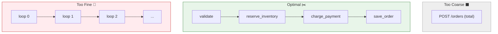

# 第24章：Spanの切り方（細かすぎ/粗すぎ問題）✂️🤔🧵

## 1) この章のゴール 🎯✨

* トレースを見たときに「どこが遅い？」「どこで失敗？」が**一発で追える粒度**で Span を切れるようになる😊🔎
* 逆に、**細かすぎて地獄（Spanだらけ）**／**粗すぎて何も分からん（1本だけ）**を回避できるようになる😇🛡️

---

## 2) まず「粒度」ってなに？🍰🧁




Span は「ある作業の時間と結果」を表す“しおり”みたいなもの📌🧵
粒度＝その“しおり”を **どのくらい細かく挟むか** の話だよ〜😊✨

* **粗すぎ**：`POST /orders` の Span 1本だけ → 「遅いのDB？外部API？在庫？決済？」が不明😵‍💫
* **細かすぎ**：for ループ1回ごとに Span → 1リクエストで数百本、読むのがつらい＆コストも増えがち😱💸

---

## 3) 迷ったらコレ！Spanを切る“王道ポイント”5つ 🧭✨

### ✅ ① 外部I/Oは基本「切る」🌐🗄️📨

DB、外部HTTP、Queue、ファイル、キャッシュ…
**アプリの外に出る瞬間**は、遅延・失敗・リトライが起きやすいので Span が超効く🥹✨

* HTTP の Span 名は **`{method} {target}`（低カーディナリティな target）**が推奨されてるよ（例：`GET /users/{id}` みたいな“型”）([OpenTelemetry][1])
* DB も「クエリ全文」じゃなく、**要約や操作名＋target**みたいな低カーディナリティが推奨だよ([OpenTelemetry][2])

---

### ✅ ② “業務の節目”で切る 🛒💳📦

技術じゃなくて、**意味のある区切り**で切ると「読む人に優しい」🥰

例）

* `validate order`
* `reserve inventory`
* `charge payment`
* `create shipment`

---

### ✅ ③ 体感で「重そう・遅そう」なところを切る 🐢⏱️

* 計算が重い
* ループが多い
* 画像処理、PDF生成、ランキング計算…など

“時間が伸びそうな塊”に Span を置くとボトルネック発見が早いよ😊🔍

---

### ✅ ④ “失敗しやすい分岐”で切る 🚧💥

* リトライがある
* フォールバックがある
* エラー理由を分けたい

こういう所は Span があると「どの分岐に行ったか」が一目で分かる🥹✨

---

### ✅ ⑤ 並列処理は「まとめ方」を意識する 🧵🧷

Promise.all で並列に投げると、Spanも増えやすい😵

* 並列の“親”を 1 本（例：`fetch related resources`）
* 子は「本当に必要な外部I/Oだけ」など、増えすぎない設計にするのがコツ😊✨

---

## 4) “細かすぎ/粗すぎ”あるある集 😱➡️😊

### 😱 細かすぎ（読むのムリ）

* `rollOnce:0`, `rollOnce:1` …みたいにループ1回ごとに Span（サンプルとしては分かりやすいけど、実運用は注意ね）([OpenTelemetry][3])
  ✅ 改善：
* ループ全体を 1 Span（`calculate score`）
* どうしても途中経過が欲しいなら **Span event** を使う（“しおり”じゃなく“付箋”）📎✨

### 😱 粗すぎ（原因が消える）

* `handleRequest` だけ
  ✅ 改善：
* 外部I/O（DB/外部HTTP）
* 業務の節目（validate/charge/reserve）
  この2つだけでも世界が変わる🥹✨

### 😱 Span名にID入れがち（地味に事故）🆔💥

* `GET /users/123` とか `order_98765` とか
  ✅ 改善：
* 名前は “型” にして、IDは属性へ（例：`enduser.id` は扱いに注意、まずは **載せない設計**が安全）
  HTTP の span name も「低カーディナリティな target」が推奨だよ([OpenTelemetry][1])

---

## 5) 実装の基本形（TS）🧑‍💻✨

OpenTelemetry JS は **`startActiveSpan` を使うのが基本**で、Span を context に乗せてくれるよ〜😊
そして **必ず `span.end()`**！([OpenTelemetry][3])

```ts
import { trace, SpanStatusCode } from "@opentelemetry/api";

const tracer = trace.getTracer("app");

export async function createOrder() {
  return tracer.startActiveSpan("create order", async (span) => {
    try {
      // ここに処理を書く（子Spanはここで作ると親子が自然につながる）
      span.setAttribute("app.feature", "checkout");

      // ...do work...

      span.setStatus({ code: SpanStatusCode.OK });
      return { ok: true };
    } catch (err) {
      span.recordException(err as Error);
      span.setStatus({ code: SpanStatusCode.ERROR });
      throw err;
    } finally {
      span.end();
    }
  });
}
```

---

## 6) ケーススタディ：注文APIを“気持ちいい粒度”で切る 🛒💳📦✨

### 🧟 悪い例（粗すぎ）

* `POST /orders`（1本だけ）
  → 「遅いのどこ？」が分からない😵‍💫

### 👼 良い例（おすすめの最小セット）

* `POST /orders`（自動計測のサーバSpanがある前提。Nodeは自動計測でリクエストごとの Span を作れるよ）([OpenTelemetry][4])

  * `validate order`
  * `reserve inventory`（外部I/Oならここで切る）
  * `charge payment`（外部HTTP）
  * `save order`（DB）

こんな感じの“木”🌳✨

```text
POST /orders
 ├─ validate order
 ├─ reserve inventory
 ├─ charge payment
 └─ save order
```

### 💡 ループがある場合（Spanを増やしすぎないコツ）🔁

「商品が20個」みたいなとき…

* 😱 悪い：`reserve item 1`, `reserve item 2` …（20本＋α）
* 😊 良い：`reserve inventory` 1本にまとめて

  * `span.setAttribute("item.count", 20)`
  * 途中経過は `span.addEvent("item reserved", { index: 3 })` みたいに“付箋”で残す📎✨

---

## 7) 迷子防止テンプレ（これで毎回同じ考え方）📄✨

Spanを切る前に、まずこの3つだけ決めよ😊🖊️

1. **トップSpan（入口）**：だいたい自動計測の `HTTP {method} {route}` がいる前提でOK（ルートは“型”が大事）([OpenTelemetry][1])
2. **外部I/OのSpan**：DB / 外部HTTP / Queue
3. **業務の節目Span**：validate / payment / inventory …みたいな “意味の塊”

---

## 8) ミニ演習🧪✨（10分）

次の処理、Spanをどう切る？（答えは1つじゃないよ😊）

* 入力チェック
* 在庫APIへ問い合わせ（外部HTTP）
* 価格計算（重め）
* DBに保存
* メール送信（外部）

✅ 目標：**5本以内**にまとめて、読める木にする🌳✨
（“細かくしたい欲”が出たら、eventで我慢📎🥹）

---

## 9) AI（Copilot/Codex）に投げると強いプロンプト例 🤖✨

* 「この関数を OpenTelemetry の `startActiveSpan` で包んで。Span名は低カーディナリティで、try/catch/finally で `recordException` と `span.end()` まで入れて」([OpenTelemetry][3])
* 「この処理フローを見て、Span境界を 5 個以内に提案して。外部I/Oと業務の節目を優先して」
* 「Span名にIDが混ざってたら直して。IDは属性に移して（ただし個人情報になりそうなら載せない案も出して）」

---

## 10) まとめ 🧵✨

* Spanは **外部I/O** と **業務の節目** を軸に切ると、だいたい勝てる😊🏆
* **名前は“型”**、詳細は **属性やevent** に逃がす（ID入りSpan名は避けがち）([OpenTelemetry][1])
* 実装は `startActiveSpan`＋`span.end()` の型を守れば安全運転できるよ🚗💨([OpenTelemetry][3])

次の章（第25章）は「なんで途中で繋がらなくなるの？」の正体（コンテキスト伝播の“途切れ”）に入っていくよ〜🔗🌬️🧠

[1]: https://opentelemetry.io/docs/specs/semconv/http/http-spans/?utm_source=chatgpt.com "Semantic conventions for HTTP spans"
[2]: https://opentelemetry.io/docs/specs/semconv/database/database-spans/?utm_source=chatgpt.com "Semantic conventions for database client spans"
[3]: https://opentelemetry.io/docs/languages/js/instrumentation/ "Instrumentation | OpenTelemetry"
[4]: https://opentelemetry.io/docs/languages/js/getting-started/nodejs/ "Node.js | OpenTelemetry"
