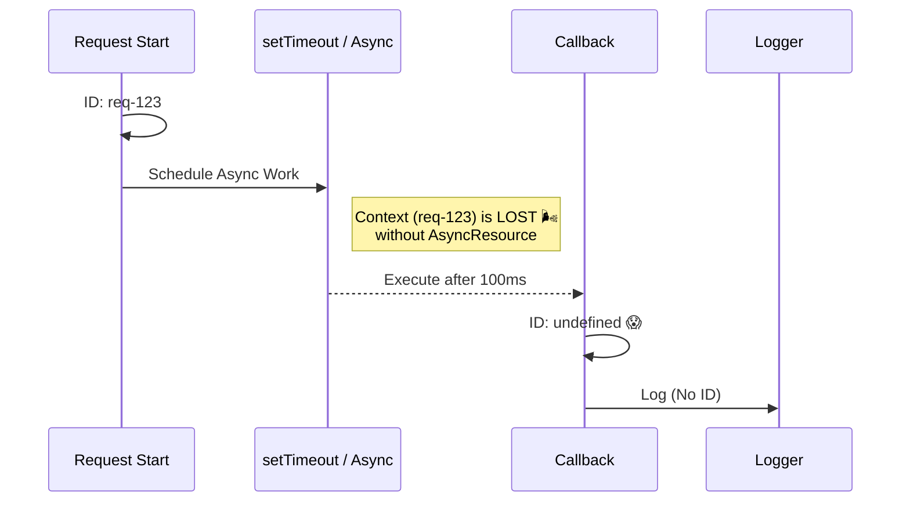

# 第25章：コンテキスト伝播① “途切れる理由”を理解 🔗🌬️🧵

[](https://speakerdeck.com/dasiths/propagating-context-and-tracing-across-your-distributed-process-boundaries-using-opentelemetry?utm_source=chatgpt.com)

## この章のゴール 🎯✨

* 「え、なんでトレースが途中で切れたの…？」を**言葉で説明**できるようになる😊
* “途切れやすい場所”を先読みして、**地雷ポイントをリスト化**できるようになる🧠📝
* 次章（26章）の「繋げる設計」へ、迷子にならず入れるようになる🚪🔗

---

## 1) そもそも“コンテキスト”って何？📎✨（超ざっくり）

コンテキストは、ざっくり言うと **「今この処理は、どのリクエスト／どのトレースに属してる？」** を表す“しおり”みたいなもの📘✨
中身は例えばこんな感じ👇

* requestId（ログを追うためのID）
* traceId / spanId（トレースを親子で繋ぐID）
* ユーザー操作ID（フロントから来る“この操作だよ”の印）
* ちょいメモ（Baggageみたいな“持ち歩き情報”）🎒

OpenTelemetry（OTel）だと、**Span（現在の作業の区間）を Context に入れて、子Spanを作る側がそれを参照**します。だから“しおり”が落ちると、親子関係が作れなくなって「別の旅」になっちゃう😵‍💫
（OTelは Context Manager がないと `context.active()` が常に空っぽ（ROOT）になるよ、って明言してます）([OpenTelemetry][1])

---

## 2) “途切れた”って、どう見える？👀💥




症状はだいたいこの3つがセットで来ます👇

### A) トレースが「途中から別ツリー」になる🌳✂️

* あるSpanの子になるはずが、**いきなり root（親なし）**で生えてくる
* “同じリクエストの続き”なのに、画面上で繋がらない😢

### B) ログが「混ざる」「IDが消える」🪵🌀

* 期待：`requestId=AAA` のログだけ追えば原因に辿り着く
* 現実：途中から `requestId` が `-` になったり、別リクエストのIDになったりする😇💦

### C) 例外の関連付けが切れて、調査が地獄化🧯🫠

* エラーは出てるのに、**どの操作のエラーか辿れない**
* “再現できない系”で詰む…（あるある）😵‍💫

---

## 3) 途切れる原因は、だいたい「3分類」🧩🔍

### ① 同一プロセス内（Nodeの非同期）で落ちる 🧵🌪️

Nodeは “非同期の連鎖” の上を処理が走るので、しおり（コンテキスト）を**ちゃんと連鎖に載せない**と落ちます。
Nodeには `AsyncLocalStorage` という「非同期の間ずっと持ち歩ける入れ物」が用意されてます（スレッドローカルっぽい、と説明されてるやつ）([nodejs.org][2])

### ② プロセス境界（HTTP/メッセージ）で受け渡しされない 🌐📦

別サービスにHTTPで飛んだ瞬間、しおりは自然には移動しません。
この受け渡しの標準が **W3C Trace Context（`traceparent` / `tracestate`）** です([W3C][3])

### ③ 計測の仕組み側（ライブラリ/計測設定）が“繋ぐ役”をしてない 🧰⚙️

OTelは多くの場合、HTTP/Expressなどの **instrumentation が自動で伝播**してくれます。だから「基本は自動、手動はレア」と書かれてます([OpenTelemetry][4])
逆に言うと、instrumentation が入ってない or 有効化されてないと、そこで切れる😢

---

## 4) TS/Nodeで「途切れやすい場所」あるある10選 🧨🧠

ここ、**今日のメイン**だよ〜！✨（このリストが次章で超効く）

### ① “awaitしない” fire-and-forget 🔥🏃‍♂️

```text
doSomethingAsync(); // awaitしない
return res.end();   // 先に返しちゃう
```

* その後に走るログやSpanが、**元のリクエスト文脈から外れる**ことがある🥲
* 特に「レスポンス返した後に裏でやる処理」は切れやすい

### ② `Promise.all()` で並行に走らせる 🧵🧵

* 並行そのものは悪じゃないけど、**親子関係の期待**がズレると混乱する😵‍💫
* 「片方だけ別トレースに見える」みたいな事故が起きがち

### ③ タイマー系：`setTimeout` / `setImmediate` / `nextTick` ⏰⚡

* “今の流れ”から **次のイベントループ**に飛ぶので、設計が雑だと切れる
* たとえば「IDをグローバル変数に置く」みたいなのは爆死する💣

### ④ EventEmitter / callback地獄 🎧📣

* `.on('event', handler)` の handler が**いつ呼ばれるか**で文脈が変わる
* Node公式も「まれに store が失われる」→「promisify する」「AsyncResource を使う」みたいな話をしてます([nodejs.org][2])

### ⑤ “callbackベース”API（古いライブラリ）📞🧓

* Promise連鎖じゃないと、文脈が自然に繋がらないケースがある
* Node公式は `util.promisify()` を推してます([nodejs.org][2])

### ⑥ “独自thenable” / 変なPromise互換 🔮

* PromiseっぽいけどPromiseじゃない…みたいな実装だと、追跡が崩れることがある😇

### ⑦ Worker Threads / child_process 🧵🚪

* スレッド/プロセスが分かれた時点で、**別世界**
* “同じIDで繋ぎたい”なら、明示的に渡す設計が必要（次章の話）

### ⑧ キュー/PubSub/ジョブキュー 📨📬

* 「受信したメッセージ処理」が、**前の処理の文脈を引きずる**事故が起きがち
* “consumer spanが前のspanの子になっちゃう”系は現場あるある😵‍💫（OTelのissueでも話題になりがち）([GitHub][5])

### ⑨ “ライブラリが内部で非同期を隠してる” 🎁🕳️

* DBクライアント／SDKが内部でイベントやコールバックを使ってて、そこで途切れる
* 「自分のコードは綺麗」でも、外部が原因なこと多い😇

### ⑩ “Context Manager 未設定”で、常に空っぽ 🫥

* OTelは Context Manager が無いとアクティブコンテキストが取れない（＝親子が作れない）って書いてる([OpenTelemetry][1])
* つまり「設定してるつもりで設定してない」が割とある💦

---

## 5) ミニ実験：ログが混ざる瞬間を体験しよ🧪🪵😱

### 実験1：グローバル変数で requestId を持つ（ダメ例）💣

「2リクエスト同時に来たら混ざる」を体験するやつ！

```ts
// bad-global.ts
import http from "node:http";

let currentRequestId: string | null = null;

function log(msg: string) {
  console.log(`[rid=${currentRequestId ?? "-"}] ${msg}`);
}

function sleep(ms: number) {
  return new Promise<void>((r) => setTimeout(r, ms));
}

http
  .createServer(async (req, res) => {
    currentRequestId = cryptoRandomId();
    log("start");

    // わざと待つ（その間に別リクエストが来ると…）
    await sleep(50);
    log("after await");

    res.end("ok");
  })
  .listen(3000, () => console.log("http://localhost:3000"));

function cryptoRandomId() {
  // 教材なので軽く
  return Math.random().toString(16).slice(2, 10);
}
```

✅ 期待：start と after await が同じ rid
😱 現実：同時アクセスすると rid が入れ替わる（混ざる）ことがある

> ここで大事なのは、「非同期で処理が入り混じる」って感覚を掴むことだよ🧠✨
> この“混ざり”が、トレースでも同じ形で起きる（親子がズレる／切れる）⚡

### 実験2：`AsyncLocalStorage` を使うと“混ざり”が止まる（チラ見せ）🔒✨

Node公式も「リクエスト単位のIDをログに入れる例」を `AsyncLocalStorage` で紹介してます([nodejs.org][2])
（本格的な“繋げ方”は26章でやるよ〜！）

---

## 6) “どこで切れた？”を見つけるコツ 🔍🧠✨

ここ、めちゃ実戦的👇

### ✅ コツ：怪しい場所の直後で「今のしおり」をログる

Node公式が言ってるやり方がこれ：
`getStore()` を疑わしい呼び出しの後に入れて、**undefined になった瞬間の直前が犯人**、って探し方([nodejs.org][2])

イメージはこんな感じ👇

* 「この関数呼んだ後から、requestIdが `-` になる」
* → その関数内部の callback / event / thenable が怪しい
* → promisify / AsyncResource / ライブラリ差し替え…（次章）へ

---

## 7) 今日のミニ演習：途切れやすい場所チェックリスト化 ✅📝💖

あなたの題材API（/work /slow /fail みたいなやつ）を思い出して、**途切れポイントを“先に”書く**よ！

### (1) 途切れポイントを最低7個書く🖊️✨

例：

* `Promise.all` してる箇所
* `setTimeout` してる箇所
* `.on('message')` で受けてる箇所
* 「awaitしてない処理」
* 外部SDK呼び出し
* 例外握りつぶしそうなcatch
* レスポンス返した後に動く処理

### (2) 各ポイントに「途切れ方」を1行でメモ📝

* 「子spanがroot化しそう」
* 「ログのrequestIdが `-` になりそう」
* 「別リクエストのIDと混ざりそう」

### (3) AIに“チェックリスト整形”を頼む🤖✨（おすすめプロンプト）

そのまま貼ってOK👇

```text
以下は Node/TypeScript のAPI実装のメモです。
「コンテキスト（requestId/trace）が途切れやすい場所」をチェックリスト化して、
各項目に「なぜ途切れやすいか」を女子大生向けに1行で説明して。
最後に、重要度（高/中/低）も付けて。
```

---

## 8) おまけ：2026っぽい最新トピック（軽く）🆕⚙️✨

最近のNodeは `AsyncLocalStorage` 周りも進化してて、Node 24+ では V8 の仕組み（AsyncContextFrame）を使う再実装が入った、みたいな話も出てます。性能や内部挙動に影響があるよ〜って背景として知っておくと安心🧠✨ ([nodejs.org][6])
（ただし“設計としての考え方”は変わらない：**しおりが落ちる場所を潰す**、これが本質👍）

---

## まとめ 🧁✨

* コンテキストは“しおり”📎：落ちると **親子Spanが作れない／ログが混ざる**😵‍💫
* 途切れの原因はだいたい「同一プロセス内」「プロセス境界」「計測設定」の3つ🧩
* 今日作った“途切れポイント表”が、次章（26章）の「繋げる設計」そのまま材料になるよ🔗💖

次は **「繋げるための設計（ヘッダー/親子維持/ルール化）」** を、手を動かしながら作っていこうね〜！🤝✨

[1]: https://opentelemetry.io/docs/languages/js/context/ "Context | OpenTelemetry"
[2]: https://nodejs.org/api/async_context.html "Asynchronous context tracking | Node.js v25.3.0 Documentation"
[3]: https://www.w3.org/TR/trace-context-2/?utm_source=chatgpt.com "Trace Context Level 2"
[4]: https://opentelemetry.io/docs/languages/js/propagation/ "Propagation | OpenTelemetry"
[5]: https://github.com/open-telemetry/opentelemetry-js/issues/3993?utm_source=chatgpt.com "Cannot make OpenTelemetry work with GCP PubSub: how ..."
[6]: https://nodejs.org/blog/vulnerability/january-2026-dos-mitigation-async-hooks "Node.js — Mitigating Denial-of-Service Vulnerability from Unrecoverable Stack Space Exhaustion for React, Next.js, and APM Users"
