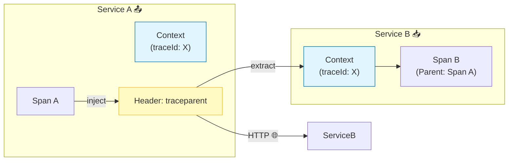

# 第26章：コンテキスト伝播② “繋げるための設計” 🤝🔗✨

前の章（25章）で「なんでトレースが途中で途切れるの？」を理解したので、今日はその逆！
**“どう設計したら、端から端までちゃんと繋がるの？”** を、TS/Nodeの感覚でまとめるよ〜🧵🧠💕

---

## 1) 今日のゴール 🎯✨

この章が終わったら、次の3つができるようになるのが目標だよ👇

* **「繋がる条件」を3つ**で説明できる🔗
* HTTPで **親子関係（Parent/Child）を崩さず**に伝播できる📨
* Node/TSで **途切れやすいポイントを避ける設計**ができる🧯

---

## 2) まず「何を繋ぐの？」を超ざっくり理解 🧵👀

分散トレースで繋げたいのは、ざっくり言うとこの2つ👇

* **Trace（旅のID）**：このリクエストの“旅全体”のID 🧳
* **Span（区間）**：旅の途中の“区間ごとの記録” 🚃

そして **Context（文脈）** は、「いま自分がどのSpanの中にいるか」を持ってる“見えないバトン”だよ🏃‍♀️💨
このバトンが切れると、**Spanが親を失って別の旅（別Trace）**に見えちゃうの🥲

JS/NodeではこのContextを成立させるのに **Context Manager** が必須だよ（無いと“現在の文脈”が保持できない）🧠🔧 ([OpenTelemetry][1])

---

## 3) “繋がる条件”はこの3つだけ覚えてOK ✅🔗✅🔗✅🔗




ここがこの章の核だよ〜！💎

### 条件A：アプリ内で Context が切れない（非同期でも！）🧵⚙️

* Nodeは非同期が多いから、**AsyncLocalStorage / async_hooks** を使って「今の文脈」を追跡するのが基本✨
* OpenTelemetryでは Node向けに **AsyncLocalStorageContextManager / AsyncHooksContextManager** が用意されてるよ（基本はALS推し）🌟 ([Socket][2])

### 条件B：外に出るとき “標準ヘッダー”で渡す 📨🌍

* HTTPなら **traceparent / tracestate**（W3C Trace Context）を使うのが王道🧾
* ここがズレると、別サービスが受け取れない/解釈できない💦 ([OpenTelemetry][3])

### 条件C：受け取った側が “親として採用”する 👨‍👧🔗

* 受信側がヘッダーから取り出して（extract）
* そのコンテキストを **「このリクエストの親」** としてサーバーSpanを作る
* これで「親子」が繋がるよ🧵✨ ([OpenTelemetry][4])

---

## 4) “何を渡す？”の設計：最小セットで強くする 🧠🧳✨

### まずはコレだけでOK（標準）📦

* `traceparent`（必須）
* `tracestate`（あれば）

W3C Trace Context ではこの2つが基本で、仕様としても「こう扱ってね」が決まってるよ📘 ([OpenTelemetry][3])

### baggage は“慎重に”🎒⚠️

OpenTelemetryでは baggage（追加のkey/value）もあるけど、入れすぎると事故るので注意！
「少量・低カードinality・個人情報ナシ」くらいの気持ちで🙅‍♀️

---

## 5) “どこを通って渡す？”の設計：経路ごとにルール化 🗺️🔗

### (1) HTTP（王道）🌐

* **受信（server）**：ヘッダーからextract → server spanの親にする
* **送信（client）**：いまのcontextをinject → ヘッダーで渡す

OpenTelemetryのJS向けPropagation解説でも、この inject/extract を基本として説明されてるよ✨ ([OpenTelemetry][5])

### (2) キュー / 非同期ジョブ（ちょい難）📮⏳

ここは設計が分かれるよ👇

* **同じ“旅”として繋ぐ（Childにする）**

  * “そのジョブがこのリクエストの続き”ならOK
* **別の旅にする（Linkで関連付け）**

  * “あとで実行される・並行で走る・再試行される”系は、無理に親子にしない方が読みやすいこと多い✨

（この「Linkで繋ぐ」発想は、後の章でめっちゃ効いてくるよ🧵💡）

---

## 6) 実装テンプレ：Node/TSで“繋がる初期化”を作る 🧩✨

ここでは **OpenTelemetryのNode SDK** を使った “まず繋げる最小構成” を作るよ！
（2026-01-17時点で、`@opentelemetry/sdk-node` は 0.210.0 が最新として表示されてるよ）([Npm][6])
`@opentelemetry/context-async-hooks` は 2.3.0 が最新表示だよ🧵 ([Npm][7])
`@opentelemetry/auto-instrumentations-node` は 0.68.0 が最新表示だよ🧰 ([Npm][8])

### 6-1) インストール（例）📦✨

```bash
npm i @opentelemetry/api
npm i @opentelemetry/sdk-node @opentelemetry/auto-instrumentations-node
npm i @opentelemetry/context-async-hooks @opentelemetry/core
npm i @opentelemetry/exporter-trace-otlp-http
```

### 6-2) `src/otel.ts`（初期化ファイル）🔧🧵

ポイントはここ👇

* **AsyncLocalStorageContextManager を enable**
* **W3C Trace Context の propagator をセット**（traceparent/tracestate）
* **アプリ本体より先に起動**（順番が超大事！）

```ts
import { diag, DiagConsoleLogger, DiagLogLevel, context, propagation } from "@opentelemetry/api";
import { NodeSDK } from "@opentelemetry/sdk-node";
import { getNodeAutoInstrumentations } from "@opentelemetry/auto-instrumentations-node";
import { AsyncLocalStorageContextManager } from "@opentelemetry/context-async-hooks";
import { CompositePropagator, W3CTraceContextPropagator, W3CBaggagePropagator } from "@opentelemetry/core";
import { OTLPTraceExporter } from "@opentelemetry/exporter-trace-otlp-http";

// デバッグしたい時だけ（本番は控えめにね）
diag.setLogger(new DiagConsoleLogger(), DiagLogLevel.INFO);

// ① Context Manager（これがないと “今のSpan” が保持されない）
const cm = new AsyncLocalStorageContextManager();
cm.enable();
context.setGlobalContextManager(cm);

// ② Propagator（traceparent / tracestate を扱う：W3C）
propagation.setGlobalPropagator(
  new CompositePropagator({
    propagators: [new W3CTraceContextPropagator(), new W3CBaggagePropagator()],
  })
);

const traceExporter = new OTLPTraceExporter({
  // 例: OpenTelemetry Collector / APM のエンドポイントに合わせる
  url: process.env.OTEL_EXPORTER_OTLP_TRACES_ENDPOINT ?? "http://localhost:4318/v1/traces",
});

export const otelSdk = new NodeSDK({
  traceExporter,
  instrumentations: [getNodeAutoInstrumentations()],
});

export async function startOtel() {
  await otelSdk.start();
}
```

* Propagatorの考え方（Composite + W3C tracecontext + baggage）は、OpenTelemetryのJSドキュメント側でも紹介されてるよ✨ ([OpenTelemetry][9])

### 6-3) `src/main.ts`（起動順を守る）🚀

```ts
import { startOtel } from "./otel";
import { startServer } from "./server";

async function main() {
  await startOtel();     // ← 先にOTel！！
  await startServer();   // ← あとでアプリ本体
}

main().catch((e) => {
  console.error(e);
  process.exit(1);
});
```

この「先にOTel」がズレると、**最初のリクエストが繋がらない**が起きやすいよ🥲⚡

---

## 7) “繋がらないあるある”と設計での予防線 🧯😵‍💫

### あるある①：ContextManager を enable し忘れ 🧠💤

* `new AsyncLocalStorageContextManager()` しただけで満足しがち
* **enable & setGlobal** までがセットだよ🧵 ([GitHub][10])

### あるある②：fire-and-forget（awaitしない）🔥

* `await`しない処理は、文脈が切れたり、Spanが閉じる前に処理が終わったりする
* 設計として「非同期に逃がす処理」は **Link設計** も検討すると読みやすいよ📮✨

### あるある③：別スレッド/別プロセス/キューで消える 🧵➡️📦➡️🧵

* Workerや別プロセスは、**自動では繋がらない**と思って設計する
* “traceparentをどの入れ物で渡す？”を先に決めるのが勝ち🏆

---

## 8) 2026年1月の“最新注意点”⚠️🗓️（超だいじ）

最近（2026年1月中旬）、Node.js側で **async_hooks / AsyncLocalStorage絡みのクラッシュ（DoSにつながる）** が話題になって、セキュリティリリースも出てるよ。
`async_hooks.createHook()` が有効な場合に「Maximum call stack size exceeded」が例外処理に届かずプロセスが落ちる、という内容が公式に書かれてる🧨 ([Node.js][11])

なので運用設計としては👇

* **Nodeの該当リリースラインを更新しておく**（例として 20.20.0 / 22.22.0 / 24.13.0 / 25.3.0 が案内されている）🛡️ ([窓の杜][12])
* OpenTelemetry側も、この件について声明を出してるよ📝 ([OpenTelemetry][13])
* そもそも context-async-hooks は async_hooks の影響を受けるので、**最新のNode LTS推奨**という注意もあるよ📌 ([Socket][2])

---

## 9) ミニ演習：あなたの “繋がる3条件” を完成させよう 📝💖

### 演習①（設計）🧠

次の文章を、自分の言葉で短くしてみてね👇（各1行でOK！）

* 条件A：
* 条件B：
* 条件C：

### 演習②（動作チェック）🔍

* APIを叩いて、ログやトレースUIで
  **「Aサービスのspan → Bサービスのspan が親子」** になってるか確認👀🧵
* もし親がいなかったら、まず見るのはこの順👇

  1. OTelの起動順（先に起動できてる？）
  2. ContextManager enable（できてる？）
  3. traceparent が送れてる？（受信してる？）

### Copilot / Codex に投げると便利なお願い🤖✨

* 「Express/Fastifyで、受信時にtraceIdをログに出すミドルウェア作って」
* 「fetch/axiosの送信前に、traceparentをcarrierにinjectするサンプル書いて」
* 「キューにtraceparentを載せる設計案を3パターン比較して」

---

## まとめ 🌸✨

* **“繋がる条件”は3つ**（アプリ内Context維持・標準ヘッダーで渡す・受信側が親にする）🔗
* Node/TSは **AsyncLocalStorage系のContextManager** が鍵🧵 ([Npm][7])
* HTTPは **W3C Trace Context（traceparent/tracestate）** を軸に設計すると強い📨 ([OpenTelemetry][3])
* 2026年1月は async_hooks/ALS絡みの注意もあるので、**Node更新も設計に含める**🛡️ ([Node.js][11])

次の章（27章）は、繋がったトレースに **「意味のある属性（attributes）」** を足して、調査のスピードを爆上げしていくよ〜🎒✨

[1]: https://opentelemetry.io/docs/languages/js/context/?utm_source=chatgpt.com "Context"
[2]: https://socket.dev/npm/package/%40opentelemetry/context-async-hooks?utm_source=chatgpt.com "@opentelemetry/context-async-hooks - npm Package Security ..."
[3]: https://opentelemetry.io/docs/specs/otel/context/api-propagators/?utm_source=chatgpt.com "Propagators API"
[4]: https://opentelemetry.io/docs/languages/js/propagation/?utm_source=chatgpt.com "Propagation"
[5]: https://opentelemetry.io/ja/docs/languages/js/propagation/?utm_source=chatgpt.com "伝搬"
[6]: https://www.npmjs.com/package/%40opentelemetry/sdk-node?utm_source=chatgpt.com "OpenTelemetry SDK for Node.js"
[7]: https://www.npmjs.com/package/%40opentelemetry/context-async-hooks?utm_source=chatgpt.com "@opentelemetry/context-async-hooks"
[8]: https://www.npmjs.com/package/%40opentelemetry/auto-instrumentations-node?utm_source=chatgpt.com "@opentelemetry/auto-instrumentations-node"
[9]: https://opentelemetry.io/docs/languages/js/instrumentation/?utm_source=chatgpt.com "Instrumentation"
[10]: https://github.com/open-telemetry/opentelemetry-js/issues/1405?utm_source=chatgpt.com "Consider auto-enabling or warning if non-enabled context ..."
[11]: https://nodejs.org/en/blog/vulnerability/december-2025-security-releases?utm_source=chatgpt.com "Tuesday, January 13, 2026 Security Releases"
[12]: https://forest.watch.impress.co.jp/docs/news/2077577.html?utm_source=chatgpt.com "「Node.js」のセキュリティリリースが年をまたいでようやく公開"
[13]: https://opentelemetry.io/blog/2026/oteljs-nodejs-dos-mitigation/?utm_source=chatgpt.com "OpenTelemetry JS Statement on Node.js DOS Mitigation"
