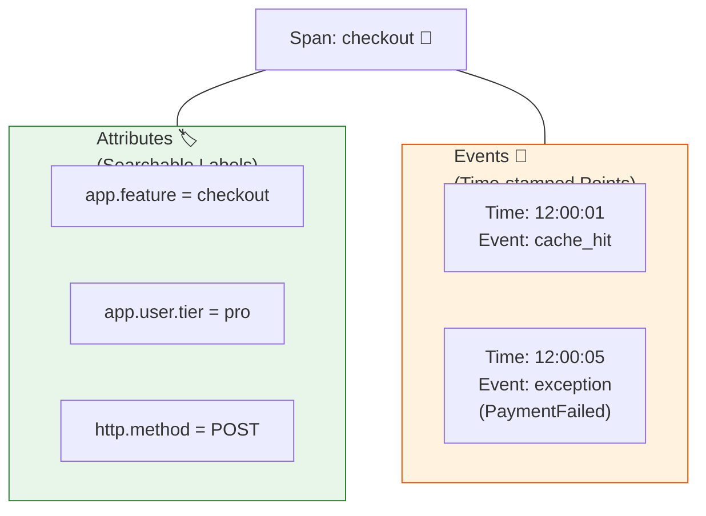

# 第27章：トレースに意味を足す（属性中心）🎒🧵✨

（2026/01/17 時点の OpenTelemetry 仕様・ドキュメントを反映して作っています🫶）

---

## この章でできるようになること🎯✨

* 「このスパン、何の処理？」を**属性（attributes）で説明**できるようになる🧵📝
* **載せていい情報／ダメな情報**の判断ができるようになる🚦🙅‍♀️
* `setAttribute / addEvent / recordException / setStatus` を使って、**調査が速くなるトレース**にできる💨🔍
* 「載せすぎ注意⚠️」を**数値上の制限（limits）**込みで理解できる🧯

---

## 1) まず整理：属性ってなに？イベントと何が違うの？🧠✨




### ✅ 属性（Attributes）＝「この処理のラベル」🏷️

スパンに付ける **key/value**。後で検索・絞り込みがしやすいのが強み✨
例：`http.request.method=GET`, `http.route=/users/:id` など

### ✅ イベント（Events）＝「途中で起きた出来事のメモ」🧾

スパンの途中に起きたことを “点” で残す感じ。
例：リトライした、キャッシュヒットした、例外が起きた など

### ✅ 例外（Exception）は “イベントとして記録” が基本💥

OpenTelemetry では例外を `exception` というイベントで記録するのがルールとして整理されています📌（`exception.message/type/stacktrace` など） ([OpenTelemetry][1])

---

## 2) 「良い属性」の3原則✨🏷️（ここが設計！）

### 原則A：まず “公式の名前（Semantic Conventions）” を優先📚✨

HTTP なら `http.request.method` や `http.response.status_code` みたいに標準名が決まってます。古い `http.method` は deprecated 扱いで、置き換え先が明記されています🧠 ([OpenTelemetry][2])

> **ポイント**：新旧の属性名が混在しやすいので、HTTP系は “安定版に寄せる” 意識が大事✨
> HTTP のセマンティック規約は移行のために `OTEL_SEMCONV_STABILITY_OPT_IN`（`http` / `http/dup`）みたいな opt-in の話も出ています📌 ([OpenTelemetry][3])

---

### 原則B：検索に強い＝「低カーディナリティ」を意識🧊

* 例：`http.route` は **低カーディナリティにすべき**で、パス（`/users/123`）で代用しちゃダメ🙅‍♀️（テンプレにする！） ([OpenTelemetry][2])
* 例：`error.type` は **予測可能・低カーディナリティ推奨**（timeout / 500 / class名 など） ([OpenTelemetry][4])

逆に `error.message` みたいな“自由文”は、カーディナリティが爆発しやすいので **スパンやメトリクスに載せるの非推奨**寄りです⚠️ ([OpenTelemetry][4])

---

### 原則C：セキュリティ＆プライバシー優先🛡️

HTTP ヘッダーは全部取ると危険なので、**「取るヘッダーを明示的に設定しろ」**という注意が仕様側にあります🔐 ([OpenTelemetry][2])
なので属性に載せるのは、基本「安全で短くて安定なもの」だけに寄せようね😊

---

## 3) 「載せすぎ注意⚠️」には理由がある（上限がある）📦

OpenTelemetry には **Span に載せられる数の上限**の考え方があり、環境変数でのデフォルト値も整理されています。
たとえばデフォルトだと：

* Span attributes count：**128**
* Span events count：**128**
* Span links count：**128**
  など（設定で変更はできる） ([OpenTelemetry][5])

> つまり…「なんでも属性に入れとこ♡」は、途中から捨てられたり（落ちたり）しがち😇
> だから **“必須セット” を決める設計**が超大事になるよ✨

---

## 4) 第27章のコア：「意味のある属性セット」を作ろう🎒✨

ここでは、あなたの教材題材（API）を想定して、**使い回せる必須セット**を提案するね😊

### ✅ A. HTTP “入口スパン” の必須セット🌐🚪

（主に自動計装で付くけど、手動でも意識する価値あり✨）

* `http.request.method`（例：GET/POST） ([OpenTelemetry][2])
* `http.route`（例：`/users/:id` みたいなテンプレ） ([OpenTelemetry][2])
* `http.response.status_code`（例：200/500） ([OpenTelemetry][2])

💡 `http.route` が取れない時に生パスで代用しないこと！それは“爆発”の近道😵‍💫 ([OpenTelemetry][2])

---

### ✅ B. 業務スパン（例：`checkout` / `createOrder`）の必須セット🛒✨

ここは標準が薄いので **アプリ用 prefix を決める**のがコツ🎯

* `app.feature`（例：`checkout`）
* `app.result`（例：`success` / `failed`） ← なるべく固定語彙にする
* `app.retry.count`（例：0/1/2）※必要なときだけ
* `app.customer.tier`（例：`free` / `pro`）← 固定語彙

🙅‍♀️ NG：`app.userId=123456`（高カーディナリティの代表）
→ どうしても必要なら **ハッシュ化**して、しかも “本当に検索するの？” を考える

---

### ✅ C. 外部I/Oスパン（DB / 外部API）必須セット🔌⏱️

* 「どこに行った？」（依存先の識別：サービス名・種別）
* 「どんな結果？」（成功/失敗の分類）
* 「再送した？」（該当するなら回数）

HTTPクライアントの再送なら `http.request.resend_count` が定義されています📌 ([OpenTelemetry][2])

---

## 5) エラーの付け方：トレースが“調査ツール”になる瞬間🧯🔍

### ✅ 基本ルール（超大事）

* 成功した操作は **status を触らない**（unset のまま） ([OpenTelemetry][6])
* 失敗した操作は

  * span status を `Error` にして ([OpenTelemetry][6])
  * `error.type` を付ける（低カーディナリティ推奨） ([OpenTelemetry][6])
* 例外は `recordException`（例外イベント）で残すのが推奨 ([OpenTelemetry][6])
* さらに「握りつぶした例外」は基本記録しない方向（handled は推奨されない） ([OpenTelemetry][6])

---

## 6) TypeScript 実装パターン（コピペして育てるやつ）🐣🧩

### 6-1) “属性つけ職人” 関数を作る（散らからない！）🧹✨

```ts
import { Span } from "@opentelemetry/api";

type CustomerTier = "free" | "pro";

export function enrichBusinessSpan(
  span: Span,
  params: {
    feature: string;
    tier?: CustomerTier;
    retryCount?: number;
  }
) {
  // 収集されない状況では、重い加工をしない（地味に効く）✨
  if (!span.isRecording()) return;

  span.setAttribute("app.feature", params.feature);

  if (params.tier) span.setAttribute("app.customer.tier", params.tier);
  if (typeof params.retryCount === "number") span.setAttribute("app.retry.count", params.retryCount);
}
```

`isRecording()` は「記録されない場合は no-op になる」前提で、無駄な処理を避けられるよ🫶 ([OpenTelemetry][7])

---

### 6-2) エラー時の “正しい3点セット” 🧯💥

```ts
import { Span, SpanStatusCode } from "@opentelemetry/api";

export function markSpanError(span: Span, err: unknown) {
  // error.type は “分類” に寄せる（低カーディナリティ）✨
  const errorType =
    err instanceof Error ? err.name : typeof err === "string" ? "ErrorString" : "UnknownError";

  span.setAttribute("error.type", errorType);

  // 例外はイベントとして記録するのが基本（exception.* が付く）✨
  span.recordException(err as any);

  // 失敗したら status=ERROR
  const message = err instanceof Error ? err.message : undefined;
  span.setStatus({ code: SpanStatusCode.ERROR, message });
}
```

* `recordException` は span イベントとして例外を残すAPI📌 ([OpenTelemetry][7])
* status のデフォルトは UNSET、成功で OK を乱用しないのがコツ✨ ([OpenTelemetry][7])
* `error.type` は標準属性で、低カーディナリティ推奨＆成功時は付けない、が指針だよ🧠 ([OpenTelemetry][4])

---

### 6-3) “途中で起きたこと” は addEvent で点を打つ🧾✨

例：リトライした瞬間をイベントで残す（※属性は短く！）

```ts
import { Span } from "@opentelemetry/api";

export function recordRetryEvent(span: Span, info: { attempt: number; reason: "timeout" | "5xx" | "network" }) {
  if (!span.isRecording()) return;

  span.addEvent("retry", {
    "app.retry.attempt": info.attempt,
    "app.retry.reason": info.reason,
  });
}
```

`addEvent` は Span にイベントを追加するAPIだよ✨ ([OpenTelemetry][7])

---

## 7) ミニ演習📝💕（この章のゴール直結！）

### 演習①：あなたの題材APIで「必須属性セット」を決めよう✅

次の3種類のスパンに対して、**各3〜5個**だけ決めてね（多いと死ぬ！笑）😇

1. HTTP入口スパン🌐
2. 業務スパン（例：注文確定）🛒
3. 外部I/Oスパン（HTTP/DB）🔌

💡 迷ったら：

* 「この属性があると、どの画面で絞り込める？」
* 「それは **固定語彙**？それとも毎回変わる？」

---

### 演習②：「載せる/載せない」判定ルールを文章化📄✨

この2行を埋めてみてね😊

* 載せる：____________（例：固定語彙、ルートテンプレ、結果分類…）
* 載せない：____________（例：生のID、全文メッセージ、全部のヘッダー…）

ヒント：ヘッダー全部取るのは危険で、取るなら明示設定が推奨だよ🔐 ([OpenTelemetry][2])

---

## 8) AI活用コーナー🤖💞（一気に上手くなるやつ）

### 使える指示例（そのまま投げてOK）✨

* 「この API（ルート一覧）に対して、OpenTelemetry の標準属性名を優先して、入口/業務/外部I/Oごとに必須属性セットを3〜5個で提案して。高カーディナリティは避けて。」
* 「`error.type` の候補語彙（低カーディナリティ）を、うちのアプリの失敗パターン別に10個くらい提案して。」（`timeout`, `validation_failed`, `upstream_5xx` みたいに）
* 「この `enrichBusinessSpan()` を共通化して、使い方例も追加して（isRecording考慮も）。」

---

## 9) よくある事故💥😵‍💫（先に潰す！）

* ❌ `http.route` の代わりに生パス入れて検索地獄 → `http.route` は低カーディナリティ前提！ ([OpenTelemetry][2])
* ❌ 例外を握りつぶしたのに `recordException` しまくる → handled 例外は推奨されない方向だよ🧯 ([OpenTelemetry][6])
* ❌ なんでも属性に入れて上限で欠ける → Span属性/イベントには上限（デフォ128）あるよ📦 ([OpenTelemetry][5])

---

## まとめ🎉🧵✨

* 属性は「この処理は何？」を説明するラベル🏷️
* 標準名（Semantic Conventions）を優先しつつ、業務は `app.*` で少数精鋭🎒
* エラーは `status=Error`＋`error.type`＋`recordException` が基本セット🧯 ([OpenTelemetry][6])
* “載せすぎ注意⚠️” は気合いじゃなくて、上限があるから設計で守る📦 ([OpenTelemetry][5])

次の第28章では、ログ・メトリクス・トレースを「同じ導線」でつなげて、調査のスピードをさらに上げていくよ〜🧩🔗🚀

[1]: https://opentelemetry.io/docs/specs/semconv/exceptions/exceptions-spans/ "Semantic conventions for exceptions on spans | OpenTelemetry"
[2]: https://opentelemetry.io/docs/specs/semconv/registry/attributes/http/ "HTTP | OpenTelemetry"
[3]: https://opentelemetry.io/docs/specs/semconv/http/http-spans/ "Semantic conventions for HTTP spans | OpenTelemetry"
[4]: https://opentelemetry.io/docs/specs/semconv/registry/attributes/error/ "Error | OpenTelemetry"
[5]: https://opentelemetry.io/docs/specs/otel/configuration/sdk-environment-variables/ "Environment Variable Specification | OpenTelemetry"
[6]: https://opentelemetry.io/docs/specs/semconv/general/recording-errors/ "Recording errors | OpenTelemetry"
[7]: https://open-telemetry.github.io/opentelemetry-js/interfaces/_opentelemetry_api._opentelemetry_api.Span.html "Span | OpenTelemetry SDK"
