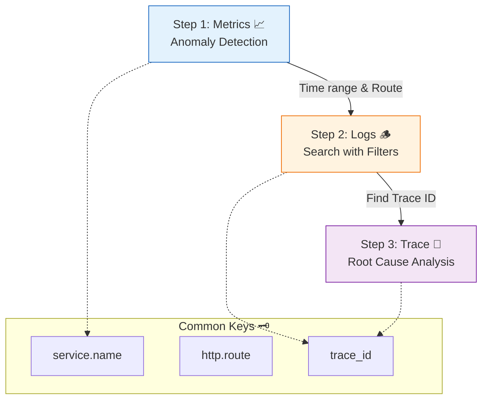

# 第28章：3本柱を“同じ導線”でつなぐ 🧩🔗✨

（ログ🪵／メトリクス📈／トレース🧵を「迷わず行き来できる状態」にする回だよ〜！）

---

## 0. 今日のゴール 🎯✨

この章が終わると、こんなことができるようになるよ👇

* 「遅い😵」「落ちた💥」って言われたときに、**迷わず辿る“調査ルート”**が作れる🧭✨
* **メトリクス → ログ → トレース**が、**同じID/同じ言葉**でつながる🔗
* ダッシュボードの点📍からトレースへ飛んだり、ログからトレースへ飛んだりできる（設計の考え方がわかる）✨
* 実装では、まず **ログに traceId/spanId を入れる**ところまでできる🔧🪵🧵

---

## 1. まず大事な考え方：観測は「量」じゃなくて「導線」👀🧠✨

ログを増やす📚！メトリクス増やす📊！トレース増やす🧵！
…も大事なんだけど、初心者が一番つまずくのはここ👇

> **“それぞれ見えてるけど、つながらない”問題** 😭🔌

* メトリクスで「遅い」って分かる📈
* ログは大量にある🪵
* トレースも見れる🧵
* でも「この遅さのログどれ？」「このエラーのトレースどれ？」で迷子 🫠

だからこの章は、**3本柱を1本の調査ルートに束ねる設計**をやるよ🧩🔗✨



---

## 2. “つなぐ”ための最重要アイテム：共通ID 🔑🔗

結論から言うね👇

### ✅ 主役は traceId（トレースID）でOK！

Webの世界では、分散トレーシングの文脈をHTTPヘッダで運ぶために **W3C Trace Context** が標準になってるよ🌐✨
その中心が `traceparent` で、**trace-id / parent-id / flags** などの情報を持つの🧵📦 ([W3C][1])

#### よくある設計パターン（おすすめ）💡

* **traceId**：分散トレースの主キー（全サービス共通の“旅のチケット”）🧵🎫
* **requestId**：人間が見やすい/短いID（任意）🪪

  * でも二重運用で迷子になりやすいから、最初は **traceIdを主**にすると安定👏

---

## 3. “同じ言葉”で揃える：共通フィールド辞書 📚🏷️✨

つながらない原因の8割は「名前バラバラ」問題😵‍💫
なので、**ログ・メトリクス・トレースで同じ意味を同じキー名**で揃えるよ！

### ✅ まずはこの10個を“固定セット”にしよ 🧷✨

（最初から完璧を目指さず、ここだけ死守でOK🙆‍♀️）

| key（おすすめ）                | 意味                          | どこで使う         |
| ------------------------ | --------------------------- | ------------- |
| `service.name`           | サービス名                       | 全部            |
| `service.version`        | バージョン/ビルド                   | 全部            |
| `deployment.environment` | prod/stg/dev など             | 全部            |
| `trace_id`               | traceId（主役）                 | ログ/メトリクス/トレース |
| `span_id`                | spanId                      | ログ/トレース       |
| `http.method`            | GET/POST                    | 全部（HTTP系）     |
| `http.route`             | `/users/:id` みたいな“ルート”      | 全部（超重要）       |
| `http.status_code`       | 200/500 など                  | 全部            |
| `error.type`             | エラー種別（例: `ValidationError`） | ログ/トレース       |
| `error.message`          | メッセージ（短め推奨）                 | ログ/トレース       |

OpenTelemetry は HTTP の属性・スパン命名などの **セマンティック規約（semantic conventions）** を用意してるから、それに寄せると将来ラクだよ✨（HTTPの属性/HTTPスパン規約）([OpenTelemetry][2])

---

## 4. 調査導線を「3ステップ」に固定する 🧭✨

第28章のミニ演習にもあるやつ！ここが超コアだよ🔥

### ✅ 調査はこの3ステップで固定 👇

**Step 1：メトリクス📈**
「いつから・どのAPIが・どれくらい」おかしい？（全体像）

**Step 2：ログ🪵**
「該当のリクエスト（traceId）を1つ“特定”」する（証拠集め）

**Step 3：トレース🧵**
その traceId の旅を見て「どこで時間/失敗が起きたか」確定（犯人特定）

---

## 5. “飛べる”と最強：メトリクス↔トレースのリンク（Exemplars）📍🧵✨

ここ、今どき感つよいよ〜！😆✨

### ✅ Exemplars（例示データ）ってなに？

ざっくり言うと👇

> **メトリクスの“点”に traceId をぶら下げる**📈📍➡️🧵

Grafana では exemplars の仕組みが説明されてて、**メトリクスからトレースへジャンプ**ができるよ✨ ([Grafana Labs][3])
さらに Tempo 側でも、metrics-generator が exemplars を自動生成して “metrics→trace linking” を助ける話があるよ🧠✨ ([Grafana Labs][4])

※最初から必須じゃないけど、**「導線設計」の完成形**として知っておくと強い💪✨

---

## 6. 実装ミニ：ログに traceId/spanId を入れて“つながる土台”を作る 🪵🧵🔧

ここから「実際に繋げる」パートだよ〜！🥳

### 6.1 OpenTelemetry（Node）側の近況メモ 🧠✨

* Node向けSDKのパッケージ（`@opentelemetry/sdk-node`）は、執筆時点で **0.210.0** が最新として公開されてるよ（npm表示）([Npm][5])
* そして OpenTelemetry JS SDK 2.x の流れとして、安定パッケージは `>=2.0.0`、不安定系は `>=0.200.0` という整理が説明されてるよ🧩([OpenTelemetry][6])
* なお Node の OpenTelemetry 公式Getting Startedでは、**ログ向けライブラリはまだ開発中**で、ログの例は載せてないよ（だから実務では“ログにtraceIdを埋め込む”アプローチが超重要）🪵🧵 ([OpenTelemetry][7])
* OpenTelemetry JS は **Node.js のアクティブ/メンテナンスLTSをサポート**って方針だよ🧡 ([OpenTelemetry][8])

---

### 6.2 目標（実装でやること）🎯

* リクエスト処理中の **現在のSpanコンテキスト**から

  * `traceId`
  * `spanId`
    を取り出して、**構造化ログに毎回入れる**🪵✨

---

### 6.3 サンプル構成（超ミニ）🧱

* `telemetry.ts`：OpenTelemetry初期化
* `logger.ts`：pino等のlogger + “traceIdを注入する関数”
* `server.ts`：Express API（`/work`, `/slow`, `/fail`）

---

### 6.4 コード例（イメージ）🧑‍💻✨

#### telemetry.ts（超ざっくり）

```ts
import { NodeSDK } from "@opentelemetry/sdk-node";
import { getNodeAutoInstrumentations } from "@opentelemetry/auto-instrumentations-node";
// Exporterは環境によりOTLP/Consoleなどに差し替えOK

export const sdk = new NodeSDK({
  // traceExporter: ...
  // metricReader: ...
  instrumentations: [getNodeAutoInstrumentations()],
});

export async function startTelemetry() {
  await sdk.start();
}

export async function stopTelemetry() {
  await sdk.shutdown();
}
```

#### logger.ts（“今のtraceId”をログに入れる）

```ts
import pino from "pino";
import { context, trace } from "@opentelemetry/api";

export const baseLogger = pino({
  level: process.env.LOG_LEVEL ?? "info",
});

export function withTraceContext(fields: Record<string, unknown> = {}) {
  const span = trace.getSpan(context.active());
  const spanCtx = span?.spanContext();

  return {
    ...fields,
    trace_id: spanCtx?.traceId,
    span_id: spanCtx?.spanId,
  };
}
```

#### server.ts（リクエストごとに“traceId入りログ”で書く）

```ts
import express from "express";
import { startTelemetry } from "./telemetry";
import { baseLogger, withTraceContext } from "./logger";

async function main() {
  await startTelemetry();

  const app = express();

  app.get("/work", async (_req, res) => {
    baseLogger.info(withTraceContext({ event: "work.start" }), "work start");
    res.json({ ok: true });
  });

  app.get("/slow", async (_req, res) => {
    baseLogger.info(withTraceContext({ event: "slow.start" }), "slow start");
    await new Promise((r) => setTimeout(r, 800));
    baseLogger.info(withTraceContext({ event: "slow.end" }), "slow end");
    res.json({ ok: true });
  });

  app.get("/fail", async (_req, res) => {
    try {
      throw new Error("Boom!");
    } catch (e: any) {
      baseLogger.error(
        withTraceContext({
          event: "fail",
          error_type: e?.name,
          error_message: e?.message,
        }),
        "request failed"
      );
      res.status(500).json({ ok: false });
    }
  });

  app.listen(3000, () => baseLogger.info({ port: 3000 }, "listening"));
}

main().catch((e) => {
  baseLogger.fatal({ err: e }, "boot failed");
  process.exit(1);
});
```

✅ これでログに `trace_id` が入るようになるから、次のステップが作れるよ👇

* ログから trace_id を拾う🪵🔎
* トレーシングUIで trace_id を検索して開く🧵✨

---

## 7. ミニ演習（この章の本題）📝✨

### 演習A：あなたの「共通フィールド固定セット」を決める 🏷️

さっきの10個をベースに、あなたの題材API用に微調整してみてね👇

* `service.name` は何？
* `http.route` はどの粒度？（`/users/:id` で固定できる？）
* `deployment.environment` の候補は？（dev/stg/prod）

💡AIに頼むなら：
「このAPI教材（/work /slow /fail）で、ログ・メトリクス・トレース共通で持つべきフィールド10個を、命名ゆれが起きないように提案して。理由も1行ずつ。」🤖📝✨

---

### 演習B：「3ステップ調査手順」を1枚にする 🧭📄

例：/slow が遅いと言われたとき

1. メトリクス：p95上がってる？どのroute？いつから？📈
2. ログ：同時刻で `http.route=/slow` のログを絞る🪵
3. トレース：ログの `trace_id` で該当トレースを開いて、遅いspanを見る🧵

💡AIに頼むなら：
「/slow が遅い時の調査を “3ステップ” に固定して、各ステップで見るべき指標/ログ項目/トレースの見どころを箇条書きで」🤖🧠✨

---

### 演習C： “飛び先” を設計する（リンク設計）🔗

* ダッシュボード📊からログ🪵へ：最低限、何で絞れる？（route、env、service、時間）
* ログ🪵からトレース🧵へ：どのキーで飛ぶ？（`trace_id`）
* 将来：exemplarsで「点からトレースへ」📍➡️🧵（知識として押さえる）([Grafana Labs][3])

---

## 8. よくある事故パターン（先に潰す）💣🧯

### 😱 事故1：requestId と traceId が別運用で迷子

➡️ **主役は1つに決める**（迷ったら traceId）🔗

### 😱 事故2：`http.route` がなくて、ログもメトリクスも検索が地獄

➡️ “実URL”じゃなくて **ルート**（`/users/:id`）を入れるのが基本🏷️✨
（OTelのHTTP規約に寄せると未来がラク）([OpenTelemetry][2])

### 😱 事故3：ログにtraceId入ってない

➡️ この章の実装ミニで解決！🪵🧵✨

---

## 9. まとめ 🎁✨

この章の結論はこれ👇

* 3本柱をつなぐには **共通ID（traceId）** と **共通語彙（固定フィールド）** が命🔗
* 調査は **メトリクス→ログ→トレースの3ステップ**で固定🧭
* “飛べる”と強い：exemplars などで **メトリクスの点→トレース**が実現できる📍🧵 ([Grafana Labs][3])
* まずは実務的に、**ログへ trace_id/span_id を確実に埋める**ところから始める🪵🧵🔧（OTel Nodeはログがまだ発展途上なので特に重要）([OpenTelemetry][7])

---

次の第29章は、この導線を“見やすい画面”に落とし込む **ダッシュボード設計📊✨** だよ！
「見る順番」を型にして、迷子ゼロにしていこ〜！😆🧭💕

[1]: https://www.w3.org/TR/trace-context/?utm_source=chatgpt.com "Trace Context"
[2]: https://opentelemetry.io/docs/specs/semconv/registry/attributes/http/?utm_source=chatgpt.com "HTTP Attributes"
[3]: https://grafana.com/docs/grafana/latest/fundamentals/exemplars/?utm_source=chatgpt.com "Introduction to exemplars | Grafana documentation"
[4]: https://grafana.com/docs/tempo/latest/metrics-from-traces/?utm_source=chatgpt.com "Metrics from traces | Grafana Tempo documentation"
[5]: https://www.npmjs.com/package/%40opentelemetry/sdk-node?utm_source=chatgpt.com "OpenTelemetry SDK for Node.js"
[6]: https://opentelemetry.io/blog/2025/otel-js-sdk-2-0/?utm_source=chatgpt.com "Announcing the OpenTelemetry JavaScript SDK 2.0"
[7]: https://opentelemetry.io/docs/languages/js/getting-started/nodejs/?utm_source=chatgpt.com "Node.js"
[8]: https://opentelemetry.io/ja/docs/languages/js/?utm_source=chatgpt.com "JavaScript"
