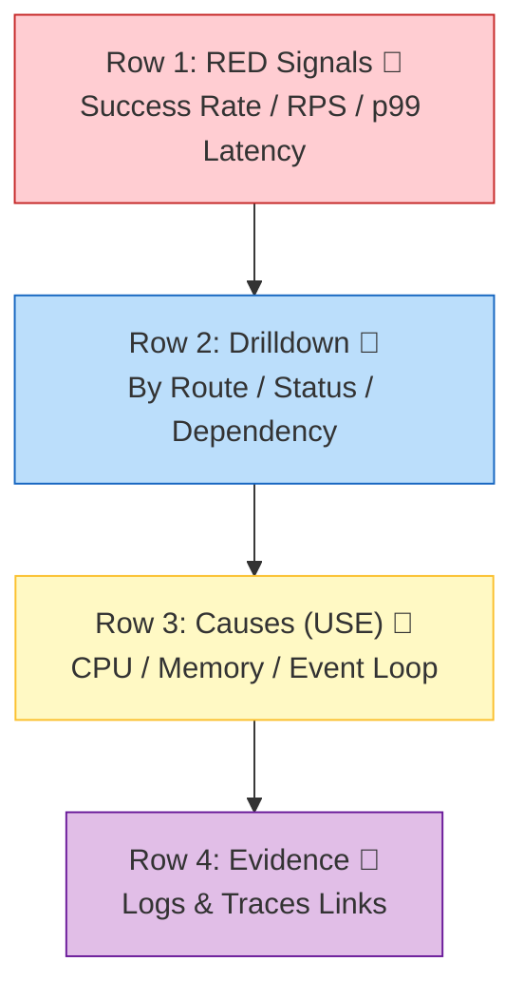

# 第29章：ダッシュボード設計📊✨（見る順番の設計）

[](https://grafana.com/docs/tempo/latest/operations/monitor/set-up-monitoring/?utm_source=chatgpt.com)

この章のゴールはこれだよ〜！🎯✨

* 1枚のダッシュボードを「上から順に読めば」状況がわかる形にできる👀✅
* 「メトリクス→ログ→トレース」へ迷子にならずに降りられる導線を作れる🧭🔗
* 余計なグラフを増やさず、運用で使い続けられる“型”を持てる💪📈

---

## 1) ダッシュボードは「画面」じゃなくて「物語」📖✨




良いダッシュボードは、見る人の頭の中でこう進むのが理想だよ👇👀

1. **今ヤバい？（症状）** 🚨
2. **どこが怪しい？（絞り込み）** 🕵️‍♀️
3. **なぜ？（証拠を取りに行く）** 🔍
4. **じゃあ何する？（行動）** 🧯

この“読む順番”を作るのが設計の本体だよ〜！🧠✨

---

## 2) 「見る順番」の鉄板テンプレ🧱✨（RED → USE → Evidence）

ダッシュボード設計の定番はこれ👇

* **RED**（ユーザー体験の症状）：Rate / Errors / Duration 🚦⏱️
* **USE**（原因のヒント）：Utilization / Saturation / Errors 🧰⚙️

Grafanaのダッシュボード設計ガイドでも、**USEは原因、REDは症状**として整理されてるよ📌([Grafana Labs][1])

---

## 3) 3本柱を“同じ導線”でつなぐ🪵📈🧵✨

ここ、めちゃ大事！🌟

* **メトリクス**：今どう？増えてる？いつから？（全体像）📈
* **ログ**：何が起きた？エラー文・条件・入力は？🪵
* **トレース**：どこで遅い？どの依存先？（時間の内訳）🧵

ちなみに最新のOpenTelemetry Node.jsガイドでも、**トレース/メトリクスはすぐ始められるけど、ログのOTelライブラリはまだ発展途上**って明言されてるよ（＝ログは既存ロガーで運ぶのが現実的）📝([OpenTelemetry][2])

---

## 4) ダッシュボード設計：7ステップ手順🧭✨

### Step 0：このダッシュボードの“客”を決める🎭

* 例：オンコール向け？開発者向け？プロダクト向け？👩‍💻👩‍🔧👩‍💼
  → “誰が見るか”で、上段に置くものが変わるよ！

### Step 1：最初の1秒で答える質問を固定する⏱️

* 「今、サービスは健康？」
* 「影響範囲は？」
* 「急に悪化した？」
  この3つが多いよ〜👀✨

### Step 2：最上段はRED（症状）で固める🚦

Grafanaの解説でも、最初のダッシュボード設計はREDが扱いやすいって書かれてるよ📌([Grafana Labs][3])

### Step 3：次段は“絞り込み”用（どこ？何が？）🧩

* endpoint別（route）
* status code別
* 依存先別（DB / 外部API）
* region / instance（必要な範囲だけ！）

### Step 4：その次にUSE（原因候補）🧯

Nodeなら特に👇が効くよ✨

* メモリ（heap / RSS）🧠
* イベントループ遅延⏳
* CPU / GC（見れるなら）⚙️

### Step 5：一番下に“証拠へのリンク”🔗

* **ログへ飛ぶ**（traceId/requestIdで絞る）🪵
* **トレースへ飛ぶ**（遅い1件にジャンプ）🧵

Grafanaは **メトリクス→トレース** を“Exemplars”でつなげられるよ（設計として超強い）🔗✨([Grafana Labs][4])

### Step 6：ワザと壊して読めるかテストする💥

* 遅延を入れる🐢
* エラー率を上げる🔥
* 外部APIを不安定にする🌪️
  → そのとき「上から順に読めば」原因に近づけるか確認！

### Step 7：役に立たないパネルは消す🗑️

ダッシュボードは“育てる”もの🌱
使わないグラフは罪…！😇（ノイズで迷子になる）

---

## 5) 章のメイン：ダッシュボードのワイヤーフレーム設計📝✨

まずは理想の配置を“文章で描く”よ！🎨
（紙でもOKだよ〜✍️）

```text
[Row 1] いまヤバい？（症状：RED）
  - SLO/成功率（またはError Budget）   - Request Rate (RPS)
  - Error Rate (5xx/4xx)               - Latency p95/p99

[Row 2] どこが怪しい？（絞り込み）
  - Endpoint別：RPS上位 / 遅延上位テーブル
  - ステータス別：エラー内訳（type / code）
  - 依存先別：外部API/DBの遅延・失敗

[Row 3] 原因候補（USE / Node健康）
  - Event Loop Lag
  - Memory (heap/RSS)
  - CPU/GC（取れる範囲で）

[Row 4] 証拠へ降りる（ログ/トレース）
  - Slow traces一覧（Tempo/Jaeger）
  - Recent error logs（Loki）
  - “このパネルから飛ぶ”リンク（traceId/requestId）
```

### ✅ ここでのポイント（読む順番のコツ）👀✨

* **Row1は「赤信号があるか」だけに集中**🚦
* **Row2で「範囲」を絞ってから**🧩
* **Row3で「原因の匂い」を嗅いで**🐶
* **Row4で「証拠」を取りに行く**🔍

---

## 6) 実戦パネル案（おすすめウィジェット構成）🧱📊✨

### Row1：最上段（見るだけで判断）🚦👀

* **成功率 / 失敗率（5xx中心）** ✅❌
* **RPS（リクエスト数/秒）** 🚀
* **p95 / p99 レイテンシ** ⏱️
* （余裕あれば）**エラーの種類別（timeout / validation / upstream）** 🧨

> ヒント：平均（avg）は罠になりがち！😵‍💫
> “遅い人がどれだけいるか”を見るなら **分位（p95/p99）** が強いよ💪

### Row2：絞り込み（どこが悪い？）🕵️‍♀️

* **Endpoint別：遅延Top / エラーTop テーブル** 🧾
* **ステータスコード別（2xx/4xx/5xx）推移** 📉
* **依存先別：外部API/DBのDuration & Errors** 🌐🗄️

### Row3：原因候補（Node健康）🫀

* **イベントループ遅延** ⏳
* **メモリ（heap/RSS）** 🧠
* **GCっぽい波形（取れるなら）** ♻️

### Row4：証拠へダイブ（リンクの段）🔗🧵🪵

* **遅いトレースの検索（TraceQL）** 🧵
* **エラーログ一覧（traceId/requestIdで絞る）** 🪵
* **メトリクスのスパイクからトレースへジャンプ（Exemplars）** ✨([Grafana Labs][4])

---

## 7) クエリ例（PromQL / LogQL / TraceQL）🧪✨

### 7.1 PromQL（メトリクス）📈

（あなたのメトリクス名に合わせて調整してね！）

```promql
## RPS（5分平均）
sum(rate(http_server_requests_total[5m])) by (route)

## エラー率（5xx）
sum(rate(http_server_requests_total{status=~"5.."}[5m]))
/
sum(rate(http_server_requests_total[5m]))

## p95（Histogram前提）
histogram_quantile(
  0.95,
  sum(rate(http_server_request_duration_seconds_bucket[5m])) by (le, route)
)
```

### 7.2 LogQL（ログ）🪵

traceId/requestId をログに含めておくと最高に気持ちいいよ〜🔗✨

```logql
{service="api", env="prod"} |= "error"
```

さらに「traceId抽出 → Tempoへリンク」みたいな導線は、Grafanaの **Derived fields** で作れる（ログ→トレースがワンクリック）🖱️✨

### 7.3 TraceQL（トレース）🧵

TempoのTraceQLで、遅いトレースを探す感じ👇（概念の例）

```text
{ resource.service.name = "api" } && duration > 500ms
```

TraceQLはTempoの公式機能としてドキュメント化されてるよ🧵📚([Grafana Labs][5])

---

## 8) “リンク設計”がダッシュボードの勝ち筋🔗✨

### 8.1 Exemplars（メトリクス→トレース）🌟

* レイテンシが跳ねた瞬間に、**その原因になったトレースへジャンプ**できるのが強い！
* GrafanaはExemplarsの仕組みを公式に解説してるよ✨([Grafana Labs][4])

さらにTempo側で **metrics-generator が exemplars を自動生成**して、メトリクス↔トレースをつなぎやすくする話もあるよ🔗([Grafana Labs][6])

### 8.2 Logs ↔ Traces（相互リンク）🪵🧵

Grafana Tempoの「Grafana上でトレースを見る」説明でも、**ログ↔トレース連携**が整理されてるよ✨

---

## 9) よくあるダメ例😇😱（ここ踏むと迷子！）

* グラフが多すぎて、どれから見ればいいか不明🌀
* 1枚に“健康”も“原因調査”も“経営指標”も全部詰める📦💥
* 平均だけ置いて満足する（遅い人が見えない）😵‍💫
* ラベルが爆発（routeにユーザーID、みたいな）🏷️💣
* 単位がない（msなの？秒なの？）⏱️❓
* 時間範囲が固定で、事故の瞬間を見返しづらい🕰️
* ログ/トレースへのリンクが無く、結局別画面で迷う🔍🚶‍♀️
* パネル名が曖昧（「Latency」だけ、とか）🫥
* 依存先が見えず、犯人探しが長引く🔎
* 作った後に見直さない（育てない）🌱

---

## 10) ミニ演習📝✨：あなたのダッシュボードを“読む順番”で作る

### 演習A：紙にワイヤーフレーム✍️

* Row1（症状）に4つだけ置く
* Row2（絞り込み）に3つ
* Row3（原因候補）に2つ
* Row4（証拠リンク）に2つ
  **合計11個まで！**（多いと死ぬ🤣）

### 演習B：3つの事故シナリオで読めるかテスト💥

1. `/slow` を増やして p95が上がる🐢
2. `/fail` を増やして 5xxが上がる🔥
3. 外部I/O（DB風）を遅くして依存先が怪しくなる🗄️⏳

チェック✅

* Row1で異常に気づく？
* Row2で範囲を絞れる？
* Row3で原因候補が見える？
* Row4で証拠（ログ/トレース）へ落ちれる？

---

## 11) AI活用（ダッシュボード設計が爆速になるやつ🤖✨）

### 使えるプロンプト例🎁

```text
あなたはSREです。
Node/TypeScriptのAPIサービス向けに、Grafanaダッシュボードを設計してください。
要件：
- 上から下へ読む導線（症状→絞り込み→原因候補→証拠リンク）
- Row1はRED（Rate/Errors/Duration）
- Row3はNodeの健康（event loop lag / memory）
- 最後に「各パネルの目的」を1行で添えて
```

クエリ改善用も便利👇

```text
このPromQLを、ダッシュボードで軽く・読みやすく・ラベル爆発しない形に直して。
目的は「route別のp95レイテンシ」と「全体のエラー率」。
（ここに現状クエリ貼る）
```

---

## 12) まとめ🧡✨（この章のコアだけ覚えよう！）

* ダッシュボードは **“読む順番”が設計**📚👀
* **RED（症状）→絞り込み→USE（原因候補）→証拠（ログ/トレース）** の型が強い🧱✨([Grafana Labs][1])
* メトリクスからトレースへ飛べる **Exemplars** は導線の切り札🔗🌟([Grafana Labs][4])
* OTel Nodeはトレース/メトリクスから始めやすいけど、ログは状況を踏まえて運び方を選ぶ🪵📝([OpenTelemetry][2])

次の第30章（アラート設計🚨）は、このダッシュボードのRow1（症状）から「鳴らすものを3つだけ選ぶ」感じで繋がるよ〜！🧯✨

[1]: https://grafana.com/docs/grafana/latest/visualizations/dashboards/build-dashboards/best-practices/?utm_source=chatgpt.com "Grafana dashboard best practices"
[2]: https://opentelemetry.io/docs/languages/js/getting-started/nodejs/?utm_source=chatgpt.com "Node.js"
[3]: https://grafana.com/blog/getting-started-with-grafana-best-practices-to-design-your-first-dashboard/?utm_source=chatgpt.com "best practices to design your first dashboard"
[4]: https://grafana.com/docs/grafana/latest/fundamentals/exemplars/?utm_source=chatgpt.com "Introduction to exemplars | Grafana documentation"
[5]: https://grafana.com/docs/tempo/latest/traceql/?utm_source=chatgpt.com "TraceQL | Grafana Tempo documentation"
[6]: https://grafana.com/docs/tempo/latest/metrics-from-traces/?utm_source=chatgpt.com "Metrics from traces | Grafana Tempo documentation"
