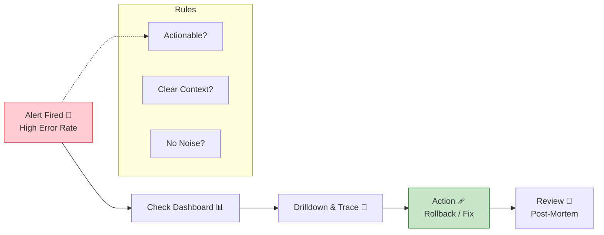

# 第30章：アラート設計＋ミニ障害演習（軽め）🚨🧯✨

〜「鳴ったら動ける」だけに絞って、ちゃんと回せるようになる章〜💪😊

---

## 0. この章のゴール🎯✨

この章が終わると、次ができるようになります👇

* **アラートを“3つだけ”**作って、ちゃんと運用できる✅
* アラート通知を見た瞬間に、**次に見る場所（ダッシュボード/ログ/トレース）が分かる**✅
* 1つのシナリオで、**ミニ障害演習（調査→一次対応→ふりかえり）**ができる✅

ポイントはこれ👇
**「たくさん作らない」＝「ちゃんと直せる」**です😌🫶

---

## 1. アラートって何者？📣👀（ログやメトリクスと違う）




アラートは、ざっくり言うと **“人間に読まれる通知”** です📩✨
そして通知先には種類があって、代表的にはこんな感じ👇

* チケット（あとで対応）🎫
* メール（気づけたら対応）📧
* ページ（今すぐ起きて対応）📟😵

こういう分類で語られることがあります。([Google SRE][1])

なので、アラート設計でいちばん大事なのは…
**「鳴ったら誰が何をするの？」** を決め切ることです🧭✨
（動けない通知はノイズになりがち…😢）

---

## 2. “良いアラート”の3原則🧠✨（この章のルール）

### 原則A：アクションできる（行動がある）🏃‍♀️💨

「鳴ったけど、どうしようもない」はアラートにしない🙅‍♀️
Grafanaのベストプラクティスでも、**行動できないものはダッシュボードで見る**のが推奨されています。([Grafana Labs][2])

### 原則B：一発で状況が分かる（文脈が入ってる）🔍✨

「何が」「どれくらい」「どこで」「次に何を見る」が書いてある通知が強い💪
そして **ダッシュボードや手順書へのリンクを注釈（annotations）で付けよう**、とされています。([Grafana Labs][2])

### 原則C：うるさくしない（ノイズを減らす）🤫⚠️

「たまに一瞬だけ」みたいなのを鳴らすと、心が折れます🥲
そこで定番なのが **“閾値＋継続時間”**。
Prometheusのアラート定義でも、条件が一定時間続いたら発火する “for” が説明されています。([Prometheus][3])

---

## 3. この章は「アラート3つだけ」で勝つ🏆✨

いったん“最小セット”を固定します👇（超おすすめ）

### ✅ アラート①：エラー率（ユーザー影響）💥

* 例：5xx が増えた
* **最優先**：ユーザーが困ってる可能性大😵

### ✅ アラート②：レイテンシ（体感が遅い）🐢

* 例：p95 が悪化
* エラーがなくても炎上しがち🔥

### ✅ アラート③：Nodeの健康（詰まり/リークの兆候）🫀

* 例：イベントループ遅延、メモリ急上昇
* これは“ページ”にしないで、最初は **チケット寄り**でもOK🎫（運用負荷を下げる作戦）

> ちなみに「症状（ユーザーが困る）を優先して鳴らす」が良い、といった流れはダッシュボード設計でも推されがちです。([Grafana Labs][2])

---

## 4. 閾値＋継続時間＋復旧の設計🧯✨（フラつかないためのコツ）

### 4.1 継続時間（for）を入れる⏱️

* 「瞬間的なスパイク」で鳴らないようにする
* 例：**“3分続いたら鳴らす”**

Prometheusだと “for” はまさにこの用途で、pending → firing になる仕組みが説明されています。([Prometheus][3])

### 4.2 “復旧が早すぎて不安”問題（keep_firing_for）🩹

直した直後って、グラフが上下して「治った？ほんと？」ってなりがち😖
Prometheusには **一定時間だけ発火状態を維持する “keep_firing_for”** もあります。([Prometheus][3])
（最初は無理に使わなくてOK。覚えておくと強い💪）

### 4.3 “ラベル増やしすぎ”は爆発する🏷️💥

最初は「サービス」「エンドポイント」くらいで十分。
Grafanaでも **まず単一ディメンションから始めて、必要なら増やす**のが推奨です。([Grafana Labs][2])

---

## 5. 通知文のテンプレ（これが“動ける通知”）🧾✨

通知には **ラベル（labels）** と **注釈（annotations）** を使い分けます。

* labels：ルーティングや識別（例：severity、service、team）🏷️
* annotations：対応者向けの説明（summary/description/runbook_url など）📝

この考え方はGrafanaの説明が分かりやすいです。([Grafana Labs][4])

### ✅ 最小テンプレ（おすすめ）

**labels（機械向け）**

* severity：page / ticket
* service：例 “api”
* env：prod / stg
* team：例 “backend”

**annotations（人間向け）**

* summary：何が起きた（1行）
* description：どう困る／どれくらい／次に見るもの
* runbook_url：手順書
* dashboard（またはGrafanaのリンク注釈）：該当パネルへ

> Grafanaは “runbook_url” やダッシュボードへのリンク注釈を用意して、初動を速くしようね、という方針です。([Grafana Labs][4])

---

## 6. 例：Prometheusルール（雰囲気サンプル）🧪✨

（※ここは“こういう形になるよ”のイメージ。式はあなたのメトリクス名に合わせてね😊）

```yaml
groups:
- name: api-alerts
  rules:

  - alert: ApiHighErrorRate
    expr: (sum(rate(http_server_requests_total{status=~"5.."}[5m]))
          / sum(rate(http_server_requests_total[5m]))) > 0.02
    for: 3m
    labels:
      severity: page
      service: api
    annotations:
      summary: "APIのエラー率が高い"
      description: "直近5分の5xx割合が2%超え。まずダッシュボード→該当エンドポイント→ログ/トレースで原因を絞る。"
      runbook_url: "RUNBOOK_URL_HERE"

  - alert: ApiHighLatencyP95
    expr: histogram_quantile(0.95,
          sum(rate(http_server_request_duration_seconds_bucket[5m])) by (le)) > 0.8
    for: 5m
    labels:
      severity: page
      service: api
    annotations:
      summary: "APIのp95レイテンシが悪化"
      description: "p95が0.8s超え。エンドポイント別の遅延→外部I/OのSpan→ログで例外/タイムアウト確認。"
      runbook_url: "RUNBOOK_URL_HERE"

  - alert: NodeEventLoopLagHigh
    expr: event_loop_lag_seconds > 0.2
    for: 10m
    labels:
      severity: ticket
      service: api
    annotations:
      summary: "イベントループ遅延が高い（要調査）"
      description: "詰まり傾向。直近デプロイ・CPU/メモリ・遅いSpanを確認して、再発防止タスク化。"
      runbook_url: "RUNBOOK_URL_HERE"
```

* “for” で一定時間継続したら発火、という考え方はPrometheusで説明されています。([Prometheus][3])
* annotations に長文説明やrunbookリンクを入れる、という役割分担も一致します。([Prometheus][3])

---

## 7. 1枚Runbook（対応手順書）の最小形📄🧭✨

Runbookは長くしない！まずは **「迷わない順番」** だけでOKです😊

### ✅ Runbook：エラー率アラートが鳴ったら（最小）

1. **影響確認** 👀

* いま本当に失敗してる？（エラー率/成功率）
* 影響範囲は？（全体？特定エンドポイント？）

2. **原因の当たりを付ける** 🎯

* 直近デプロイがある？（あればまず疑う）
* 遅延も一緒に上がってる？（DB/外部APIの可能性）

3. **ログで絞る** 🪵🔍

* requestId / traceId で該当リクエストを追う
* エラー種別（timeout / validation / upstream / bug）を分類

4. **トレースで“どこが遅い/落ちた”を見る** 🧵

* 遅いSpan・失敗Spanを特定
* 外部I/O（DB/HTTP）ならそこが本丸

5. **一次対応（止血）🩹**

* 影響が大きいなら、

  * 直近リリースのロールバック
  * 該当機能の一時停止（フラグOFF）
  * タイムアウト短縮/リトライ抑制（状況次第）
    など“被害を広げない”行動を優先

6. **記録** 📝

* 「いつ」「何が」「何をした」「結果」を短く残す
* 後でふりかえりがラクになる✨

> “初動で迷わない”通知（なぜ存在し、何が起き、どう調べるか）を作ろう、という方針はGrafanaのベストプラクティスでも強調されています。([Grafana Labs][2])

---

## 8. ミニ障害演習（1シナリオ）🎬🚨✨

ここからが楽しいとこ！😆🫶
**1本だけ**やります（軽めでOK！）

### 🎭 シナリオ：外部I/Oが遅くなって、p95が悪化 → 5xxも増える

* 最初：レイテンシアラートが鳴る🐢
* 次に：タイムアウトでエラー率アラートが鳴る💥
* やること：**ダッシュボード → トレース → ログ**の順で当てにいく🎯✨

---

### 8.1 演習の“制限時間”⏳（おすすめ）

* 0〜5分：状況把握（影響と範囲）
* 5〜12分：原因の当たり（どこが遅い？）
* 12〜20分：一次対応（止血）
* 20〜30分：ふりかえりメモ作成

---

### 8.2 調査の“正解ルート”（手順）🧭✨

#### Step1：ダッシュボードで「どの症状？」を見る📊

* p95が上がってる？
* エラー率も上がってる？
* 特定のエンドポイントだけ？

（ここで “症状” を確定させる）

#### Step2：トレースで「どこが遅い？」を見る🧵🔍

* いちばん時間を使ってるSpanは？
* 外部I/OのSpanが太い？（DB/HTTPなど）
* 失敗してるSpanはどれ？（status=error）

#### Step3：ログで「何が起きた？」を確定する🪵✅

* timeout なのか
* upstream の 500 なのか
* validation 系なのか
* retry が暴れてるのか

---

### 8.3 一次対応（止血）の考え方🩹✨

初心者のうちは、これだけ覚えれば強いです👇

* **直近デプロイが怪しい** → ロールバックが最速🏃‍♀️💨
* **外部I/Oが死んでる** → タイムアウト調整・一時的に機能オフ・フォールバック検討🧯
* **リトライ嵐** → 逆に被害拡大するので抑える（状況次第）⚠️

---

## 9. ふりかえりテンプレ（“30分で終える”版）📝✨

最後に、これだけ書けばOKです😊🫶

### ✅ ふりかえり（短いやつ）

* 何が起きた？（一文）
* 影響は？（誰がどれくらい困った？）
* 検知は良かった？（早すぎ/遅すぎ/うるさすぎ）
* 初動で迷った点は？（リンク不足？説明不足？）
* 次に直すことTOP3（アラート/ダッシュボード/コード）

Grafanaでも、アラートは放置すると負債になりやすいから、見直して消せるようにしようね、という話があります。([Grafana Labs][2])

---

## 10. 次のレベル（興味が出たら）📚✨：SLO→バーンレートで鳴らす

「閾値アラート」って分かりやすいけど、調整が難しくなりがちです😵‍💫
そこで上級者がよく使うのが **SLOとエラーバジェット**、そして **バーンレート**🔥

GoogleのSRE Workbookでは、

* “何%の予算を何時間で溶かすならページ”
  みたいに考える方法や、
* 複数ウィンドウでノイズを減らす方法
  がまとまっています。([Google SRE][5])

今すぐ必須じゃないけど、将来めっちゃ武器になります💪😎

---

## 11. この章のミニ演習（提出物イメージ）🧩✅✨

最後に“形”として残すと強いよ〜📌

* アラート3つ（名前／条件／for／severity）🚨
* 通知文テンプレ（summary/description/runbook_url/dashboard）🧾
* Runbook 1枚📄
* 演習ログ（時系列メモ）🕒
* ふりかえりTOP3📝

---

## 12. AI活用（この章で超効くやつ）🤖✨

Copilot/Codexに投げるなら、こういう頼み方が強いです👇💡

* 「このアラート通知、初動で迷わない文章にして。次に見る順番も入れて」🧾
* 「Runbookを“5ステップ以内”に削って。初心者でも迷わない順にして」📄
* 「閾値がうるさい。forや条件の調整案を3つ出して（ノイズ優先で）」🔧
* 「演習のふりかえりから、再発防止タスクを3つに要約して」📝

---

### まとめ🎀✨

アラートは「増やす」のが正義じゃなくて、
**“鳴ったら動ける”を守る**のが正義です🚨🫶
まずは3つで勝ちましょう😊💪✨

次に進めるなら、あなたの題材APIのメトリクス名に合わせて、上の3つを“実データ版”の式に落とし込むところまで一緒に作れます🧩📈🧵

[1]: https://sre.google/sre-book/monitoring-distributed-systems/ "Google SRE monitoring ditributed system - sre golden signals"
[2]: https://grafana.com/docs/grafana/latest/alerting/guides/best-practices/ "Best practices | Grafana documentation
"
[3]: https://prometheus.io/docs/prometheus/latest/configuration/alerting_rules/ "Alerting rules | Prometheus"
[4]: https://grafana.com/docs/grafana/latest/alerting/fundamentals/alert-rules/annotation-label/ "Labels and annotations | Grafana documentation
"
[5]: https://sre.google/workbook/alerting-on-slos/ "Google SRE - Prometheus Alerting: Turn SLOs into Alerts"
