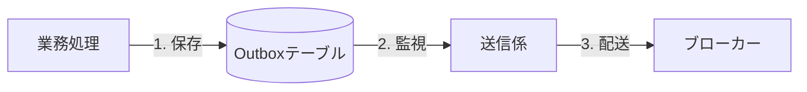
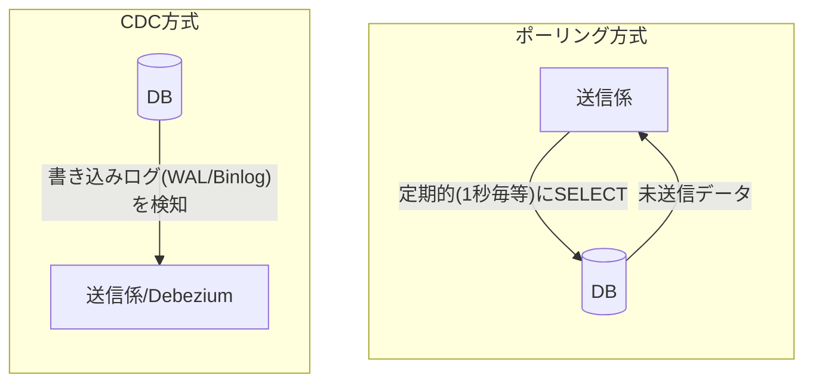

# 第02章：Outboxを一言で（超ざっくり定義）🧠✨

## この章でわかること 🎯

* Outboxって結局なに？を**一言で説明できる**ようになる🗣️✨
* 「なんでDBに残すの？」「なんで同じトランザクションなの？」が腹落ちする🔐🙂
* どんな場面で使うと効くのか、パッとイメージできる📩🤝

---

## 2.1 Outboxを一言で言うと？📦🧾

**Outboxとは： “あとで送るメッセージ（イベント）”を,いったんDBに安全に保管する仕組み** だよ✨📦




ポイントはこれ👇

* いま送るんじゃなくて、**「送る予定」をまず保存**する🧾
* 保存できたら、**別の“送信係”が後で送る**📤
* こうすると「送ったつもり」「送れてなかった」「二重に送った」が減る🛡️

この考え方は、いわゆる **Transactional Outbox pattern** として広く知られてるよ📚✨
「業務データの更新」と「Outboxへの追加」を同じDBトランザクションでコミットして、後で別プロセスがブローカーへ配送する、という形が基本✅
([microservices.io][1])

---

## 2.2 「DBに残す」って、何を残すの？🧾🤔

Outboxに入れるのは、ざっくり言うと **“送る内容そのもの”** だよ📄✨

* イベントの種類（例：`OrderPlaced`）🏷️
* 中身（payload：JSON）📦
* いつ作られたか（作成日時）🕒
* （あとで章が進むと）状態（未送信/送信済み/失敗など）🚦


ここでは細かい設計はまだやらないよ🙂
大事なのは、**「送信に必要な情報を、あとで取り出せる形で残す」**って感覚！

---

## 2.3 なんで“同じトランザクション”が必要なの？🔐😵‍💫

ここがOutboxの心臓🫀✨

もし「注文を確定した（DB更新）」のあとに「イベント送信」を別々にやると…

* DB更新✅ → 送信❌（ネットワーク落ちた、ブローカー死んだ etc）
  → **注文は確定してるのに、通知が飛ばない**📭😱

Transactional Outboxは、これをこうする👇

* **注文確定（業務データ更新）＋Outboxに“送る予定”追加**を
  **同じトランザクションでコミット**する🔐✅


すると、こう言えるようになる🎯

* **DBコミットが成功したなら、Outboxも必ず残る**
* **DBがロールバックなら、Outboxも残らない**

この “if and only if（片方だけ成功が起きない）” が超強い💪
([microservices.io][1])
「送信は失敗し得る」前提の説明は、クラウド実装例でも強調されてるよ☁️📨
([Amazon Web Services, Inc.][2])

---

## 2.4 Outboxは「送信」じゃないよ！“送信係”がいるよ📤👤

Outboxは **保管場所**📦
送るのは別の人（処理）だよ🙂✨

登場人物はこんな感じ👇

* 🗄️ **DB**：業務テーブル＋Outboxテーブル
* 📦 **Outbox**：送る予定のメッセージ置き場
* 📤 **Message Relay / Publisher（送信係）**：Outboxから拾って実際に送る係


この形が基本パターンとして整理されてるよ📚
([microservices.io][1])

---

## 2.5 「後で送る」はどうやって？よくある2パターン⏱️🔍

送る方法は大きく2つ！



送信係がOutboxからメッセージを見つける方法は、大きく2つが有名だよ🙂

### A) ポーリング（定期的に見に行く）⏲️👀

「未送信ある？あるなら送る！」って、一定間隔でDBを見に行く方式。
学習用に一番わかりやすい✨
([microservices.io][3])

### B) 変更検知（CDC：Change Data Capture）🔍⚡


DBの変更（ログやストリーム）を見て「Outboxに追加された！」を検知して送る方式。
例えば Debezium はOutboxテーブルの変更をキャプチャしてイベント化する考え方を公式ドキュメントで説明してるよ📘
([Debezium][4])
DBのログ（例：PostgresのWAL / MySQLのbinlog）を使う説明も、パターンとして整理されてるよ📚
([microservices.io][5])

---

## 2.6 どんな時に使うの？📩🤝✨

Outboxが刺さるのは、だいたいこのへん👇

* 🔔 **通知**：注文確定 → メール/Push通知
* 🔗 **外部連携**：決済OK → 会計システムへ連携
* 🧩 **非同期処理**：画像生成依頼 → バックグラウンド処理へ投入
* 🧱 **マイクロサービス間のイベント連携**：在庫更新 → 別サービスへ伝える


要するに、**「DB更新の結果を、他の場所へ伝えたい」**って時に使う📣✨
“内部状態（DB）”と“外部に流したイベント”のズレを避ける、という説明も代表的だよ🛡️
([Debezium][4])

---

## 2.7 ミニ例で理解しよ！「注文確定 → 通知イベント」🛒📩

イメージはこんな感じ👇

1. 注文確定（業務データ更新）🛒✅
2. そのトランザクション内でOutboxにも追加📦🧾
3. 送信係がOutboxを拾う📤
4. メッセージング基盤に送る（例：キュー/トピック）📮
5. 成功したら「送った」印をつける✅🚦

この「まずDBに安全に残して、後で送る」が基本形だよ✨
([microservices.io][1])

---

## 2.8 “超ざっくり”擬似コード（TypeScript）🧩✨

※ここでは概念をつかむための雰囲気コードだよ🙂（DBライブラリは何でもOK）


```ts
type Order = { id: string; status: "PLACED" | "CANCELLED" };

type OutboxMessage = {
  id: string;            // message/event id
  eventType: string;     // e.g. "OrderPlaced"
  payload: unknown;      // JSON
  createdAt: Date;
};

async function placeOrder(orderId: string) {
  await db.transaction(async (tx) => {
    // 1) 業務データ更新
    await tx.orders.update({
      where: { id: orderId },
      data: { status: "PLACED" },
    });

    // 2) Outboxに「送る予定」を追加（同じトランザクション）
    const msg: OutboxMessage = {
      id: crypto.randomUUID(),
      eventType: "OrderPlaced",
      payload: { orderId },
      createdAt: new Date(),
    };

    await tx.outbox.insert(msg);
  });

  // ここでは送らない！📭
  // 送信は別の「送信係」が後でやる📤
}
```

ここでの大事ポイントは1つだけ👇
✅ **業務更新とOutbox追加が “同じ transaction” の中**

---

## 2.9 よくある勘違い＆NG（この章で直しておこ）🧯😇

* ❌ **「Outbox＝メッセージング基盤に送ること」**
  → ちがうよ！Outboxはまず“保管”📦（送るのは送信係）📤
* ❌ **「DB更新してから、そのあと送信すればOK」**
  → 送信は失敗するから、ズレが起きる📭😱（Outboxで防ぐ）
  ([Amazon Web Services, Inc.][2])
* ❌ **「とりあえず全部リアルタイムで同期送信」**
  → 壊れやすい＆遅くなりがち🌀（切り離すのが狙い）

---

## 2.10 ちょいクイズ（3問）📝✨

1. Outboxにまず保存するのは、何のため？📦
2. 「同じトランザクション」にする理由を一言で言うと？🔐
3. 送信係がOutboxを見つける方法の代表例を2つ言える？⏱️🔍

---

## 2.11 AI活用ミニ型（第2章ver）🤖✨

コピペして使えるやつ📋💕

* **一言定義づくり**🧠

  * 「Outboxを一言で定義して。初心者向けで、例え話も入れて」
* **イベント名の案出し**🏷️

  * 「注文確定のイベント名（過去形）を候補10個。英語で」
* **“同じトランザクション”説明の添削**🔐

  * 「この説明、初心者に伝わる？もっと簡単に直して：〜（本文貼る）」
* **使いどころチェック**✅

  * 「この機能でOutboxが必要か判断して。必要なら理由も：〜（仕様貼る）」

---

## 2.12 いまの“実装トレンド感”だけチラ見せ👀✨

Outboxの考え方自体は昔から安定だけど、実装の選択肢が増えてるよ📈

* Microsoft Azure の設計ガイドでは、DBの仕組み（例：変更フィード）とメッセージ基盤を組み合わせたTransactional Outboxの説明があるよ☁️📨
  ([Microsoft Learn][6])
* Dapr もTransactional Outboxを使うHow-Toを公開してるよ🧩（状態管理＋pub/subの組み合わせ）
  ([Dapr Docs][7])

「Outboxって概念だけ？」じゃなくて、**“公式にパターンとして整理され、実装ガイドや支援ツールも揃ってきてる”**って感じだね🙂✨

[1]: https://microservices.io/patterns/data/transactional-outbox.html?utm_source=chatgpt.com "Pattern: Transactional outbox"
[2]: https://aws.amazon.com/blogs/compute/implementing-the-transactional-outbox-pattern-with-amazon-eventbridge-pipes/?utm_source=chatgpt.com "Implementing the transactional outbox pattern with ..."
[3]: https://microservices.io/patterns/data/polling-publisher.html?utm_source=chatgpt.com "Pattern: Polling publisher"
[4]: https://debezium.io/documentation/reference/stable/transformations/outbox-event-router.html?utm_source=chatgpt.com "Outbox Event Router"
[5]: https://microservices.io/patterns/data/transaction-log-tailing.html?utm_source=chatgpt.com "Pattern: Transaction log tailing"
[6]: https://learn.microsoft.com/en-us/azure/architecture/databases/guide/transactional-outbox-cosmos?utm_source=chatgpt.com "Transactional Outbox pattern with Azure Cosmos DB"
[7]: https://docs.dapr.io/developing-applications/building-blocks/state-management/howto-outbox/?utm_source=chatgpt.com "How-To: Enable the transactional outbox pattern"
