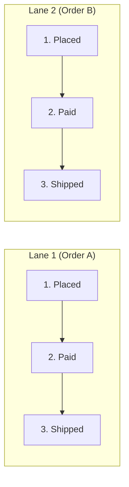

# 第18章：順序（Ordering）をどう扱う？🍱➡️🍱

## この章のゴール🎯✨

* 「順序が大事なケース」と「そこまで要らないケース」を見分けられるようになる🙂👍
* Outboxで起きがちな“順序崩れ”の原因を知って、対策の選択肢を持てるようになる🧠🔧
* いちばん現実的な **「同じID（例：注文ID）だけ順序を守る」** 実装の型を作れるようになる📦🔁✅

---

## 18-1. 順序が崩れると何が困るの？😵‍💫💥


順序って、ざっくり言うと **「起きた順に届いてほしい」** ってことだよね📩✨
でも、順序が崩れるとこうなる👇

## 例：注文イベント🛒📦




* `OrderPaid`（支払い完了💳✅）が先に届く
* その後に `OrderPlaced`（注文確定🧾✅）が届く

受け側が「注文が存在しないのに支払い完了…？」ってなる🌀😇
結果として…

* エラーで落ちる💥
* 変な中間状態になる😱
* 後続の処理が詰まる🚧

---

## 18-2. 「順序」にはレベルがあるよ📶🙂

順序って実は3段階くらいで考えるとラクだよ🍀

## A) 全体順序（全部ぜんぶ1列に並ぶ）🚂


* どのイベントも **1本の列** で順番通り
* 強いけど、だいたい重い（スケールしづらい）🥲

## B) キー単位順序（同じIDだけ順序を守る）🔑🍱

* 例：**同じ注文IDだけ順番通り**
* Outbox設計でいちばん“使いどころ”が多い✨

## C) 多少の前後はOK（受け側で吸収する）🧽✨

* 「最終的に合えばOK」なやつ
* 冪等性（第17章）と相性◎🛡️🔁

---

## 18-3. まず仕分けしよう⚖️✅「順序が必要」判定チェック

次のどれかに当てはまったら、順序が必要になりやすいよ👇

* **同じIDの状態遷移**（例：注文：作成→支払い→発送）📦➡️🚚
* 後のイベントが **前のイベントの前提** になってる（例：作成されてから更新）🧩
* 受け側が「存在チェック」や「前状態チェック」を強くしてる🔒
* “取り消し”や“戻し”が絡む（例：キャンセル）🚫🔙

逆に、順序が不要になりやすいのは👇

* ただの通知（メール送信📧）みたいに「多少前後しても致命的じゃない」
* 「上書きして最終状態に寄せれば良い」タイプ（例：ステータス同期）🪄

---

## 18-4. Outboxなのに順序が崩れるのはなぜ？🤔🌀

Outboxは「送信漏れ」を強く防げる仕組みだけど📦🛡️、**順序**は別問題になることがあるよ🙂

## 崩れポイント①：複数Publisherで並列処理👯‍♀️


同時に拾って送ると、送信タイミングがズレる⏱️💨
（第14章の“並行実行”の世界）

## 崩れポイント②：リトライが混ざる🔁🌧️

先に送ったやつが失敗→遅れて再送、みたいに **失敗が順序を曲げる** 😇

## 崩れポイント③：送信先の“順序保証”は範囲がある📬

たとえば **Kafka** は「同じパーティション内は順序OK、別パーティション間は保証しない」タイプで有名だよ📌([Confluent][1])
だから「同じキーを同じパーティションに寄せる」＝partition key が大事になる🗝️([Confluent][1])

**Amazon SQS FIFO** も「MessageGroupId 単位で順序を守る」設計だよ📮🔑([AWS ドキュメント][2])

**RabbitMQ** は基本的にキューは順序を保とうとするけど、複数コンシューマや再配送（redelivery）で“絶対”にはならない、みたいな注意があるよ🐰📩([rabbitmq.com][3])

---

## 18-5. 結論：おすすめの基本方針✨（迷ったらこれ）

## ✅ 方針1：順序保証は「必要なキーだけ」に絞る🔑

* だいたい **注文ID / ユーザーID / 在庫SKU** みたいな“主語”がキーになるよ🙂

## ✅ 方針2：受け側は「順序が崩れても壊れない」作りを混ぜる🛡️

* 冪等性（第17章）＋「古いイベントは無視」みたいな安全策を入れると強い💪✨

---

## 18-6. 実装パターン①：順序を気にしない（最終状態で勝つ）🏁🧽

## 使いどころ🙆‍♀️

* 通知系📧
* 状態同期（最後の状態が正しければOK）🔄

## コツ✨

* payloadに `occurredAt`（発生時刻）や `version` を入れる
* 受け側で「古い更新なら捨てる」ルールにする🗑️

### 例：受け側のガード（超ミニ）🧠

```ts
type IncomingEvent = {
  entityId: string;
  version: number;      // 単調増加（例：注文の更新回数）
  payload: unknown;
};

type StoredState = { entityId: string; lastVersion: number };

function shouldApply(current: StoredState, incoming: IncomingEvent): boolean {
  // 同じ or 古いものは捨てる（冪等＋順序崩れ耐性）
  return incoming.version > current.lastVersion;
}
```

---

## 18-7. 実装パターン②：同じID（例：注文ID）だけ順序を守る🍱➡️🍱（本命✨）

## まず設計を“言語化”しよう🧠✨

* **streamKey**：順序を守りたい単位（例：`orderId`）
* **streamSeq**：そのstreamKey内での連番（例：注文の状態遷移の番号）
* **lane**：streamKeyを「車線」に振り分ける番号（並列化のため）🚗🚗🚗

> 「順序は streamKey 内だけ」
> 「並列化は lane 単位」
> この考え方が超強いよ🙂💪

---

## 18-8. Outboxテーブルに足すと強いカラム案🧾✨


最小（第9章）に、順序のためにこれを足すイメージ👇

* `stream_key`：例 `order:123` 🧷
* `stream_seq`：1,2,3… 🔢
* `lane`：0..N-1 🚦
* `locked_until`：ワーカーが一時的に確保する時間（リース）⏳
* `status`：`pending` / `processing` / `sent` / `failed` 🚦

---

## 18-9. 「lane（車線）」で“順序×スケール”を両立する🚗💨


## なぜlaneが効くの？🤔

* 全イベントを1列にすると詰まる🚧
* でも「注文ごとに1列」なら同時にいっぱい走れる🚗🚗🚗✨
* そこで、注文IDをハッシュして lane に振り分ける（=論理的な分割）🔀

これはKafkaの「キーで同じパーティションに寄せる」発想と似てるよ🧠📌([Confluent][1])
SQS FIFO の MessageGroupId も同じ系統だよ📮🔑([AWS ドキュメント][2])

---

## 18-10. ハンズオン：lane付きOutbox Publisher（TypeScript）🛠️✨

ここからは「Publisher（送信係）」側の型を作るよ📤🙂
DBは“SQLで取れる”前提で、クエリの形を見せるね👀

## ① laneを決める関数（安定ハッシュ）🔢🔧

```ts
// かんたんFNV-1a（十分安定ならOK）
function fnv1a32(input: string): number {
  let hash = 0x811c9dc5;
  for (let i = 0; i < input.length; i++) {
    hash ^= input.charCodeAt(i);
    hash = Math.imul(hash, 0x01000193);
  }
  return hash >>> 0;
}

function laneOf(streamKey: string, laneCount: number): number {
  return fnv1a32(streamKey) % laneCount;
}
```

## ② “次に送るべき1件”を安全に確保する（イメージSQL）🔒🧲

複数ワーカーがいても二重取りしないために、`FOR UPDATE SKIP LOCKED` みたいな仕組みがよく使われるよ🔐([Netdata][4])
ただし、ロックや分離レベルで想定外の挙動が出る話もあるので、**検証しながら**が大事だよ🧪([CYBERTEC PostgreSQL | Services & Support][5])

### ポイント🎯

* laneを固定したワーカーが、lane内の `pending` を順に処理
* `ORDER BY stream_seq` で「同じstreamKeyの順序」を守る
* でも lane内には複数streamKeyが混ざるので、**各streamKeyの先頭だけ取る** のがコツ🙂

（SQLはDB方言があるので“形”として見てね）

```sql
-- lane = :lane のワーカーが、処理可能な1件を確保する例（イメージ）
WITH candidate AS (
  SELECT o.*
  FROM outbox o
  WHERE o.status = 'pending'
    AND o.lane = :lane
    AND (o.locked_until IS NULL OR o.locked_until < now())
  ORDER BY o.stream_key, o.stream_seq
  FOR UPDATE SKIP LOCKED
  LIMIT 1
)
UPDATE outbox u
SET status = 'processing',
    locked_until = now() + interval '30 seconds'
FROM candidate c
WHERE u.id = c.id
RETURNING u.*;
```

## ③ TypeScript側（ざっくり骨格）🦴✨

```ts
type OutboxRow = {
  id: string;
  streamKey: string;
  streamSeq: number;
  lane: number;
  eventType: string;
  payload: unknown;
  status: "pending" | "processing" | "sent" | "failed";
};

type Db = {
  claimNext(lane: number): Promise<OutboxRow | null>;
  markSent(id: string): Promise<void>;
  markFailed(id: string, reason: string): Promise<void>;
};

type Sender = {
  send(row: OutboxRow): Promise<void>;
};

export async function runWorkerLoop(db: Db, sender: Sender, lane: number): Promise<void> {
  for (;;) {
    const row = await db.claimNext(lane);
    if (!row) {
      await sleep(200); // ちょい待つ😴
      continue;
    }

    try {
      // ここで「送信先」に streamKey をキーとして渡すと、
      // 送信先側（Kafka partition key / SQS MessageGroupId）とも相性◎🔑
      await sender.send(row);
      await db.markSent(row.id);
    } catch (e) {
      const reason = e instanceof Error ? e.message : String(e);
      await db.markFailed(row.id, reason);
    }
  }
}

function sleep(ms: number) {
  return new Promise<void>((r) => setTimeout(r, ms));
}
```

---

## 18-11. 送信先別：順序を守る“キーの渡し方”🔑📬

## Kafkaの場合🧩

* 同じキーを同じパーティションへ → **そのパーティション内で順序が保たれやすい**
* つまり `key = streamKey` が基本になるよ🙂([Confluent][1])

## SQS FIFOの場合📮

* `MessageGroupId = streamKey` にすると、そのグループ内の順序を維持できるよ✨([AWS ドキュメント][2])

## RabbitMQの場合🐰

* 1キュー1コンシューマに寄せると順序が素直になりやすいけど、並列化とのトレードオフがあるよ⚖️([rabbitmq.com][3])

---

## 18-12. それでも“受け側ガード”は入れよう🛡️🙂（保険✨）


順序を守る設計でも、現実は「再送」「障害」「再配送」などがあるからね🌧️🔁
なので受け側でこれを入れると事故が減るよ👇

## 受け側の定番ガード✅

* `lastProcessedSeq` をDBに保存
* `incoming.streamSeq <= lastProcessedSeq` は捨てる（冪等）🗑️
* `incoming.streamSeq == last+1` だけ適用✨
* `incoming.streamSeq > last+1` が来たら…

  * いったん保留（stash）して「待つ」か
  * “欠番が来ない前提”の設計にする（送信側で順序保証を強くする）🧠

---

## 18-13. よくある落とし穴😇🕳️

## 落とし穴①：全部に順序保証をかけて詰まる🚧

* 全体順序は超簡単だけど、遅延が積み上がりやすい🥲
* まずは **キー単位** に絞るのがコスパ良い✨

## 落とし穴②：順序だけ守って冪等性を捨てる💥

* “絶対順序”なんて運用では崩れることがある
* 冪等性（第17章）はセットで持つのが安全🛡️🔁

## 落とし穴③：ロック/分離レベルの思い込み🧠💣

`FOR UPDATE` 系は便利だけど、分離レベルなどで意外な挙動が起きることがあるよ🧪([CYBERTEC PostgreSQL | Services & Support][5])
（なのでテストで並列をしっかり回すのが大事💪）

---

## 18-14. 演習ミニ課題📝🎉

## 課題A：順序が必要か判定しよう⚖️

次のイベント、順序必要？（理由も一言で）🙂

1. `OrderPlaced` → `OrderPaid`
2. `EmailSent` → `PushSent`
3. `UserProfileUpdated(name)` → `UserProfileUpdated(icon)`

## 課題B：stream設計してみよう🔑🔢

注文ID = `O-100` のイベント列を考えて、`streamSeq` を振ってみてね👇

* 注文確定
* 支払い完了
* 発送開始
* 配達完了

## 課題C：lane数を決めよう🚦

* laneCount = 4 / 8 / 16 のどれにする？
* 「増やすと何が嬉しい？ 何が困る？」を箇条書きで🙂✍️

---

## 18-15. AI活用ミニ型（この章専用）🤖✨

## 1) 「順序が必要なイベントだけ」洗い出し🔍

* 「このサービスのイベント一覧を貼る → 順序が必要な組だけ抽出して」って頼むと速い💨

## 2) streamKey候補の提案🧠

* 「注文系は orderId、在庫系は sku、ユーザー系は userId で良い？」みたいに相談するのが◎🙂

## 3) 並列テスト案を作ってもらう🧪

* 「2ワーカー/4ワーカーで、順序と二重送信が起きないテストケース」を出してもらうと強い💪✨

---

## 18-16. まとめ📦✅

* 順序は **全部に保証しない** のがコツ🙂
* だいたいは **「同じID（streamKey）だけ順序」** が本命🍱➡️🍱
* 送信先（Kafka/SQS FIFOなど）も **キー単位の順序** が基本思想だよ🔑([Confluent][1])
* 最後に、冪等性＋受け側ガードは“保険”じゃなくて“標準装備”🛡️🔁

---

## （豆知識）2026年のTypeScriptまわり小ネタ🧁✨

* TypeScriptは「Goでのネイティブ実装（TypeScript 7）」のプレビューが公開されて、ビルド高速化（大規模で10倍級をうたう話）などが話題になってるよ⚡([Microsoft Developer][6])
* Node.jsは v24 が Active LTS、v25 が Current という位置づけになってるよ🟩([nodejs.org][7])

[1]: https://www.confluent.io/learn/kafka-partition-key/?utm_source=chatgpt.com "Apache Kafka Partition Key: A Comprehensive Guide"
[2]: https://docs.aws.amazon.com/AWSSimpleQueueService/latest/SQSDeveloperGuide/using-messagegroupid-property.html?utm_source=chatgpt.com "Using the message group ID with Amazon SQS FIFO Queues"
[3]: https://www.rabbitmq.com/blog/2020/06/23/quorum-queues-local-delivery?utm_source=chatgpt.com "How quorum queues deliver locally while still offering ..."
[4]: https://www.netdata.cloud/academy/update-skip-locked/?utm_source=chatgpt.com "Using FOR UPDATE SKIP LOCKED for Queue-Based ..."
[5]: https://www.cybertec-postgresql.com/en/transaction-anomalies-with-select-for-update/?utm_source=chatgpt.com "Transaction anomalies with SELECT FOR UPDATE"
[6]: https://developer.microsoft.com/blog/typescript-7-native-preview-in-visual-studio-2026?utm_source=chatgpt.com "TypeScript 7 native preview in Visual Studio 2026"
[7]: https://nodejs.org/en/about/previous-releases?utm_source=chatgpt.com "Node.js Releases"
